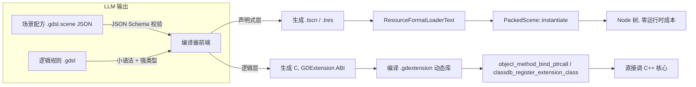

# Godot LLM 友好 DSL 设计（草案）

> 一句话：让 LLM 写「配方」而不是写「程序」——一份 schema 校验的场景配方 + 一小撮强类型规则，编译后直接摸到 C++ 的函数指针。

**结论：能做。分两层——声明式层（场景/资源）直接生成 Godot 内置的 `.tscn`/`.tres` 文本，零运行时成本走 `ResourceFormatLoaderText`；逻辑层（规则/状态/效果）编译成 GDExtension 原生代码，用 `object_method_bind_ptrcall` 裸指针调 C++。LLM 友好靠「小语法 + 强类型 ontology + schema 校验 + 可编译成约束解码」，可测试靠把编译器/绑定器当 `core/` seam 用 doctest 覆盖，并套用 `SOP_TDD_AI_TESTING.md` 的 red→green 门。代价：它不是通用语言，覆盖不了编辑器插件、任意算法这些长尾。**

## 是什么 / 不是什么

- 是「场景 + 玩法规则」的描述语言；不是通用编程语言（GDScript/C# 才是通用的）。
- 是 schema 校验、确定性格式化的数据与规则；不是「生成 GDScript 再靠重试纠错」。
- 是直连 C++ 的（声明式走 `ResourceFormatLoaderText`、逻辑走 GDExtension `ptrcall`）；不是又一个跑在 Variant 字节码 VM 上的脚本。

## 1. 三条「直连 C++」路线与选型

Godot 里脚本语言碰到 C++ 只有一条总闸门：`Object::callp`（`core/object/object.cpp:768`）。它先查脚本实例 `script_instance->callp()`，脚本没有该方法时回退到 `ClassDB::get_method()` 拿到的 `MethodBind` 再调用 C++ 成员函数（回退逻辑 `object.cpp:800-828`）。所有跨边界数据都是 `Variant`，开销分三档：`call`（动态装箱+校验）> `validated_call`（预校验 Variant 指针）> `ptrcall`（裸指针，零 Variant）。

在这个总闸门之上，有三条让新 DSL 直连 C++ 的路线：

| 路线 | 机制（`file:line`） | 封送成本 | 表达逻辑/控制流 | 实现面 | 本设计选它做 |
|---|---|---|---|---|---|
| A. 注册新 `ScriptLanguage` | `ScriptServer::register_language`（`script_language.cpp:239`，上限 16 个 `script_language.h:48`；**仅引擎核心可调，不在 GDExtension 接口**） | Variant 边界，内部可优化到 `ptrcall` | ✅ | 最大（`ScriptLanguage` 30+ 个纯虚函数，`script_language.h:208-472`）+ 需编译进引擎核心 | 开发期热重载（核心编译级）后备 |
| B. 编译为 GDExtension 原生 | `object_method_bind_ptrcall`（`gdextension_interface.cpp:1350`，注册于 `:1843`）→ `MethodBind::ptrcall`（`method_bind.h:119`） | **最低：裸指针零 Variant** | ✅ | 中（C ABI + 注册回调） | **逻辑层** |
| C. 生成 `.tscn`/`.tres` 文本 | `ResourceFormatLoaderText`（`resource_format_text.h:148`）→ `PackedScene::instantiate`（`packed_scene.h:273`） | 仅加载期，运行时为零 | ❌ 纯数据+信号，无算法 | 最小（只需生成文本） | **场景/资源层** |

选型结论：**声明式用 C，逻辑用 B**。A 不是「改个配置就能用的后备」——`ScriptServer::register_language` 是引擎核心 API，GDExtension ABI 里没有任何把 `ScriptLanguage` 注册进 `ScriptServer` 的函数（无 `script_server_register_language`）。GDExtension 的脚本侧能力是另一条更有限的机制：通过 `ScriptLanguageExtension`（`script_language_extension.h:226`）+ `ScriptInstanceExtension`（`:683`）挂一个语言实例，其 `get_language_func`（`GDExtensionScriptInstanceInfo3`，`gdextension_interface.json:3345`）返回 `GDExtensionScriptLanguagePtr`——但它进不了 `ScriptServer` 的语言表，所以 `.gdsl` 扩展名自动识别、编辑器语言下拉都不可得。官方 FAQ 的「new languages via GDExtension」指的正是这条 `ScriptLanguageExtension` 路径，不是 `ScriptServer::register_language`。真要做完整路线 A，必须像 GDScript 那样编译进引擎核心（`modules/gdscript/register_types.cpp:143`）。

一个关键事实决定了「逻辑层不用跑 VM」可行：`ScriptLanguage`/`Script`/`ScriptInstance` 三个抽象类没有任何一处要求「编译成字节码」或「有栈虚拟机」。`ScriptInstance::callp` 只要求「返回 Variant、填 CallError」（`script_instance.h:57`）。GDScript 的栈式字节码解释器（`GDScriptFunction::call` `gdscript_vm.cpp:499`，`Opcode` 表 `gdscript_function.h:152` 起）是 GDScript **自己的实现选择**，不是引擎强加。所以本设计的逻辑层可以直接生成 C + GDExtension，绕开整个脚本运行时。

## 2. 架构：两层 DSL



- **声明式层**：描述「存在哪些节点、什么属性、怎么连信号」。输入是带 JSON Schema 的 JSON，编译成 `.tscn`/`.tres`，交给引擎现成的 `ResourceFormatLoaderText` 解析——这是 Godot 已经内置的「直连 C++ 的声明式 DSL」，只是引擎原生 `.tscn` 没 schema、不承载行为（官方 issue #7102 承认 tscn 就是节点/资源属性的序列化，无正式规范）。
- **逻辑层**：描述「实体有什么状态、什么条件下触发什么效果」。它编译成 GDExtension 原生代码，是真正取代 GDScript/C# 编写玩法逻辑的那一层。

## 3. 语法草案（LLM 友好 = 可验证 > 可表达）

### 3.1 声明式层 = JSON 输入 → 编译出 `.tscn`/`.tres`

- **输入是 JSON，不是 `.tscn` 文本**——`.tscn` 是 Godot 自定义文本格式（`[gd_scene]`/`[node]`/`[connection]` 块、`Vector2(1,2)` 字面量），JSON Schema 只校验 JSON 文档，校验不了它。
- 用 **JSON Schema**（`json-schema.org/specification`）约束每个 node/resource/connection 的类型、必填属性、枚举取值；编译器再把它翻译成 `.tscn`/`.tres` 交给 `ResourceFormatLoaderText`（`resource_format_text.h:148`）。
- 收益：schema 校验是无状态的（JSON Schema 规范原话「each schema object is independently evaluated」），且业界已围绕 JSON Schema 标准化约束解码（JSONSchemaBench，arXiv:2501.10868），能校验并拒绝不合规输出、确保通过 schema 的产物 100% **结构（语法）**合规——不保证语义正确（连接引用的节点是否存在、资源路径可解析）。
- 逻辑层（§3.2）是自定义语法，走 tree-sitter CFG + 自研校验器；两层各用各的校验机制，不混。

### 3.2 逻辑层 = 小语法 + 固定 effect ontology

借鉴两个已被证明「LLM 能生成可玩游戏」的先例——VGDL 的区块化（`github.com/GAIGResearch/GVGAI/wiki/VGDL-Language`）与 PuzzleScript 的重写规则（`puzzlescript.net`）：

```
type Player @extends CharacterBody2D        # 映射到已注册的 ClassDB 类或 DSL 注册的扩展类
state:
    hp: int = 3                             # 强类型字段，静态类型，无动态类型
    speed: float = 400.0

rule OnHit by Bullet:
    when target.hp > 0                      # guard：纯布尔表达式
    then target.hp -= 1, emit(hit)          # effect：有限 ontology
```

- 语法刻意**删掉** while/递归/闭包/动态类型/隐式转换。语法小到能进 tree-sitter 的 CFG（`tree-sitter.github.io/tree-sitter/creating-parsers/2-the-grammar-dsl.html`），才能编译成约束解码用的状态机。
- **固定 effect ontology**：`spawn/despawn/set_field/emit_signal/apply_impulse/...` 是有限集合，LLM 不能凭空发明符号——每个符号都能用 grep 对 ClassDB 或 DSL 自己的类型表核实（对齐 `DOC_SPEC.md`「禁止编造符号」与 SOP §2.3「非 tautological」）。
- **确定性格式化**：编译器带 canonical formatter，LLM 输出先 format 再 diff，消除空白/换行噪声。

## 4. 直连 C++ 的精确路径（为什么高效）

逻辑层代码生成的调用路径，用引擎给 GDExtension/C# 的**同一条快路径**：

1. 先 `classdb_get_method_bind`（`gdextension_interface.json:8512`）取 `MethodBind`，再 `object_method_bind_ptrcall`（`gdextension_interface.cpp:1350`）→ `mb->ptrcall(o, args, ret)`（`method_bind.h:119`），完全无 Variant 装箱、也**无类型校验**——实现是 `reinterpret_cast` 后直接把 `const void**` 塞进 `ptrcall`（`gdextension_interface.cpp:1350-1353`），参数类型错了就是未定义行为（内存破坏），没有 Variant 兜底。所以类型检查器（§5）不只是「LLM 纠错」工具，它是**防止生成代码触发 UB 的正确性闸门**。
2. DSL 定义的 `type` 用 `classdb_register_extension_class`（`gdextension_interface.json:8574`）注册成原生类，其方法本身就是 ClassDB 里的 `MethodBind`，`Object::callp` 可直接命中（`object.cpp:818` 注释明言 extension 类无需 `ScriptInstance`）。

性能边界（官方口径，见文末「来源锚点」URL）：瓶颈不是 VM 解释执行，而是**跨语言边界的 marshalling**。官方 FAQ 原话：「C# 与 GDScript 性能同数量级，C++ 快于两者」「C# 语言本身更快，但大量调用 Godot API 时可慢于 GDScript，因为 marshalling 成本」。所以本 DSL 的效率优势**集中在「热循环留在原生代码内、少穿边界」**，不是静态类型本身；引擎 API 密集的常规玩法逻辑不会自动变快。官方给出的上限是：原生类方法调用 typed vs untyped **+70%~150%**（GDScript typed-instructions 报告，debug build），这正是「静态类型 → 预校验参数 → 直接取函数指针」这条快路径的幅度。

## 5. 可测试性：接入 SOP_TDD_AI_TESTING.md

把 DSL 编译器拆成纯函数 seam，按 SOP §2.1 的优先级落在 `core/`（纯函数、易字面量）：

| 组件 | seam（公共边界） | 落在哪 | 断言方式 |
|---|---|---|---|
| 解析器 | DSL 文本 → AST | `tests/core/<dsl>/test_parser.cpp` | 合法文本→预期 AST；非法文本→报错 |
| 类型检查器 | AST → typed IR | `tests/core/<dsl>/test_typecheck.cpp` | 类型错误被拒绝（也是 ptrcall 免 UB 的前置条件）；合法程序通过 |
| 代码生成 | IR → C / `.tscn` 文本 | `tests/core/<dsl>/test_codegen.cpp` | 确定性：同一输入逐字节同一输出 |
| 绑定器 | 生成代码 → 对 `MethodBind` 的调用 | `tests/servers/` 或模块内 | mock MethodBind 收到预期 ptrcall |
| 端到端 | DSL 文本 → 实例化场景 | `tests/scene/`，`[SceneTree]` tag | 节点树/连接数与声明一致 |

law / metric / morality 三层（SOP §0.5）在本 DSL 上的落地：

- **law（可证伪，机器检查）**：合法 DSL 程序必须 round-trip 且 type-check 通过；生成的 `.tscn` 节点/连接数与声明一致；代码生成确定性（同一输入同一输出）。这些是 property-based，一个反例即违约。
- **metric（趋势，不设门）**：mutation score ≥70%、changed-code coverage delta ≥80%、iterations-to-green 1–3、token cost per green test 下行。
- **morality（靠 review）**：effect ontology 怎么命名、要加新 effect 先讨论，不静默扩展。

red→green 门照搬 SOP §4.2：先写只含测试的 `.cpp`，跑到**失败断言**（编译错误不算红），再写最小实现，测试文件在红绿之间逐字节不变。

## 6. 先例与缺口

最相关的四条先例（一手来源见文末）：

- **GDC 2026 腾讯《AI-Driven 3D Game Prototyping with Engine Integration》**（`schedule.gdconf.com/session/.../917890`）：官方 takeaways 与本目标逐条重合——逻辑/表现分离让 AI 深度参与、用 TDD 保证 AI 生成逻辑的可靠性、帮 AI 理解 3D 空间。
- **VGDL + Hu et al.《Game Generation via LLMs》**：实验证明「EBNF 语法 + 强类型约束 + 规范示例」能让 LLM 生成**有效且可玩**的游戏；也暴露了固定本体的边界（无 3D、无连续动作）。
- **PuzzleScript + ScriptDoctor**：证明「编译器报错 + 自动 playtest 反馈」能构成 LLM 的自动纠错环，即本设计 TDD 环的最小形态。
- **flecs / Bevy 场景格式**：反射驱动序列化（flecs JSON/REST）与声明式场景记号（Bevy BSN）给出「类型安全、可验证、直接绑定 C++」的工程范式。

**缺口（本 DSL 要填的）**：没有任何一方把四条能力合流——(a) `.tscn` 作为可生成的文本输出格式、(b) VGDL/PuzzleScript 的「小语法+固定本体→LLM 可验证生成」、(c) flecs/Bevy 的反射驱动绑定 C++、(d) JSON Schema/tree-sitter 的可编译成约束解码——再叠加 Godot 目前缺失的 TDD 可执行测试环。现有 Godot LLM 项目（Godot_AI、godot-llm、Ziva）全在「生成 GDScript + 重试」，没有 compile-time 保证。

## 7. 风险与待确认

- **自定义场景扩展名被硬编码阻塞**：godot-json-scene-format 项目证明 `ResourceFormatLoader` 可行，但 `main.cpp` 硬编码扩展名（官方 issue #77397）。**规避**：本设计不发明新扩展名，直接生成 `.tscn`/`.tres` 文本，绕开 loader 注册。
- **逻辑层编译 vs 热重载的取舍**：GDExtension 需重编译，损失 GDScript 式热重载。**待确认**：接受编译延迟，还是把语言做进引擎核心走路线 A 换热重载——后者是核心编译级成本，不是 GDExtension 插件能解决的。
- **C#/GDScript 单次调用绝对 ns 数据**：官方从未发布，所有跨语言绝对耗时**待确认**（仅有定性结论与 typed-instructions 相对加速比）。
- **effect ontology 的覆盖边界**：VGDL/PuzzleScript 的「效果本体」都是硬编码、不可扩展，本 DSL 的 ontology 要覆盖多少玩法本体**待确认**——这是最大的设计风险，不是技术风险。

## 8. 下一步（最小垂直切片）

按 SOP §4.3 一次只切一片：**第一片做 parser 的 red→green**——写 `tests/core/<dsl>/test_parser.cpp`，一个最小 `.gdsl` 文本 → 预期 AST 的用例，先跑到失败断言，再写最小解析器。之后依次 typechecker → codegen（先 `.tscn` 输出）→ 绑定器。每片先冻结 seam 卡（feature/seam/inputs/expected/[Area] 名），确认后再动手。

## 一句话总结

> 这个 DSL 的定位是把「可生成的场景文本、LLM 可验证的小语法、反射式 C++ 绑定、可约束解码的 schema」四件事并成一份「配方语言」，再用 SOP 的 red→green 门保证每片配方都可证伪、可测、不捏造符号。

---

## 来源锚点

**仓库源码（`file:line`，已核实）**
- `Object::callp` 及脚本优先/原生回退：`core/object/object.cpp:768`、`:800-828`
- `ScriptServer::register_language` / 上限 16：`core/object/script_language.cpp:239` / `script_language.h:48`
- `ScriptLanguage` / `Script` / `ScriptInstance` 纯虚接口：`script_language.h:208-472`、`:113-206`、`script_instance.h:38-97`
- `ScriptInstance::callp` 返回 Variant、不要求 VM：`script_instance.h:57`
- `MethodBind::ptrcall`：`core/object/method_bind.h:119`
- GDExtension `object_method_bind_ptrcall`：`core/extension/gdextension_interface.cpp:1350`（注册 `:1843`）
- `classdb_register_extension_class`：`core/extension/gdextension_interface.json:8574`
- GDExtension 脚本侧能力（`ScriptLanguageExtension`/`ScriptInstanceExtension`，但无 `script_server_register_language`）：`script_language_extension.h:226`、`:683`；`get_language_func` `gdextension_interface.json:3345`；`classdb_get_method_bind` `:8512`
- 声明式加载器：`scene/resources/resource_format_text.h:148`（`ResourceLoaderText` `:40`）、`packed_scene.h:273`
- GDScript 参考实现（VM 是自选）：`modules/gdscript/register_types.cpp:143`、`gdscript_vm.cpp:499`、`gdscript_function.h:152`（`enum Opcode` 起始）

**官方文档 / 规范（URL）**
- `.tscn` 格式：`docs.godotengine.org/en/stable/engine_details/file_formats/tscn.html`
- GDScript EBNF（descriptive-only、parser 非 grammar 生成）：`docs.godotengine.org/en/stable/engine_details/file_formats/gdscript_grammar.html`
- 语言性能定性结论（C# 与 GDScript 同数量级、C++ 更快）：`docs.godotengine.org/en/stable/about/faq.html`
- GDScript typed-instructions 加速比（原生方法调用 +70%~150%）：`godotengine.org/article/gdscript-progress-report-typed-instructions/`
- GDExtension 定位（几乎总比 C#/GDScript 快）：`docs.godotengine.org/en/stable/tutorials/scripting/gdextension/what_is_gdextension.html`
- JSON Schema 规范：`json-schema.org/specification`
- tree-sitter grammar DSL：`tree-sitter.github.io/tree-sitter/creating-parsers/2-the-grammar-dsl.html`
- VGDL 语言：`github.com/GAIGResearch/GVGAI/wiki/VGDL-Language`
- PuzzleScript：`puzzlescript.net`；ScriptDoctor：`arxiv.org/abs/2506.06524`
- GDC 2026 腾讯演讲：`schedule.gdconf.com/session/ai-driven-3d-game-prototyping-with-engine-integration-presented-by-tencent-games-ai/917890`
- 自定义场景格式被硬编码阻塞：`github.com/godotengine/godot/issues/77397`；tscn 无正式规范：`github.com/godotengine/godot/issues/7102`
