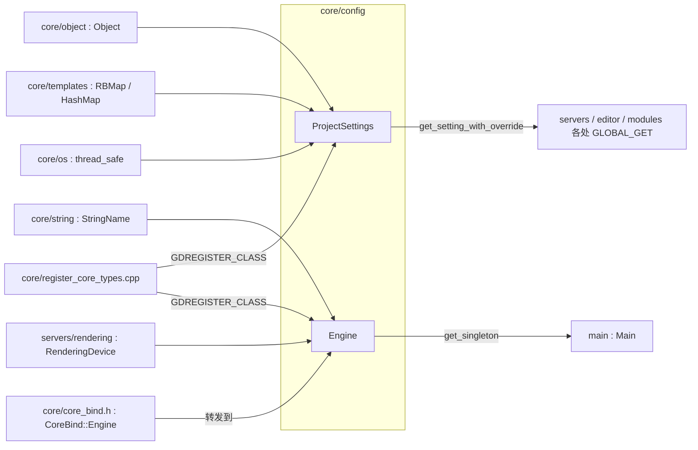
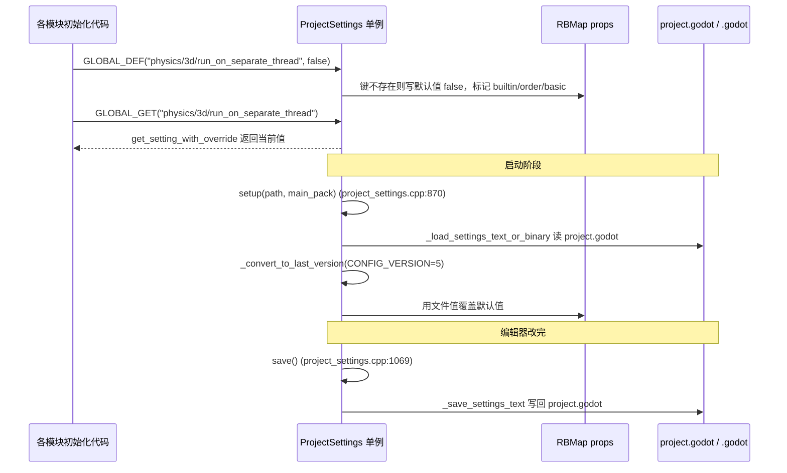

# config（core）

> 一句话：`config` 是引擎的「配置中枢 + 运行时仪表盘」——`ProjectSettings` 管「这台引擎该怎么跑」（静态配置），`Engine` 管「这台引擎现在跑得怎么样」（运行时状态），两者各自是一个进程级单例。

**结论**：`config` 模块给整台引擎提供两个全局单例——`ProjectSettings`（`core/config/project_settings.h:40`）负责项目设置的注册、读写与持久化，`Engine`（`core/config/engine.h:43`）负责记录帧率、时间缩放、物理步进、单例注册表等运行时状态；代价是它们都是进程全局唯一、随处可被 `GLOBAL_GET` 读取的中心化对象，改动要经统一入口，不能各自为政。

## 是什么 / 不是什么

`config` 只装两个类，共 4 个 `.h/.cpp` 文件、约 2882 行（`engine.h/.cpp` 229+453 行，`project_settings.h/.cpp` 295+1899 行，`SCsub` 6 行）。

- 它**负责**：把散落在各模块里的默认配置集中登记到一张表里（`GLOBAL_DEF` 系列宏），读 `project.godot` 时把值灌进去，编辑器改完后写回去；同时维护一整套运行时计数器（帧数、物理帧、FPS、时间缩放）。
- 它**不负责**：解析 `.cfg` 那种键值文本文件——那是 `ConfigFile` 的活，在 `core/io/config_file.h:38`，不在这。
- 脚本里你写的 `Engine.max_fps`、`ProjectSettings.set_setting()` 不是直接敲这两个类的实例——`Engine` 的脚本可见版本是 `CoreBind::Engine`（`core/core_bind.h:568`），它是个转发壳，每个方法都调 `::Engine::get_singleton()`（见 `core/core_bind.cpp:1895`）。

一句话分清两兄弟：**`ProjectSettings` 存「该怎样」，`Engine` 存「现在怎样」**——前者可以存盘，后者每帧在变。

## 在引擎里的位置

- `ProjectSettings` 继承 `Object`（`core/config/project_settings.h:40`），靠 `RBMap<StringName, VariantContainer>` 存全部设置（`project_settings.h:101`），靠 `_THREAD_SAFE_CLASS_` 保证线程安全。
- `Engine` 不继承 `Object`，是纯 C++ 单例；脚本能碰到它是因为 `CoreBind::Engine` 这层包装。
- 二者都在 `core/register_core_types.cpp:320` 和 `:329` 被 `GDREGISTER_CLASS` 注册，并在 `:366` 把 `ProjectSettings` 挂成 `Engine` 的一个单例。

## 关键概念

- **全局默认项（GLOBAL_DEF）**：好比「出厂设置清单」。`GLOBAL_DEF("physics/3d/run_on_separate_thread", false)` 告诉引擎「这项默认是 false，第一次见到就登记」。真实锚点：宏定义在 `core/config/project_settings.h:261`，底层实现 `_GLOBAL_DEF` 在 `core/config/project_settings.cpp:1327`——它只做一件事：如果 `props` 里还没有这个键，就把默认值塞进去，再打上 order/basic/restart 等元数据。
- **读取项（GLOBAL_GET）**：好比「随时查表」。`GLOBAL_GET(m_var)` 展开成 `ProjectSettings::get_singleton()->get_setting_with_override(m_var)`（`project_settings.h:265`），带 feature override 语义——同一个键在 `.android`、`.editor` 等不同 feature 下可以给不同值（`feature_overrides`，`project_settings.h:109`）。
- **持久化文件（project.godot）**：设置落盘的目标文件。文本读写走 `_load_settings_text`（`project_settings.cpp:943`）/ `_save_settings_text`（`:1146`），二进制走 `_load_settings_binary`（`:909`）/ `_save_settings_binary`（`:1077`）。
- **版本迁移（CONFIG_VERSION）**：`static const int CONFIG_VERSION = 5`（`project_settings.h:161`）。老项目文件版本低，读进来时 `_convert_to_last_version`（`project_settings.cpp:626`）负责把它一步步升到当前版本。
- **运行时状态（Engine 的计数器）**：帧数 `frames_drawn`、物理帧 `_physics_frames`、时间缩放 `_time_scale`、物理 tick `ips`，这些字段全在 `core/config/engine.h:59-76`，是「引擎现在怎么样」的实时快照。

## 核心文件（按阅读顺序）

1. `core/config/SCsub` — 只把本目录 `*.cpp` 加进 `core_sources`，没有 `register_types`，注册在别处统一做。
2. `core/config/project_settings.h` — `ProjectSettings` 类声明 + 全部 `GLOBAL_DEF/GLOBAL_GET` 宏，是理解本模块的入口。
3. `core/config/project_settings.cpp` — 加载/保存/迁移/`_GLOBAL_DEF`/内置默认项的实现，全模块最长（1899 行）。
4. `core/config/engine.h` — `Engine` 类声明，运行时状态字段 + 单例注册表 API。
5. `core/config/engine.cpp` — `Engine` 的实现：时间缩放计算、FPS 上限联动 `RenderingDevice`、单例增删查、版本信息拼装。

## 数据流 / 调用链

一次「模块声明默认配置 → 引擎读取 → 编辑器保存」的典型链路：

关键点：`GLOBAL_DEF` 只在「键还没登记」时写默认值（`project_settings.cpp:1329` 的 `has_setting` 判断），所以文件里的用户值永远不会被默认值顶掉；`setup` 之后的 `GLOBAL_GET` 拿到的才是合并了文件值、feature override 之后的最终值。

## 中文口诀

- 默认值先登记，GLOBAL_DEF 来造表。
- 读值走 GLOBAL_GET，override 优先表。
- project.godot 落盘，version 五步慢慢搬。
- ProjectSettings 管该怎样，Engine 管现在怎样。
- 脚本碰的是包装壳，真身在 config 里藏。
- 线程安全靠 _THREAD_SAFE，改动全走统一入口。

## 练习（15 分钟）

1. 打开 `core/config/project_settings.cpp`，在 `_add_builtin_input_map()` 附近（约 `:1648`）找一条 `GLOBAL_DEF`，顺着 `_GLOBAL_DEF`（`:1327`）看它写了哪几个元数据字段。
2. 打开 `core/core_bind.cpp:1895`，确认 `CoreBind::Engine::set_physics_ticks_per_second` 是如何转发到 `::Engine` 单例的。
3. 在 `core/config/project_settings.h` 里数出 `GLOBAL_DEF` 系列共多少个变体宏（`RST`/`NOVAL`/`BASIC`/`INTERNAL`），分别对应 `_GLOBAL_DEF` 的哪个布尔参数。

## 自测

- [ ] `_GLOBAL_DEF` 里 `has_setting` 为真时，会不会覆盖已存在的值？（读 `project_settings.cpp:1329`）
- [ ] `ProjectSettings::save()` 写出的文件名是什么，文本格式和二进制格式分别在哪个函数里实现？
- [ ] `GLOBAL_GET_CACHED` 靠什么判断缓存是否失效？（读 `project_settings.h:278-295` 里的 `_version` 比较）
- [ ] `ConfigFile` 是不是 `config` 模块的成员？（读 `core/io/config_file.h:38`）

## 一句话总结

> `config` 是引擎的两块全局地基：`ProjectSettings` 把「该怎么配置」集中成一张可存盘的表，`Engine` 把「现在跑得如何」集中成一排实时计数器，引擎上下处处通过 `GLOBAL_DEF/GLOBAL_GET` 和两个单例读写它们。
