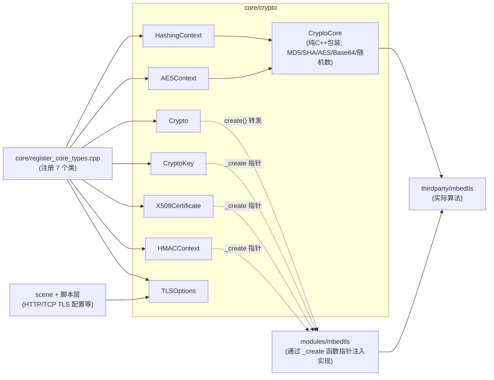
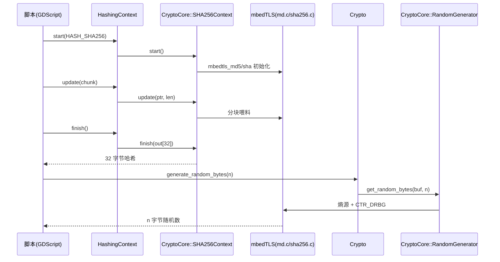

# crypto（core）

> 一句话：`crypto` 是引擎的「保险箱 + 验钞机」——给脚本提供哈希、AES 对称加密、RSA 非对称加密、证书、TLS 配置这些密码学原语，真正的数学运算外包给 mbedTLS。

**结论**：`core/crypto` 只定「接口」，不写「算法」——它把哈希/AES/随机数这些轻量运算封装成脚本能调的类，把 RSA、证书、HMAC 这类重运算留成函数指针，等 `mbedtls` 模块来填充实现；代价是两套编译路径和一层间接调用，关掉 mbedtls 模块时部分类只能返回空。

## 是什么 / 不是什么

`core/crypto` 是密码学原语的**门面**，不是密码学实现本身。它负责：

- 把哈希（MD5/SHA1/SHA256）、AES、Base64、随机数包装成 `RefCounted` 脚本类或纯 C++ 静态函数。
- 声明 `CryptoKey` / `X509Certificate` / `HMACContext` / `Crypto` 这些类的公开 API，并留好「谁来填空」的钩子。

它不负责：

- 真正的 RSA、X.509、TLS 握手算法——那些在 `modules/mbedtls/` 里（不在本模块写）。
- 证书链校验、密钥协商的具体密码学逻辑——同样交给 mbedtls 模块。

一句话记住：**core 定接口，module 补实现**。

## 在引擎里的位置



实线 = 直接编译依赖；虚线 = 运行时通过函数指针注入。

## 关键概念

1. **哈希流水线**：`HashingContext` 是一个「启动—喂料—出锅」三段的磨盘，`start()` 选算法，`update()` 分块倒数据，`finish()` 出结果（`hashing_context.h:56-58`）。算法枚举只有三个：`HASH_MD5 / HASH_SHA1 / HASH_SHA256`（`hashing_context.h:40-44`）。

2. **接口桩 + 实现注入**：`CryptoKey`、`X509Certificate`、`HMACContext`、`Crypto` 四个类在 core 里只有接口和一个 `_create` 函数指针（如 `crypto.h:42`）。mbedtls 模块启动时把这个指针指向自己的工厂函数；关掉模块时指针是空，`create()` 返回 `nullptr` 并报错（`crypto.cpp:122`、`crypto.cpp:133`）。

3. **纯 C++ 的 `CryptoCore`**：不出现在脚本里的内部工人，把 mbedTLS 原语包成 `RandomGenerator / MD5Context / SHA1Context / SHA256Context / AESContext` 五个内嵌类，外加 `b64_encode / md5 / sha1 / sha256` 四个静态函数（`crypto_core.h:40-118`）。它永远可用，不依赖 mbedtls 模块。

4. **两套编译路径**：`SCsub` 按「有没有 mbedtls 模块」分叉——模块开着就只编自己的 `.cpp`（`SCsub:49-55`），模块关了就从 `thirdparty/mbedtls` 抽出 10 个 `.c` 文件编一个精简版，保证哈希/Base64/AES 还能用（`SCsub:23-48`）。

5. **证书/密钥当资源存**：`ResourceFormatLoaderCrypto` 认识 `.crt / .key / .pub` 三种扩展名，读进来变成 `X509Certificate` 或 `CryptoKey` 资源（`crypto_resource_format.cpp:59-63`）。

## 核心文件（按阅读顺序）

1. `core/crypto/crypto.h` — 6 个脚本类的公开接口（`CryptoKey`、`X509Certificate`、`TLSOptions`、`HMACContext`、`Crypto`），先读这个建立全貌。
2. `core/crypto/hashing_context.h` — `HashingContext` 和 `HashType` 枚举，最简单的入口类。
3. `core/crypto/aes_context.h` — `AESContext` 和 4 种工作模式（ECB/CBC × 加密/解密）。
4. `core/crypto/crypto_core.h` — `CryptoCore` 纯 C++ 包装层，看它到底调了哪些 mbedTLS 原语。
5. `core/crypto/crypto_resource_format.h` — `.crt/.key/.pub` 的加载/保存器。
6. `core/crypto/SCsub` — 两套编译路径的开关逻辑，理解「轻量构建」的关键。

## 数据流 / 调用链

以「脚本算一个 SHA256」和「脚本生成随机数」为例：



注意 `HashingContext::update/finish` 内部用 `switch` 按 `type` 分发到 `MD5Context / SHA1Context / SHA256Context` 三个不同的 mbedTLS 上下文（`hashing_context.cpp:40-64`），最终都落到 `CryptoCore`。

## 中文口诀

```
哈希三段走，start、update、finish 不回头。
AES 十六字节对齐走，ECB 简单 CBC 要 IV。
密钥证书是空壳，mbedtls 模块来填肉。
模块一关别硬凑，create 返回空指针。
随机哈希保底有，CryptoCore 永远在。
证书三兄弟，crt、key、pub 资源存。
比较用恒定时间，防时序攻击别省。
```

## 练习（15 分钟）

1. 打开 `core/crypto/crypto.cpp`，找到 `CryptoKey::_create` 和 `Crypto::_create` 这两个静态函数指针，确认它们的默认值是 `nullptr`（第 37、128 行附近）。
2. 打开 `core/register_core_types.cpp` 的 233-239 行，数一数 core 一共注册了几个 crypto 相关的类，并区分哪些是 `GDREGISTER_CLASS`、哪些是 `register_custom_instance_class`。
3. 打开 `core/crypto/SCsub`，对比 `if not has_module` 分支（第 23-48 行）和 `elif is_builtin` 分支（第 49-55 行）编译的源文件差异，用一句话说清两者区别。
4. 读 `core/crypto/crypto.cpp:154-169` 的 `constant_time_compare`，写出它为什么能防时序攻击（提示：看它是否提前返回）。

## 自测

- [ ] `CryptoKey`、`X509Certificate`、`HMACContext`、`Crypto` 这四个类为什么用 `register_custom_instance_class` 而不是普通注册？关掉 mbedtls 模块后调用 `Crypto::create()` 会发生什么？
- [ ] `HashingContext` 支持哪三种哈希算法？它们的输出长度分别是多少字节？
- [ ] `AESContext::start` 对密钥长度和 IV 长度各有什么约束（`aes_context.cpp:39-45`）？
- [ ] `.crt`、`.key`、`.pub` 分别被加载成什么资源类型（`crypto_resource_format.cpp:35-56`）？

## 一句话总结

> `core/crypto` 是密码学原语在引擎里的「总服务台」——哈希、AES、随机数这类轻活自己接，RSA、证书、HMAC 这类重活登记成函数指针等 mbedtls 模块来办，代价是一层间接调用和「模块关了部分类变空壳」的妥协。
