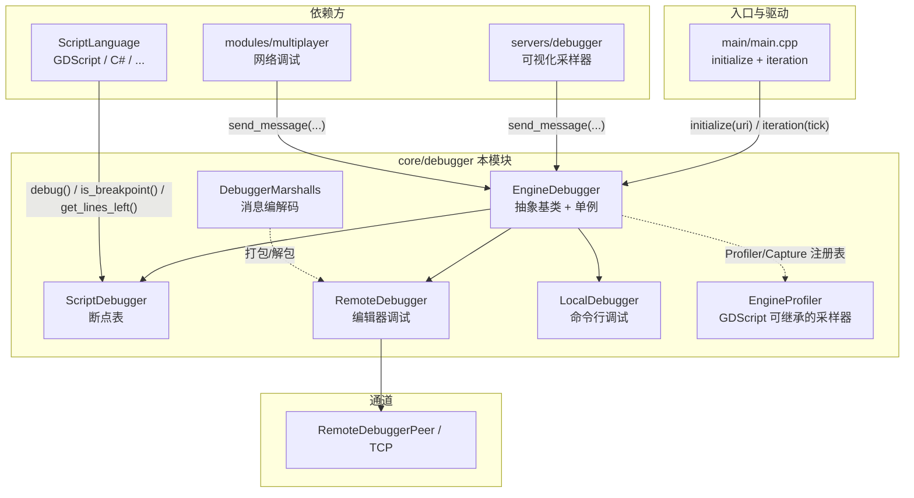
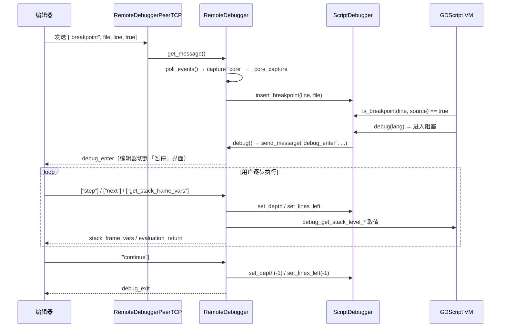

# debugger（core）

> 一句话：调试器就像给运行中的游戏装了一根「对讲机」——引擎这边汇报日志/报错/帧耗时，编辑器那边发回断点、单步、取变量等指令，两边靠一条消息通道对话。

**结论**：`core/debugger` 是引擎内置调试的「公共地基」——它定义一套与调试器无关的抽象（单例、断点表、性能采样、消息编解码），让「远程编辑器调试」和「命令行本地调试」共用同一条主干；代价是它自己不真正执行调试指令，命令解析与数据采集要交给 `RemoteDebugger`、`LocalDebugger` 以及各脚本语言的 `ScriptLanguage` 实现。

## 是什么 / 不是什么

这个目录是「调试的骨架」，不是「调试的肉」。

- 它负责：抽象调试器接口（`EngineDebugger` 基类 + 单例）、维护断点表（`ScriptDebugger`）、注册/分发性能采样器（`EngineDebugger::Profiler`）、把栈变量和错误打包成可传输的 `Array`（`DebuggerMarshalls`）。
- 它不负责：具体怎么连网络（`RemoteDebuggerPeerTCP` 只留接口，真正的 socket 在 `StreamPeerSocket`）；也不负责 GDScript 的单步/取值细节——那在 `modules/gdscript/` 的 `ScriptLanguage` 实现里，这里只通过 `ScriptLanguage` 抽象调用。
- 它不负责：场景树的实时可视化（`servers/debugger` 的 servers/visual profiler 是它的「客户」之一）。

对比句到此为止。一句话记住分工：`debugger` 管「通道和协议」，脚本语言管「执行和取值」，编辑器管「界面」。

## 在引擎里的位置

自上而下读：`main.cpp` 负责开机 `initialize`、每帧 `iteration` 喂时间；`EngineDebugger` 根据 URI 决定实例化 `LocalDebugger` 还是 `RemoteDebugger`，并持有 `ScriptDebugger` 断点表；各脚本语言 VM 在「命中断点」时反过来查断点表、进入 `debug()` 阻塞等待。

## 关键概念

1. **单例骨架 `EngineDebugger`** —— 一根「总插线板」。它持有静态指针 `singleton` 与 `script_debugger`（`engine_debugger.h:95-96`），真正干活的子类 `RemoteDebugger` / `LocalDebugger` 都继承它（`remote_debugger.h:39`、`local_debugger.h:36`）。

2. **断点表 `ScriptDebugger`** —— 一张「行号 → 文件集合」的地图。内部是 `HashMap<int, HashSet<StringName>> breakpoints`（`script_debugger.h:44`），一个行号可以挂多个源文件；`is_breakpoint(p_line, p_source)` 供脚本 VM 在每条语句前查询（`script_debugger.h:71`）。

3. **采样器注册表 `EngineDebugger::Profiler`** —— 一组「回调三件套」（`toggle` / `add` / `tick`，`engine_debugger.h:53-70`）。任何子系统都能 `register_profiler("名字", profiler)` 挂进去，`iteration` 每帧统一 `tick`，编辑器远程开/关。

4. **消息捕获 `EngineDebugger::Capture`** —— 「按前缀路由消息」的回调表。编辑器发来的命令按 `名字:子命令` 拆前缀，命中 `core` / `profiler` 等 capture 再派发（`remote_debugger.cpp:339-351`、`722-764`）。

5. **编解码器 `DebuggerMarshalls`** —— 把栈变量/栈帧/错误序列化成 `Array` 的「打包车间」。`ScriptStackVariable`、`ScriptStackDump`、`OutputError` 三个结构各带 `serialize()/deserialize()`（`debugger_marshalls.h:36-70`）。

## 核心文件（按阅读顺序）

1. `core/debugger/engine_debugger.h` — 抽象基类 + 单例，定义 Profiler/Capture/协议三类注册表和 `initialize/iteration/deinitialize` 生命周期。
2. `core/debugger/engine_debugger.cpp` — 生命周期的实际实现；`initialize` 里注册 `tcp://`/`unix://` 协议、按 URI 造 `LocalDebugger` 或 `RemoteDebugger`（`engine_debugger.cpp:123-169`）。
3. `core/debugger/script_debugger.h` — 断点表 + 单步/深度计数（`lines_left`、`depth`），是脚本语言与调试器的契约点。
4. `core/debugger/remote_debugger.h` — 编辑器调试的实现，持有 peer、输出/错误限流队列、各线程消息表。
5. `core/debugger/remote_debugger.cpp` — 核心：`debug()` 的阻塞消息循环（`396-650`）、`poll_events()` 的非阻塞派发（`652-720`）、`flush_output()` 限流打包（`191-261`）。
6. `core/debugger/local_debugger.h` — 命令行调试实现，`debug()` 里是一个 `debug> ` 交互 REPL。
7. `core/debugger/remote_debugger_peer.h` — 抽象 peer 接口 + `RemoteDebuggerPeerTCP`（后台线程收发包）。
8. `core/debugger/engine_profiler.h` — 可被 GDScript 继承的 `EngineProfiler`，通过 `bind/unbind` 挂进注册表。
9. `core/debugger/debugger_marshalls.h` — 消息结构体与序列化，是线路上消息的「格式定义」。

## 数据流 / 调用链

一条典型「编辑器下断点 → 命中 → 单步」的链路：

反向再看「运行时的日志/报错」：`RemoteDebugger` 在构造时把 `_print_handler` / `_err_handler` 挂进全局打印/错误钩子（`remote_debugger.cpp:793-799`），任何 `print` / 报错都会先落入 `output_strings` / `errors` 队列，再由 `flush_output` 限流后经 peer 送出（`remote_debugger.cpp:191-261`）。所以调试器的日志通道不是轮询抓取，而是「劫持全局打印钩子」。

## 中文口诀

> 引擎调试一插线板，单例骨架 `EngineDebugger`。
> 断点一张行号表，`ScriptDebugger` 管查询。
> 采样回调三件套，toggle、add、再 tick。
> 消息前缀做路由，core 与 profiler 分开走。
> 远程阻塞等命令，本地 REPL 敲键盘。
> 打包全靠 Marshall，栈帧错误变数组。

## 练习（15 分钟）

1. 打开 `engine_debugger.cpp` 的 `initialize`（123-169 行），找出 `local://` 和 `tcp://` 两个分支分别 new 了什么对象。
2. 在 `remote_debugger.cpp` 的 `debug()`（396-650 行）里，数一数 `command ==` 一共处理了多少种调试命令（step/next/continue/get_stack_dump/...），列出名单。
3. 打开 `local_debugger.cpp` 的 `debug()`，在 `debug> ` 提示符循环里找到 `c`（continue）和 `q`（quit）两个分支各自做什么。
4. 用 grep 在 `modules/gdscript/` 里搜 `get_lines_left`，看 VM 是在哪一行检查「还该不该停」的。

## 自测

- [ ] `EngineDebugger::is_active()` 返回 true 的条件是什么？（提示：看 `engine_debugger.h:106`，两个指针都得非空。）
- [ ] 编辑器发来 `performance:profile_frame` 这条消息，会命中哪个 capture、走到哪个函数？（提示：前缀 `performance`。）
- [ ] `ScriptDebugger` 的 `lines_left` / `depth` 两个 `thread_local` 变量，分别控制单步的什么语义？（提示：`step` 与 `next` 分支的差异。）

## 一句话总结

> `core/debugger` 是引擎调试的「通道 + 断点表 + 采样注册表 + 消息格式」四合一公共层，向上给脚本语言一个统一的调试契约，向下让远程编辑器和命令行两种前端共享同一条主干。
