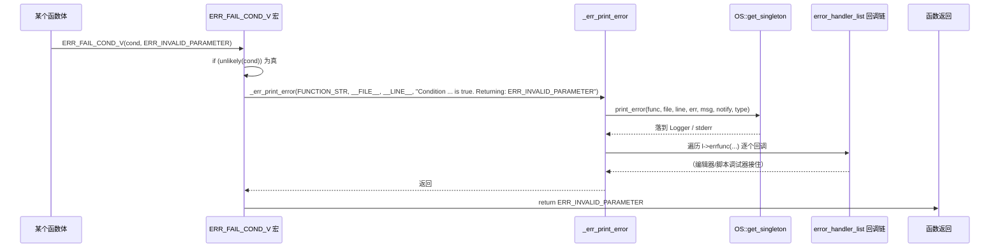

# error（core）

> 一句话：`core/error` 是引擎的「错误返回 + 错误报告」双件套——`Error` 枚举是函数之间约定好的「结果暗号」，`ERR_*` 宏族是散落在代码各处的「报警器」。

**结论**：`core/error` 只干两件事：用 `Error` 枚举（`core/error/error_list.h:46`）给每个函数一个统一的返回值「语言」，让调用方用 `result != OK` 判断成败；再用 `ERR_FAIL_*` / `ERR_PRINT` / `WARN_PRINT` 一整套宏（`core/error/error_macros.h`）做「检查 + 报错 + 提前返回」。它服务引擎里每一个 C++ 子系统，代价是：它是全局宏 + 全局枚举，没有命名空间，也不走异常（不 `throw`），错误只能靠「返回值逐层上传」这一条路，漏了就不被察觉。

## 是什么 / 不是什么

`core/error` 负责三样：错误码的定义（`Error` 枚举 + `error_names[]` 可读描述）、错误报告宏（几十个 `ERR_*`/`WARN_*`/`CRASH_*`）、以及错误处理器的注册分发（`add_error_handler` 回调链）。

它**不是**异常系统——Godot 全引擎禁用 C++ 异常，错误靠返回值传递，这套宏用「条件为真就打印并 `return`」来兜住非法输入。它**也不是**日志系统——`core/io/logger.h` 的 `Logger` 才是「怎么把一行字写到控制台/文件」的实现，`error` 只负责「决定要报什么、往哪个 handler 送」。脚本层的报错（GDScript 运行时错误）也不归它管，脚本错误只是借 `ERR_HANDLER_SCRIPT` 这个类型标签走同一条打印通道。

## 在引擎里的位置

```mermaid
flowchart LR
    subgraph core/error
        E[Error 枚举<br/>error_list.h]
        N[error_names[]<br/>error_list.cpp]
        M[ERR_* 宏族<br/>error_macros.h]
        P[_err_print_error<br/>error_macros.cpp]
    end
    TYP[core/typedefs.h<br/>_STR · unlikely]
    OS[core/os<br/>OS::print_error]
    LOG[core/io/logger<br/>Logger]
    CORE[core/ 其余全部<br/>math · io · object · variant]
    SCENE[scene/ · servers/ · editor/ · modules/]
    SCRIPT[脚本运行时<br/>GDScript · GDExtension]

    E --> N
    M --> P
    TYP --> M
    P --> OS
    P --> LOG
    CORE --> E
    CORE --> M
    SCENE --> E
    SCENE --> M
    SCRIPT --> P
```

- 向上依赖极薄：`error_macros.h` 只 `#include "core/typedefs.h"`（`error_macros.h:33`），靠里面的 `_STR`（字符串化，`core/typedefs.h:88`）、`unlikely`（分支预测提示，`core/typedefs.h:212`）、`_NO_INLINE_`（禁止内联，`core/typedefs.h:116`）就能独立存在。
- 向下几乎被一切依赖：`Error` 是 `core/` 里最底层的公共类型之一，`math`、`io`、`object`、`variant` 全都在用；`_err_print_error` 最终把字交给 `OS::print_error`（`core/error/error_macros.cpp:126`）或 `Logger`。

## 关键概念

- **Error 枚举**：引擎统一的「返回值语言」。`enum Error`（`core/error/error_list.h:46`）里 `OK` = 0，`FAILED` = 1，一路数到 `ERR_PRINTER_ON_FIRE`（`:95`，一个真存在的恶搞值），最后 `ERR_MAX`（`:96`）是哨兵、表示「错误总数」。核心约定写在枚举上方注释里：**永远不要拿返回值去和 `FAILED` 比较，要用 `result != OK` 或 `!result`**（`error_list.h:33-36`），这样将来才能给错误加更细的分类而不破坏现有代码。
- **error_names[]**：每个枚举值的「人话翻译」。`error_names[]`（`core/error/error_list.h:99`）在 `core/error/error_list.cpp:36` 定义，下标与枚举值一一对应，末尾 `static_assert(std_size(error_names) == ERR_MAX)`（`error_list.cpp:88`）保证加枚举时忘了加描述会编译报错。
- **错误处理器链（ErrorHandlerList）**：错误报告的「订阅广播」。`ErrorHandlerFunc`（`error_macros.h:61`）是一个函数指针类型，`ErrorHandlerList`（`error_macros.h:63`）把它串成单链表；`add_error_handler` / `remove_error_handler`（`error_macros.h:70-71`）负责挂上/摘下。每次报错，`_err_print_error` 会遍历整条链逐个回调（`error_macros.cpp:135-139`），编辑器、脚本调试器都靠它接住错误。
- **错误类型标签（ErrorHandlerType）**：把报错分四类——`ERR_HANDLER_ERROR` / `ERR_HANDLER_WARNING` / `ERR_HANDLER_SCRIPT` / `ERR_HANDLER_SHADER`（`error_macros.h:38-43`）。它只决定「前缀是什么、走哪条打印通道」，不改变「要不要返回」。
- **ERR_FAIL_* 宏族**：与 `assert()` 相反的逻辑（`error_macros.h:108`）——`assert` 是条件为假就崩，`ERR_FAIL_COND` 是条件为真才触发。而且它不崩，只「打印 + 返回」，设计目标是「bug 不致命，尽量返回可用的数据，让引擎继续跑」（`error_macros.h:110-113`）。

## 核心文件（按阅读顺序）

1. `core/error/error_list.h` — `Error` 枚举本体，以及「如何比较错误」的核心约定注释（`error_list.h:33-43`），全模块的地基。
2. `core/error/error_list.cpp` — `error_names[]` 描述数组 + 数量校验的 `static_assert`。
3. `core/error/error_macros.h` — 全部报错宏的定义处（约 860 行，含 `ErrorHandlerType`、`ErrorHandlerFunc`、`ErrorHandlerList` 三个基础设施）。
4. `core/error/error_macros.cpp` — 宏背后真正干活的 `_err_print_error` 实现：OS 未就绪时走 `_err_print_fallback` 直接 `fprintf(stderr, ...)`，就绪后走 `OS::print_error` 并广播回调链。
5. `core/error/SCsub` — 只有一行 `env.add_source_files(env.core_sources, "*.cpp")`，无独立编译配置。

## 数据流 / 调用链

一条 `ERR_FAIL_COND_V(cond, ERR_INVALID_PARAMETER)` 被展开后，从检查到返回的完整链路：



宏的命名即返回约定：**带 `_V` 的宏 `return m_retval`，不带 `_V` 的只 `return`**；`_MSG` 加一段人话消息；`_ED` 额外把 `p_editor_notify` 置真通知编辑器；`_ONCE` 用函数内 `static bool` 保证进程生命周期只打印一次（`error_macros.h:679-687`）；前缀换成 `CRASH_*` 则 `_err_flush_stdout()` 后 `GENERATE_TRAP()`（`__debugbreak`/`__builtin_trap`，`error_macros.h:98-104`）直接崩掉；`DEV_ASSERT` / `DEV_CHECK_ONCE` 只在 `DEV_ENABLED` 下编译，release 里被整段剔成空（`error_macros.h:826-850`）。

## 中文口诀

```
Error 枚举当暗号，OK 为 0 是通行；
比较别碰 FAILED，写成 result != OK；
ERR_FAIL 条件真才响，与 assert 正好相反；
带 V 才把值返回，带 MSG 多句话，带 ED 报给编辑器；
CRASH 一响就崩掉，DEV_ASSERT 只在调试期；
报错最终落 print_error，回调链上人人接。
```

## 练习（15 分钟）

1. 打开 `core/error/error_list.h:46-97`，从 `OK` 数到 `ERR_MAX`，数清 `Error` 枚举一共有多少个「可被函数返回」的值（不含 `ERR_MAX` 哨兵）。再对照 `core/error/error_list.cpp:36-86` 的 `error_names[]`，看描述条数是否与之一一对应。
2. 在 `core/error/error_macros.h` 里找出 `ERR_FAIL_NULL`（`:340`）、`ERR_FAIL_COND_V`（`:452`）、`ERR_CONTINUE`（`:490`）、`ERR_BREAK`（`:525`）四个宏，各写一句话说明它们在「不满足条件」时分别执行了什么跳转（`return` / `return m_retval` / `continue` / `break`）。
3. 打开 `core/core_constants.cpp:592-642`，确认 `Error` 枚举是被 `BIND_CORE_ENUM_CONSTANT` 逐个绑成 GDScript 全局常量的；再按 `core/error/error_list.h:39-43` 注释里写的四步流程，试述「新增一个错误码」要动哪四个文件。

## 自测

- [ ] 为什么注释反复强调「不要和 `FAILED` 比较，要 `result != OK`」？如果哪天给 `Error` 插入一个介于 `OK` 和 `FAILED` 之间的新值，和 `FAILED` 比较会出什么问题？
- [ ] `ERR_FAIL_COND(m_cond)` 与标准 `assert(m_cond)` 的触发条件分别是什么？各自「触发后」做了什么？
- [ ] `_err_print_error` 在「OS 还没初始化」和「OS 已就绪」两条路径下分别怎么打印？`is_printing_error` 这个 `thread_local` 标志是用来防什么的（`core/error/error_macros.cpp:116-121`）？

## 一句话总结

> `core/error` 是引擎的「结果暗号 + 报警器」：`Error` 枚举给全引擎一套统一的返回值语言，`ERR_*` 宏族用「条件为真就报错并返回」代替异常，把非法输入挡在崩溃之前，是 Godot「能跑就别崩」哲学的落地处。
