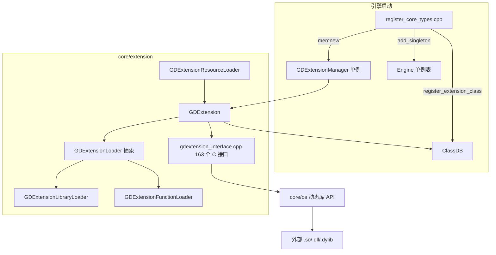
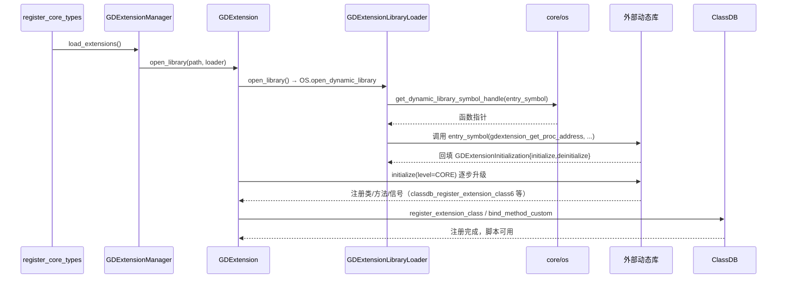

# extension（core）

> 一句话：GDExtension 是引擎给自己开的一扇「后门」——外部 C/C++ 写的动态库（.so / .dll / .dylib）凭一张 `configuration/entry_symbol` 门票，就能在运行时把类、方法、信号挂进引擎的 ClassDB，像原生模块一样被脚本调用。

**结论**：`core/extension` 是 Godot 的「外部原生扩展宿主」——它负责把第三方编译好的动态库在运行时加载进引擎并注册成原生类，为的是让开发者不必改引擎源码就能写 C++ 扩展；代价是它自己只是一层「翻译 + 调度」，真正的类行为、方法实现全在外部库里，引擎这边只有 `gdextension_interface.cpp` 里 163 个 C 接口函数当「翻译官」。

## 是什么 / 不是什么

这个目录干一件事：**把 .gdextension 配置文件指向的动态库，加载进来，并把库注册的类交给 ClassDB**。

- 它负责：解析 `.gdextension` 资源（`GDExtensionResourceLoader`）、加载/卸载动态库（`GDExtensionLibraryLoader`）、把库导出的类注册进 ClassDB（`GDExtension::_register_extension_class_internal` → `ClassDB::register_extension_class`）。
- 它**不负责**：动态库内部逻辑（那是库作者写的）；不负责 GDScript/C# 的绑定细节（那些是别的模块）；不负责导出模板里怎么打包库（那是 editor 的导出器）。
- 它不是旧 `GDNative`：GDExtension 是 4.x 重写的接口，头文件里 `#ifndef DISABLE_DEPRECATED` 包住的 `_register_extension_class`（旧版 1~5 号签名）就是为了兼容历史接口，新版统一走 `_register_extension_class6`（`gdextension.h:80-86`）。

## 在引擎里的位置

- 上家：`core/register_core_types.cpp:396-398` 在启动时依次调用 `GDExtension::initialize_gdextensions()` → `load_extensions()` → `initialize_extensions(CORE)`。
- 下家：`ClassDB`（注册类）、`core/os`（`open_dynamic_library` / `get_dynamic_library_symbol_handle` 真正碰动态库，见 `gdextension_library_loader.cpp:201,226`）。
- 旁路：`libgodot.h` 反着来——让一个宿主程序把 Godot 当库嵌进去（`libgodot_create_godot_instance`），这是「引擎被嵌入」的另一条线，不在主流程里。

## 关键概念

1. **入口符号（entry_symbol）**：动态库的「接头暗号」。`.gdextension` 文件里 `configuration/entry_symbol` 键写死一个函数名，加载器用 `get_dynamic_library_symbol_handle` 从库里捞出这个函数，转成 `GDExtensionInitializationFunction` 后调用（`gdextension_library_loader.cpp:226-235`）。
2. **初始化函数（initialize/deinitialize 回调）**：库导出的入口函数回填一个 `GDExtensionInitialization` 结构，里面带 `initialize` / `deinitialize` 回调。引擎按 level 逐级调用（`GDExtension::initialize_library`，`gdextension.cpp:846`），level 从 CORE → SERVERS → SCENE → EDITOR（`gdextension.h:143-148`）。
3. **接口函数表（interface functions）**：163 个 `gdextension_` 前缀的 C 函数，在 `gdextension_setup_interface()` 里用 `REGISTER_INTERFACE_FUNC` 宏逐个塞进 `GDExtension::gdextension_interface_functions` 这个 HashMap（`gdextension_interface.cpp:1709-1711`）。外部库要什么函数，就通过 `gdextension_get_proc_address(name)` 来取（`gdextension_interface.cpp:238`）。
4. **类注册桥（GDExtensionMethodBind）**：库注册一个方法，引擎就造一个 `GDExtensionMethodBind`（继承 `MethodBind`，`gdextension.cpp:49`），把库给的回调指针 `call_func` 包起来，再 `ClassDB::bind_method_custom` 挂上（`gdextension.cpp:617`）。脚本调用这个方法时，实际执行的是库里那个函数指针。
5. **热重载（reload，仅编辑器）**：`GDExtensionManager::reload_extension`（`gdextension_manager.cpp:158`）把旧库卸载、重新加载，还要把已创建实例的属性存下来重灌（`GDExtension::prepare_reload`，`gdextension.cpp:924`）。运行时构建里没有这条路。

## 核心文件（按阅读顺序）

1. `gdextension_interface.json` — 接口的「唯一事实源」：9327 行的 JSON，声明所有 C 接口类型/函数，构建时生成 `.gen.h`。
2. `SCsub` — 构建脚本，用 3 个 Python 脚本把 JSON 变成 `gdextension_interface.gen.h`、`gdextension_interface_dump.gen.h`、`ext_wrappers.gen.h`。
3. `gdextension.h` — 核心类 `GDExtension`（Resource），管理单个扩展库的打开、初始化、类注册表 `extension_classes`。
4. `gdextension_loader.h` — 抽象基类 `GDExtensionLoader`，定义 open/initialize/close 三个纯虚动作。
5. `gdextension_library_loader.h/.cpp` — 真正 load 动态库的实现，解析 `.gdextension` 文件、找入口符号。
6. `gdextension_manager.h/.cpp` — `GDExtensionManager` 单例，管所有已加载扩展、按 level 初始化/反初始化。
7. `gdextension_interface.cpp` — 163 个 C 接口函数的具体实现 + 注册表，外部库调用的入口都在这。
8. `godot_instance.h/.cpp` + `libgodot.h` — 反向场景：把 Godot 引擎嵌进别的宿主程序时用的壳。
9. `gdextension_resource_format.h/.cpp` — `GDExtensionResourceLoader`，让 `.gdextension` 文件能被 ResourceLoader 识别为资源。

## 数据流 / 调用链

一次典型的「启动时加载一个扩展」：

## 中文口诀

> 一张门票 entry_symbol，接头暗号要对上。
> 加载库靠 loader，动态库在 os 手上。
> 接口函数一百六，get_proc_address 来取用。
> 注册类走 ClassDB，方法绑定函数指针。
> 初始化分四级，CORE 到 EDITOR 逐层上。
> 热重载只在编辑器，卸载重灌属性档。

## 练习（15 分钟）

1. 打开 `core/extension/gdextension_library_loader.cpp`，找到 `parse_gdextension_file`，写出它强制要求的 3 个 `configuration/` 键（答案在 286-313 行）。
2. 打开 `core/extension/gdextension.cpp` 的 `initialize_gdextensions()`（889 行），数一数里面除了 `gdextension_setup_interface()` 之外，额外 `register_interface_function` 注册了几个 classdb 系列函数。
3. 打开 `core/register_core_types.cpp` 299 行附近，确认 `GDExtensionManager` 为什么是 `GDREGISTER_ABSTRACT_CLASS` 而不是 `GDREGISTER_CLASS`。

## 自测

- [ ] `gdextension_get_proc_address` 的参数是一个字符串名字，它最终从哪个 HashMap 里查表？查不到时会发生什么？（提示：`gdextension.cpp:798-802`）
- [ ] 引擎怎么知道该初始化到第几级？`GDExtension::get_minimum_library_initialization_level` 读的是哪个结构的哪个字段？

## 一句话总结

> `core/extension` 是一台「扩展接驳机」：`GDExtensionManager` 当总闸，`GDExtensionLibraryLoader` 把动态库接上电，`gdextension_interface.cpp` 的 163 个 C 函数当翻译，最后通过 `ClassDB` 把外部原生类插进引擎的类系统。
