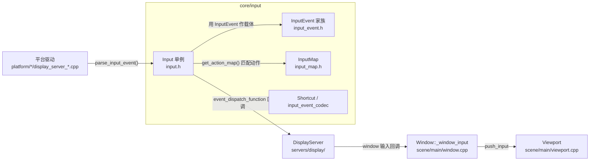
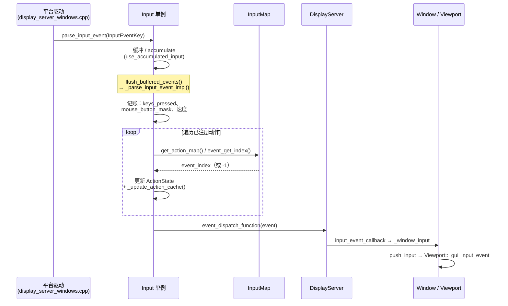

# input（core）

> 一句话：input 是引擎的「中枢神经系统」——把键盘/鼠标/手柄/触摸的原始信号，统一翻译成一张张 `InputEvent`「传票」，记账后广播给游戏节点，并按 `InputMap` 里的字典把按键组合翻译成「跳跃」「开火」这类动作。

**结论**：`core/input` 是 Godot 的输入中枢，为上层游戏逻辑服务，把所有设备的原始输入统一成 `InputEvent`、维护按键/动作的实时状态、并按 `InputMap` 做「按键 → 动作」映射；代价是它是一层全局单例中转（`Input`），任何输入都要先经过它再流到场景树，多了一层缓冲与回调。

## 是什么 / 不是什么

**是什么**：一个「翻译 + 记账 + 广播」的三段式流水线。平台驱动（`platform/*/display_server_*.cpp`）把操作系统事件包装成 `InputEvent` 交给 `Input` 单例（`core/input/input.h:78`），`Input` 记账（哪些键按着、鼠标在哪、每个动作力度多大），再按 `InputMap`（`core/input/input_map.h:40`）把事件匹配成动作，最后通过回调送回场景树。

**不是什么**：

- 它**不负责**从操作系统窗口系统里抓消息——那是 `platform/` 平台驱动和 `servers/display/` 的 DisplayServer 干的活。input 只负责「收到事件之后」的处理。
- 它**不负责**把输入投递给具体节点（GUI 控件、3D 拾取）——那是 `scene/main/viewport.cpp` 的 `Viewport` 干的事。input 只在最后把事件交给 DisplayServer 的回调，剩下的路由不属于这里。
- 它**不负责**物理按键扫描、手柄驱动通信——手柄数据库在 `core/input/gamecontrollerdb.txt`，但真正读手柄的是平台层。

## 在引擎里的位置

## 关键概念

1. **`InputEvent`（传票）**：一次输入的完整描述，本身是 `Resource`，可以进信号、可序列化（`core/input/input_event.h:52`）。整族分三层：`InputEventFromWindow`（带窗口 ID）→ `InputEventWithModifiers`（带 Shift/Ctrl/Alt/Meta）→ 叶子如 `InputEventKey`、`InputEventMouseButton`、`InputEventJoypadButton` 等。共 12 种具体类型，由 `InputEventType` 枚举定义（`core/input/input_enums.h:35`）。

2. **`Input` 单例（记账本 + 广播站）**：全局唯一的输入状态仓库。`static inline Input *singleton`（`core/input/input.h:82`），构造时 `singleton = this`（`core/input/input.cpp:2321`）。它记住「哪些键按着」（`keys_pressed`、`physical_keys_pressed`）、「鼠标位置与速度」（`mouse_velocity_track`）、「每个动作的按下状态与力度」（`action_states`），并对外提供 `is_action_pressed`、`get_vector` 这类查询。

3. **`InputMap`（动作词典）**：把动作名（如 `"jump"`）映射到一串 `InputEvent` 的字典。核心结构 `struct Action { int id; float deadzone; List<Ref<InputEvent>> inputs; }`（`core/input/input_map.h:49`）。`load_from_project_settings()`（`core/input/input_map.cpp:325`）从项目设置里读出 `input/` 段的动作配置。`ALL_DEVICES = -1` 表示动作不区分设备（`core/input/input_map.h:47`）。

4. **设备 ID（来路标记）**：每个 `InputEvent` 带一个 `device` 字段，用几个约定常量区分来源：`DEVICE_ID_KEYBOARD = 16`、`DEVICE_ID_MOUSE = 32`、`DEVICE_ID_EMULATION = -1`（触摸/鼠标互模拟）、`DEVICE_ID_INTERNAL = -2`（`core/input/input_event.h:64-67`）。0–15 预留给手柄（`JOYPADS_MAX = 16`，`core/input/input.h:104`）。

5. **手柄映射与事件编解码**：手柄物理按键通过 `gamecontrollerdb.txt` + `godotcontrollerdb.txt` 两张数据库翻译成标准 `JoyButton`/`JoyAxis`（构建时由 `core/input/SCsub:14-18` 生成 `default_controller_mappings.gen.cpp`）；`encode_input_event`/`decode_input_event`（`core/input/input_event_codec.h:40-41`）把事件打成字节流，供网络远程输入用。

## 核心文件（按阅读顺序）

1. `core/input/input_enums.h` — 所有枚举：`InputEventType`、`JoyButton`、`JoyAxis`、`MouseButton`、`HatMask`、`MIDIMessage`。先读它，后面都是这些类型的组合。
2. `core/input/input_event.h` — `InputEvent` 类族定义（继承链 + 每种事件的字段）。这是「传票」的长相。
3. `core/input/input_map.h` — 动作词典的定义与增删查接口。
4. `core/input/input.h` — `Input` 单例的完整接口：状态、查询、解析、手柄、鼠标模式、动作按压。核心中的核心。
5. `core/input/shortcut.h` — `Shortcut` 资源：把一串事件打包成一个「快捷键」，`matches_event` 判定是否命中。
6. `core/input/input_event_codec.h` — 事件二进制编解码（网络传输用）。
7. `core/input/input.cpp` — `Input` 的实现（约 2381 行），重点看 `parse_input_event`、`_parse_input_event_impl`、`_update_action_cache`。
8. `core/input/SCsub` + `input_builders.py` + `gamecontrollerdb.txt` — 手柄数据库的构建脚本与数据源。

## 数据流 / 调用链

一次「按下 W 键，触发 `move_up` 动作，节点收到 `_input`」的完整链路：

关键锚点：`Input::parse_input_event`（`core/input/input.cpp:1519`）→ `Input::_parse_input_event_impl`（`core/input/input.cpp:801`，其中动作匹配循环在 1005 行、最终分发回调在 1045 行）→ `event_dispatch_function`（每个 DisplayServer 构造时用 `set_event_dispatch_function` 注册，如 `platform/windows/display_server_windows.cpp:8393`）→ `Window::_window_input`（`scene/main/window.cpp:2004`）。

## 中文口诀

> 设备信号进引擎，先裹传票 `InputEvent`。
> 单例 `Input` 来记账，键鼠状态记心间。
> `InputMap` 是词典，动作映射把词翻。
> 设备 ID 标来路，十六键三十二鼠。
> 最后回调出单例，窗口视图去分发。

## 练习（15 分钟）

1. 打开 `core/input/input_event.h`，画出 `InputEvent` 的继承树（从 `InputEvent : Resource` 到 `InputEventKey` 中间有几层），并说出每层多存了什么字段。
2. 在 `core/input/input.cpp` 里找到 `_parse_input_event_impl`，定位「更新 `keys_pressed`」和「动作匹配循环」两段代码的行号，用自己的话复述它们各干了什么。
3. 打开 `core/input/input_map.cpp` 的 `load_from_project_settings()`，找到它读取的项目设置键名（`input/` 前缀），对照你项目里的 `project.godot` 输入段。
4. 用 `grep -rn "set_event_dispatch_function" core platform servers` 找出 3 个不同的 DisplayServer 实现，确认它们都在构造时把事件出口指回了自己。

## 自测

- [ ] `InputEvent::device` 取值为 16、32、-1、-2 时，分别代表什么来源？（答案见 `core/input/input_event.h:64-67`）
- [ ] `Input::parse_input_event` 在什么条件下会「缓冲」而不是立刻解析？缓冲的开关字段叫什么？（见 `core/input/input.cpp:1549-1557` 与 `use_accumulated_input`）
- [ ] 一个动作「刚刚按下」是靠哪个帧号记录判定的？`pressed_physics_frame` 和 `pressed_process_frame` 差在哪？（见 `core/input/input.cpp:1033-1042`）
- [ ] `InputMap::ALL_DEVICES` 和 `DEFAULT_DEADZONE` 的值各是多少？（见 `core/input/input_map.h:47,55`）

## 一句话总结

> `core/input` 是引擎的输入中枢：把设备信号统一成 `InputEvent`，由 `Input` 单例记账并广播，按 `InputMap` 把按键翻译成动作，是连接「操作系统输入」和「游戏节点 `_input`」的唯一中转站。
