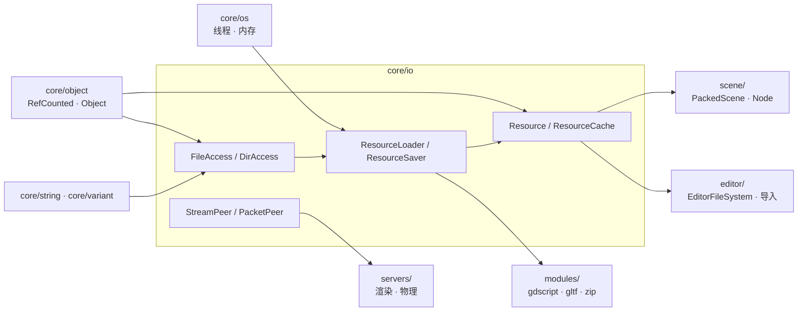
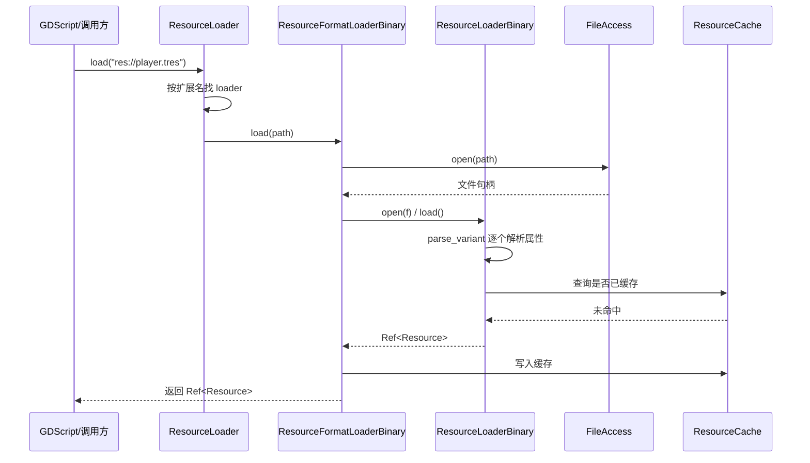

# io（core）

> 一句话：`core/io` 是引擎的「读写器官」——磁盘文件、目录、网络流、资源文件，全靠这一层的抽象接口进出。

**结论**：`core/io` 为整个引擎提供两类服务——底层「字节进出」（`FileAccess` / `DirAccess` 读写文件和目录、`StreamPeer` / `PacketPeer` 走网络），以及高层「资源进出」（`ResourceLoader` / `ResourceSaver` 把 `.tres` / `.scn` / `.png` 等文件变成引擎里的 `Resource` 对象再存回去）。代价是：它是纯抽象层，具体实现（磁盘、打包文件、加密、网络协议）都藏在 50 多个 `.cpp` 里，靠多态分发，读源码要先分清「接口」和「实现」。

## 是什么 / 不是什么

`core/io` 负责三件事：文件与目录的访问、资源（`Resource`）的加载与保存、以及网络字节流的收发（`StreamPeer`/`PacketPeer` 家族）。

它**不是**操作系统封装——`core/os` 才管平台差异和系统 API；`io` 只定义「读写接口」，平台怎么落地由 `platform/` 的 `FileAccessUnix` / `FileAccessWindows` 等子类实现。它**也不是**资源管理系统——`scene/resources/` 里的 `PackedScene`、`editor/` 里的 `EditorFileSystem` 才是资源的上层消费者，`io` 只负责「文件 → 对象」这一步转换。

## 在引擎里的位置



- 向上依赖：`core/object`（`RefCounted` 是所有 `FileAccess`/`Resource` 的基类）、`core/string`、`core/variant`、`core/os`（线程、内存、时间戳）。
- 向下被依赖：`scene/` 的 `PackedScene` 靠 `ResourceLoader` 反序列化，`editor/` 的 `EditorFileSystem` 靠 `DirAccess` 扫描目录，`modules/` 的 `gltf`、`zip`、`gdscript` 都往 `ResourceLoader` 里注册自己的格式加载器。

## 关键概念

- **文件句柄（FileAccess）**：一把「读写的钥匙」。`FileAccess` 是抽象基类（`core/io/file_access.h:45`），统一 `get_8/get_32/get_var/store_*` 一套读写原语；磁盘、内存、压缩包、加密各有一个子类（`FileAccessMemory`、`FileAccessCompressed`、`FileAccessPack`），通过静态 `FileAccess::open()`（`file_access.h:242`）按 `AccessType`（资源/用户数据/文件系统，`file_access.h:49`）分发到平台实现。
- **目录句柄（DirAccess）**：文件句柄的目录版。`DirAccess`（`core/io/dir_access.h:38`）提供 `list_dir_begin/get_next/change_dir/make_dir/copy/remove` 一套目录原语，同样靠 `make_default<T>()`（`dir_access.h:141`）挂平台实现。
- **资源（Resource）**：引擎里所有可保存/可加载的数据对象（贴图、网格、脚本、场景）的基类，定义在 `core/io/resource.h:52`。它带 `path_cache`（`resource.h:73`）记自己来自哪个文件，`ResourceCache`（`resource.h:197`）按路径缓存已加载实例，避免重复加载。
- **格式加载器（ResourceFormatLoader / Saver）**：资源的「翻译官」。`ResourceLoader`（`core/io/resource_loader.h:103`）是静态门面，内部维护一个 `ResourceFormatLoader` 数组（`resource_loader.h:156`），每个 loader 认识一种格式（二进制、JSON、图片、PO 翻译），`load()` 时按扩展名逐个问「你认不认这个路径」。
- **二进制格式（ResourceFormatLoaderBinary）**：Godot 的「母语」。`.tres`/`.scn`/`.res` 都是同一种二进制格式，由 `ResourceLoaderBinary`（`core/io/resource_format_binary.h:38`）解析、`ResourceFormatLoaderBinary`（`:109`）包装成 loader、`ResourceFormatSaverBinary`（`:182`）负责写回。

## 核心文件（按阅读顺序）

1. `core/io/resource.h` — 资源基类 `Resource` 和全局缓存 `ResourceCache`，理解「资源是什么」从这里开始。
2. `core/io/resource_loader.h` — 加载门面 `ResourceLoader` 和 loader 虚基类 `ResourceFormatLoader`，含线程加载与 `LoadToken`。
3. `core/io/resource_saver.h` — 保存门面 `ResourceSaver` 和 saver 虚基类 `ResourceFormatSaver`。
4. `core/io/resource_format_binary.h` — 二进制 `.tres`/`.scn` 的读写实现，Godot 原生资源格式。
5. `core/io/file_access.h` — 文件访问抽象基类，所有读写原语的定义处。
6. `core/io/dir_access.h` — 目录访问抽象基类。
7. `core/io/file_access_pack.h` — 打包文件（`.pck`/`.zip`）里的文件访问实现，`DirAccessPack` 也在里面。
8. `core/io/json_resource_format.h` — JSON 资源的加载/保存器（`ResourceFormatLoaderJSON`/`ResourceFormatSaverJSON`）。
9. `core/io/image_loader.h` — 图片格式加载器 `ImageLoader` 与 `ImageFormatLoader`。
10. `core/io/stream_peer.h` / `packet_peer.h` — 网络字节流/包接口的两个家族，TCP/TLS/UDP 都从这派生。

## 数据流 / 调用链

加载一个 `res://player.tres`（二进制格式）的典型链路：



保存方向对称：`ResourceSaver::save()`（`resource_saver.h:86`）→ 按资源类型找 `ResourceFormatSaver` → `ResourceFormatSaverBinary::save()` 用 `FileAccess::store_*` 把属性序列化回字节。

## 中文口诀

```
文件目录两把钥匙，FileAccess 配 DirAccess；
Resource 是数据本体，缓存记在 ResourceCache；
Loader 管进 Saver 管出，二进制是 Godot 母语；
StreamPeer 流 PacketPeer 包，网络字节各走各道；
抽象接口在 core/io，落地实现平台自己搞。
```

## 练习（15 分钟）

1. 打开 `core/io/file_access.h`，数出 `AccessType` 枚举里有几个值（`file_access.h:49`），对照 `file_access.cpp` 里 `FileAccess::create()` 看平台子类是怎么被 `make_default<T>()` 挂上的。
2. 在 `core/register_core_types.cpp:152-178` 找到 `ResourceLoader::initialize()` 和二进制、导入器、图片三个 loader 的注册，确认加载器是在哪一步被塞进 `ResourceLoader` 的数组。
3. 打开 `core/io/resource_format_binary.h:38` 的 `ResourceLoaderBinary`，找到 `parse_variant` 和 `external_resources` 字段，说明一个 `.tres` 里「引用了另一个资源」是怎么存、怎么在加载时被再触发一次 `load()` 的。

## 自测

- [ ] `ResourceLoader::load()` 返回的 `Ref<Resource>` 如何命中 `ResourceCache`？如果 `CACHE_MODE_IGNORE`（`resource_loader_constants.h:38`）会跳过哪一步？
- [ ] `FileAccess` 的 `READ_WRITE` 与 `WRITE_READ`（`file_access.h:60-61`）两个 ModeFlags 的区别是什么？
- [ ] 为什么 `.pck` 打包文件里也能 `open("res://...")` 读文件？`FileAccessPack` 是怎么把自己伪装成普通 `FileAccess` 的？

## 一句话总结

> `core/io` 是引擎的读写器官：底层 `FileAccess`/`DirAccess` 管字节进出，高层 `ResourceLoader`/`ResourceSaver` 管资源进出，两者之间由「格式加载器」这一层翻译官衔接，是引擎里几乎每个子系统都要踩一脚的地基模块。
