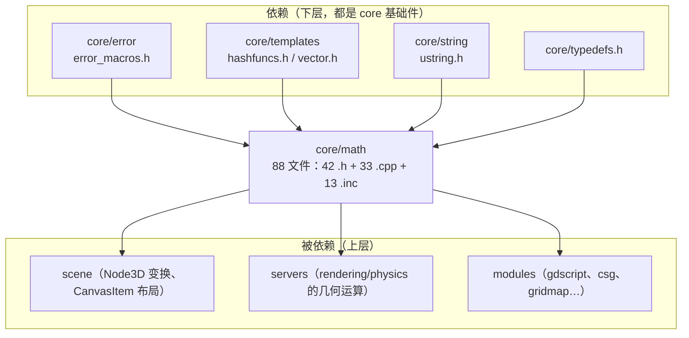
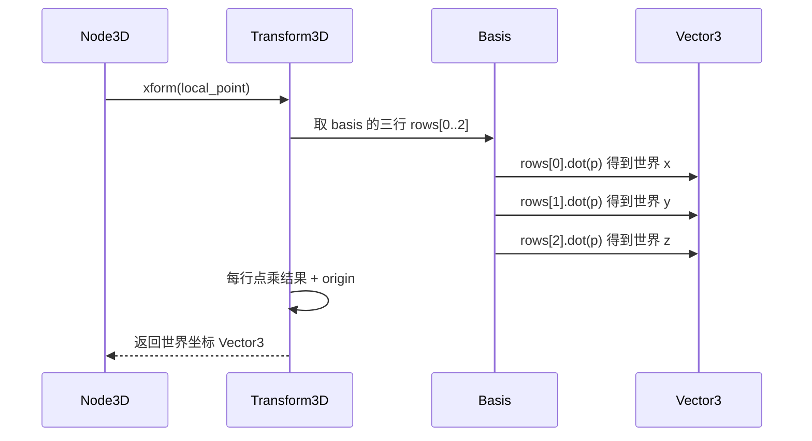

# math（core）

> 一句话：整个引擎的「算数地基」——坐标、旋转、颜色、碰撞、投影，所有游戏数学都堆在这层用 `real_t` 拼出来的小结构体上。

**结论**：`core/math` 是 Godot 的数学基础设施，为 `scene` / `servers` / `modules` 提供 2D/3D 向量、矩阵变换、几何查询、寻路与随机数等全部基础类型和算法；代价是它是一个纯头文件重、`_FORCE_INLINE_` 密集的模块（88 个文件，几乎零运行时抽象，所有值类型都是 POD 结构体），换速度换内存布局，但不承担任何业务逻辑。

## 是什么 / 不是什么

- **是**：值类型（`Vector3`、`Basis`、`Transform3D`……）和算法工具（`Geometry3D`、`AStar3D`……）的集合，全模块无 `Object` 继承，值类型都是 `struct`，靠 `Variant` 系统打包后暴露给 GDScript。
- **不是**：不做渲染、不做物理模拟、不做场景树管理。它只负责「算」，算出结果交给 `servers/rendering` 去画、交给 `servers/physics_*` 去碰、交给 `scene` 去组织。
- 对比：它跟 `core/string`、`core/templates` 一样属于最底层的纯工具层，但**只谈数字与几何**，不碰文本、不碰容器。

## 在引擎里的位置

- 入口文件 `SCsub` 只有一行 `env.add_source_files(env.core_sources, "*.cpp")`（`core/math/SCsub:6`），说明它把目录下所有 `.cpp` 直接编进核心，没有一个「注册模块」的入口——它不需要 `register_types`，因为值类型是通过 `variant` 系统对外暴露的。

## 关键概念

1. **`real_t`：可换精度的标量**。引擎里所有小数坐标都用 `real_t`，单精度时是 `float`、双精度构建时是 `double`（`core/math/math_defs.h:144`、`:146`）。改它一个别名，全引擎精度跟着变。
2. **向量是带字段的 `union`**。`Vector2` 用 `union` 把 `x/y`、`width/height`、`coord[2]` 叠在同一块内存上（`core/math/vector2.h:53-67`），`Vector3` 同理（`core/math/vector3.h:63-73`）。这是为了零拷贝、按需取别名。
3. **`Basis` = 三行向量组成的 3×3 矩阵**，存的是旋转 + 缩放，成员就一个 `Vector3 rows[3]`（`core/math/basis.h:41`）。旋转向量时就是「逐行点乘」：`rows[0].dot(v), rows[1].dot(v), rows[2].dot(v)`（`core/math/basis.h:336-340`）。
4. **`Transform3D` = `Basis` + `origin`**。两个成员：`Basis basis; Vector3 origin;`（`core/math/transform_3d.h:43-44`）。`basis` 管方向与缩放，`origin` 管平移。把局部点变到世界坐标用 `xform()`，反着变用 `xform_inv()`（`core/math/transform_3d.h:87`、`:94`）。
5. **`Quaternion`：为插值而生的旋转表示**。欧拉角会万向锁、矩阵插值会变形，四元数（`x/y/z/w` 四分量，`core/math/quaternion.h:46`）做 `slerp` 平滑插值最稳，所以动画和旋转插值用它。

## 核心文件（按阅读顺序）

1. `core/math/math_defs.h` — 定义 `real_t`、`MATH_CHECKS`（`:57`）等全局精度/校验开关。
2. `core/math/math_funcs.h` — `Math` 命名空间（`:39`），`sin/cos/clamp/lerp/random` 等标量函数。
3. `core/math/vector2.h` / `vector3.h` / `vector4.h` — 浮点向量；`vector2i.h` / `vector3i.h` / `vector4i.h` 是整数版本。
4. `core/math/basis.h` — 3×3 矩阵（旋转/缩放），`rotate` / `inverse` / `slerp` / `from_euler`（`:85`）。
5. `core/math/quaternion.h` — 四元数旋转。
6. `core/math/transform_2d.h` / `transform_3d.h` — 仿射变换（2D/3D），`xform` / `inverse` / `looking_at`。
7. `core/math/aabb.h` — 轴对齐包围盒（`position` + `size`，`:45-46`），碰撞粗筛必备。
8. `core/math/rect2.h` / `rect2i.h` — 2D 矩形；`plane.h` — 平面；`projection.h` — 投影矩阵。
9. `core/math/geometry_2d.h` / `geometry_3d.h` — 几何算法（`Geometry2D` 是类 `:42`，`Geometry3D` 是命名空间 `:40`）：求交、最近点、凸包。
10. `core/math/a_star.h` / `a_star_grid_2d.h` — 寻路（`AStar3D` `:41`、`AStar2D` `:171`、`AStarGrid2D`）。
11. `core/math/bvh.h` / `dynamic_bvh.h` / `bvh_tree.h` — 包围体层次，宽相（broadphase）加速结构。
12. `core/math/random_pcg.h` / `random_number_generator.h` — 随机数（`RandomPCG` `:54`、`RandomNumberGenerator`）。

## 数据流 / 调用链

以「把局部坐标变换到世界坐标」为例，走一遍典型的变换调用：

- 真实实现就在 `core/math/transform_3d.h:177-182`：`xform()` 返回 `Vector3(basis[0].dot(v)+origin.x, basis[1].dot(v)+origin.y, basis[2].dot(v)+origin.z)`——所谓「矩阵乘向量」，落到源码就是**三次点乘再加一个平移向量**。

## 中文口诀

> 向量坐标是地基，二维三维带整数；
> Basis 三行管旋转，四元数插值最稳当；
> Transform 加个原点，矩阵变换四处走；
> 包围盒与矩形，碰撞粗筛先上场；
> Geometry 与寻路，算法工具在高层；
> real_t 一个别名，单双精度随手换；
> 全是 struct 无继承，POD 直白快又省。

## 练习（15 分钟）

1. 打开 `core/math/vector3.h`，找到 `union` 块，写下一行注释说明 `x/y/z`、`coord[3]` 为何能共占内存。
2. 打开 `core/math/basis.h:336` 附近，把 `xform` 的「三行点乘」翻译成一句人话。
3. 打开 `core/math/transform_3d.h:43-44`，回答：为什么 `Transform3D` 只需要两个成员就能表达一个完整仿射变换。
4. 在 `core/math/geometry_3d.h` 里 grep `convex_hull`，确认它返回的数据结构类型。

## 自测

- [ ] `Vector2` 的 `x/y` 和 `coord[]` 是同一块内存吗？依据是哪一行？
- [ ] `Basis` 存的是行主序还是列主序？`xform` 里是「行点乘」还是「列点乘」？
- [ ] `Transform3D::xform` 和 `xform_inv` 的区别是什么？哪个在非均匀缩放下更安全（提示：看 `affine_inverse`）？
- [ ] `real_t` 默认是 `float` 还是 `double`？改双精度会重新编译哪些东西？

## 一句话总结

> `core/math` 是 Godot 的数学地基：88 个文件里，几十个 POD 结构体（向量、矩阵、四元数、包围盒）和一堆纯算法类，用最小的抽象代价支撑起整个引擎的坐标变换、几何计算与寻路。
