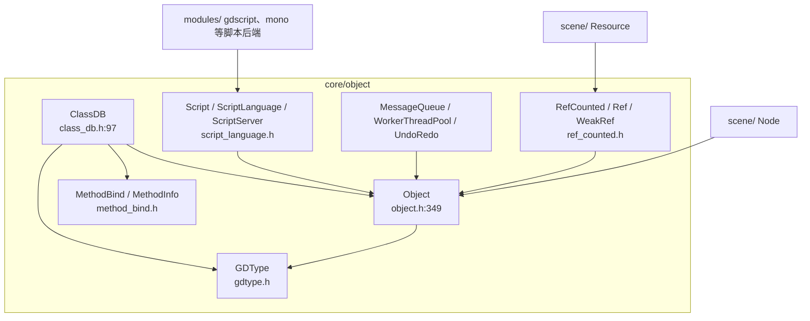
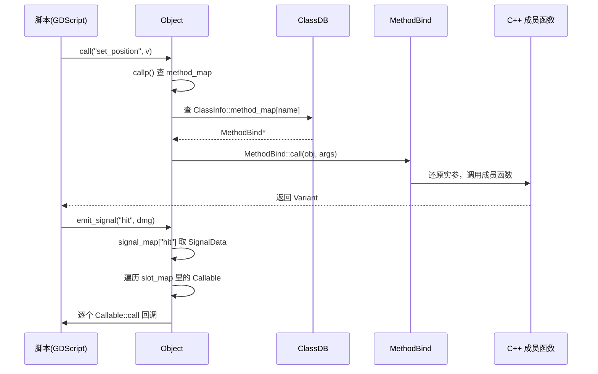

# object（core）

> 一句话：object 模块是 Godot 引擎的「户口本 + 调度台」——所有脚本可见类的共同祖先 `Object`、反射注册表 `ClassDB`、引用计数 `RefCounted` 都住在这里。

**结论**：`core/object` 是 Godot 对象模型的根基，它给引擎里每一个脚本可见的类提供「反射、属性、信号、脚本挂载、引用计数」五件套，代价是几乎所有 C++ 类都必须继承 `Object` 并接受 `GDCLASS` 宏的侵入式约束。

## 是什么 / 不是什么

这个目录管的是「对象如何存在、如何被脚本看见、如何互相调用」。它负责：定义 `Object` 基类（`core/object/object.h:349`）、用 `ClassDB` 登记每个类的方法/属性/常量（`core/object/class_db.h:97`）、用 `RefCounted` 数人头管理引用类型（`core/object/ref_counted.h:36`）、用 `MethodBind` 把 C++ 函数包成脚本可调用的形式（`core/object/method_bind.h:38`）。

它不管具体的游戏逻辑。渲染交给 `servers/rendering`，物理交给 `servers/physics_2d/physics_3d`，GUI 节点在 `scene/gui` 里继承它。`Object` 是「地基」，不关心楼上盖了什么房子。

## 在引擎里的位置

- `Object` 是根：`scene/` 的 `Node`、`Resource` 都是它的后代。
- `ClassDB` 依赖 `Object` + `MethodBind` + `GDType`，负责反射。
- `Script` 继承自 `Resource`（因此也是 `RefCounted`），脚本后端（GDScript、Mono）通过 `ScriptLanguage` 挂进引擎。

## 关键概念

1. **`Object` —— 公共祖先**。比喻：所有对象的「出生证」，上面有名字、编号、能做什么。它提供 `set/get`（`object.h:689`）、`call/call_deferred`（`object.h:707`、`object.h:792`）、信号 `connect/emit_signal/disconnect`（`object.h:785`、`object.h:767`）、`notification`（`object.h:721`）、元数据 `set_meta/get_meta`（`object.h:748`）和翻译 `tr/tr_n`（`object.h:810`）。每个对象还有一个唯一 `ObjectID`（`core/object/object_id.h:41`）。

2. **`ClassDB` —— 反射注册表**。比喻：户籍处，记录「哪个类有哪个方法、哪些属性、继承谁」。`bind_method`（`class_db.h:374`）、`add_property`（`class_db.h:469`）、`add_signal`（`class_db.h:460`）、`bind_integer_constant`（`class_db.h:500`）、`instantiate`（`class_db.h:345`）都在这。脚本里写的 `Node.new()`、`obj.get("x")` 最终都查它。

3. **`GDCLASS` 宏 —— 类身份登记**。比喻：贴在每个 `Object` 子类上的「身份证」。`GDCLASS(m_class, m_inherits)`（`object.h:248`）自动生成 `get_class_static()`、`cast_to`（`object.h:636`）、`initialize_class()`，把类名塞进 `ClassDB`。配套的 `GDSOFTCLASS`（`object.h:161`）给不入册的类用。

4. **`RefCounted` / `Ref<T>` / `WeakRef` —— 引用计数**。比喻：数人头，没人指着它就回收。`RefCounted`（`ref_counted.h:36`）用 `SafeRefCount` 记引用数，`reference()/unreference()`（`ref_counted.h:51`）增减；`Ref<T>`（`ref_counted.h:59`）是 C++ 侧智能指针，析构时 `unref()` 归零就 `memdelete`；`WeakRef`（`ref_counted.h:241`）只旁观不计数，不延长对象寿命。

5. **`MethodBind` + `Callable` —— 调用封装**。比喻：电话总机，把「脚本要调的方法名 + Variant 参数」转接成「C++ 成员函数实参」。`MethodBind` 基类（`method_bind.h:38`）存方法名、参数类型、默认参数，模板特化在 `method_bind_common.h`（如 `MethodBindT`、`MethodBindTRC`）。信号机制本体在 `Object` 里：连接存进 `signal_map`（`object.h:423`），发射走 `emit_signalp`（`object.h:776`），`Signal` 类型本身定义在 `core/variant/callable.h:178`。

## 核心文件（按阅读顺序）

1. `core/object/object.h` — `Object` 基类声明 + `GDCLASS/GDSOFTCLASS/ADD_SIGNAL` 宏 + `ObjectDB`（约 1168 行），模块的「宪法」，先读它。
2. `core/object/object.cpp` — `Object` 构造/析构、信号调度、属性 get/set 的实际实现。
3. `core/object/class_db.h` / `class_db.cpp` — `ClassDB` 反射注册表，`bind_method`/`add_property`/`instantiate` 的定义。
4. `core/object/method_bind.h` / `method_bind_common.h` — `MethodBind` 基类与各种参数/返回形态的模板特化。
5. `core/object/gdtype.h` — `GDType` 类型元数据（类名层级 `name_hierarchy`、常量表、信号表、枚举表）。
6. `core/object/ref_counted.h` — `RefCounted` / `Ref<T>` / `WeakRef`，引用计数三件套。
7. `core/object/message_queue.h` — `MessageQueue` / `CallQueue`，`call_deferred` 的延迟队列。
8. `core/object/worker_thread_pool.h` — `WorkerThreadPool`，基于 `Callable` 的任务线程池。
9. `core/object/undo_redo.h` — `UndoRedo`，撤销/重做（do/undo 操作对）。
10. `core/object/script_language.h` — `ScriptServer` / `Script` / `ScriptLanguage`，脚本后端的宿主接口。

目录共 35 个文件：17 个头文件、15 个 `.cpp`、`SCsub`、`make_virtuals.py`（构建时生成 `gdvirtual.gen.h`）、`object.compat.inc`（兼容层）。

## 数据流 / 调用链

一次「脚本调用方法 + 一次信号发射」的完整链路：

- 方法调用走 `Object::callp`（`object.h:703`）→ 查 `ClassDB` 的 `method_map`（`class_db.h:128`）→ `MethodBind` 拆包调用。
- 信号发射走 `emit_signalp`（`object.h:776`），从 `signal_map` 取出连接，逐个调用 `Callable`，支持 `CONNECT_DEFERRED` 走 `MessageQueue` 延迟（`object.h:354` 的 `ConnectFlags`）。

## 中文口诀

Object 是根，万物皆对象；
ClassDB 记账，反射不迷茫。
GDCLASS 贴标签，类型认得亲爹娘；
RefCounted 数人头，归零就释放。
信号一响 Callable 忙，方法全靠 MethodBind 扛。

## 练习（15 分钟）

1. `grep "class Object"` 定位到 `core/object/object.h:349`，找到 `signal_map`（约 423 行）和 `connect/emit_signalp` 声明，说出信号连接的存储结构长什么样。
2. 打开 `core/object/ref_counted.h`，读 `Ref<T>::unref()`（约 199 行），回答：引用计数什么时候减到 0，归零后发生什么。
3. 在 `core/object/class_db.h` 找 `bind_method` 模板（约 374 行），确认一个 `MethodBind` 是怎么被塞进 `ClassInfo::method_map` 的。
4. 打开 `core/object/SCsub` 和 `make_virtuals.py`，确认 `gdvirtual.gen.h` 是如何在构建时生成的。

## 自测

- [ ] `Object` 的信号连接存在哪个成员变量里？`ConnectFlags` 里 `CONNECT_DEFERRED` 和 `CONNECT_ONE_SHOT` 分别是什么意思？
- [ ] `Ref<T>` 在析构时做了什么？`WeakRef` 为什么不会延长它指向对象的寿命？
- [ ] 一个 C++ 类想要脚本可见，最少要贴哪个宏？它会被登记到 `ClassDB` 的什么数据结构里？

## 一句话总结

> `core/object` 是 Godot 的对象地基：`Object` 给万物立规矩，`ClassDB` 让脚本能看见万物，`RefCounted` 管万物的生死，`MethodBind` 让脚本能驱动万物。
