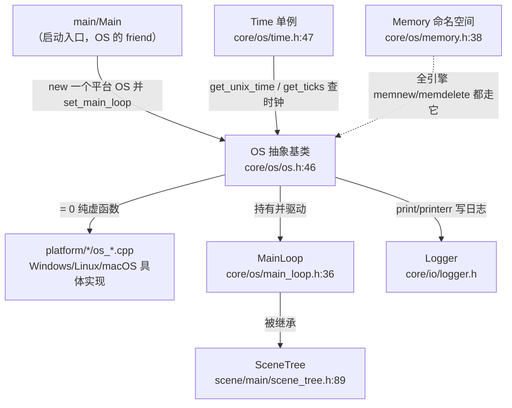
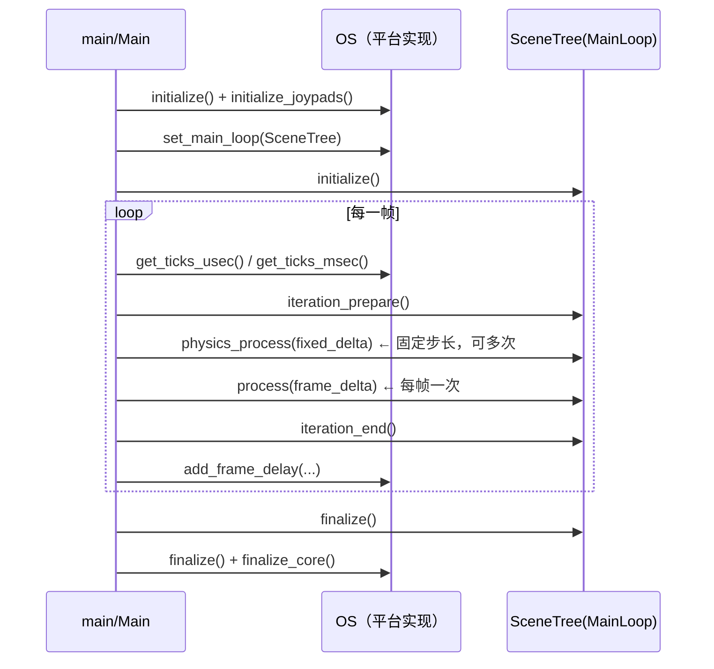

# os（core）

> 一句话：`os` 是引擎的「总前台」——把「我这程序跑在什么操作系统上」这件事，抽象成一纸跨平台接口合同，再配上主循环、内存、线程、时钟这些基础工具箱。

**结论**：`core/os` 负责定义操作系统抽象（`OS` 单例）与主循环契约（`MainLoop`），并为全引擎提供内存分配（`Memory`）、并发（`Thread`/`Mutex`/`Semaphore`）、时钟（`Time`）等底层能力；它的代价是**只定契约、不干重活**——真正的平台实现散落在 `platform/`，本模块绝大多数接口是 `= 0` 纯虚函数。

## 是什么 / 不是什么

**是什么**：一沓「合同」。`OS` 这个类把命令行、退出码、打印、环境变量、系统目录、时钟、进程、动态库加载这些平台差异，统一成一套接口（`core/os/os.h`），上层代码只认合同、不认平台。

**不是什么**：它不渲染画面（交给 `servers/rendering`），不派发键盘鼠标事件（交给 `core/input`），不读写文件（交给 `core/io`），不画控件（交给 `scene/gui`）。它也不「真正实现」平台逻辑——`OS` 里成片的纯虚函数（如 `initialize`、`get_ticks_usec`、`execute`、`get_datetime`、`get_name`，见 `core/os/os.h:132` 起），实际实现都在 `platform/<系统>/os_<系统>.cpp`，那不在本模块范围内。

一句话边界：**`core/os` 写合同，`platform/` 履约。**

## 在引擎里的位置



依赖方向：`OS` 依赖 `core/io/logger`、`core/config/engine`、`core/string/ustring`、`core/templates/list·vector`（见 `core/os/os.h:33-40` 的 include）。反过来，几乎整个引擎都通过 `OS::get_singleton()` 找它要服务——它是全局最底层的「服务台」之一。

## 关键概念

1. **OS 单例 = 总前台**。一个进程只有一个 `OS`，藏在 `static OS *singleton`（`core/os/os.h:78`），通过 `OS::get_singleton()`（`core/os/os.h:146`，实现 `core/os/os.cpp:55`）拿到。引擎任何角落想打印、查时间、开进程，都先找它。

2. **MainLoop 契约 = 演出流程**。主循环是抽象基类（`core/os/main_loop.h:36`），约定四幕：`initialize()` → 每帧 `process(delta)` + 固定步长多次 `physics_process(delta)`（中间夹 `iteration_prepare`/`iteration_end`）→ 退出时 `finalize()`（`core/os/main_loop.h:64-69`）。真正上台演出的是它的子类 `SceneTree`（`scene/main/scene_tree.h:89`）。

3. **Memory = 分配器的入口**。`Memory::alloc_static/free_static`（`core/os/memory.h:65-70`）是底层，`memnew`/`memdelete`/`memnew_arr` 宏（`core/os/memory.h:148/157/188`）在它上面包了一层，全引擎的 `new`/`delete` 都从这里走。

4. **并发工具箱**。`Thread`（`core/os/thread.h:64`）封装 `std::thread`；`Mutex`（可重入）/`BinaryMutex`（不可重入）加 RAII 的 `MutexLock`（`core/os/mutex.h:97-98,72`）；另有 `Semaphore`、`RWLock`、`SpinLock`、`ConditionVariable` 一整套。

5. **Time 单例 = 日历台**。`Time`（`core/os/time.h:47`）负责 ISO 8601 日期换算，在 `core/register_core_types.cpp:368` 注册为全局单例，供 GDScript 的 `Time` 调用。

## 核心文件（按阅读顺序）

1. `core/os/os.h` — `OS` 抽象基类，纯虚接口总表（平台合同）。
2. `core/os/main_loop.h` — 主循环四幕契约 + 应用生命周期通知枚举。
3. `core/os/memory.h` — `Memory` 命名空间 + `memnew`/`memdelete` 宏。
4. `core/os/thread.h` — `Thread` 封装（含主线程 ID、缓存行常量）。
5. `core/os/mutex.h` — `Mutex`/`BinaryMutex`/`MutexLock`，附 `rw_lock.h`、`semaphore.h`、`spin_lock.h`、`condition_variable.h`。
6. `core/os/time.h` — `Time` 单例；配套 `time_enums.h`（`Month`/`Weekday`）。
7. `core/os/keyboard.h` — `Key` 键码与 `KeyModifierMask` 修饰键枚举。
8. `core/os/process_id.h` — `typedef int64_t ProcessID`（进程号类型别名）。

本目录共 27 个文件：17 个 `.h`、9 个 `.cpp`、1 个 `SCsub`。`SCsub` 只写一行 `env.add_source_files(env.core_sources, "*.cpp")`（`core/os/SCsub:6`），即整目录的 `.cpp` 全部编进核心库。

## 数据流 / 调用链

一次典型调用：`Main` 启动后拿到平台 `OS` 实现，塞进主循环，然后逐帧驱动。



要点：`OS` 只负责「报时」和「收尾」，真正每帧要做什么由 `MainLoop` 契约规定、`SceneTree` 实现。`OS` 自己不发号施令，它把 `MainLoop` 存在手里（`get_main_loop` 纯虚，`core/os/os.h:253`），由 `Main` 取出来驱动。

## 中文口诀

```
OS 是管家，跨平台接话；纯虚当合同，实现在 platform。
MainLoop 定流程，SceneTree 来演出；初始化进帧循环，finalize 收尾。
memnew 造对象，memdelete 送终；Thread 开并行，Mutex 守门锁。
Time 查日历，OS 报 ticks；边界要看牢，别越俎代庖。
```

## 练习（15 分钟）

1. 打开 `core/os/os.h`，数一数 `= 0` 纯虚函数有多少处，并说出 5 个你认识的（提示：`get_ticks_usec`、`execute`、`get_datetime`、`get_name`、`get_main_loop`）。
2. 打开 `core/os/main_loop.h`，画出 `initialize → process/physics_process → finalize` 的调用顺序，并说出 `physics_process` 和 `process` 的参数含义差异。
3. 在 `core/os/memory.h` 找到 `memnew` 与 `memdelete` 宏，说明它们和 `Memory::alloc_static` / `operator new` 的层次关系。
4. 在 `core/os/mutex.h` 找到 `using Mutex` 和 `using BinaryMutex` 两行，说出「可重入」与「不可重入」的区别。

## 自测

- [ ] `OS` 是具体类还是抽象基类？它的单例声明在哪一行、用哪个函数拿到？
- [ ] `MainLoop` 的 `physics_process` 与 `process` 各自代表什么节奏？谁继承 `MainLoop` 成为引擎真正的主循环？
- [ ] `Time` 单例是在哪个文件、哪一行注册进引擎的？
- [ ] `OS::get_ticks_usec` 是纯虚函数吗？它的实现放在哪个层（core 还是 platform）？

## 一句话总结

> `core/os` 是引擎的「总前台」：一纸跨平台合同（`OS`）、一份主循环流程（`MainLoop`）、外加内存/线程/时钟三件套——只定规矩，脏活留给 `platform/`。
