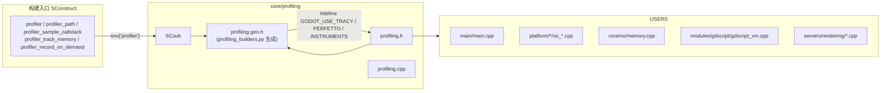
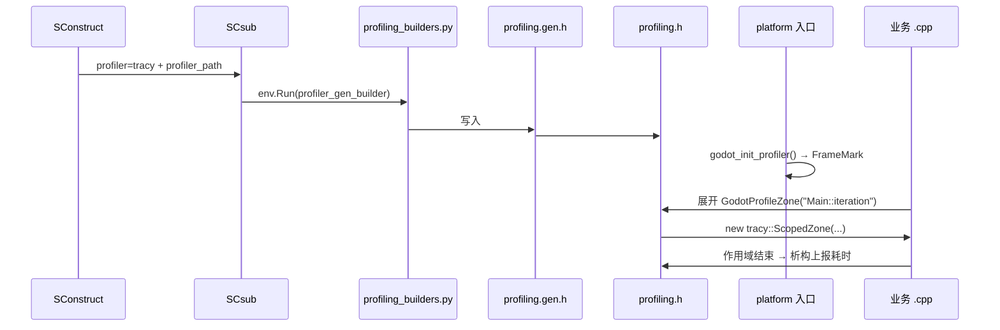

# profiling（core）

> 一句话：给引擎代码装上一排「镜头」，把每一段执行（函数、脚本调用、内存分配）拍成时间轴；换不同的外接分析器（Tracy / Perfetto / Instruments）只需换「插头」，不用改代码。

**结论**：`core/profiling` 是引擎的性能埋点层——它只定义「埋点宏」和「后端接线」，本身不采样、不分析、不渲染火焰图；真正的采集与分析交给 Tracy、Perfetto、Apple Instruments 三个外部工具。代价是：编译期多一次后端选择，代码里多一批空宏。

## 是什么 / 不是什么

它**是**：一套写在 `core/profiling/profiling.h` 里的宏（9 个），把「从这里到作用域结束是一个耗时区」这种意图，翻译成不同后端的调用。

它**不是**：

- **不是采样器/分析器**。它只发事件，不统计、不生成报告——那是 Tracy、Perfetto、Instruments 的事。
- **不是运行时 Profiler 面板**。引擎里那个带图表的面板属于 `Performance` 计数器（`main/performance.h`），不在这个目录。
- **不是一个 ClassDB 模块**。目录里没有 `register_types.cpp`，不向脚本暴露任何类；它是纯 C++ 编译期原语。

一句话：别的模块「往日志里打点」，这个模块「往分析器里打点」，且打点行为由编译选项决定。

## 在引擎里的位置

- 下游依赖：`profiling.h` 只依赖生成的 `profiling.gen.h`（`core/profiling/profiling.h:33`），后端头（`tracy/Tracy.hpp`、`perfetto.h`、`os/signpost.h`）按宏分支包含。
- 上游使用：埋点宏散布在 `main/main.cpp:4922`、`platform/windows/os_windows.cpp:2350`、`core/os/memory.cpp:62`、`modules/gdscript/gdscript_vm.cpp:500`、`servers/rendering/renderer_viewport.cpp:864` 等 `.cpp` 里。
- 生命周期钩子：`godot_init_profiler()` / `godot_cleanup_profiler()` 由平台入口调用，如 `platform/windows/godot_windows.cpp:69`。

## 关键概念

- **埋点宏（zone）**——像给代码段落拍照的镜头，拍的是「这段耗时」。`GodotProfileZone("Main::iteration")` 定义一个从本行到作用域结束的耗时区（`core/profiling/profiling.h:63`）。
- **后端切换**——同一个插座，插不同的插头。`#if defined(GODOT_USE_TRACY)` / `GODOT_USE_PERFETTO` / `GODOT_USE_INSTRUMENTS` 三个分支 + 一个全空 stub 分支（`core/profiling/profiling.h:45`、`98`、`181`、`241`）。
- **分组区（zone group）**——一镜到底的长镜头：`GodotProfileZoneGroupedFirst` 开镜，`GodotProfileZoneGrouped` 换机位（提前结束旧区、开新区），不新建作用域（`core/profiling/profiling.h:64-76`）。
- **脚本调用区**——源位置是「动态」的（脚本文件、函数名），不是编译期常量。`GodotProfileZoneScript` / `GodotProfileZoneScriptSystemCall` 传入 `StringName`（`core/profiling/profiling.h:78-81`），在 `gdscript_vm.cpp:500` 使用。
- **内存追踪**——`GodotProfileAlloc` / `GodotProfileFree` 一对，成对出现在分配/释放处（`core/profiling/profiling.h:85-93`），挂接点如 `core/os/memory.cpp:62`。

## 核心文件（按阅读顺序）

1. `core/profiling/profiling.h` — 唯一的公共接口：9 个埋点宏 + 2 个生命周期函数声明，按后端分支展开。
2. `core/profiling/profiling.cpp` — 各后端的 `godot_init_profiler()` / `godot_cleanup_profiler()` 实现，以及 Tracy 的 `StringName` 驻留表（`tracy::TracyInternTable`）。
3. `core/profiling/SCsub` — 编译期接线：根据 `env["profiler"]` 选择后端、追加第三方源文件（`TracyClient.cpp` / `perfetto.cc`），并触发 `profiling.gen.h` 生成。
4. `core/profiling/profiling_builders.py` — `profiler_gen_builder()`：把 `profiler=*` 选项翻译成 `profiling.gen.h` 里的 `#define`（`profiling_builders.py:6`）。

## 数据流 / 调用链

一次「编译期选后端 → 运行期打点」的完整链路：

- 编译期：`SConstruct:207` 定义 `profiler` 枚举（`none`/`tracy`/`perfetto`/`instruments`），`SCsub:49` 分支处理，`profiling_builders.py:8-21` 把选项写进 `profiling.gen.h`。
- 运行期：平台入口 `godot_init_profiler()`（如 `platform/windows/godot_windows.cpp:69`）初始化后端；业务代码里的 `GodotProfileZone` 等宏按后端展开成真实调用；作用域结束由 RAII 对象析构上报。

## 中文口诀

> 宏打点，后端换，代码不用动一遍。
> 编译选 profiler，gen.h 里写 define。
> 作用域开 Zone，析构报耗时。
> 分组区一镜到底，换机位不换镜头。
> 脚本位置是动态，驻留表里查 StringName。
> 分配释放成对来，Alloc 配 Free 记得全。
> 没选后端全是空宏，零开销照样编译。

## 练习（15 分钟）

1. 打开 `core/profiling/profiling.h`，找到 4 个 `#if defined(...)` 分支，说出每个分支对应的后端名。
2. 在 `core/profiling/SCsub` 里找到 `find_tracy_path`，指出它靠哪个文件名（`TracyClient.cpp`）判断路径类型。
3. 在 `main/main.cpp` 里 grep `GodotProfileZone`，数出它定义了几个耗时区（如 `"setup"`、`"Main::iteration"`、`"Physics Step"`）。
4. 读 `core/os/memory.cpp:62` 附近的 `GodotProfileAlloc`，对比 `profiling.h` 里 Tracy 与 no-op 两种展开的差别。

## 自测

- [ ] 为什么说这个模块「不向脚本暴露任何类」？依据是目录里少了哪个文件？
- [ ] `GodotProfileZoneGrouped` 和 `GodotProfileZone` 在作用域管理上的根本区别是什么？
- [ ] `godot_init_profiler()` 是在哪一层被调用的（core 还是 platform）？举一个真实调用点。
- [ ] `profiling.gen.h` 是手写的还是构建期生成的？由哪个函数生成？

## 一句话总结

> `core/profiling` 是引擎的「埋点插座」——用 9 个宏把耗时/内存事件发出去，用编译选项决定插哪个外部分析器，自己不做任何分析。
