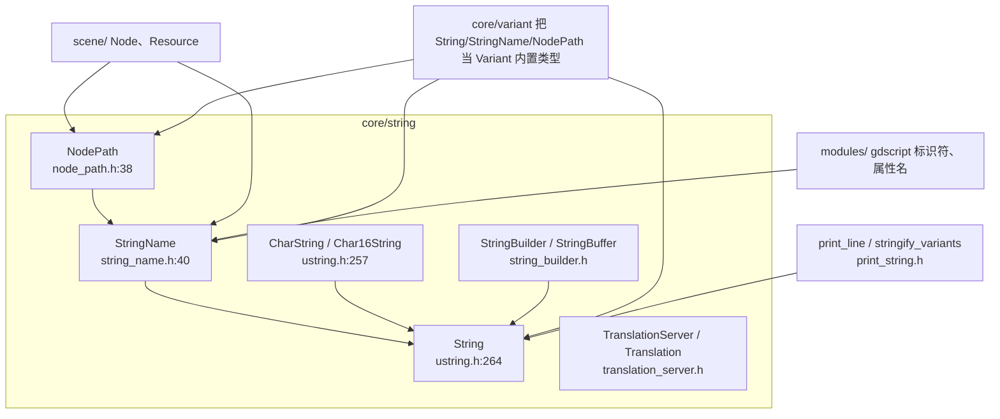
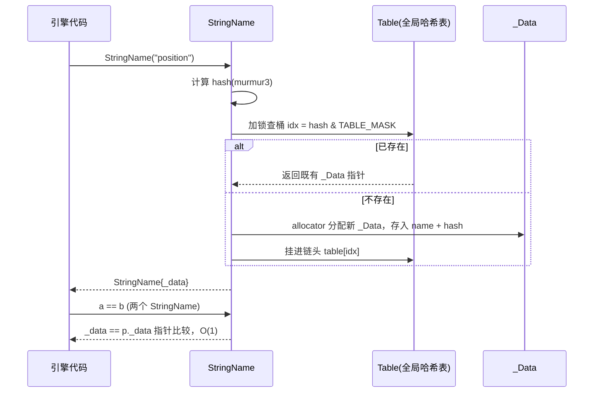

# string（core）

> 一句话：string 模块是 Godot 的「文字仓库 + 名字户籍处」——`String` 管可变文本，`StringName` 管不可变的标识符驻留，翻译系统管多语言。

**结论**：`core/string` 给引擎提供两套字符串——可编辑的 `String` 与全局驻留的 `StringName`，外加节点路径 `NodePath`、拼接器 `StringBuilder`/`StringBuffer`、以及 `TranslationServer` 多语言体系；代价是引入一张全局驻留哈希表（`StringName` 创建要加锁查表），换来字符串比较从 O(n) 降到 O(1)。

## 是什么 / 不是什么

这个目录管「字符怎么存、怎么拼、怎么比较、怎么翻译」。它负责：可变字符串 `String`（`core/string/ustring.h:264`）、驻留标识符 `StringName`（`core/string/string_name.h:40`）、节点路径 `NodePath`（`core/string/node_path.h:38`）、翻译服务 `TranslationServer`（`core/string/translation_server.h:36`）。

它不负责具体怎么渲染字形——那在 `servers/text` / `servers/rendering`；也不负责文件读写——那在 `core/io`。这里的 `String` 只管「内存里的字符」，磁盘上的字节流交给 `core/io` 的 `FileAccess`。

**String 和 StringName 的边界**：`String` 是「能改的文本」，`StringName` 是「不能改的名字」。要拼接、切片、格式化、显示，用 `String`；要做属性名、方法名、信号名、字典键、翻译 key，用 `StringName`。

## 在引擎里的位置

- `StringName` 建立在 `String` 之上：每个驻留项内部就存一个 `String name`（`string_name.h:46`）。
- `NodePath` 是 `Vector<StringName>` 的封装（`node_path.h:41-42`），所以路径比较也受益于 `StringName` 的 O(1)。
- `scene/` 的节点名、属性名、信号名全是 `StringName`；`modules/gdscript` 的标识符表也用 `StringName` 当键。

## 关键概念

1. **`String` —— 可变文本**。比喻：一块可以随便涂改的白板。底层是 `CowData<char32_t>`（`ustring.h:265`），即「UTF-32 字符数组 + 写时复制（COW）」：拷贝一个 `String` 不复制字符，只有真的改它时才分离。`length()` 返回字符数（`ustring.h:304`），`find`（`ustring.h:384`）、`split`（`ustring.h:481`）、`format`（`ustring.h:408`）、`to_int`（`ustring.h:457`）都挂在这里。

2. **`StringName` —— 驻留标识符**。比喻：给每个名字发一张唯一身份证，全网只印一张。全局 `Table`（`string_name.cpp:38`）是一张 65536 个桶（`TABLE_LEN = 1 << 16`，`string_name.cpp:39-40`）的链式哈希表，相同字符串只存一份 `_Data`（`string_name.h:43`）。因此 `operator==` 直接比指针 `_data == p_name._data`（`string_name.h:109-113`），O(1)。代价是创建时要 `MutexLock` 加锁查表（`string_name.cpp:218`）。高频场景用 `SNAME` 宏静态缓存（`string_name.h:212`），例如 `emit_signal`、`call_deferred`、`get_theme_*`。

3. **`CharString` / `Char16String` —— 编码桥**。比喻：翻译官，把 `String` 的 UTF-32 内部表示翻译成外面要的 `char*`（UTF-8/ASCII）或 `char16_t*`。`CharStringT<T>` 模板（`ustring.h:171`）实例化出 `CharString = CharStringT<char>` 和 `Char16String = CharStringT<char16_t>`（`ustring.h:257-258`）。`String::utf8()` 返回 `CharString`（`ustring.h:535`），`String::ascii()`（`ustring.h:518`）。

4. **`NodePath` —— 场景路径**。比喻：门牌号，指向场景树里的某个节点（或属性）。内部是 `Vector<StringName> path` + `Vector<StringName> subpath`（`node_path.h:41-42`），`Data` 引用计数共享。构造后不可变，切片用 `slice()`（`node_path.h:66`），比较同样走哈希。

5. **`TranslationServer` / `Translation` —— 多语言**。比喻：翻译中心，一句原文按 locale 翻成多国语言。`TranslationServer` 是单例（`translation_server.h:36`），持有 `main_domain`（`translation_server.h:42`）；`Translation` 是 `Resource` 子类，存 `translation_map`（`translation.h:61`）。入口是 `translate()` / `translate_plural()`（`translation_server.h:143-144`）。

## 核心文件（按阅读顺序）

1. `core/string/ustring.h` — `String` 本体 + `CharProxy` + `CharStringT`，全部字符串操作与编码转换的声明（约 812 行），先读它。
2. `core/string/string_name.h` / `string_name.cpp` — `StringName` 驻留表 `Table`，`setup/cleanup`、创建、`SNAME` 宏。
3. `core/string/char_utils.h` / `char_range.cpp` — Unicode 字符分类（`is_unicode_letter` 等），`xid_start`/`xid_continue` 二分区间表。
4. `core/string/node_path.h` — `NodePath`，`Vector<StringName>` 的路径封装。
5. `core/string/string_builder.h` / `string_buffer.h` — 两个拼接器：延迟拼接 vs 栈上小缓冲。
6. `core/string/print_string.h` — `print_line` / `stringify_variants` / 打印 handler。
7. `core/string/translation_server.h` / `translation.h` / `optimized_translation.h` — 翻译单例、翻译资源、压缩翻译。
8. `core/string/fuzzy_search.h` / `plural_rules.h` — 编辑器模糊匹配、复数规则求值。

目录共 31 个文件：16 个头文件、12 个 `.cpp`、2 个 `.compat.inc`、`SCsub`。`SCsub` 只有一句 `env.add_source_files(env.core_sources, "*.cpp")`（`core/string/SCsub:6`），全部编译进 `core_sources`。脚本可见类在 `core/register_core_types.cpp` 登记：`Translation`/`TranslationDomain`/`OptimizedTranslation`（`register_core_types.cpp:261-263`）、`TranslationServer`（`register_core_types.cpp:325`）。

## 数据流 / 调用链

一次 `StringName` 的创建与比较：

- 关键点：创建时查表加锁（`string_name.cpp:218`），比较时只比指针（`string_name.h:109-113`）。所以 `StringName` 适合「建一次、比很多次」的场景。
- `String` 则相反：`String::operator==` 走 `str_compare` 逐字符比（`ustring.h:109` 的 `str_compare`），代价与长度成正比，但换来可任意修改。

一条翻译调用链：`RTR("...")` / `Object::tr` → `TranslationServer::translate`（`translation_server.h:143`）→ 查 `main_domain` 的 `translation_map` → 命中则返回译文 `StringName`，否则回退 `fallback`（`translation_server.h:40`），最后原样返回。

## 中文口诀

String 可改白板一片，逐字比较开销现；
StringName 驻留只一份，指针一比定乾坤。
名字做键找它管，文本拼接别乱串；
NodePath 走场景，Builder 攒串省中间。
翻译交给 Server 办，复数规则 PluralRules 判。

## 练习（15 分钟）

1. `grep "class \[\[nodiscard\]\] String"` 定位 `core/string/ustring.h:264`，看 `_cowdata` 是什么类型，回答：为什么拷贝 `String` 不复制字符。
2. 打开 `core/string/string_name.h` 的 `operator==`（约 109 行）和 `core/string/string_name.cpp` 的 `Table`（约 38 行），回答：`TABLE_LEN` 是多少，为什么比较是 O(1)。
3. 在 `core/string/ustring.h` 找 `utf8()`（约 535 行）和 `ascii()`（约 518 行），确认它们各自返回什么类型，和 `CharString` 的 typedef 对一下。
4. 读 `core/string/string_buffer.h` 的 `reserve()`（约 121 行），回答：什么时候才从栈上小缓冲切换到堆上的 `String`。
5. 打开 `core/string/translation_server.h`，找到 `translate()` 和 `translate_plural()` 的参数，说出复数形式靠哪个类求值。

## 自测

- [ ] `String` 的 `operator==` 和 `StringName` 的 `operator==` 复杂度各是多少？为什么 `StringName` 能 O(1)？
- [ ] `StringName` 内部保存的 `String name` 存在哪个结构体里？创建时为什么需要加锁？
- [ ] `SNAME` 宏做了什么优化？文档注释里点名的三个适用场景是什么（`string_name.h:200-210`）？
- [ ] `NodePath` 的 `path` 和 `subpath` 各是什么类型？`Data` 里缓存了什么让重复 `hash()` 变快（`node_path.h:46-47`）？
- [ ] `Translation` 的 `translation_map` 键是什么结构？为什么用 `StringName` 而不是 `String` 做 key？

## 一句话总结

> `core/string` 是 Godot 的文字地基：`String` 管能改的文本，`StringName` 管不能改的名字，`NodePath` 管场景坐标，`TranslationServer` 管多语言——一套字符，四种用途。
