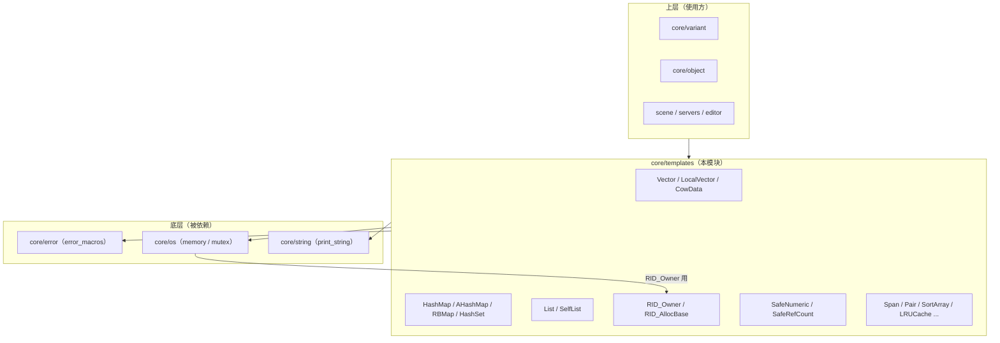

# templates（core）

> 一句话：这是 Godot 的「自研容器 + 工具模板仓库」——像一套为引擎定制的 STL，但刻意换了配方：容器做成了「写时复制」和「免异常」，还带一套为 RID / 引用计数 / 线程命令队列准备的原语。

**结论**：`core/templates` 是引擎最底层的通用数据结构层，为 `core` 及以上所有代码提供动态数组、哈希表、红黑树、链表、RID 分配、原子计数等基础件；它刻意不用 STL 容器，代价是「你写 C++ 时不能套 STL 的肌肉记忆」，换来的是内存布局可控、拷贝廉价、不依赖异常。

## 是什么 / 不是什么

`core/templates` 是「一堆头文件模板 + 三个 .cpp」的集合，`SCsub` 只编译 `*.cpp`（`core/templates/SCsub:6`）。它负责三件事：

1. **容器**：动态数组（`Vector`/`LocalVector`/`CowData`）、哈希表（`HashMap`/`AHashMap`/`HashSet`）、有序树（`RBMap`/`RBSet`）、链表（`List`/`SelfList`）。
2. **引擎原语**：`RID_Owner` 分配资源 ID，`SafeNumeric`/`SafeRefCount` 做线程安全的引用计数，`CommandQueueMT` 做跨线程命令排队。
3. **零散工具**：`Span`（数组视图）、`Pair`/`KeyValue`、`SortArray`/`SortList`、`PagedAllocator`、`RingBuffer`、`LRUCache` 等。

它**不是**一个注册模块：目录里没有 `register_types.cpp`，也不通过 ClassDB 暴露任何脚本类。它不负责分配策略之外的内存管理（底层内存交给 `core/os/memory.h` 的 `Memory`/allocator 接口），也不管具体业务——渲染、物理、场景这些「用容器的人」都不在这里。

它和 STL 的关键区别只有一条主线：**Godot 核心不抛异常，也不愿为一次浅拷贝付出整块数据复制的代价**。所以 `Vector` 是写时复制（COW），哈希表默认用 Robin Hood 开放寻址而非红黑树链桶。这是理解整个目录的钥匙。

## 在引擎里的位置



依赖方向很克制：模板文件几乎只 `#include` `core/error/error_macros.h`、`core/os/memory.h`、`core/string/print_string.h` 三个头（见 `vector.h:41`、`local_vector.h:33`、`cowdata.h:33`）。反过来，整个引擎的上层都往里 include，因此它是 `core` 里「被依赖最广、依赖最少」的一层。

## 关键概念

- **写时复制（COW）**：像「考试答案纸复印——谁都不改就共用同一张，谁要改才单独发一张」。`Vector` 里多个实例共享同一块 `CowData`，直到有人调用写接口（`ptrw`/`write[i]`）才真正复制数据。锚点：`CowData<T>`（`cowdata.h:60`）把「引用计数 + 容量 + 大小 + 数据」压在同一块内存里（布局注释见 `cowdata.h:67-72`），`Vector` 通过 `VectorWriteProxy write`（`vector.h:51`、`vector.h:65`）触发写分离。

- **免异常容器**：像「不发脾气的前台——出错靠返回值报，不靠甩脸色」。Godot 核心关闭 C++ 异常，所以 `push_back`/`resize` 返回 `bool`/`Error` 而不是抛异常。`Vector::push_back` 返回 `bool`（`vector.h:74`），`resize` 返回 `Error`（`vector.h:107`）。

- **三种哈希表，各有取舍**：`HashMap` 用 Robin Hood 开放寻址 + 按插入序的双链表（`hash_map.h:41-53`），适合需要稳定迭代/频繁增删；`AHashMap` 是「紧凑数组式」哈希表，元素像动态数组一样排布、可用下标访问，但删元素会拿末尾元素填洞（`a_hash_map.h:45-78`）；`RBMap` 是红黑树，适合需要有序遍历（`rb_map.h:42`）。

- **RID 分配**：像「挂号处发号牌——拿到号就能去对应窗口办事，号本身不携带数据」。`RID_AllocBase` 从全局递增的 `base_id` 发号（`rid_owner.h:67-71`），`RID_Owner` 把「号 → 对象指针」映射到一块紧凑数组上（`rid_owner.h:517`）。`RID` 本体是轻量的 64 位 ID（`rid.h`）。

- **原子引用计数**：像「带锁的计数器，不给你任何隐式算术，逼你显式声明原子操作」。`SafeNumeric<T>` 包装 `std::atomic<T>`，设计目标就是不提供隐式转换和算术运算（`safe_refcount.h:42-50`），`SafeRefCount` 在其上实现 `ref`/`unref`（`safe_refcount.h:188`）。

## 核心文件（按阅读顺序）

1. `vector.h` — 对外最常用的 COW 动态数组，几乎所有数组语义都转发给 `CowData`。
2. `cowdata.h` — COW 的真正实现：单块内存存「引用计数 + 容量 + 大小 + 数据」，1.5 倍扩容（`cowdata.h:87`）。
3. `local_vector.h` — 无 COW 的动态数组，内部代码在明确不需要 COW 时用它省掉引用计数开销。
4. `hashfuncs.h` — 哈希/比较的默认策略 `HashMapHasherDefault`、`HashMapComparatorDefault`。
5. `hash_map.h` — Robin Hood 开放寻址哈希表，键值按插入序维护双链表。
6. `a_hash_map.h` — 数组式紧凑哈希表，内存小、可按下标访问。
7. `rb_map.h` / `rb_set.h` — 红黑树实现的 Map/Set，有序遍历用。
8. `list.h` — 双向链表，接口刻意做得和 `SelfList` 兼容。
9. `self_list.h` — 侵入式链表，节点内嵌前后指针，省掉一次额外分配。
10. `rid_owner.h` — RID 的分配与「ID → 对象」归属管理。
11. `safe_refcount.h` — `SafeNumeric`/`SafeRefCount` 原子计数原语。
12. `span.h` — 只读的连续内存视图（等价 `std::span`），不拥有内存（`span.h:56-60`）。
13. `sort_array.h` / `sort_list.h` — 数组/链表的排序包装。
14. `command_queue_mt.h` — 跨线程命令队列，把「对象 + 成员函数 + 参数」打包排队执行。
15. 其余工具：`pair.h`（`Pair`/`KeyValue`）、`paged_allocator.h`、`ring_buffer.h`、`lru.h`（`LRUCache`）、`vset.h`、`fixed_vector.h`、`pooled_list.h`、`bin_sorted_array.h`、`hash_set.h`、`iterable.h`、`tuple.h`。

## 数据流 / 调用链

以「新建一个 `Vector`、往里塞两个元素、写一次、再拷贝一份」为例：

```mermaid
sequenceDiagram
    participant U as 使用方代码
    participant V as Vector&lt;T&gt;
    participant C as CowData&lt;T&gt;
    participant M as Memory（core/os/memory）

    U->>V: Vector&lt;int&gt; a;
    U->>V: a.push_back(1)
    V->>C: push_back()（无共享数据 → 直接分配）
    C->>M: alloc_static（单块内存：计数+容量+大小+数据）
    U->>V: a.write[0] = 42
    V->>C: ptrw()（发现计数 > 1 → 触发 COW 分离）
    C->>M: 复制旧数据到新块
    U->>V: Vector&lt;int&gt; b = a;（浅拷贝，只加引用计数，不复制数据）
    Note over V,C: b 与 a 共享同一 CowData，直到任一方写
```

关键点：`Vector` 的拷贝构造是**浅拷贝**，只增加 `CowData` 里的引用计数；只有 `write` 代理、`ptrw()` 这类「取可写指针」的路径才会真正复制数据。这正是 COW 容器和 STL `std::vector`（拷贝即整块复制）的根本差异。

## 中文口诀

> 数组三兄弟，`CowData` 打底，`Vector` 套 COW，`LocalVector` 就地。  
> 哈希有三样，`HashMap` 稳序，`AHashMap` 紧凑，`RBMap` 有序。  
> 链表分内外，`List` 自带节点，`SelfList` 侵入省一分配。  
> RID 是号牌，`RID_Owner` 发号又查表，号轻数据重。  
> 引用计数带锁，`SafeNumeric` 不隐转，显式声明原子操作。  
> 全族不抛异常，出错靠返回值报。

## 练习（15 分钟）

1. 打开 `cowdata.h:67-72` 的布局注释，画出「引用计数 / 容量 / 大小 / 数据」四块在一段内存里的相对位置。
2. 在 `vector.h` 里找出 `write` 成员和 `ptrw()`，回答：哪一个调用会触发 COW 分离？
3. 对比 `hash_map.h:41-53` 和 `a_hash_map.h:45-78` 的注释，各写一句「什么时候该用哪个」。
4. 打开 `rid_owner.h`，找到 `_gen_id()` 附近，确认 RID 的 ID 是从几开始发的（`base_id` 初值）。

## 自测

- [ ] `Vector<int> a; Vector<int> b = a;` 之后，`b.write[0]` 会不会改到 `a` 的数据？依据 `cowdata.h` 哪几行判断？
- [ ] `HashMap` 删除一个元素时用什么策略避免「探测链断裂」？提示：看 `hash_map.h` 顶部注释里的「backward shift deletion」。
- [ ] `SafeNumeric` 为什么不提供 `operator+` / 隐式转换？答案在 `safe_refcount.h:42-50`。

## 一句话总结

> `core/templates` 是 Godot 的「免异常 + 写时复制」容器与引擎原语仓库——它用 `CowData` 支撑的 `Vector`、Robin Hood 的 `HashMap`、发号牌式的 `RID_Owner` 和显式原子的 `SafeNumeric`，换掉了 STL 的拷贝与异常模型，成为引擎上层所有子系统共享的地基。
