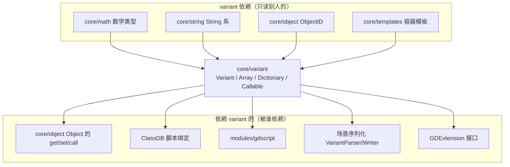
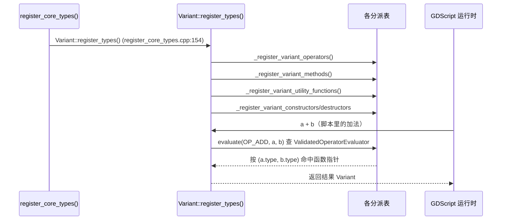

# variant（core）

> 一句话：`Variant` 是 Godot 的「万能包装盒」——一个能装下引擎里几乎所有值的动态类型，GDScript 里你写的每个变量，底层都住在它里面。

**结论**：`variant` 模块实现了引擎的动态类型系统 `Variant`（`core/variant/variant.h:93`），为脚本层（GDScript/GDExtension）提供一个「什么值都能装、什么运算都能做」的统一值容器；它服务于所有需要动态传值的上层，代价是每次访问都要查一遍类型标签、比 C++ 原生类型慢一个量级。

## 是什么 / 不是什么

`variant` 模块只做一件事：定义并实现 `Variant` 这个「带类型标签的 24 字节（`real_t` 为 float 时）联合体」，以及围绕它的一整套动态分派机制。

它负责：
- `Variant::Type` 枚举——45 种类型（`NIL` 到 `VARIANT_MAX`），从 `BOOL/INT/FLOAT/STRING` 到 `VECTOR3/BASIS/TRANSFORM3D` 再到 `ARRAY/DICTIONARY/PACKED_*_ARRAY`（`variant.h:96-146`）。
- 运算符分派表 `variant_op.cpp`（约 9.4 万字节），定义 `a + b`、`a == b` 这类操作对任意两种类型怎么算。
- 内置方法分派表 `variant_call.cpp`（约 15.9 万字节），定义 `arr.size()`、`str.length()` 这类方法调用。
- 文本序列化 `VariantParser` / `VariantWriter`（`variant_parser.h:37`、`:157`），负责 `.tscn`/`.tres` 场景文件里 `[node name="X"]` 这种文本格式的读写。

它不负责：
- 数学本身——`Vector3` 的加减乘除实现在 `core/math/`，`Variant` 只是把结果装箱。
- 对象系统——`Object` 的引用计数、信号、属性在 `core/object/`，`Variant` 里只存一个 `ObjectID`（`variant.h:170`）。
- 脚本语言解析——GDScript 词法/语法分析在 `modules/gdscript/`，它只消费 `Variant` 这个值。

## 在引擎里的位置



位置在引擎最底层：`variant.h` 的头文件里直接 `#include` 了 `core/math/*`、`core/string/*`、`core/object/object_id.h`（`variant.h:33-63`），说明它只「消费」这些底层类型；而 `core/register_core_types.cpp:154` 在引擎启动时调用 `Variant::register_types()`，把运算符表、方法表、构造函数表一次注册好，供整棵上层树使用。

## 关键概念

1. **类型标签（tagged union）**：`Variant` 就是一个 `Type type` 字段加一个 `_data` 联合体（`variant.h:167`、`:250`）。访问值时先 `switch(type)` 再看 `_data` 里哪个成员有效——像寄快递时先看面单再拆对应包裹。

2. **析构表（`needs_deinit`）**：不是所有类型都要析构。一个 `bool` 存 `_data._bool` 不用清理，一个 `String` 却要释放堆内存。引擎用一张静态 `bool needs_deinit[VARIANT_MAX]` 表（`variant.h:268-312`）让析构函数先查表再决定要不要 `_clear_internal()`，省掉大部分空转。

3. **三种分派表**：运算符（`Variant::evaluate`，`variant.h:600`）、内置方法（`get_validated_builtin_method`）、全局函数（`call_utility_function`）都靠「类型组合 → 函数指针」的查表实现，这就是 GDScript 动态调用 `a + b` 时引擎走的真实路径。核心结构是 `variant_call.cpp:670` 的 `_VariantCall`。

4. **引用型容器**：`Array`（`array.h:47`）和 `Dictionary`（`dictionary.h:46`）是写时复制（copy-on-write）的引用容器，内部各藏一个 `ArrayPrivate`/`DictionaryPrivate` 指针，所以 `var b = a` 只是多一个引用而不是整块拷贝。

5. **可调用对象**：`Callable`（`callable.h:48`）把「对象 + 方法名」抽象成一个 16 字节的可调用值，`Signal`（`callable.h:178`）复用同一套机制；`Variant` 里装 `CALLABLE`/`SIGNAL` 类型时，信号连接、`connect`/`emit` 就靠它。

## 核心文件（按阅读顺序）

1. `core/variant/variant.h` — 公共接口。`Variant` 类、`Type`/`Operator` 枚举、45 种类型、全部构造/转换运算符、方法/属性/索引/keyed 的查询入口，先读它。
2. `core/variant/variant_internal.h` — `VariantInternal`（`:49`），绕过公开接口直接摆弄 `Variant` 内部指针和逐类型 `initialize`，给 GDExtension 和底层优化用。
3. `core/variant/array.h` / `dictionary.h` — 两个引用型容器的接口。
4. `core/variant/callable.h` / `callable_bind.h` — `Callable`、`Signal`、`CallableCustom` 及 `bind`/`unbind`。
5. `core/variant/variant_op.cpp` — 运算符分派表，约 9.4 万字节，全模块最重的「运算字典」。
6. `core/variant/variant_call.cpp` — 内置方法 + 常量 + 枚举表（`_VariantCall`），约 15.9 万字节。
7. `core/variant/variant_utility.cpp` — 全局工具函数（`print`、`lerp`、`clamp` 等）注册表，约 6.6 万字节。
8. `core/variant/variant_construct.cpp` / `variant_destruct.cpp` — 每种类型的构造/析构表。
9. `core/variant/variant_setget.cpp` — 属性（成员）读写分派表，约 6.3 万字节。
10. `core/variant/variant_parser.cpp` / `variant_parser.h` — 场景文本格式的解析器 `VariantParser` 和写出器 `VariantWriter`，约 7.2 万字节。
11. `core/variant/SCsub` — 只有一行：把目录下所有 `*.cpp` 收进 `core_sources` 编译。

## 数据流 / 调用链

引擎启动时注册、运行时查表，两条链都从 `Variant` 出发：



一条典型的文本加载路径：`VariantParser::parse()` 读字符流 → `parse_value()` 解析出 `Variant` → 遇到 `[sub_resource]` 时回调 `ResourceParser` 去构造 `Resource`（`variant_parser.h:149-154`）。场景文件（`.tscn`）能存成文本再原样读回，全靠这一对解析/写出器。

## 中文口诀

```
类型标签挂前面，联合体里把值变。
查表分派三大件，运算方法工具链。
二十四字节走天下，大对象才单独分配。
数组字典引用算，拷贝只是加个引用。
注册一次用全局，core 里最先站起来。
```

## 练习（15 分钟）

1. 打开 `core/variant/variant.h`，数一数 `enum Type`（`:96-146`）里到底有几种类型，并找出「原子类型 / 数学类型 / misc 类型 / typed arrays」四段的分界注释。
2. 在 `variant.h:268-312` 的 `needs_deinit` 表里挑 3 个标 `true` 和 3 个标 `false` 的类型，解释为什么 `TRANSFORM2D` 要析构而 `VECTOR2` 不用。
3. 打开 `variant_op.cpp`，用 grep 找 `_register_variant_operators`（`:212`），看它往哪张表里写数据，表的大小跟 `VARIANT_MAX` 有什么关系。

## 自测

- [ ] 为什么 `Variant` 的析构函数要用 `needs_deinit` 表而不是无条件 `_clear_internal()`？（提示：`variant.h:873-877`）
- [ ] `Variant::evaluate(OP_ADD, a, b)` 返回的 `Variant` 是新增的堆对象还是栈上的 24 字节值？（提示：`variant.h:601-606`）
- [ ] `var b = a`（a 是 Array）时引擎拷贝了整块数组吗？（提示：`array.h:48` 的 `_p` 指针）

## 一句话总结

> `variant` 模块是 Godot 的「值中枢」：一个带类型标签的动态容器 `Variant` 加三套查表分派（运算符/方法/工具函数），让脚本层能用一个统一类型表达、运算、序列化引擎里几乎所有的值。
