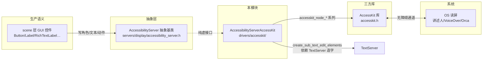
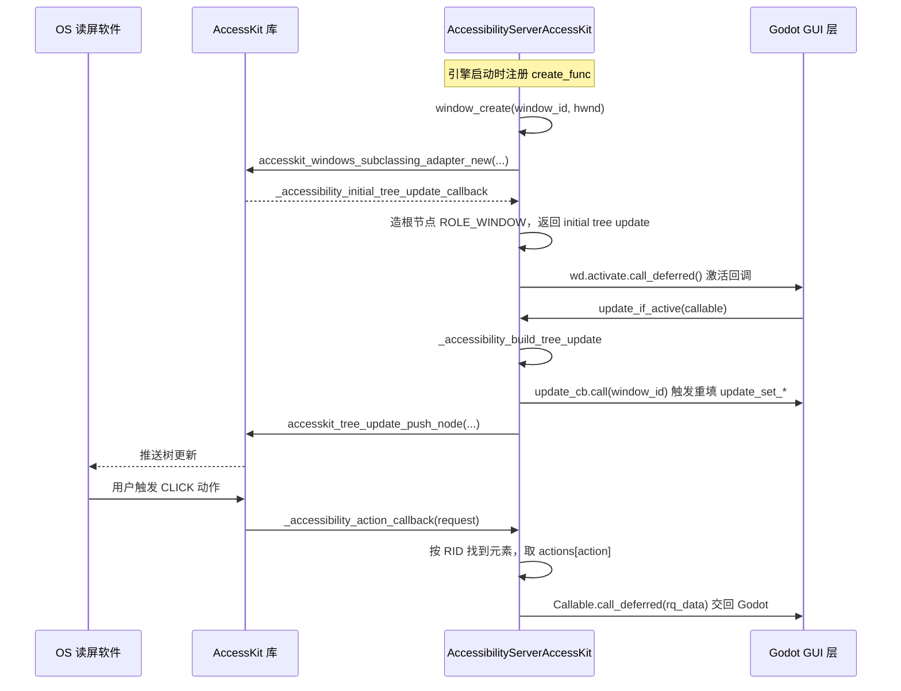

# accesskit（drivers）

> 一句话：这是一根「翻译官」，把 Godot 自己那套无障碍描述（控件角色、文本、位置、动作），实时翻译成 AccessKit 这个跨平台无障碍库能听懂的树节点，再交给系统级读屏软件。

**结论**：`AccessibilityServerAccessKit` 是无障碍服务器 `AccessibilityServer` 的一个后端实现，职责是把引擎内部用 RID 管理的无障碍元素翻译成 AccessKit 的树，喂给 Windows / macOS / Linux 各自的读屏服务；代价是它只是纯胶水层——不产生无障碍数据，只做「转述」，所有语义（角色、动作、文本）都必须由上层 `servers/display` 定义好了传进来。

## 是什么 / 不是什么

它**是**：
- `AccessibilityServer` 的 AccessKit 实现，一个具体的「后端驱动」（`accessibility_server_accesskit.h:40` 的 `class AccessibilityServerAccessKit : public AccessibilityServer`）。
- 一个「双向桥」：把 Godot 元素转成 AccessKit 节点给读屏软件读（下行），再把读屏软件发出的动作回调转成 `Callable` 交还给 Godot（上行）。

它**不是**：
- 不是无障碍数据的生产者。角色、名字、文本这些语义由 `scene/` 的 GUI 控件通过 `AccessibilityServer` 接口写进来，本模块只负责搬运。
- 不是读屏软件本身，也不负责屏幕朗读 / 语音合成。真正的 OS 读屏（Windows 讲述人、macOS VoiceOver、Linux Orca）在 AccessKit 的另一头。
- 不是可选的业务模块——它属于 `drivers` 层（`drivers/register_driver_types.cpp:44` 的 `register_core_driver_types()` 里注册），仅在 `ACCESSKIT_ENABLED` 宏开启的平台上编译（见 `platform/{windows,macos,linuxbsd}/detect.py`）。

## 在引擎里的位置

注册链：`register_core_driver_types()`（`drivers/register_driver_types.cpp:46`）→ `AccessibilityServerAccessKit::register_create_func()`（`accessibility_server_accesskit.cpp:1789`）→ 塞进 `AccessibilityServer::register_create_function("accesskit", create_func)`（`servers/display/accessibility_server.cpp:233`）。

## 关键概念

- **无障碍元素 = `AccessibilityElement`**：一个比喻「引擎侧的一份元素档案」。每个元素存着角色 `role`、名字 `name`、值 `value`、父节点 `parent`、子节点列表 `children`、动作表 `actions`，以及一个惰性创建的 AccessKit 节点指针 `node`（`accessibility_server_accesskit.h:45`）。它由 `RID_PtrOwner<AccessibilityElement>` 管理（`accessibility_server_accesskit.h:61`），RID 就是它与上层的唯一握手暗号。
- **窗口适配器 = `WindowData.adapter`**：每扇原生窗口对应一个 AccessKit 适配器。类型随平台变——Windows 是 `accesskit_windows_subclassing_adapter`，macOS 是 `accesskit_macos_subclassing_adapter`，Linux 是 `accesskit_unix_adapter`（`accessibility_server_accesskit.h:63`）。它就是「那根插进 OS 无障碍通道的线」。
- **惰性节点 = `_ensure_node`**：AccessKit 节点不是建元素时就造，而是第一次真正要写属性时才 `accesskit_node_new`（`accessibility_server_accesskit.cpp:701`）。没被改过的元素连节点都不存在，省内存。
- **角色/动作映射 = `role_map` / `action_map`**：两张 `HashMap`，把 Godot 的 `AccessibilityServerEnums::AccessibilityRole/Action` 逐项翻译成 AccessKit 的 `accesskit_role/action`。构造时一次性填好（`accessibility_server_accesskit.cpp:1709` 起的构造函数）。

## 核心文件（按阅读顺序）

1. `drivers/accesskit/SCsub` — 只有一行：把唯一的源文件 `accessibility_server_accesskit.cpp` 加进 `env.drivers_sources`，整个驱动就一个 cpp。
2. `drivers/accesskit/accessibility_server_accesskit.h` — 类声明 + 两个内部结构 `AccessibilityElement` / `WindowData`，约 200 行，是理解数据模型的入口。
3. `drivers/accesskit/accessibility_server_accesskit.cpp` — 全部实现（约 1790 行）：构造函数填映射表、几十个 `update_set_*` 写属性、回调函数把 AccessKit 动作转回 Callable。
4. `drivers/register_driver_types.cpp` — 在 `register_core_driver_types()` 里调用 `AccessibilityServerAccessKit::register_create_func()`（`drivers/register_driver_types.cpp:46`）。

## 数据流 / 调用链

一次「读屏软件点了一个按钮」的完整往返：

关键点：上行靠 `_accessibility_action_callback`（`accessibility_server_accesskit.cpp:124`）——它从 `accesskit_action_request` 里解出 `target_node`（其实是个 RID），反查元素，把 `ACCESSKIT_ACTION_DATA_*` 各种载荷翻译成 `Variant`，再 `call_deferred` 回 Godot 主线程。下行靠 `_accessibility_build_tree_update`（`accessibility_server_accesskit.cpp:643`）——它先 `in_accessibility_update = true` 让 GUI 层安全地调 `update_set_*`，再把这些变更打包成 `accesskit_tree_update` 一次推给库。

## 中文口诀

- 一层胶水两头翻，上接 Server 下接库。
- RID 是暗号，元素存档案，节点惰性建。
- 映射两张表，角色动作对号坐。
- 上行看动作回调，下行看构建更新。
- 只在更新区间写属性，别在通知外乱动。

## 练习（15 分钟）

1. 打开 `accessibility_server_accesskit.cpp:1709` 的构造函数，数一数 `role_map` 一共填了多少项，并挑一个「Godot 角色 → AccessKit 角色」不一致的映射（例如 `ROLE_CHECK_BUTTON → ACCESSKIT_ROLE_SWITCH`），说说为什么不一一对应。
2. 找到 `create_sub_text_edit_elements`（`accessibility_server_accesskit.cpp:317`），解释为什么文本行要被拆成多个 `ROLE_TEXT_RUN`，以及它怎样依赖 `TextServer` 拿到字形宽度和单词断点。
3. 跟踪 `update_if_active`（`accessibility_server_accesskit.cpp:678`）到 `_accessibility_build_tree_update`（`accessibility_server_accesskit.cpp:643`），用一句话说明 `in_accessibility_update` 标志是干什么的。

## 自测

- [ ] `window_create` 里，Linux 和 Windows 用的适配器构造函数有什么不同（一个带 `deactivation_callback`，一个不带）？为什么只有 Linux 版需要显式回调 `_accessibility_deactivation_callback`？
- [ ] `_accessibility_action_callback` 里，`ACCESSKIT_ROLE_TEXT_RUN` + `ACCESSKIT_ACTION_SCROLL_INTO_VIEW` 这个组合被特殊处理了，它为什么要把 `ae` 换成 `root_ae`（即父节点）再转发？
- [ ] `free_element` 和 `update_set_*` 都检查 `in_accessibility_update`，但一个报「不能在更新通知里删除」，一个报「只能在该通知里更新」。这两个约束各自防止了什么错误？

## 一句话总结

> `accesskit` 是无障碍体系里最薄的一层：`AccessibilityServer` 定好「说什么」，AccessKit 负责「说给谁听」，而这个模块只做中间的翻译与搬运。
