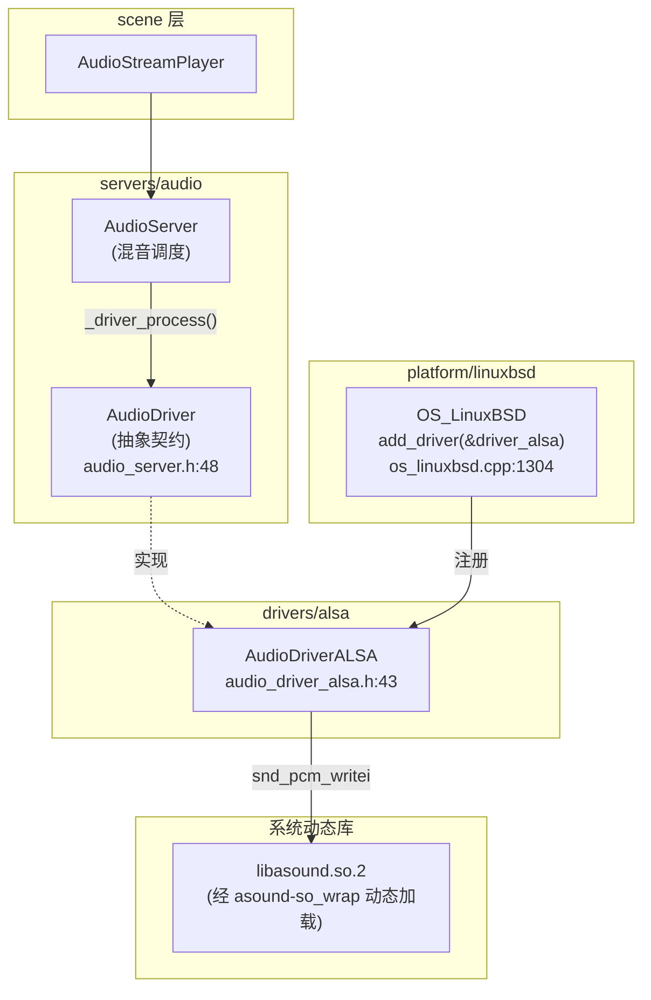
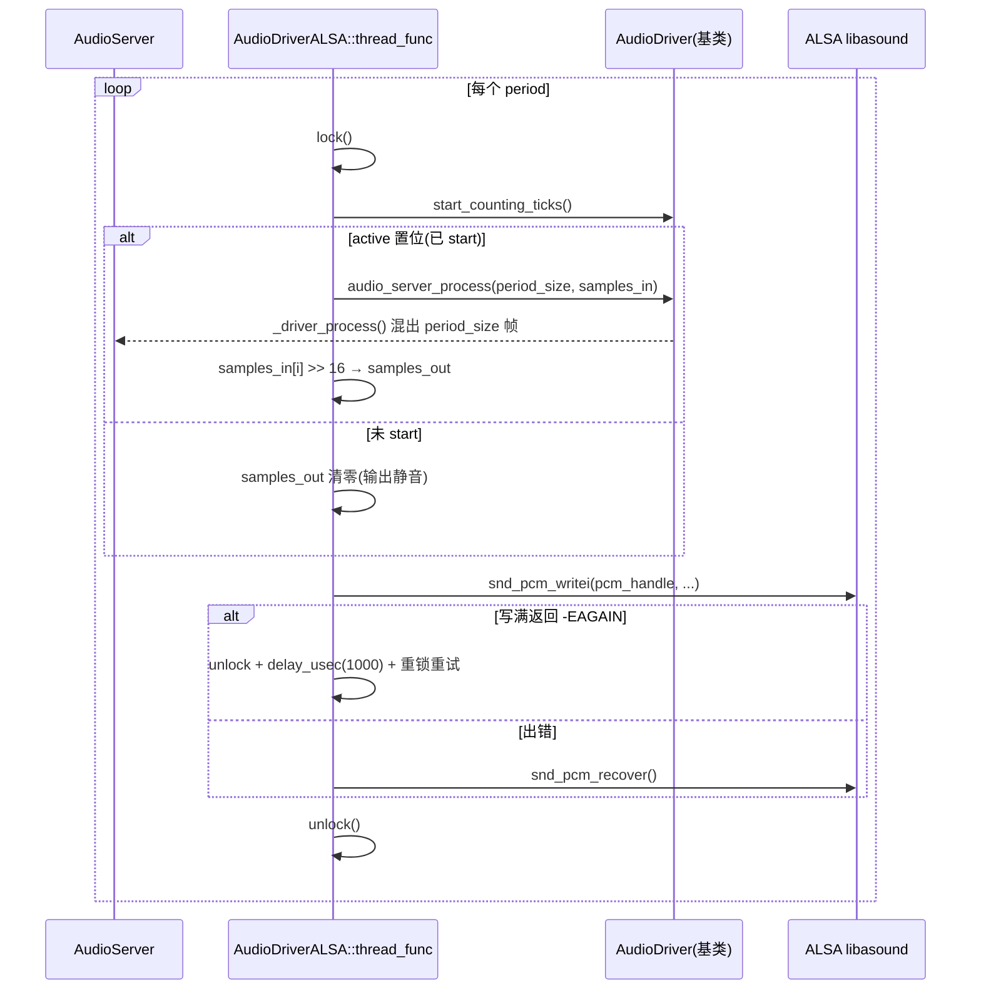

# alsa（drivers）

> 一句话：ALSA 是 Linux 的声卡驱动接口，Godot 用一个小类把它「翻译」成引擎自己的音频输出契约——就像给 Linux 声卡装一个统一口径的插座，引擎只认这个插座，不关心插座后面接的是哪块声卡。

**结论**：`AudioDriverALSA` 实现 `AudioDriver` 契约，把 AudioServer 混好的整型音频帧喂给 ALSA PCM 设备；它只做「搬运 + 时钟」，不混音、不解码，代价是必须起一条常驻线程持续写数据，并绕开 ALSA 的编译期依赖（用 dylibloader 运行时动态加载）。

## 是什么 / 不是什么

**是什么**：Linux 桌面默认的音频输出后端之一。引擎把混好的音频放到 `samples_in`，它右移 16 位转成 16bit 后交给 `snd_pcm_writei` 写进声卡缓冲区（`drivers/alsa/audio_driver_alsa.cpp:216-228`）。

**不是什么**：
- 它**不混音**。混音在 `AudioServer` 里完成，它只调用基类的 `audio_server_process()` 让上层把这一帧算出来（`servers/audio/audio_server.cpp:72`）。
- 它**不解码、不读文件**。解码是各音频流/采样自己的事。
- 它**不负责录音输入**。基类留了 `input_start()` 等口子，但本类没实现，只做输出。
- 它**不处理 MIDI**。MIDI 是兄弟模块 `alsamidi`（`MidiDriverALSAMidi`），不在本文范围。

## 在引擎里的位置



- 上层 `AudioServer` 只面向 `AudioDriver` 的纯虚接口，不认识 ALSA。
- `OS_LinuxBSD` 在启动时把 `AudioDriverALSA` 的实例 `driver_alsa` 塞进 `AudioDriverManager`（`platform/linuxbsd/os_linuxbsd.cpp:1304`）。
- 编译期是否启用由 `detect.py` 里定义的 `ALSA_ENABLED` 宏决定（`platform/linuxbsd/detect.py:355`），整个类都被这层 `#ifdef` 包住。

## 关键概念

1. **PCM 句柄（`snd_pcm_t *pcm_handle`）**：ALSA 的「插座」。打开设备后所有读写都冲它来，关掉后置空（`audio_driver_alsa.cpp:340-345`）。
2. **period（一个混音周期）**：驱动每次喂给声卡的帧数，直接决定延迟。代码用 `closest_power_of_2(latency * mix_rate / 1000)` 算出 `period_size`，缓冲区总大小 = `period_size × 2`（`audio_driver_alsa.cpp:120-124`）。
3. **`SND_PCM_NONBLOCK`**：以非阻塞方式打开设备。写不进时返回 `-EAGAIN`，驱动睡 1ms 再试，而不是卡死线程（`audio_driver_alsa.cpp:87, 233-240`）。
4. **sowrap（dylibloader 包装）**：`asound-so_wrap.c/h` 是生成的动态加载包装，运行时 `dlopen("libasound.so.2")` 而非编译期链接 `-lasound`。因此发行版二进制不依赖 ALSA 头文件/开发库，`initialize_asound()` 失败就直接返回 `ERR_CANT_OPEN`（`audio_driver_alsa.cpp:163-179`）。这层包装不展开，它属于生成物。
5. **int32 → int16 转换**：引擎内部用 32bit 整型混音，ALSA 这里配置成 `S16_LE`，所以每帧样本右移 16 位落到 `samples_out`（`audio_driver_alsa.cpp:218-220`）。

## 核心文件（按阅读顺序）

1. `drivers/alsa/audio_driver_alsa.h` — 类声明：继承 `AudioDriver`，持有线程、互斥锁、PCM 句柄、输入/输出两个样本缓冲。
2. `drivers/alsa/audio_driver_alsa.cpp` — 全部实现：设备初始化、混音线程主循环、设备枚举与切换。
3. `drivers/alsa/SCsub` — 只加 2 个源文件：启用 sowrap 时加 `asound-so_wrap.c`，外加 `*.cpp`。
4. `drivers/alsa/asound-so_wrap.h/.c` — dylibloader 生成物，把 `snd_pcm_*` 等符号重定向到动态加载的 `libasound.so.2`（生成物，不手改）。

## 数据流 / 调用链

一次「声卡要数据 → 引擎出数据」的典型周期：



- 线程由 `init()` 在设备就绪后启动（`audio_driver_alsa.cpp:197`），靠 `SafeFlag exit_thread` 结束（`:348`）。
- `start()` 只做一件事：把 `active` 置位，让线程从「写静音」切换到「真混音」（`:275-277`）。
- 热切换设备在循环末尾检测 `output_device_name != new_output_device`，关旧设备、开新设备（`:252-268`）。

## 中文口诀

```
ALSA 做插座，引擎只认契约
混音不在我，喂帧靠基类
非阻塞写卡，EAGAIN 睡一毫秒
三十二位混，右移十六位落
运行时加载，不靠编译链接
period 定延迟，两个周期一缓冲
线程不歇脚，静音也照写
换设备看末尾，关了旧的再开新
```

## 练习（15 分钟）

1. 打开 `audio_driver_alsa.cpp:120-124`，把 `latency` 改成 5ms 和 200ms，手算 `period_size`（假设 mix_rate=44100），对比哪种延迟更低、哪种更不容易爆音。
2. 找到 `snd_pcm_writei` 的返回分支，画出三种情况（>0 / -EAGAIN / 其他错误）各自走哪条路径。
3. 在 `thread_func` 里定位 `samples_in[i] >> 16`，说明为什么是 16 位而不是 8 位或 24 位。
4. 看 `SCsub`，确认「不开 sowrap 时编译哪些文件」，再对照 `audio_driver_alsa.cpp:39-43` 的 `#include` 分支。

## 自测

- [ ] `AudioDriverALSA` 实现了基类 `AudioDriver` 的哪几个纯虚函数？漏掉哪个会导致无法实例化？
- [ ] 为什么打开设备时传 `SND_PCM_NONBLOCK`？去掉它会有什么后果？
- [ ] `samples_in` 是 `Vector<int32_t>` 而 `samples_out` 是 `Vector<int16_t>`，两者大小关系是什么（和 `channels` 有关吗）？
- [ ] 热切换输出设备的判断发生在 `thread_func` 的哪个位置？为什么必须放在锁内？
- [ ] 若 `initialize_asound()` 失败，`init()` 返回什么？发行版二进制为什么还能在没有 ALSA 开发库的机器上启动？

## 一句话总结

> `AudioDriverALSA` 是 Linux 上把引擎混好的音频帧经 `libasound.so.2` 写进声卡的那根「出水管」——一头接 `AudioDriver` 契约，一头接系统动态库，中间靠一条常驻线程保证声音不断流。
