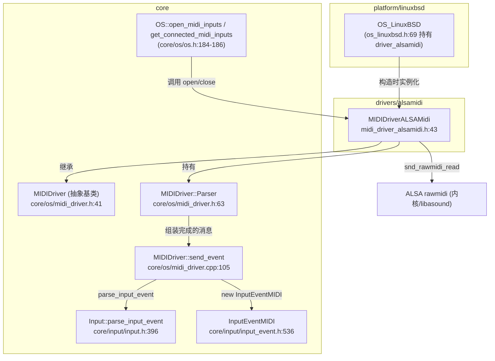
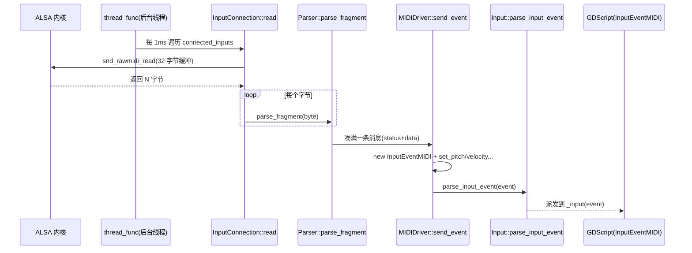

# alsamidi（drivers）

> 一句话：它是 Linux 上「把电子琴/合成器的按键信号，翻译成引擎输入事件」的搬运工——从 ALSA 内核 MIDI 接口读到原始字节，组装成 `InputEventMIDI` 交给 `Input` 系统。

**结论**：`alsamidi` 是 Godot 在 Linux 桌面上的 MIDI 输入驱动，为一个 `MIDIDriverALSAMidi`（`drivers/alsamidi/midi_driver_alsamidi.h:43`），负责枚举系统里的 ALSA rawmidi 输入端口、开一条后台线程不断读字节、把字节流解析成 MIDI 消息，最终通过基类 `MIDIDriver::send_event`（`core/os/midi_driver.cpp:105`）塞进引擎的 `Input` 事件管线；代价是独占一条轮询线程，且只读不写、只认输入不认输出。

## 是什么 / 不是什么

它**是** Linux 上 MIDI *输入*到引擎输入系统之间的一层适配：把 ALSA 的 `snd_rawmidi_*` 字节流，翻译成 Godot 自己的 `InputEventMIDI`。

它**不是**：

- 不是音频输出——ALSA 的*声音播放*由 `drivers/alsa`（`AudioDriverALSA`）负责，两者只是共用 `ALSAMIDI_ENABLED`/`ALSA_ENABLED` 这组编译开关（`platform/linuxbsd/detect.py:355`）。
- 不是 MIDI 消息语义的权威来源——「一个字节算不算状态字节、后面要跟几个数据字节」这些规则，定义在基类 `MIDIDriver::Parser`（`core/os/midi_driver.h:63`），alsamidi 只负责喂字节。
- 不是跨平台方案——macOS 用 `coremidi`、Windows 用 `winmidi`、Web 用 `webmidi_driver`，各平台各自实现同一个 `MIDIDriver` 接口。

## 在引擎里的位置



依赖方向一句话：脚本调用 `OS.open_midi_inputs()` → 单例 `MIDIDriver` → 具体实现 `MIDIDriverALSAMidi` 去读 ALSA；解析出消息后沿基类 `send_event` 回到 `Input`。

## 关键概念

- **输入连接（InputConnection）**：一台 MIDI 设备 = 一个连接对象，自带 `Parser` 和一个 `snd_rawmidi_t*` 句柄（`midi_driver_alsamidi.h:47-56`）。类比：每个琴键接进来的一根「水管」，管口挂着一个解析器。
- **后台轮询线程（thread）**：`MIDIDriverALSAMidi` 里的 `Thread thread` 每隔 1ms 把所有连接读一遍（`midi_driver_alsamidi.cpp:67-79`），读到就解析，读不到就睡 1000 微秒。
- **字节级解析器（Parser）**：MIDI 是字节流协议，一个 `NOTE_ON` 消息 = 状态字节 + 2 个数据字节。`Parser::parse_fragment`（`core/os/midi_driver.cpp:145`）一个字节一个字节喂进去，凑满一条就回调 `send_event`。
- **事件封装（send_event）**：把解析出的 `MIDIMessage` 类型和参数（音高、力度、控制号……）塞进 `Ref<InputEventMIDI>`，最后 `Input::get_singleton()->parse_input_event(event)`（`core/os/midi_driver.cpp:142`）。这是「驱动 → 引擎输入系统」的交接点。
- **非阻塞枚举（SND_RAWMIDI_NONBLOCK）**：`open()` 用 `snd_device_name_hint` 列出所有 rawmidi 端口，逐个以非阻塞方式打开（`midi_driver_alsamidi.cpp:81-121`），打不开的跳过。

## 核心文件（按阅读顺序）

1. `drivers/alsamidi/midi_driver_alsamidi.h` — 驱动类 `MIDIDriverALSAMidi` 与内部结构 `InputConnection` 的声明，含线程、互斥锁、连接向量。
2. `drivers/alsamidi/midi_driver_alsamidi.cpp` — 全部实现：枚举端口、读字节、解析、线程主循环、开关生命周期。
3. `core/os/midi_driver.h` — 抽象基类 `MIDIDriver`，声明 `Parser`、`send_event`、单例与 `connected_input_names`。
4. `core/os/midi_driver.cpp` — `Parser` 的字节解析逻辑 + `send_event` 的事件组装逻辑（真正的语义核心）。
5. `core/input/input_event.h:536` — `InputEventMIDI` 类，脚本层最终收到的那个事件对象。
6. `core/input/input_enums.h:112` — `MIDIMessage` 枚举（`NOTE_ON=0x9`、`CONTROL_CHANGE=0xB`……）。

## 数据流 / 调用链

一次「按下琴键」的完整路径：



要点：线程只负责「搬运字节」，`Parser` 负责「组包」，`send_event` 负责「翻译成引擎事件」。三层分工清晰，alsamidi 自身没有解析规则。

## 中文口诀

```
枚举端口先列清单，非阻塞打开逐个连；
后台线程隔毫秒读，凑满一条才往前传。
状态数据分门别类，解析规则全在基类；
事件塞进 InputEventMIDI，交给 Input 去派发。
只读不写是边界，音频另有 ALSA 管。
```

## 练习（15 分钟）

1. 打开 `core/os/midi_driver.cpp`，找到 `parse_fragment` 里 `case MessageCategory::Data` 分支，画一条 `NOTE_ON`（`0x90 0x3C 0x64`）经过它时 `data_buffer` 的变化过程。
2. 在 `send_event` 里找出 `PITCH_BEND` 分支，解释为什么音高要写成 `(p_data[1] << 7) | p_data[0]`（14 位合并）。
3. 对比 `drivers/alsamidi/midi_driver_alsamidi.cpp:95` 的 `SND_RAWMIDI_NONBLOCK` 和 `read()` 里对 `-EAGAIN` 的处理，说明「非阻塞 + 轮询」这套组合为什么需要 `thread_func` 里那句 `delay_usec(1000)`。

## 自测

- [ ] `MIDIDriverALSAMidi::open()` 里，为什么 `device_index` 只在 `snd_rawmidi_open` 成功后才 `++`？（答案藏在 `midi_driver_alsamidi.cpp:105-106` 注释里）
- [ ] 一条 RealTime 消息（如 `0xF8` Timing Clock）能不能插在另一条消息的数据字节中间？它在 `parse_fragment` 的哪个 case 被「直通」？
- [ ] 如果 `OS_LinuxBSD` 构造后没人调用 `open_midi_inputs()`，后台线程会不会启动？`open()` 在哪一行 `thread.start`？

## 一句话总结

> `alsamidi` 是 Linux 专属的 MIDI 输入搬运工：枚举 ALSA rawmidi 端口 → 后台线程非阻塞读字节 → 交给基类 `Parser` 组包 → 装成 `InputEventMIDI` 送进 `Input` 系统。
