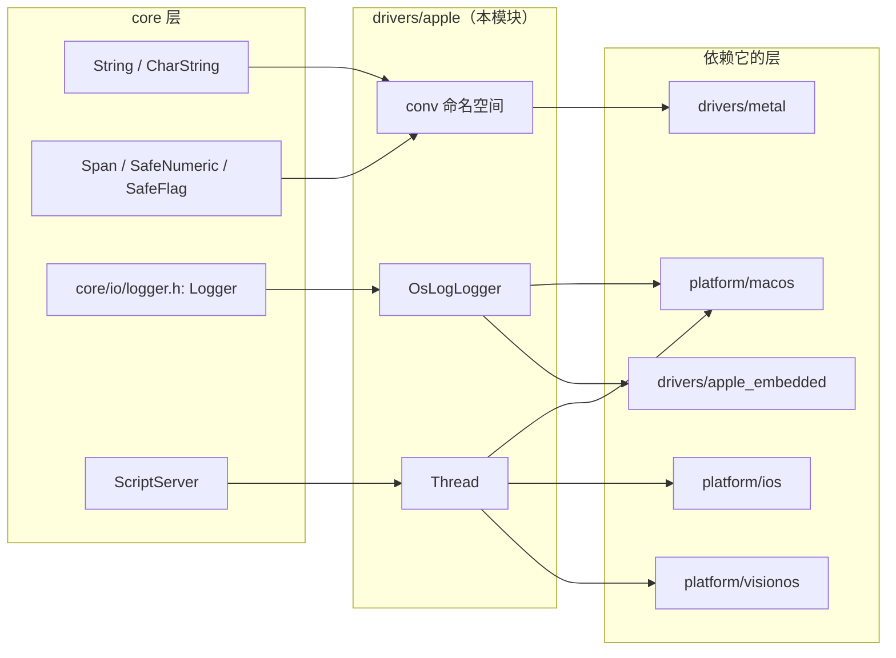
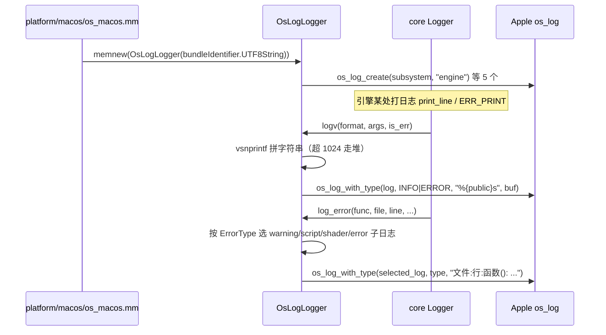

# apple（drivers）

> 一句话：它是 macOS / iOS / visionOS 三个苹果平台「共用的工具箱」——把字符串转换、日志、线程这三件套封装成一套接口，让平台层和别的驱动拿来即用。

**结论**：`drivers/apple` 是苹果系平台共享的底层公共封装，为 macOS / iOS / visionOS（以及 `apple_embedded`）提供字符串桥接、系统日志、pthread 线程三组能力；它不注册任何脚本类，也不含独立入口，代价是被上层强依赖——改这里会同时影响三个平台和 Metal 驱动。

## 是什么 / 不是什么

它是一层「粘合胶」：Godot 的 C++ 世界和 Apple 的 Foundation / 内核 API 在这里握手。它只做三件事，别的一概不碰：

- 是：字符串在 `String` 与 `NSString`（或 `NS::String`）之间双向转换；日志接到 Apple 统一日志系统 `os_log`；线程包一层 `pthread` 并统一线程 ID 和优先级。
- 不是：不负责窗口、事件、渲染——那些交给 `platform/macos`、`platform/ios`、`drivers/metal` 各自实现。
- 不是：不注册任何 `ClassDB` 脚本类。整个目录没有 `register_types.cpp`，`SCsub` 只把 `.mm` 和 `.cpp` 塞进 `drivers_sources`（`drivers/apple/SCsub:7-8`）。

它不是独立程序，是「被 include 的头文件库」：平台层直接 `#include "drivers/apple/thread_apple.h"`（`platform/macos/platform_thread.h:33`），Metal 驱动直接调 `conv::to_nsstring`（`drivers/metal/rendering_device_driver_metal.cpp:1927`）。

## 在引擎里的位置

它处在「core 之上、具体平台之下」：向上被 `platform/*` 与 `drivers/metal`、`drivers/apple_embedded` 消费，向下依赖 `core` 的字符串、模板容器、日志基类。

## 关键概念

- **字符串桥 `conv`** —— 像两国互译的翻译官，把 Godot 的 UTF-32 字符串和 Apple 的 Foundation 字符串互转，尽量零中间缓冲。锚点：`conv::to_nsstring` / `conv::to_string`（`drivers/apple/foundation_helpers.h:48-87`）。
- **统一日志 `OsLogLogger`** —— 把 Godot 的 `Logger` 虚函数接到 Apple 的 `os_log`，让引擎日志出现在「控制台.app / Console.app」里，还能按错误类型分流到不同子日志。锚点：`OsLogLogger`（`drivers/apple/os_log_logger.h:40`）。
- **线程 `Thread`** —— 包在 `pthread` 外的瘦封装，统一线程 ID（主线程恒为 1）、优先级到 QoS 类的映射、以及加大栈防止 SPIRV-Cross 爆栈。锚点：`Thread`（`drivers/apple/thread_apple.h:42`）。
- **主线程哨兵** —— 用 `SafeFlag is_main_thread_assigned` 保证全局只有一个线程能自称主线程。锚点：`Thread::make_main_thread`（`drivers/apple/thread_apple.cpp:65`）。

## 核心文件（按阅读顺序）

1. `drivers/apple/SCsub` — 把本目录 `.mm`、`.cpp` 全部编入 `drivers_sources`，无独立注册。
2. `drivers/apple/foundation_helpers.h` / `.mm` — `conv` 命名空间：`String`↔`NSString`（Objective-C++）/`NS::String`（纯 C++）双向转换，零中间缓冲。
3. `drivers/apple/os_log_logger.h` / `.cpp` — `OsLogLogger : Logger`，构造函数按 subsystem 建 5 个 `os_log_t`，`logv`/`log_error` 写 Apple 统一日志。
4. `drivers/apple/thread_apple.h` / `.cpp` — `Thread` 类：pthread 封装、线程 ID 分配、优先级→QoS 映射、栈大小策略。

## 数据流 / 调用链

以「macOS 平台把日志交给 os_log」为一次典型调用：

线程侧同理：`platform/*/platform_thread.h` include 本模块的 `Thread`，`Thread::start` 里 `pthread_attr_set_qos_class_np` 设优先级、`pthread_attr_setstacksize` 把默认 512KiB 提到 1/2/4 MiB（`drivers/apple/thread_apple.cpp:112-122`），再 `pthread_create` 跑 `thread_callback`，回调前后各调一次 `ScriptServer::thread_enter/exit`（`drivers/apple/thread_apple.cpp:46-63`）。

## 中文口诀

- 苹果三层共用一套，字符串日志线程三件套。
- `conv` 翻译不造缓冲，UTF-32 对 NSString 双通。
- `OsLogLogger` 接 os_log，五路分流按错投。
- `Thread` 包着 pthread 跑，主线程 ID 恒为一。
- 优先级映射 QoS，栈从 512K 提兆级。
- 平台只管 include，Metal 只管调桥接。

## 练习（15 分钟）

1. 打开 `drivers/apple/thread_apple.cpp:84` 的 `Thread::start`，数一数 `pthread_attr_*` 一共调了几个，分别干什么。
2. 在 `drivers/apple/foundation_helpers.mm:40` 和 `:46` 对比两个 `to_nsstring` 重载，指出它们用的 `encoding` 参数为什么不同。
3. 打开 `drivers/apple/os_log_logger.cpp:39`，画出构造函数里 5 个 `os_log_t` 与 `ErrorType` 的对应表。
4. 用 `rg "drivers/apple/" --glob '!drivers/apple/*'` 找出所有 include 本模块的文件，按平台/驱动归类。

## 自测

- [ ] `conv::to_nsstring` 对 `String` 用的是哪种 `NSStringEncoding`，为什么能用它做到零中间缓冲？
- [ ] `OsLogLogger::log_error` 里 `OS_LOG_TYPE_DEFAULT` 对应哪个 `ErrorType`，其余错误类型统一用什么级别？
- [ ] `Thread::make_main_thread` 为什么用 `SafeFlag::set_if_clear` 而不是直接赋值 `caller_id = MAIN_ID`？
- [ ] 二级线程默认栈为什么从 512KiB 被抬高，ASan / 未优化 / 正常三种构建各设多大？

## 一句话总结

> `drivers/apple` 是苹果三平台共享的「粘合层」，用 `conv` 桥字符串、`OsLogLogger` 接系统日志、`Thread` 包线程，让上层的 macOS / iOS / visionOS 和 Metal 驱动不用各自重复造轮子。
