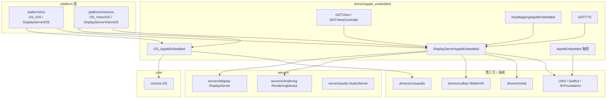
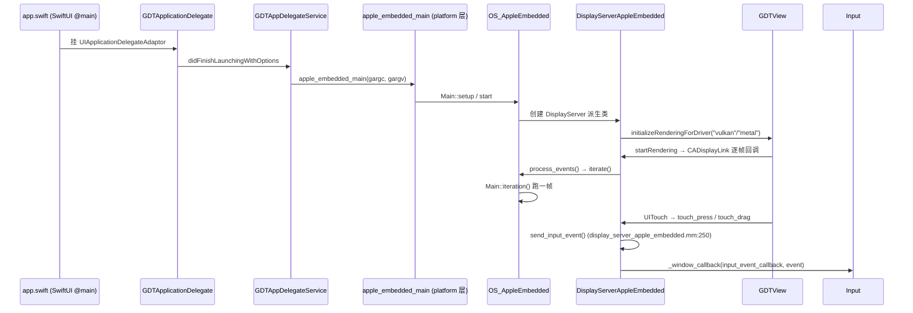

# apple_embedded（drivers）

> 一句话：它是 Godot 跑在 iPhone / iPad / Vision Pro 这类「无窗口、全屏、触控优先」设备上的公共底座，把 UIKit / SwiftUI 的触摸、屏幕、语音合成、触觉震动都翻译成引擎内部的 `DisplayServer` / `OS` 接口。

**结论**：`apple_embedded` 是 iOS 与 visionOS 两个平台共享的驱动层——用 Objective-C++ / Swift 把 Apple 原生 UIKit / SwiftUI 世界桥接到 Godot 的 `OS` 与 `DisplayServer`，代价是它自己不完整、必须被 `platform/ios`、`platform/visionos` 各派生一次才能真正跑起来。

## 是什么 / 不是什么

- **是什么**：一个「公共基类包」。它提供 `OS_AppleEmbedded`、`DisplayServerAppleEmbedded` 这两个基类，外加一套 UIKit 视图（`GDTView`、`GDTViewController`）、应用生命周期钩子（`GDTApplicationDelegate`）、键盘映射、TTS、触觉等工具，供上层平台继承复用。
- **不是什么**：它不是一个能独立编译运行的平台。真正的平台入口 `main_ios.mm` / `main_visionos.mm` 在 `platform/` 层；`apple_embedded` 只提供「会被谁派生」的那部分。
- **对比句**：macOS 桌面走的是 `drivers/apple` + `drivers/coreaudio` + `platform/macos` 那条线；这里的 `apple_embedded` 面向的是 iOS / visionOS 这类「嵌入式 Apple 设备」，两者共用 Apple 生态但驱动路径不同。源码注释写得很直白——`display_server_apple_embedded.h:61` 注明 `"Embedded" as in "Embedded Device"`。

## 在引擎里的位置

关键依赖方向：`OS_AppleEmbedded : public OS_Unix`（`os_apple_embedded.h:51`）；`DisplayServerAppleEmbedded : public DisplayServer`（`display_server_apple_embedded.h:62`）；渲染上下文在 `display_server_apple_embedded.mm:94` 用 `RenderingContextDriverVulkanAppleEmbedded`（MoltenVK），`.mm:102` 用 `RenderingContextDriverMetal`。

## 关键概念

- **嵌入式设备的「操作系统」** —— `OS_AppleEmbedded`（`os_apple_embedded.h:51`）：iOS / visionOS 共用的 OS 基类，管主循环 `iterate()`（`.mm:221`）、`start()`（`.mm:242`）以及字体、路径、权限这些系统级杂活。
- **屏幕与输入的「翻译官」** —— `DisplayServerAppleEmbedded`（`display_server_apple_embedded.h:62`）：把屏幕尺寸、安全区、触摸、虚拟键盘、HDR/EDR 都翻译成 `DisplayServer` 虚函数实现。
- **触觉震动** —— `AppleEmbedded`（`apple_embedded.h:37`）：一个 `Object` 单例，包一层 `CHHapticEngine`（`.h:43`），在 `os_apple_embedded.mm:188` 以名字 `AppleEmbedded` 注册成引擎单例。
- **UIKit 视图外壳** —— `GDTView` / `GDTViewController`（`godot_view_apple_embedded.h:47` / `godot_view_controller.h:38`）：承载 `CAMetalLayer` 渲染层、转发 `UITouch` 触摸的 Objective-C 对象。
- **按键换算** —— `KeyMappingAppleEmbedded`（`key_mapping_apple_embedded.h:37`）：把 Apple 的 `CFIndex` 键码换算成 Godot 的 `Key` / `KeyLocation`。

## 核心文件（按阅读顺序）

1. `SCsub` — 编译入口：给 `drivers_sources` 加 `*.mm`（Objective-C++）和 `*.swift`（`SCsub:34-35`），并启用 clang 模块、配置 Swift builder。
2. `os_apple_embedded.h` / `.mm` — `OS_AppleEmbedded` 基类：主循环、字体、路径、权限、SD 乐手柄（`JoypadSDL`）。
3. `display_server_apple_embedded.h` / `.mm` — `DisplayServerAppleEmbedded` 基类：窗口/屏幕/输入/虚拟键盘/HDR/EDR 的完整实现，约 977 行，是信息量最大的文件。
4. `godot_view_apple_embedded.h` / `.mm` — `GDTView`：渲染层（`GDTDisplayLayer`）创建与 `startRendering` / `stopRendering` 生命周期。
5. `godot_view_controller.h` / `.mm` — `GDTViewController`：持有 `GDTView`，在 `loadView`（`.mm:124`）里 `GDTViewCreate()`。
6. `godot_view_renderer.h` / `.mm` — `GDTViewRenderer`：遵循 `GDTViewRendererProtocol`，负责 `setupView:` / `renderOnView:`。
7. `app.swift` + `godot_app_delegate.h` + `app_delegate_service.mm` — SwiftUI `@main` 入口 + 应用生命周期代理，`didFinishLaunching` 里调用平台提供的 `apple_embedded_main`（`app_delegate_service.mm:86`）。
8. `apple_embedded.h` / `.mm` — 触觉引擎封装与 `alert` 弹窗。
9. `key_mapping_apple_embedded.h` / `.mm` — 键码映射。
10. `tts_apple_embedded.h` / `.mm` — `GDTTTS`：包 `AVSpeechSynthesizer` 做文字转语音。
11. `rendering_context_driver_vulkan_apple_embedded.h` / `.mm` — Vulkan 的 `CAMetalLayer` 表面驱动（MoltenVK）。

## 数据流 / 调用链

一次冷启动到出第一帧，以及一次触摸事件的分发：

两条主线：**帧循环**由 UIKit 的 `CADisplayLink` 驱动，回调进 `OS_AppleEmbedded::iterate()`（`os_apple_embedded.mm:221`）→ `Main::iteration()`；**输入**由 `GDTView` 收到 `UITouch` 后调 `DisplayServerAppleEmbedded::touch_press` / `touch_drag`（`display_server_apple_embedded.h:134-135`），最终经 `send_input_event` 灌进 `Input`。

## 中文口诀

- 嵌入式苹果设备，UIKit 桥接到引擎。
- OS 管循环，Display 管输入。
- SwiftUI 起 @main，代理拉起 apple_main。
- 视图 GDTView，金属层上画帧。
- 触摸翻译官，键码换 Key。
- 震动、语音、权限，平台派生才完整。

## 练习（15 分钟）

1. 打开 `display_server_apple_embedded.mm`，找到 `initialize_tts()` 与 `tts_speak()`，回答：TTS 功能由哪个项目设置开关（提示：`audio/general/text_to_speech`）？
2. 打开 `godot_view_apple_embedded.mm` 的 `startRendering`，找出渲染循环是靠哪个系统类（`CADisplayLink` 还是 `NSTimer`）驱动的。
3. 打开 `os_apple_embedded.mm` 的 `initialize_modules()`，确认 `AppleEmbedded` 是用什么名字注册成引擎单例的。
4. 打开 `app_delegate_service.mm` 的 `didFinishLaunchingWithOptions`，说出它最终调用的外部符号叫什么、定义在哪一层（`platform/ios/main_ios.mm` 还是 `drivers/`）。

## 自测

- [ ] `DisplayServerAppleEmbedded` 的基类是谁？它的触摸事件最终通过哪个方法进入 `Input`？（提示：`display_server_apple_embedded.h:62`、`.mm:250`）
- [ ] 为什么 `apple_embedded` 里没有 `main()`，却能被 iOS / visionOS 复用？`apple_embedded_main` 实际定义在哪一层？
- [ ] `KeyMappingAppleEmbedded::remap_key` 的入参类型是什么？（提示：`key_mapping_apple_embedded.h:42`，注意它用 `CFIndex` 而不是 Godot 的 `Key`）
- [ ] Vulkan 在 Apple 嵌入式设备上靠什么系统类型承载表面？（提示：`rendering_context_driver_vulkan_apple_embedded.h:37` 引入的 `CAMetalLayer`）

## 一句话总结

> `apple_embedded` 是 iOS / visionOS 共用的驱动底座：把 UIKit / SwiftUI 的触摸、显示、语音、触觉翻译成 Godot 的 `OS` 与 `DisplayServer`，本身不完整，靠 `platform/ios` 与 `platform/visionos` 派生补上平台专属部分才算一个可运行的平台。
