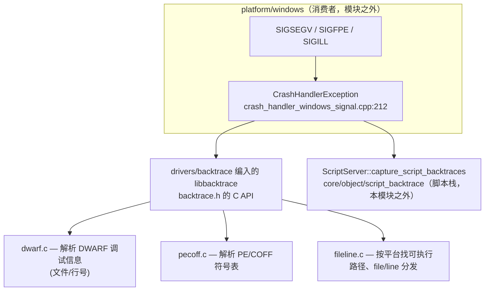
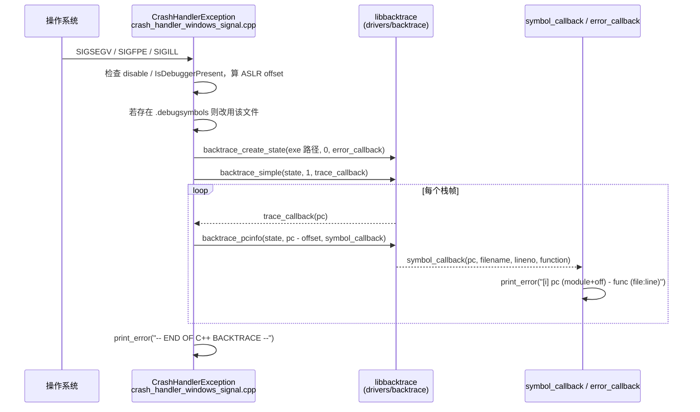

# backtrace（drivers）

> 一句话：它是「崩溃现场的翻译官」——把一堆冷冰冰的裸内存地址（PC），翻译成「函数名 + 文件名 + 行号」再打印出来。

**结论**：`drivers/backtrace` 把 vendored 的 libbacktrace 编译进 Godot 的 `drivers` 静态库，供崩溃处理器在进程死前把原生 C++ 调用栈逐帧翻译并打印。它只为崩溃诊断服务，代价是只在 Windows + 非 MSVC（即 MinGW）下编译，其它平台用各自的系统栈回溯方案，不用它。

## 是什么 / 不是什么

- **是什么**：一个「地址 → 符号」的翻译库。给它一个可执行文件路径 + 一个程序计数器（PC），它读文件的调试信息，返回该地址所在的函数名、文件名、行号。
- **不是什么**：它不是崩溃处理器本身——注册信号、打印报头、决定是否退出这些活都在 `platform/windows/crash_handler_windows_signal.cpp`；它不是脚本栈回溯——GDScript 调用栈由 `core/object/script_backtrace.h` 负责，两者在崩溃输出里并列出现，但互不归属。
- 本模块自己**没有任何 `.h`/`.cpp`**，目录里只有一个 `SCsub`（45 行）。它的「接口」就是 vendored 代码 `thirdparty/libbacktrace/backtrace.h` 暴露的 C API。

## 在引擎里的位置



- 编译入口：`drivers/backtrace/SCsub:13-26` 把 12 个 `.c` 列进 `thirdparty_sources`，`SCsub:41` 再 glob 本目录 `*.cpp`（实际为空），全部并入 `env.drivers_sources`。
- 挂载条件：`drivers/SCsub:18-21`——只有 `platform == "windows"` 且 `not env.msvc`（MinGW）才 `SConscript("backtrace/SCsub")`。最终进 `libdrivers`（`drivers/SCsub:73`）。

## 关键概念

- **`backtrace_state`（不透明状态）**：一个刻意不暴露内部字段的结构（`backtrace.h:47` 只前向声明）。它缓存解析 DWARF/符号表的结果，程序只需 `backtrace_create_state` 建一次，之后复用。比喻：一次把「字典」索引建好，查词就快。
- **`backtrace_simple`（走栈，只要地址）**：沿栈逐帧取出 PC 并回调，**不需要调试信息**（`backtrace.h:133`）。崩溃时先靠它把地址列表拿全，即使没有调试信息也能给出裸地址。
- **`backtrace_pcinfo`（单地址翻译）**：给定一个 PC，回调给出 `filename/lineno/function`，**需要调试信息**（`backtrace.h:154`）。走栈时每拿到一个地址就调它一次，把地址变成人话。
- **ASLR 偏移**：Windows 每次加载可执行文件的基址都不同（ASLR），文件里记录的地址相对的是文件基址。运行期镜像基址减文件基址得到 `offset`（`crash_handler_windows_signal.cpp:249-251`），翻译前要把 PC 减掉它。
- **回调链 `trace_callback → backtrace_pcinfo → symbol_callback`**：采集与打印的连接点。走栈回调只给 PC，`trace_callback` 转手调 `backtrace_pcinfo`，最终 `symbol_callback` 里 `print_error` 落盘。

## 核心文件（按阅读顺序）

1. `drivers/backtrace/SCsub` — 本模块唯一文件。声明要编译的 12 个 libbacktrace 源文件，并把它们推进 `drivers_sources`。
2. `thirdparty/libbacktrace/backtrace.h` — vendored 库的公共 C API：`backtrace_create_state` / `backtrace_simple` / `backtrace_full` / `backtrace_pcinfo` / `backtrace_print` / `backtrace_syminfo` 与回调类型。这是本模块暴露给引擎的「面」。
3. `platform/windows/crash_handler_windows_signal.cpp` — 唯一消费者。从信号处理函数到逐帧打印的完整主线都在这一个文件里。

## 数据流 / 调用链



主线落点：信号注册在 `crash_handler_windows_signal.cpp:321-326`（`CrashHandler::initialize` 用 `signal(SIGSEGV, CrashHandlerException)` 等）；`CrashHandlerException` 在 `:212`；`backtrace_create_state` 在 `:277`；`backtrace_simple` 在 `:280`；`trace_callback` 在 `:175`；`backtrace_pcinfo` 在 `:178`；`symbol_callback` 在 `:102`。翻译失败或解析出错时由 `error_callback`（`:147`）兜底打印。

## 中文口诀

```
崩溃信号来敲门，handler 抢在退出前。
镜像偏移先算清，debugsymbols 若在换。
create_state 建一次，simple 走栈只给 PC。
pcinfo 把地址翻译，函数文件加行号。
逐帧 print_error 打印，直到 END OF BACKTRACE。
脚本回溯另有人，ScriptBacktrace 别混谈。
MSVC 走 SEH，MinGW 才用它这一家。
```

## 练习（15 分钟）

1. 读 `drivers/SCsub:18-21`，回答：为什么 `backtrace` 只在 `windows` 且 `not env.msvc` 时编译？把那个条件原样抄下来。
2. 打开 `crash_handler_windows_signal.cpp`，从 `:212` 的 `CrashHandlerException` 开始，把 `backtrace_create_state → backtrace_simple → trace_callback → backtrace_pcinfo → symbol_callback` 这条链手写一遍，标注每步的行号。
3. 对比 `crash_handler_windows_seh.cpp` 与 `crash_handler_windows_signal.cpp`：MSVC 路径用哪个 Windows API 走栈？MinGW 路径用哪个 libbacktrace 函数？

## 自测

- [ ] `backtrace_state` 结构体的完整定义在哪个文件？为什么 `backtrace.h` 只给了前向声明？
- [ ] `backtrace_simple` 和 `backtrace_pcinfo` 对调试信息的需求有何不同？Godot 为什么「先用 simple、再用 pcinfo」？
- [ ] `get_image_base`（`crash_handler_windows_signal.cpp:182`）读的是 PE 文件里的哪个字段？它和 `image_mem_base` 的差被用来做什么？

## 一句话总结

> `drivers/backtrace` 是 Godot 在 Windows/MinGW 下崩溃时，把原生栈的裸地址翻译成「函数 + 文件 + 行号」的那本字典。
