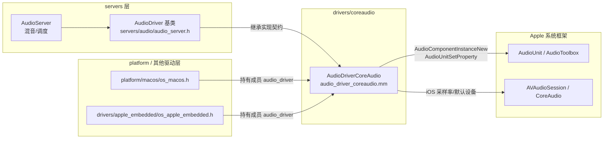
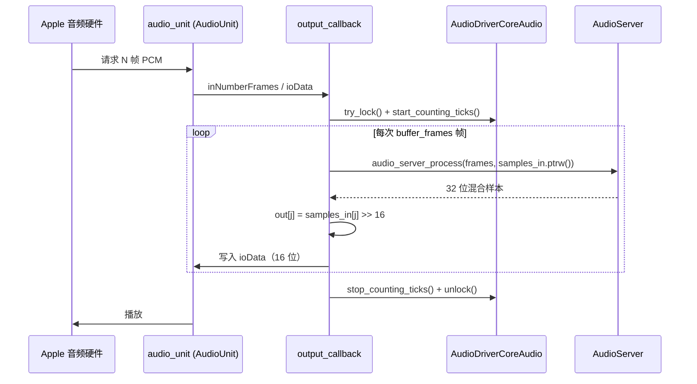

# coreaudio（drivers）

> 一句话：把 Godot 混音器产出的 PCM 数据，塞进 Apple 的 AudioUnit「传送带」，让 macOS/iOS 设备发出声音；顺便把麦克风声音反向接回来。

**结论**：`coreaudio` 是 macOS/iOS 平台的音频输出/输入驱动，用单个类 `AudioDriverCoreAudio` 实现引擎的 `AudioDriver` 契约，把混音好的 32 位样本交给苹果 `AudioUnit` 播放、再从 `AudioUnit` 抓取麦克风数据；代价是它依赖苹果私有框架，只能跑在苹果系统上。

## 是什么 / 不是什么

`coreaudio` 是一个「驱动层适配器」：它只负责把引擎统一的 `AudioDriver` 接口翻译成 Apple CoreAudio 的 `AudioUnit` API。它**不负责**混音（那是 `servers/audio/` 里 `AudioServer` 的活，`audio_server_process` 会帮它算好每一帧样本），也不负责音频文件的编解码（交给 `ogg`/`vorbis`/`mp3` 等模块）。它夹在「混音服务器」和「苹果硬件」之间，是最后一道搬运工。

## 在引擎里的位置



平台层（`os_macos.h:46`、`os_apple_embedded.h:56`）各持有一个 `AudioDriverCoreAudio audio_driver;` 成员，由引擎启动时调用它的 `init()`/`start()`；它自己向上只依赖 `AudioServer` 提供的 `audio_server_process`、`input_buffer_write` 等基类方法，向下调用苹果的 CoreAudio/AudioUnit C API。

## 关键概念

1. **AudioUnit（音频单元）**——苹果的「声卡接口插件」。本驱动在 `init()` 里用 `AudioComponentFindNext` + `AudioComponentInstanceNew` 拿到一个输出单元实例，存进成员 `audio_unit`（`audio_driver_coreaudio.h:45`）。
2. **渲染回调（Render Callback）**——苹果的「闹钟」：设备每要一批帧就回调一次 `output_callback`，驱动在这里现算样本喂给它，而不是预先填满缓冲区（`audio_driver_coreaudio.mm:190`）。
3. **HALOutput / RemoteIO**——同一份代码编译出两个分支：macOS 用 `kAudioUnitSubType_HALOutput`，iOS 用 `kAudioUnitSubType_RemoteIO`（`audio_driver_coreaudio.mm:83-86`），其余逻辑几乎共享。
4. **输入单元（input_unit）**——与输出分离的第二个 AudioUnit，只有开了 `audio/driver/enable_input` 才初始化（`audio_driver_coreaudio.mm:184`），回调里用 `AudioUnitRender` 抓麦克风。
5. **bit 深度的换算（>> 16）**——引擎内部样本是 32 位 `int32_t`，AudioUnit 要 16 位 `int16_t`，回调里一句 `out[j] = samples_in[j] >> 16` 完成降位（`audio_driver_coreaudio.mm:217`）。

## 核心文件（按阅读顺序）

1. `drivers/coreaudio/SCsub` — 编译入口，只编 `*.mm`（Objective-C++，因为要混用苹果框架和 Godot 的 C++）。
2. `drivers/coreaudio/audio_driver_coreaudio.h` — 唯一的类声明 `AudioDriverCoreAudio`，一眼看清它实现了 `AudioDriver` 的哪些虚函数。
3. `drivers/coreaudio/audio_driver_coreaudio.mm` — 全部实现，共 730 行：init / start / stop / finish、输出回调、输入回调、macOS 设备枚举。

## 数据流 / 调用链

一次输出帧的典型调用（播放方向）：



播放侧的关键是 `audio_server_process`（`audio_driver_coreaudio.mm:214`）：驱动不自己混音，只按 `buffer_frames` 一小批一小批地向服务器要数据、降位、塞进 `ioData`。输入方向则是 `input_callback` 里先 `AudioUnitRender` 抓原始样本，再逐样本 `input_buffer_write` 交给服务器（`audio_driver_coreaudio.mm:250-255`），单声道输入会被写两次补成双声道。

## 中文口诀

```
AudioUnit 是声卡，find 再 new 拿到手。
HAL 给 Mac，RemoteIO 给 iPhone，一套代码两分支。
回调里不要囤货，现要现算 audio_server_process。
三十二位右移十六，降成十六位再送出。
输入单元要单开，enable_input 才去 init。
锁住锁住再填缓冲，try_lock 抢不到就填零。
```

## 练习（15 分钟）

1. 打开 `audio_driver_coreaudio.mm` 的 `init()`（第 78 行起），圈出它按顺序做了哪几件事：找组件 → 建实例 → 查默认采样率 → 设流格式 → 算 buffer_frames → 挂回调 → `AudioUnitInitialize`。
2. 找到 `output_callback`（第 190 行起），写出 `active` 为 false 或 `try_lock()` 失败时它做了什么（提示：清零缓冲、直接返回）。
3. 在 `input_callback`（第 231 行起）里找到「单声道转双声道」的那两行 `input_buffer_write(sample)`，说明为什么写两次。
4. 看 `buffer_frames` 的计算（第 160 行）：`Math::closest_power_of_2(latency * mix_rate / 1000)`，把 latency 换成 20ms、mix_rate 换成 44100，手算结果是多少帧。

## 自测

- [ ] `AudioDriverCoreAudio` 的 `get_name()` 返回什么字符串？在哪个文件的哪一行？
- [ ] macOS 和 iOS 分别用哪个 `componentSubType` 常量？为什么能共用一套代码？
- [ ] 引擎混音产出的是多少位样本，交给 AudioUnit 时被右移了几位？
- [ ] 输出和输入共用一个 AudioUnit 还是各自一个？输入单元什么时候才会被初始化？
- [ ] `_get_device_list` 为什么要在设备名后拼接 `(id)`？（`audio_driver_coreaudio.mm:598`）

## 一句话总结

> `coreaudio` 是苹果平台上的「混音服务器 ↔ 硬件」翻译层：一个类、一个 AudioUnit 输出加一个可选输入单元，用渲染回调把 `AudioServer` 的 32 位样本降位送出去，再把麦克风数据反向接回来。
