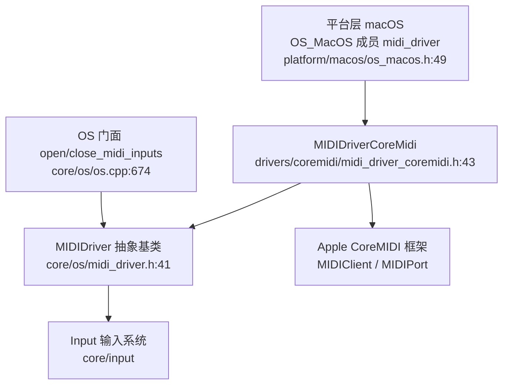
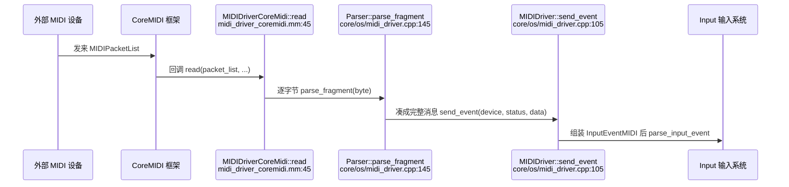

# coremidi（drivers）

> 一句话：把 macOS 的 CoreMIDI 框架当成「键盘手到调音台」的那根线——外部 MIDI 设备发来的字节流，被它接住、拆成一条条消息，再塞进引擎的输入系统。

**结论**：coremidi 是 Godot 在 macOS 上的 MIDI **输入**驱动，它把 Apple CoreMIDI 框架收到的原始字节流转译成引擎能消费的 `InputEventMIDI` 并推给输入系统；代价是只覆盖 macOS、只负责「收」不负责「发」，且用了一个全局互斥锁串行化所有回调。

## 是什么 / 不是什么

它是「中转站」：一边连着 Apple 的 CoreMIDI 框架，一边连着引擎的输入系统。它自己不懂音乐，只懂「把字节按 MIDI 协议拼成一条完整消息」。

它**是**：

- macOS 上 MIDI 输入设备的接入层（`MIDIDriverCoreMidi`，`drivers/coremidi/midi_driver_coremidi.h:43`）。
- 把 `MIDIPacketList` 字节流喂给引擎侧解析器的那只手（`read`，`midi_driver_coremidi.mm:45`）。

它**不是**：

- 不是输出驱动——没有任何「把消息发给设备」的代码，MIDI 输出不走这里。
- 不是 MIDI 协议的解析器本体——真正的按字节拼消息逻辑在基类 `MIDIDriver::Parser`（`core/os/midi_driver.h:63`），本模块只负责「接到字节就逐字节喂进去」。

## 在引擎里的位置

上面这条链的关键点：驱动是「被拥有」的。`OS_MacOS` 在类里直接放了一个 `MIDIDriverCoreMidi midi_driver;` 成员（`os_macos.h:49`），构造时基类 `MIDIDriver` 的构造函数把 `this` 存成全局单例（`midi_driver.cpp:41-43`）。上层 `OS` 门面（`open_midi_inputs` / `close_midi_inputs` / `get_connected_midi_inputs`，`core/os/os.cpp:674/682/665`）通过 `MIDIDriver::get_singleton()` 拿到它，自己不必知道「底下到底是 CoreMIDI 还是 WinMIDI」。

## 关键概念

- **客户/端口（Client/Port）**：CoreMIDI 的「接入许可证 + 进线口」。`open()` 里先 `MIDIClientCreate` 建客户，再 `MIDIInputPortCreate` 建输入端口（`midi_driver_coremidi.mm:64/71`）。
- **源（Source）**：每个 MIDI 设备是一个 `MIDIEndpointRef`，`MIDIGetNumberOfSources` + `MIDIGetSource(i)` 枚举，再用 `MIDIPortConnectSource` 把端口接上去（`midi_driver_coremidi.mm:77-83`）。
- **连接（InputConnection）**：本模块为每个成功接入的源建一个小结构体，里面放一个 `Parser`（引擎侧解析器）和源引用（`midi_driver_coremidi.h:47-52`），并把指针塞给 CoreMIDI 当 `src_conn_ref_con` 回调上下文。
- **回调（read）**：静态函数，CoreMIDI 有数据就调它。它拿锁、取回 `InputConnection`，逐字节 `parse_fragment`（`midi_driver_coremidi.mm:45-57`）。
- **关门标志（core_midi_closed）**：静态布尔 + 静态 `Mutex`，防止 `close()` 之后迟到的回调还在往里写（`midi_driver_coremidi.h:56-57`）。

## 核心文件（按阅读顺序）

1. `drivers/coremidi/SCsub` — 一句话：把本目录所有 `*.mm`（Objective-C++ 源）收进 `drivers_sources`（`SCsub:7`）。
2. `drivers/coremidi/midi_driver_coremidi.h` — 类声明：客户、端口、`InputConnection`、静态锁与关门标志、静态回调 `read`。
3. `drivers/coremidi/midi_driver_coremidi.mm` — 实现：`open()` 建客户端/端口并枚举连接所有源，`read()` 回调喂字节，`close()` 拆线释放。

## 数据流 / 调用链

一次「按键」走完这条链：设备发来字节 → CoreMIDI 把它打包成 `MIDIPacketList` 回调 `read` → `read` 遍历每个 packet 的每个字节喂给 `Parser::parse_fragment` → `Parser` 按状态字节判断消息类型、凑够数据字节后调 `send_event` → `send_event` 造一个 `InputEventMIDI`（`core/os/midi_driver.cpp:110`）、填好通道/音高/力度等字段，最后 `Input::get_singleton()->parse_input_event(event)` 交给输入系统（`midi_driver.cpp:142`）。驱动层的使命到 `parse_input_event` 就结束了。

## 中文口诀

- 客户端口先建好，再数源头逐个连。
- 回调进来看字节，逐条拆包不乱序。
- 一把互斥锁住门，关门以后不回头。
- 消息拼齐送输入，MIDI 到此算到头。

## 练习（15 分钟）

1. 打开 `drivers/coremidi/midi_driver_coremidi.mm`，在 `open()` 里找出「建客户 → 建端口 → 枚举源 → 连接」四步各自的 API 调用行号。
2. 顺着 `read()` → `Parser::parse_fragment` → `send_event` → `Input::parse_input_event` 这条链，在 `core/os/midi_driver.cpp` 里找出一个 `NOTE_ON` 消息最终填进了 `InputEventMIDI` 的哪两个字段。
3. 回答：如果 `MIDIPortConnectSource` 失败，`open()` 做了什么？（看 `midi_driver_coremidi.mm:84-86`）

## 自测

- [ ] 为什么 `read` 是 `static` 的，而它要拿 `InputConnection` 却只能靠 `src_conn_ref_con` 回调参数？
- [ ] `core_midi_closed` 与 `mutex` 为什么要设成 `static`（类级共享），而不是每个实例各一份？
- [ ] 一条带「running status」的连续 NOTE_ON，是靠 `Parser` 里哪个成员变量记住上次状态字节的？（看 `core/os/midi_driver.cpp:188-194`）

## 一句话总结

> coremidi 是 macOS 上「把 CoreMIDI 字节流翻译成 `InputEventMIDI`」的那根输入导线，薄薄一层，重心全在基类 `MIDIDriver::Parser` 的拼包逻辑上。
