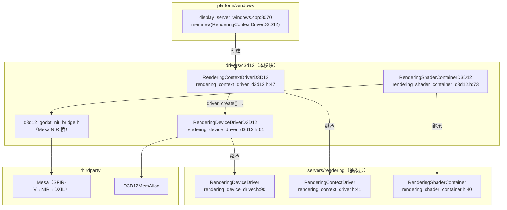
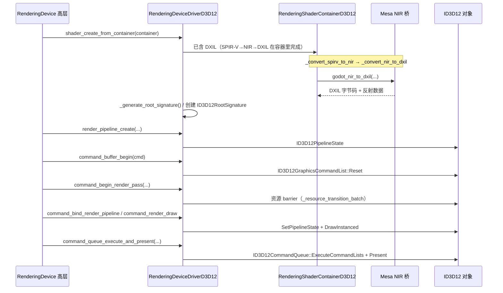

# d3d12（drivers）

> 一句话：d3d12 是 Godot 在 Windows 上的一整套「Direct3D 12 翻译官」，把引擎统一的 RenderingDevice 抽象（`RenderingDeviceDriver` 契约）逐条翻译成 D3D12 的 `ID3D12GraphicsCommandList` 调用。

**结论**：这个模块实现 `RenderingDeviceDriver` 契约，让 Godot 的 RD 渲染后端跑在 Direct3D 12 上；代价是把「状态化、隐式」的 D3D12 语义（命令分配器、描述符堆、资源 barrier、根签名）全塞进一个 5496 行的 `rendering_device_driver_d3d12.cpp` 里，换来 Windows 平台上的现代图形 API 支持。

## 是什么 / 不是什么

它是**渲染后端驱动**，不是游戏逻辑，也不是 API 封装教程。它做的事只有一件：把 `RenderingDeviceDriver` 的纯虚接口（`servers/rendering/rendering_device_driver.h:90`）在 D3D12 上落地。

- **负责**：设备初始化、缓冲区/纹理/采样器的创建、命令录制与提交、交换链呈现、着色器从 SPIR-V 编译成 DXIL、光追（BLAS/TLAS）与时间戳查询。
- **不负责**：着色器语言的前端解析（那是 `RenderingShaderContainer` 基类和 glslang 的事，本模块只做「SPIR-V → DXIL」这段）；窗口系统的创建（`HWND` 由 `platform/windows` 传入，本模块只 `surface_create`）。
- **不负责**：Vulkan/Metal 的同样工作——每个后端各有一个平行的 `RenderingDeviceDriver` 实现，本模块是 D3D12 那个。

## 在引擎里的位置



## 关键概念

- **RenderingDeviceDriver = 统一菜单**：引擎高层只点菜（`buffer_create`、`command_render_draw`），不问后端是谁。D3D12 版就是这份菜单在 Windows 上的「厨师」，类名 `RenderingDeviceDriverD3D12`（`rendering_device_driver_d3d12.h:61`），全部接口 `override final`。
- **Context 与 Device 的分工**：`RenderingContextDriverD3D12` 管「厂」——`IDXGIFactory2`、枚举显卡、创建窗口表面 `Surface`；`RenderingDeviceDriverD3D12` 管「活」——`ID3D12Device` 和一切命令录制。前者 `driver_create()` 直接 `memnew` 后者（`rendering_context_driver_d3d12.cpp:246`）。
- **着色器容器 = SPIR-V 到 DXIL 的翻译流水线**：`RenderingShaderContainerD3D12`（`rendering_shader_container_d3d12.h:73`）把标准 SPIR-V 经 `_convert_spirv_to_nir`（`rendering_shader_container_d3d12.cpp:334`）转成 Mesa NIR，再 `_convert_nir_to_dxil`（`:452`）产出 DXIL，最后 `_generate_root_signature`（`:526`）生成根签名——D3D12 没有 SPIR-V 直读，全靠这条链。
- **描述符堆 = 杂货铺货架**：D3D12 要求所有 SRV/UAV/采样器先放进 `ID3D12DescriptorHeap`，驱动内部用 `DescriptorHeap` 结构（`rendering_device_driver_d3d12.h:132`）做池化分配，GPU 可见与 CPU 端分开管理。
- **根签名 = 把 Vulkan 的 descriptor set 折算成 D3D12 的寄存器**：`ROOT_CONSTANT_REGISTER` / `RUNTIME_DATA_REGISTER`（`rendering_shader_container_d3d12.h:78-79`）借 NIR 桥的寄存器乘数（`GODOT_NIR_DESCRIPTOR_SET_MULTIPLIER = 100000000`，`d3d12_godot_nir_bridge.h:44`）映射 uniform 集合。

## 核心文件（按阅读顺序）

1. `SCsub` — 编译清单：`*.cpp` 全编，链接 `D3D12MemAlloc`，要求 Mesa 静态库版本 25.3，可选 Agility SDK / PIX / DComp。
2. `d3d12_godot_nir_bridge.h` — 与 Mesa NIR 的 C 桥头，定义 `GodotNirCallbacks` 回调和寄存器乘数常量。
3. `rendering_shader_container_d3d12.h` — 着色器容器与格式类，声明 SPIR-V→NIR→DXIL 三步。
4. `rendering_context_driver_d3d12.h` — 设备工厂、显卡枚举、窗口表面 `Surface`（321 行 cpp，量小）。
5. `rendering_device_driver_d3d12.h` — 主类声明：内存/缓冲区/纹理/命令/渲染/计算/光追各段。
6. `rendering_device_driver_d3d12.cpp` — 主实现，5496 行，本模块的绝对主体。
7. `rendering_shader_container_d3d12.cpp` — SPIR-V→DXIL 与根签名生成（871 行）。
8. `dxil_hash.cpp` / `d3d12_hooks.cpp` — DXIL 哈希与外部系统钩子（合计 233 行）。

## 数据流 / 调用链

一次「画一个三角形」的典型路径，看抽象如何落到 D3D12：



关键点：着色器转换在**容器创建时**一次完成，之后每帧只是「绑 PSO + 录命令 + 提交」；barrier 由 `_resource_transition_batch`（`rendering_device_driver_d3d12.h:243`）自动把 Vulkan 风格的 `TEXTURE_LAYOUT_*` 折算成 `D3D12_RESOURCE_STATES`。

## 中文口诀

```
统一菜单一份菜谱，D3D12 厨子照着做；
Context 管厂把卡找，Device 管活把命令造；
SPIR-V 先变 NIR，再下锅成 DXIL；
根签名像份座位表，描述符堆当货架跑；
缓冲纹理要转状态，barrier 记牢别乱跳。
```

## 练习（15 分钟）

1. 打开 `rendering_device_driver_d3d12.h:61`，数一数 `RenderingDeviceDriverD3D12` 公有接口分了几个 `/**** ... ****/` 段，对照 `servers/rendering/rendering_device_driver.h` 确认每个 `override` 都在基类里找得到声明。
2. 在 `rendering_shader_container_d3d12.cpp` 里从 `_set_code_from_spirv` 出发，按调用顺序标出 `_convert_spirv_to_nir` → `_convert_nir_to_dxil` → `_generate_root_signature` 三个函数，各用一句话写下它做了什么。
3. 读 `SCsub`，圈出它依赖的三个 thirdparty 组件（Mesa、D3D12MemAlloc、以及可选的 Agility SDK），写出各自在渲染里的角色。

## 自测

- [ ] `RenderingDeviceDriverD3D12` 继承自哪个基类？这个基类定义在哪个文件、哪一行？
- [ ] `get_api_name()` 返回的字符串是什么？（提示：`rendering_device_driver_d3d12.cpp:5912`）
- [ ] SPIR-V 在 D3D12 后端要经过哪两个中间步骤才变成 DXIL？
- [ ] `REQUIRED_SHADER_MODEL` 常量值 `0x62` 对应哪个 D3D 着色器模型？
- [ ] 为什么 D3D12 里「command pool」只是一个记录 command buffer 的链表，而不是真正的池？

## 一句话总结

> d3d12 模块用 5496 行的 `RenderingDeviceDriverD3D12` 把 Godot 的 RD 抽象逐条翻译成 Direct3D 12 命令，并借 Mesa NIR 桥把 SPIR-V 编译成 DXIL，是 Windows 上现代图形 API 的完整落地。
