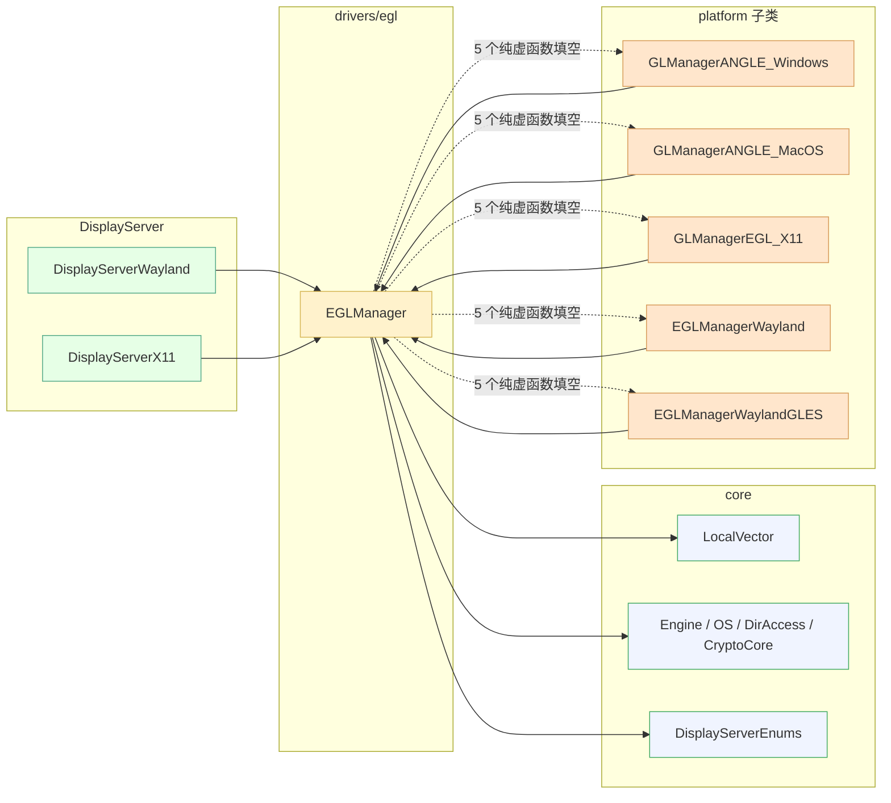
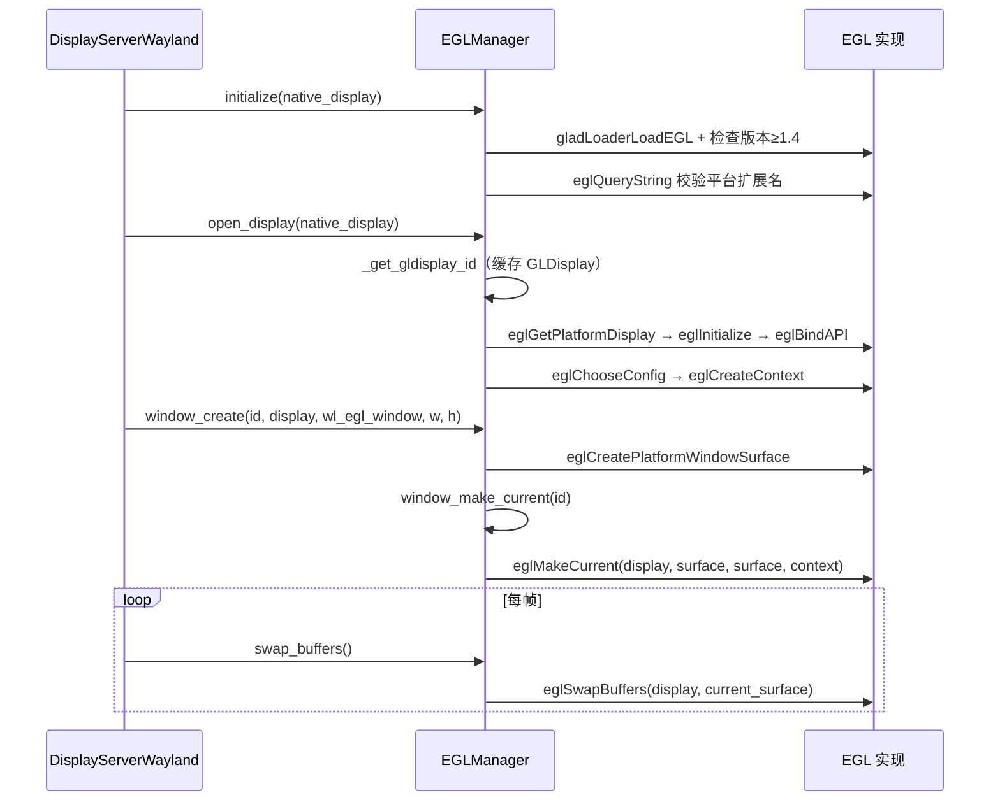

# egl（drivers）

> 一句话：`egl` 是「跨平台 GL 上下文的总管家」——用 EGL 这个 Khronos 标准接口，把「打开显示器、配像素格式、建 GL 上下文、贴画布、翻页显示」这一整套杂活收敛到一个基类里，平台只填 5 个填空。

**结论**：`egl` 模块只有一个类 `EGLManager`，它把 EGL 1.4/1.5 创建与管理 GL 上下文的通用流程写成模板，只把平台差异留给 5 个纯虚函数填空；为 Godot 的 GLES3 渲染后端提供统一的上下文底座，代价是必须依赖各平台的 EGL 实现（ANGLE / Mesa / 厂商驱动）。

## 是什么 / 不是什么

`EGLManager` 负责 GL 上下文的「命脉」：一个原生显示器对应一个 `EGLDisplay` + `EGLContext`（缓存在 `GLDisplay` 里），一个窗口对应一个 `EGLSurface`（缓存在 `GLWindow` 里），并提供 `window_make_current`（切到哪个窗口画）、`swap_buffers`（翻页显示）、`set_use_vsync`（开不开垂直同步）。这套逻辑 X11、Wayland、Windows(ANGLE)、macOS(ANGLE) 全部共用。

它不负责三件事：

- **不负责真正画图**——那归 GLES3 光栅器（`rasterizer_gles3`）管，`egl` 只管把画布和上下文备好。
- **不负责窗口系统事件**——窗口的创建销毁、输入、尺寸，是 `DisplayServer` 的活，`egl` 只接它递来的 `void *` 原生句柄。
- **不负责 EGL 库本身的加载**——动态加载由 glad（`gladLoaderLoadEGL`）完成，头文件是各平台自带的 `platform_egl.h`，不在本模块内。

## 在引擎里的位置

依赖方向很干净：`EGLManager` 只依赖 core 的容器和工具类，以及 `DisplayServerEnums::WindowID` 这个枚举；平台子类反过来继承它并填空；最终由 `DisplayServerWayland`（`display_server_wayland.cpp:947`、`2417`）之类的显示服务器持有并调用它。

## 关键概念

1. **`EGLDisplay` 是「显示器接线板」**：把原生显示器句柄翻译成 EGL 认识的显示连接。每个原生显示器一份，存在 `GLDisplay::egl_display`（`egl_manager.h:47`），创建入口 `_get_gldisplay_id`（`egl_manager.cpp:75`）。
2. **`EGLContext` 是「GL 状态的家」**：所有 GL 的纹理、着色器、状态机都挂在这个上下文上。一个显示器配一个上下文，存 `GLDisplay::egl_context`（`egl_manager.h:48`），在 `_gldisplay_create_context` 里创建（`egl_manager.cpp:188`）。
3. **`EGLSurface` 是「画布」**：窗口上真正能被画上去的那块表面。每个窗口一个，存 `GLWindow::egl_surface`（`egl_manager.h:66`），在 `window_create` 里创建（`egl_manager.cpp:294`）。
4. **5 个纯虚函数是「平台填空」**：`_get_platform_extension_name` / `_get_platform_extension_enum` / `_get_platform_api_enum` / `_get_platform_display_attributes` / `_get_platform_context_attribs`（`egl_manager.h:77-81`）。基类把流程写死，平台只填「用哪个扩展、绑哪个 API、给什么参数」。
5. **`current_window` 是「正在画的那个窗口」**：基类记住当前上下文绑定到哪个 `GLWindow`，`swap_buffers` 和 `release_current` 都靠它（`egl_manager.h:72`）。

## 核心文件（按阅读顺序）

1. `drivers/egl/egl_manager.h` — 模块唯一头文件，声明 `EGLManager` 基类、内部 `GLDisplay`/`GLWindow` 结构、5 个纯虚钩子（119 行）。
2. `drivers/egl/egl_manager.cpp` — 全部实现：display/context/surface 的创建与销毁、make-current、swap、vsync、shader 缓存（544 行）。
3. `drivers/egl/SCsub` — 只把 `*.cpp` 加进 `drivers_sources`，无特殊编译选项。

## 数据流 / 调用链

一次典型的 Wayland 启动 + 渲染循环（调用点都在 `display_server_wayland.cpp`）：

关键在 `_get_gldisplay_id`（`egl_manager.cpp:75`）的「按句柄找缓存、找不到就建」：display 和 context 是惰性创建的，第一次 `open_display` 时建好并塞进 `displays`，后续窗口只复用同一份。

## 中文口诀

> 显示句柄找缓存，找不到就把线接（`_get_gldisplay_id`）。
> 绑定 API 配像素，上下文一个显示器一个（`_gldisplay_create_context`）。
> 窗口来了贴画布，surface 挂上才算数（`window_create`）。
> 画之前先 make-current，翻页全靠 swap-buffers（`window_make_current` / `swap_buffers`）。
> 垂直同步调 interval，平台差异五个填空填（`set_use_vsync` + 5 个纯虚函数）。

## 练习（15 分钟）

1. 打开 `egl_manager.cpp`，从 `_get_gldisplay_id`（第 75 行）读到第 154 行，把 `eglGetPlatformDisplay → eglInitialize → eglBindAPI → _gldisplay_create_context` 这条链用一句话写下来。
2. 对比 `platform/linuxbsd/x11/gl_manager_x11_egl.cpp` 和 `platform/windows/gl_manager_windows_angle.cpp` 里 5 个纯虚函数的实现，各写一句它们的区别。
3. 在 `window_make_current`（第 370 行）里找出 `eglMakeCurrent` 的三个 surface/context 参数分别来自哪个字段，验证「surface 传两次、context 传一次」这个写法。

## 自测

- [ ] 为什么 `_get_gldisplay_id` 要先遍历 `displays` 找缓存？找不到时 `eglGetPlatformDisplay` 的三种分支（1.5 / EXT_platform_base / 老式 `eglGetDisplay`）分别在哪几行？
- [ ] `initialize` 里为什么要先 `gladLoaderLoadEGL(EGL_NO_DISPLAY)` 再 `gladLoaderLoadEGL(tmp_display)` 加载两次？（提示：看第 450-482 行注释与代码）
- [ ] `release_current`（第 345 行）和 `window_make_current` 里的 `eglMakeCurrent` 参数有什么不同？为什么 `release_current` 不需要访问 `current_window->egl_surface`？

## 一句话总结

> `egl` 是 Godot GLES3 渲染后端跨平台的「GL 上下文地基」——一个 `EGLManager` 基类管 display/context/surface 的一生，五个纯虚函数让每个平台只填自己的差异。
