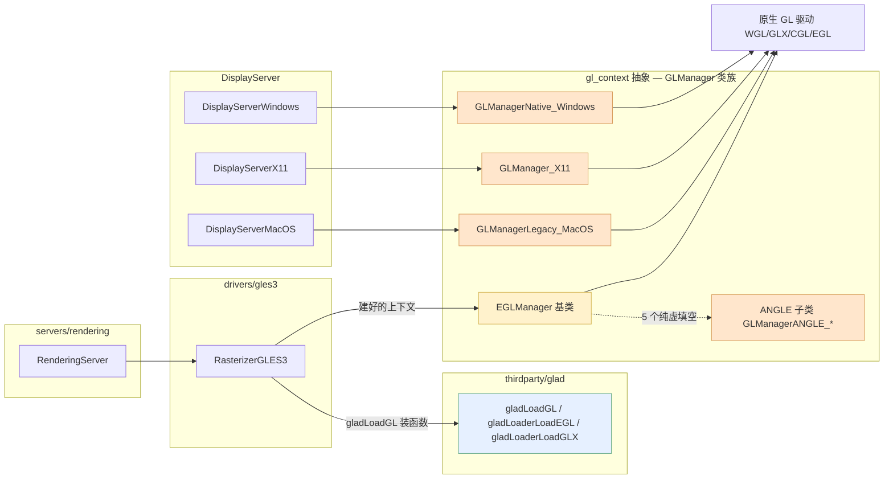
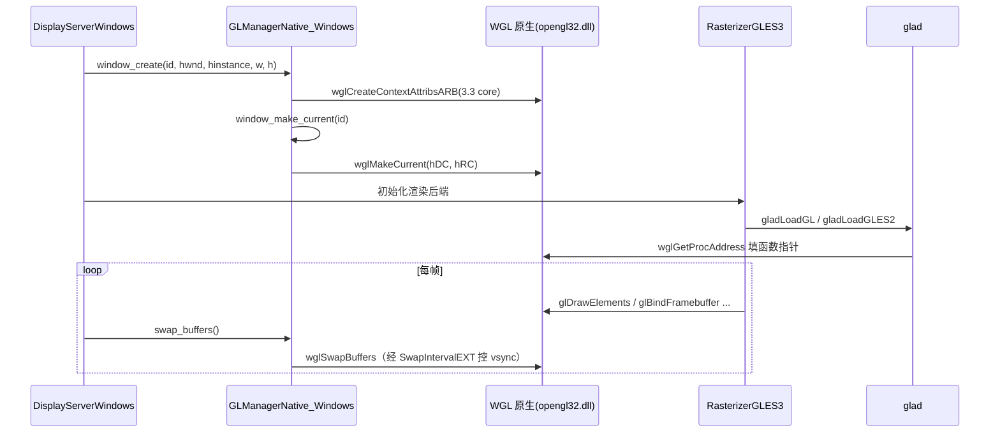

# gl_context（drivers）

> 一句话：`gl_context` 是 Godot OpenGL/GLES3 后端的「万能插座转接头」——把 Windows 的 WGL、Linux 的 GLX、macOS 的 CGL、跨平台的 EGL 这几种制式不同的「GL 上下文插座」，统一成 `window_create / window_make_current / swap_buffers` 一套接口，再用 glad 把 GL 函数指针一次性装载进来。

**结论**：`gl_context` 为 GLES3（Compatibility）渲染后端提供「GL 上下文 + GL 函数装载」这一层：`SCsub` 把 glad 函数加载器编进引擎并定义 `GLAD_ENABLED`，跨平台上下文抽象则由 `GLManager*` 类族落地（WGL/GLX/CGL 原生实现 + EGL 基类与 ANGLE 子类）；代价是每多一个平台就多一份上下文管理器，且处处被 `GLES3_ENABLED` / `EGL_ENABLED` 平台宏拦腰截断。

## 是什么 / 不是什么

先说清一个事实：本模块源目录 `drivers/gl_context/` 当前只有 `SCsub`（`SCsub` 里的 `*.cpp` glob 在此检出里是空的），真正的上下文管理器源码落在两个邻居——EGL 基类在 `drivers/egl/`，WGL/GLX/CGL 原生实现在 `platform/*/`。所以 `gl_context` 更像这条主线的「伞」：编译入口 + 抽象契约在这里，具体实现分派到平台。

它负责四件事：

- **建上下文**：给每个显示器创建一个 GL 上下文（WGL 的 `HGLRC`、GLX 的 `glx_context`、CGL 的 `NSOpenGLContext`、EGL 的 `EGLContext`）。
- **绑定窗口**：`window_make_current` 让「接下来画到哪个窗口」生效（`gl_manager_windows_native.h:91`、`egl_manager.h:104`）。
- **翻页与垂直同步**：`swap_buffers` 把后台缓冲翻到屏幕上（`egl_manager.h:102`），`set_use_vsync` 开关垂直同步。
- **装载 GL 函数**：glad 在上下文建好后把 `glDrawElements`、`glCreateShader` 等函数指针填满（`rasterizer_gles3.cpp:256-272`）。

它不负责三件事：

- **不负责真正画图**——那是 `drivers/gles3` 的 `RasterizerGLES3` 干的，gl_context 只负责把「插座」备好。
- **不负责窗口事件**——窗口的创建销毁、尺寸、输入归 `DisplayServer`，gl_context 只接它递来的 `HWND` / `::Window` / `NSView` 原生句柄。
- **不负责渲染资源调度**——纹理、RID 的生命周期是 `servers/rendering` 的 `RenderingServer` 的事。

## 在引擎里的位置

依赖方向：`RasterizerGLES3` 通过 glad 装载 GL 函数（`rasterizer_gles3.cpp:256`），并在启动时拿到 `DisplayServer` 递来的上下文；`DisplayServer*` 各平台实例各自持有一个 `GLManager*` 子类（`display_server_windows.h:268`、`display_server_x11.h:126`、`display_server_macos.h:65-67`），最终落到 WGL/GLX/CGL/EGL 原生调用。

## 关键概念

1. **`GLDisplay` / `GLWindow` 是统一的「数据形状」**：每个平台管理器内部都用同样的两个结构记账——`GLDisplay` 存显示器级句柄（WGL 的 `HGLRC hRC`，`gl_manager_windows_native.h:57-60`；X11 的 `x11_display` + `context`，`gl_manager_x11.h:67-74`；EGL 的 `egl_display` + `egl_context`，`egl_manager.h:44-54`），`GLWindow` 存窗口级句柄。一个显示器一个上下文、一个窗口一块画布，这是全家共同的骨架。

2. **`EGLManager` 是「模板方法基类」**：把 EGL 1.4/1.5 的通用流程写死，只留 5 个纯虚函数给平台填空（`_get_platform_extension_name` / `_get_platform_extension_enum` / `_get_platform_api_enum` / `_get_platform_display_attributes` / `_get_platform_context_attribs`，`egl_manager.h:77-81`）。ANGLE 三兄弟（Windows / macOS / X11）各自只填这 5 个空。

3. **glad 是「函数指针装载工」**：GL 函数的地址在上下文建好之前是拿不到的，glad 负责在正确时机把它们一个个 `LoadProcAddress` 进来。锚点：`gladLoaderLoadGLX`（`gl_manager_x11.cpp:349`）、`gladLoaderLoadEGL`（`egl_manager.cpp:454,482`）、`gladLoadGL / gladLoadGLES2`（`rasterizer_gles3.cpp:256,260,267,272`）。

4. **三套原生 API 各管一块**：WGL 用 `wglCreateContextAttribsARB` 建 3.3 core 上下文（`gl_manager_windows_native.cpp:401`）；GLX 用 `glXCreateContextAttribsARB`（`gl_manager_x11.cpp:193`）；macOS 用 `NSOpenGLContext` + `NSOpenGLProfileVersion3_2Core`（`gl_manager_macos_legacy.mm:46`），走的是 CGL/Cocoa，不是老的 AGL 框架。

5. **三个方法就是「对外契约」**：无论底层是哪种 API，`window_make_current`（切上下文）、`swap_buffers`（翻页）、`set_use_vsync`（垂直同步）在每个 `GLManager*` 里都有同名实现（`gl_manager_windows_native.h:88-96`、`gl_manager_x11.h:111-119`、`egl_manager.h:101-107`）。上层不用管平台差异，只认这三板斧。

## 核心文件（按阅读顺序）

1. `drivers/gl_context/SCsub` — 本模块的编译入口：把 `thirdparty/glad/gl.c`（linuxbsd 再加 `egl.c`）编进 `drivers` 库，定义 `GLAD_ENABLED`（`SCsub:13`）、linuxbsd 定义 `EGL_ENABLED` + `GLAD_GLES2`（`SCsub:16`）；末尾 glob 本目录 `*.cpp`（当前为空）。
2. `drivers/egl/egl_manager.h` — EGL 基类 `EGLManager`，全家最完整的实现，内部 `GLDisplay`/`GLWindow` 和 5 个纯虚钩子。
3. `platform/windows/gl_manager_windows_native.h` — WGL 管理器 `GLManagerNative_Windows`，`HGLRC hRC` + 像素格式配置。
4. `platform/linuxbsd/x11/gl_manager_x11.h` — GLX 管理器 `GLManager_X11`，`XVisualInfo` / fbconfig / `get_glx_context`。
5. `platform/macos/gl_manager_macos_legacy.h` — macOS 原生管理器 `GLManagerLegacy_MacOS`，`NSOpenGLContext` + CGL 函数指针。
6. `platform/windows/gl_manager_windows_angle.h` — ANGLE 子类 `GLManagerANGLE_Windows`，只填 5 个纯虚函数，最简的「平台填空」样本。
7. `drivers/gles3/rasterizer_gles3.cpp` — glad 装载 GL 函数的调用点（`256-272` 行），把「上下文」和「函数指针」接上。

## 数据流 / 调用链

一次典型的 Windows 启动 + 渲染循环：

要点：上下文一定在「装函数」之前建好——`window_create` 先拿到 `HGLRC`，`RasterizerGLES3` 才调 `gladLoadGL` 把函数指针填满（`rasterizer_gles3.cpp:256`）；之后每帧光栅器只管发 GL 调用，`DisplayServer` 在帧尾调 `swap_buffers` 翻页。EGL 平台只是把上面 `WGL` 参与者换成 `EGLManager`、原生调用换成 `eglCreateContext / eglMakeCurrent / eglSwapBuffers`，骨架完全一致。

## 中文口诀

> 显示器一个接一个，上下文跟着显示器走（`GLDisplay` 记句柄）。
> 窗口来了贴画布，make-current 先摆正再画图。
> WGL 建 core 3.3，GLX 走 ARB，macOS 用 Cocoa 不开老 AGL。
> EGL 一条基类管全场，五个填空给平台。
> 函数指针 glad 装，先有上下文后填表。
> 翻页靠 swap，垂直同步调 interval，上层只认三板斧。

## 练习（15 分钟）

1. 打开 `drivers/gl_context/SCsub`，对照 `drivers/SCsub:53-55`，写一句 `gl_context` 模块在什么条件下才被编译、编译了哪些源文件。
2. 打开 `platform/windows/gl_manager_windows_angle.h` 和 `platform/linuxbsd/x11/gl_manager_x11_egl.h`，各找出 5 个纯虚函数名，确认它们和 `egl_manager.h:77-81` 一一对应。
3. 在 `gl_manager_windows_native.cpp:382-401` 找到 `wglCreateContextAttribsARB` 的参数表，用一句话说清它要的是「什么版本、什么 profile、什么 flag」的上下文。
4. 在 `gl_manager_x11.cpp:348-354` 和 `rasterizer_gles3.cpp:256-272` 之间，用一句话说出「GLX 函数装载」和「GL 函数装载」分别在哪个时机发生。

## 自测

- [ ] `gl_manager_windows_native.cpp` 里为什么先用 `gd_wglCreateContext` 建一个临时上下文、再用 `wglCreateContextAttribsARB` 重建一次？（提示：看 372-413 行）
- [ ] `EGLManager` 的 5 个纯虚函数分别在哪个文件里被实现？`EGLManagerWayland` 和 `EGLManagerWaylandGLES` 的区别是什么？
- [ ] 为什么 `gladLoadGL` 一定要在 `window_make_current` 之后才调用，而不是在 `initialize` 阶段？
- [ ] macOS 那条线为什么用 `NSOpenGLContext` + CGL，而不是老 AGL 框架？哪个宏把它标记为 deprecated？

## 一句话总结

> `gl_context` 是 Godot GLES3 后端的「跨平台 GL 上下文转接头」：编译入口把 glad 装载器编进来，`GLManager*` 类族把 WGL/GLX/CGL/EGL 四种插座统一成建上下文、绑窗口、翻页三件事，让上层的 `RasterizerGLES3` 不用关心自己跑在哪个操作系统上。
