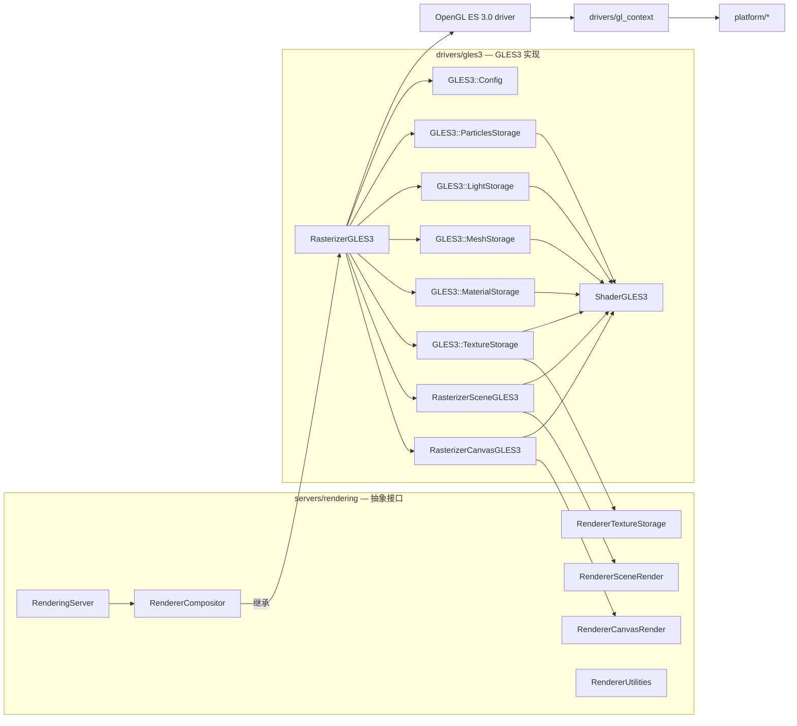
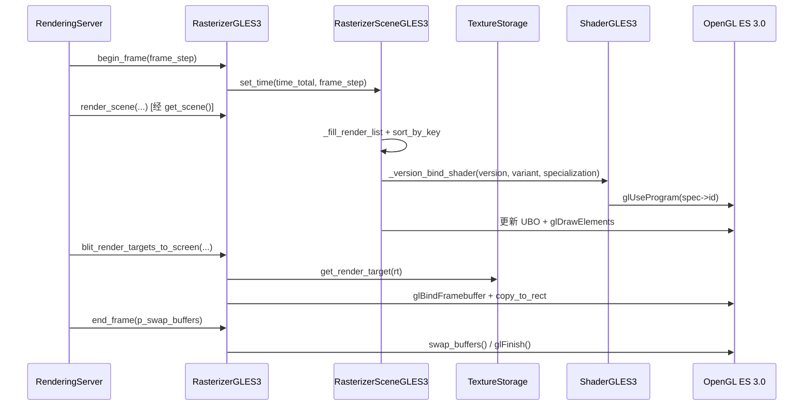

# gles3（drivers）

> 一句话：这是 Godot「Compatibility 兼容」渲染后端——它把 3D 场景、2D 画布、粒子、光照全部翻译成 OpenGL ES 3.0 的 GL 调用，靠 GLSL 着色器和一堆 UBO 在低端 GPU 上把画面拼出来。

**结论**：`drivers/gles3` 是 Godot 的一个完整软件光栅化前端（Compatibility 渲染器），向上实现 `servers/rendering` 里 `RendererCompositor` 那套抽象接口，向下把渲染命令变成 OpenGL ES 3.0 调用；代价是不能用 Vulkan 的管线缓存、无异步资源创建，且新特性（SDFGI、体素 GI 等）在这里是空实现。

## 是什么 / 不是什么

它是一套「OpenGL ES 3.0 专用」的渲染后端，是整个 Godot 引擎唯二的后端之一（另一个是 `servers/rendering/renderer_rd` 的 Vulkan/RD 后端）。

- **它负责**：纹理/网格/材质/光照/粒子这些渲染资源的 GL 对象管理，2D Canvas 与 3D Scene 的绘制循环，着色器编译与磁盘缓存，以及后处理（辉光、泛光、色调映射）。
- **它不负责**：OpenGL 上下文的创建与平台窗口（交给 `drivers/gl_context` 和 `platform/` 下的平台层），着色器语言编译到字节码（交给 `modules/glslang`），渲染资源的调度与 RID 生命周期（交给 `servers/rendering` 的 RenderingServer）。

所以你可以把它理解成一家「外包画厂」：RenderingServer 是总包，把「画什么」用抽象接口发下来；`drivers/gles3` 是专门干 OpenGL 那家分包，只认 GL 这套手艺。

## 在引擎里的位置

主线就一条：`RasterizerGLES3`（`rasterizer_gles3.h:53`）继承 `RendererCompositor`（`servers/rendering/renderer_compositor.h:52`），在构造函数里 `memnew` 出 Config、六个 Storage、五个后处理、以及 Canvas/Scene 两个光栅化器（`rasterizer_gles3.cpp:369-384`），再通过 `get_canvas()` / `get_scene()` / `get_texture_storage()` 等 getter 把这些子部件暴露给 RenderingServer 调用。

## 关键概念

1. **「仓库」与「画师」分离**：资源数据住在六个 `GLES3::*Storage` 仓库里（纹理、网格、材质、光照、粒子、工具），画师是 `RasterizerCanvasGLES3` 和 `RasterizerSceneGLES3`。仓库只管把 RID 翻译成 `GLuint` 对象，画师只负责在帧里把它们画出来。锚点：`TextureStorage : public RendererTextureStorage`（`storage/texture_storage.h:421`）、`RasterizerSceneGLES3 : public RendererSceneRender`（`rasterizer_scene_gles3.h:152`）。

2. **Shader 的三级复用**：`ShaderGLES3`（`shader_gles3.h:45`）把一个着色器拆成三层——`Version`（每个用户 Shader 一份）、`Variant`（用 `#ifdef` 切换行为，比如深度预通道 vs 颜色通道）、`Specialization`（同样用 `#ifdef` 切，但只为性能，多编几份更快的变体）。编译结果按 sha256 存到磁盘缓存目录（`shader_gles3.h:137-142`），下次启动直接加载。锚点注释见 `shader_gles3.h:77-106`。

3. **GL 状态脏标记**：3D 画师里塞了一个 `SceneState`，把 cull/blend/depth/stencil 这些 GL 状态当前值记下来，改状态前先比对，不一样才真的调 `glEnable`/`glDepthFunc`。这是为了少发无意义的 GL 调用。锚点：`set_gl_cull_mode` / `enable_gl_depth_test` 等（`rasterizer_scene_gles3.h:531-666`）。

4. **能力探测 Config**：`GLES3::Config`（`storage/config.h:52`）在启动时读一遍 GPU 支持什么——最大纹理尺寸、压缩格式（s3tc/bptc/etc2/astc）、MSAA、各向异性过滤、multiview，还塞了一堆厂商 workaround 开关（Adreno 3XX、PowerVR GE 8320）。锚点：`storage/config.h:60-101`。

5. **低端身份的自我声明**：`RasterizerGLES3::make_current` 里写死 `low_end = true`（`rasterizer_gles3.cpp:227`），并 `is_opengl() { return true; }`（`rasterizer_gles3.h:104`）、`can_create_resources_async() { return false; }`（`rasterizer_gles3.h:125`），告诉上层「我这条后端不追求极致画质，也不支持后台编译」。

## 核心文件（按阅读顺序）

1. `drivers/gles3/SCsub` — 编译入口：主目录 `*.cpp` 全收，再递归进 `shaders/`、`storage/`、`effects/`、`environment/`。
2. `drivers/gles3/rasterizer_gles3.h` — 后端总入口 `RasterizerGLES3`，Compositor 单例，帧循环与 blit。
3. `drivers/gles3/storage/config.h` — `GLES3::Config`，GPU 能力与扩展探测、workaround 开关。
4. `drivers/gles3/shader_gles3.h` — `ShaderGLES3`，着色器 Version/Variant/Specialization 编译与缓存。
5. `drivers/gles3/storage/texture_storage.h` — `GLES3::TextureStorage`，纹理 / RenderTarget / 压缩格式。
6. `drivers/gles3/storage/material_storage.h` — `GLES3::MaterialStorage`，材质数据，并持有 canvas/sky/scene/particles 四个内建 Shader 实例。
7. `drivers/gles3/storage/mesh_storage.h` — `GLES3::MeshStorage`，网格 / 骨骼 / MultiMesh。
8. `drivers/gles3/storage/light_storage.h` — `GLES3::LightStorage`，光源与反射探针。
9. `drivers/gles3/rasterizer_canvas_gles3.h` — 2D 画师 `RasterizerCanvasGLES3`，Item 批处理与 2D 光照。
10. `drivers/gles3/rasterizer_scene_gles3.h` — 3D 画师 `RasterizerSceneGLES3`，渲染列表 / 阴影 / 天空。
11. `drivers/gles3/storage/render_scene_buffers_gles3.h` — `RenderSceneBuffersGLES3`，3D 场景的 FBO / MSAA / glow 缓冲。

`shaders/*.glsl` 是源着色器，经 `gles3_builders.py` 在构建期生成对应的 `*ShaderGLES3` 类（`shaders/SCsub:19-28` 只挂了 10 个：canvas、feed、scene、sky、canvas_occlusion、canvas_sdf、particles、particles_copy、skeleton、tex_blit）。

## 数据流 / 调用链

一帧的典型走向（以 3D 场景为例）：

要点：场景渲染先收集实例进渲染列表（opaque/alpha/secondary 三类，`rasterizer_scene_gles3.h:47-52`），按 sort key 排序减少状态切换；画之前通过 `_version_bind_shader` 拿到对应的编译好的 GL program（`shader_gles3.h:183`）；数据以 UBO 形式一次性上传（`SceneState::UBO`，`rasterizer_scene_gles3.h:406-456`）；最后把 render target 内容 blit 到窗口（`_blit_render_target_to_screen`，`rasterizer_gles3.cpp:397`）。

## 中文口诀

- 六个仓库存数据，两个画师来作画。
- 版本变体特化层，着色器缓存三兄弟。
- 状态不脏不调 GL，能省一次省一次。
- Config 出门先探路，能力短板早知道。
- 低端自报 low_end，不做异步不吹牛。
- Compositor 一家当，构造时把众人召集。

## 练习（15 分钟）

1. 打开 `drivers/gles3/rasterizer_gles3.cpp:369-386`，数出构造函数 `memnew` 了多少个对象，对照 `rasterizer_gles3.h:65-80` 的成员声明，画出「创建顺序」。
2. 在 `shader_gles3.h:77-106` 读注释，用一句话分别解释 Version / Variant / Specialization 三个词的区别。
3. 在 `rasterizer_scene_gles3.h:531` 附近，找 3 个「先比对、再调 GL」的状态函数，说明这个模式的收益。

## 自测

- [ ] `RasterizerSceneGLES3` 和 `RasterizerCanvasGLES3` 各自继承的基类在 `servers/rendering` 的哪个文件里？
- [ ] `ShaderGLES3::_version_bind_shader`（`shader_gles3.h:183`）在拿不到对应 specialization 时，是走「排队等待」还是「当场编译」？
- [ ] `RasterizerGLES3` 的 `finalize()`（`rasterizer_gles3.cpp:202`）为什么在 `memdelete` 顺序里把 `texture_storage` 放到最后、还单独先调 `_tex_blit_shader_free()`？
- [ ] `Config` 里 `use_depth_prepass`（`config.h:58`）这个开关，在 3D 画师里影响了哪个渲染路径？

## 一句话总结

> `drivers/gles3` 是 Godot 的「兼容」渲染后端：用 OpenGL ES 3.0 这一套老而通用的手艺，把 RenderingServer 的抽象命令落成真正的像素，代价是放弃现代 API 的先进特性，换取在低端硬件上也能跑起来的覆盖面。
