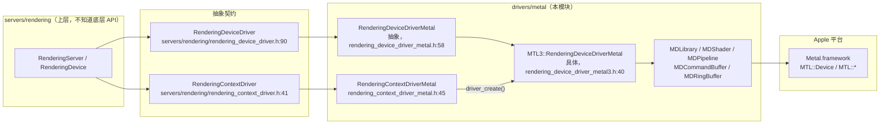
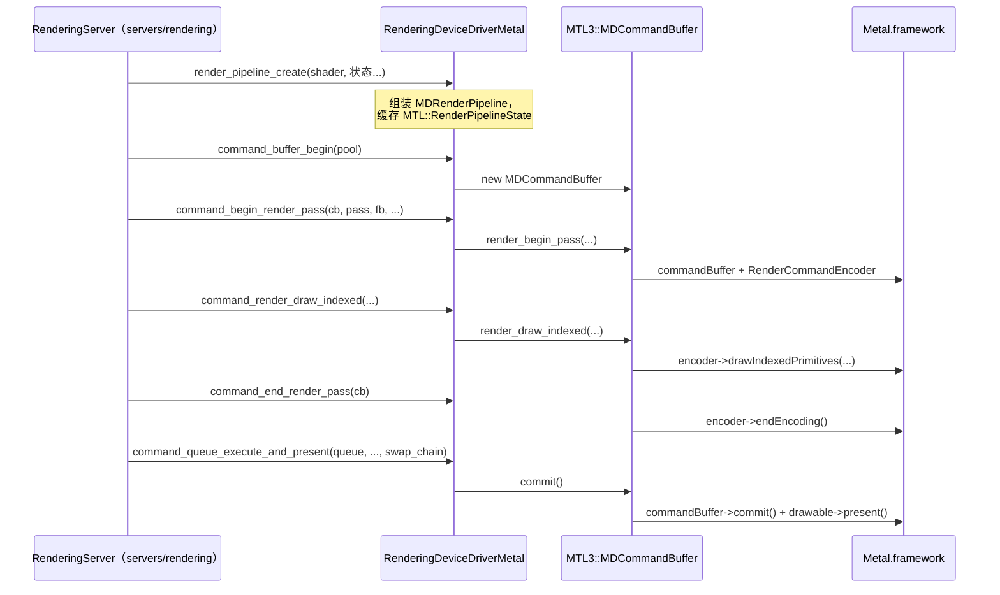

# metal（drivers）

> 一句话：Metal 驱动是 Godot 渲染器在 Apple 芯片上的「翻译官」——它把 `RenderingDeviceDriver` 这套 Vulkan 风格的抽象指令，逐条翻译成 Apple 的 Metal API 调用。

**结论**：`drivers/metal` 实现了 `RenderingDeviceDriver` 抽象契约（`servers/rendering/rendering_device_driver.h:90`），让 Godot 的渲染服务器在 macOS / iOS / tvOS 上能驱动 Apple GPU；它的代价是必须把 Godot 的 SPIR-V 着色器转译成 MSL，并用近 120 KB 的单一翻译单元 `rendering_device_driver_metal.cpp` 去填补「Vulkan 语义」和「Metal 语义」之间的所有差异。

## 是什么 / 不是什么

- **是**：`RenderingDeviceDriver` 契约的一个具体实现。上层渲染服务器只对着抽象接口说话，永远不知道底下是 Vulkan 还是 Metal。
- **是**：一套「对象 + 编码器」的翻译层。Godot 的 `BufferID` / `TextureID` / `PipelineID` 是句柄，Metal 驱动把这些句柄换算成 `MTL::Buffer` / `MTL::Texture` / `MTL::RenderPipelineState`。
- **不是**：渲染算法本身。场景怎么画、光怎么算，都在 `servers/rendering` 里；这里只负责「按命令把东西交给 GPU」。
- **不是**：着色器编译器。SPIR-V → MSL 的转译由编译进来的 spirv-cross 完成（`SCsub:15-26`），本目录只消费它产出的 MSL 源码或 `.metallib` 二进制。

## 在引擎里的位置

要点：契约接口在 `servers/rendering`，实现全在 `drivers/metal`。`RenderingContextDriverMetal` 负责找设备、建窗口表面；`RenderingDeviceDriverMetal` 负责所有资源与命令。两者都在类声明上用 `API_AVAILABLE(macos(11.0), ios(14.0), tvos(14.0))` 标注了最低系统版本。

## 关键概念

1. **契约就是「同一套话术」**：`RenderingDeviceDriver` 里定义了几百个纯虚方法（`buffer_create`、`texture_create`、`render_pipeline_create`、`command_render_draw`…），`RenderingDeviceDriverMetal` 全部 `override final` 填上。上层照单下菜，Metal 驱动照单做菜。
2. **双级类 = 共享骨架 + 具体血肉**：`RenderingDeviceDriverMetal`（`rendering_device_driver_metal.h:58`）是抽象层，把缓冲/纹理/管线等绝大多数方法实现掉，只留下队列、栅栏、信号量等几个纯虚；`MTL3::RenderingDeviceDriverMetal`（`rendering_device_driver_metal3.h:40`）补上这些。头文件里还 forward-declare 了 `MTL4::MDCommandBuffer`，说明骨架为「未来 Metal 4 实现」留了位置，但本目录目前只有 MTL3。
3. **命令缓冲 = 编码器翻译器**：抽象基类 `MDCommandBufferBase`（`metal_objects_shared.h:639`）声明了 render / compute / blit 三套命令，具体类 `MTL3::MDCommandBuffer`（`metal3_objects.h:263`）把它们分别翻译进 `MTL::RenderCommandEncoder` / `MTL::ComputeCommandEncoder` / `MTL::BlitCommandEncoder`。
4. **着色器三级封装**：`MDLibrary`（`metal_objects_shared.h:843`）包一个 `MTL::Library`；`MDShader` 及其子类 `MDRenderShader` / `MDComputeShader`（`metal_objects_shared.h:900/926/917`）记录 uniform 布局与 push constant；`MDPipeline` 及子类 `MDRenderPipeline` / `MDComputePipeline`（`metal_objects_shared.h:988/997/1078`）包住最终的 `MTL::RenderPipelineState` / `MTL::ComputePipelineState`。
5. **帧环 + 动态缓冲**：`MDRingBuffer`（`metal_objects_shared.h:105`）是给 GPU 临时数据用的环形分配器，默认段 512 KB；动态 uniform buffer 按帧轮流用（`BufferInfo::_frame_idx`，`rendering_device_driver_metal.h:192`），避免 CPU/GPU 抢同一块内存。

## 核心文件（按阅读顺序）

1. `rendering_context_driver_metal.h` — 入口：实现 `RenderingContextDriver`，枚举设备、创建 `MTL::Device`、管理窗口表面（`Surface` 类，含 HDR/VSync 状态）。
2. `rendering_device_driver_metal.h` — 骨干：`RenderingDeviceDriverMetal` 类声明，几百个 `override final` 方法按 `#pragma mark`（Generic / Memory / Texture / Pipeline / Rendering / Compute / Raytracing…）分块。
3. `rendering_device_driver_metal3.h` — 具体子类：补齐队列、命令池、栅栏（`FenceEvent` / `FenceSemaphore`）、信号量（`Semaphore`）。
4. `metal_objects_shared.h` — 共享对象：`MDRingBuffer`、`MDResourceCache`、`MDLibrary`、`MDShader`、`MDPipeline`、`MDUniformSet`、`MDCommandBufferBase`。
5. `metal3_objects.h` — MTL3 命令缓冲：`MDCommandBuffer`、`ResourceTracker`（资源驻留跟踪）、`BindingCache`（绑定去重）、`DirectEncoder`（直连编码）。
6. `rendering_shader_container_metal.h` — 着色器容器：记录 MSL 反射数据、编译 MSL 源码为二进制（`RenderingShaderContainerMetal` / `RenderingShaderContainerFormatMetal`）。
7. `metal_device_profile.h` / `metal_device_properties.h` — 设备能力：按 GPU 家族（`Apple1`…`Apple9`）决定 MSL 版本与 argument buffer 档位；`MetalFeatures` / `MetalLimits` 上报能力与上限。
8. `pixel_formats.h` — 像素格式映射表：Godot `DataFormat` ↔ `MTL::PixelFormat`（`PixelFormats` 类）。
9. `sha256_digest.h` / `SCsub` — 前者是着色器缓存键；后者说明编译方式（C++20、`-fmodules`、链接 spirv-cross 与 metal-cpp）。

## 数据流 / 调用链

一次最典型的绘制，从上层下命令到 GPU 执行的链路：

着色器的离线环节单独一条链：上层给 `RenderingShaderContainer`（内含 SPIR-V）→ `RenderingShaderContainerMetal::_set_code_from_spirv`（`rendering_shader_container_metal.h:224`）经 spirv-cross 生成 MSL → `compile_metal_source` 产出二进制 → `MDLibrary` 缓存（按 `SHA256Digest` 键）→ `MDRenderPipeline` / `MDComputePipeline` 引用。

## 中文口诀

- 契约定在 servers，血肉落在 metal。
- 骨架抽象 Metal 基类，MTL3 补队列栅栏。
- 缓冲纹理管线句柄，句柄背后都是 MTL 对象。
- 命令缓冲三道编码，渲染计算拷贝各归各。
- SPIR-V 先译成 MSL，Library 三连包成 Pipeline。
- 帧环一滚就是动态，argument buffer 兜住 uniform。
- 像素格式有对照表，设备能力有 Profile。

## 练习（15 分钟）

1. 打开 `rendering_device_driver_metal.h`，数一数 `#pragma mark` 分了几大块，找到 `render_pipeline_create` 和 `compute_pipeline_create` 的声明，看它们的参数有哪些来自 `RenderingDeviceDriver` 契约。
2. 打开 `rendering_context_driver_metal.cpp`，找到 `driver_create()`，确认它返回的是 `MTL3::RenderingDeviceDriverMetal` 还是 `RenderingDeviceDriverMetal`。
3. 打开 `metal_objects_shared.h` 的 `MDRingBuffer`，用一句话解释 `allocate()` 里 16 字节对齐是为了什么。
4. 打开 `rendering_shader_container_metal.h` 的 `HeaderData`，找出 `USES_ARGUMENT_BUFFERS` 和 `NEEDS_VIEW_MASK_BUFFER` 两个 flag 分别决定什么行为。

## 自测

- [ ] `RenderingDeviceDriverMetal` 是抽象类还是可实例化的类？它留下哪些方法给 `MTL3::RenderingDeviceDriverMetal` 去实现？（提示：看 `rendering_device_driver_metal.h` 里 `= 0` 的纯虚方法）
- [ ] `MTL3::MDCommandBuffer` 的三个编码器分别对应哪些 `MDCommandBufferBase` 里的虚方法组？
- [ ] Godot 的 `BufferID` 是怎么变成 `MTL::Buffer *` 的？（提示：`metal_objects_shared.h` 里的 `namespace rid`）

## 一句话总结

> `drivers/metal` 是 `RenderingDeviceDriver` 契约在 Apple 平台上的完整实现——用一组「MD 前缀的对象」把 Godot 的抽象渲染指令翻译成 Metal 调用，核心是 `RenderingDeviceDriverMetal` + `MTL3::RenderingDeviceDriverMetal` 双级类，以及 `MDLibrary → MDShader → MDPipeline` 与 `MDCommandBufferBase → MDCommandBuffer` 两条对象链。
