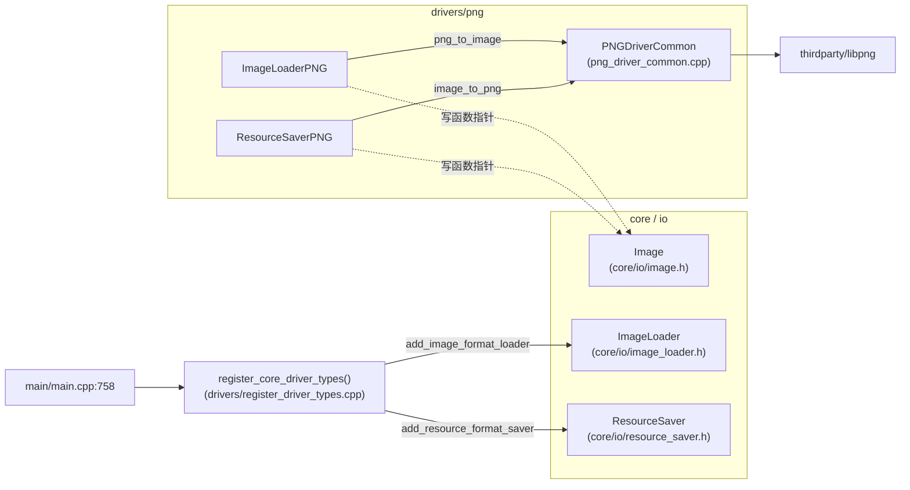
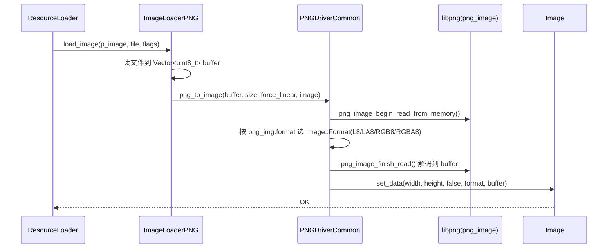

# png（drivers）

> 一句话：给引擎装一个「PNG 翻译官」——把 `.png` 字节流翻译成 `Image`，再把 `Image` 翻译回 `.png` 字节流。

**结论**：`drivers/png` 是 Godot 对 libpng 的封装驱动，负责 PNG 图片的编码（保存）与解码（加载），为 `Image` 与资源系统提供 PNG 支持；代价是它不产出任何可见对象，只是把 libpng 的能力「插」进引擎的两个全局注册表（`ImageLoader` / `ResourceSaver`）和 `Image` 的静态函数指针槽位里。

## 是什么 / 不是什么

这个目录一共 6 个源文件（`SCsub` + 2 个 `.h` + 3 个 `.cpp`），只干两件事：**把字节流解码成 `Image`**，**把 `Image` 编码成字节流**。真正的压缩/解压算法不在这个目录里——它们在 `thirdparty/libpng/`，本驱动只调用 libpng 暴露的 C 接口。

- 它负责：PNG 的加载与保存、向引擎注册 PNG loader/saver（`drivers/register_driver_types.cpp:49-53`）。
- 它不负责：JPEG/WebP/BMP/TGA 等其他图片格式（那些各自有独立驱动/模块，如 `modules/jpg`）。
- 它不负责：把解码后的像素上传到 GPU 变成纹理（那是渲染服务器的活，`Image` 只是 CPU 侧的像素容器）。

## 在引擎里的位置

`main/main.cpp:758` 在引擎启动时调 `register_core_driver_types()`，后者实例化 `ImageLoaderPNG` / `ResourceSaverPNG` 并塞进两个全局注册表；同时它们的构造函数把具体实现写进 `Image` 的静态函数指针槽位。

## 关键概念

1. **简化版 libpng 接口（`png_image`）**：比喻成「一键拍照」——老式 libpng 要你手动建 struct、设回调、逐行读；`png_image` 系列（`png_image_begin_read_from_memory` / `png_image_finish_read`）把整套流程收进一个结构体。锚点：`png_driver_common.cpp:63` 的 `png_image png_img;`。

2. **函数指针槽位**：比喻成「墙上的插座」——`Image` 自己不懂 PNG，但预留了一排静态函数指针（`Image::_png_mem_loader_func`、`Image::png_packer`、`Image::save_png_func` 等，见 `core/io/image.h:206/219/253/257`）。驱动初始化时「把插头插上」，之后 `Image::save_png()` 之类的方法就能直接工作了。

3. **格式注册表**：`ImageFormatLoader`（`core/io/image_loader.h:42`）与 `ResourceFormatSaver`（`core/io/resource_saver.h:36`）是引擎统一的图片加载/资源保存插件接口。PNG 驱动各自派生一个子类，注册后，`ResourceLoader` 遇到 `.png` 就会路由到本驱动。

## 核心文件（按阅读顺序）

1. `drivers/png/SCsub` — 编译脚本：编译本目录 `*.cpp`，并在 `builtin_libpng` 开启时把 `thirdparty/libpng/` 的 C 源码一起编进来（`SCsub:12-64`）。
2. `drivers/png/png_driver_common.h` — 公共接口，只有两个自由函数：`png_to_image`（解码）和 `image_to_png`（编码），挂在 `PNGDriverCommon` 命名空间下。
3. `drivers/png/png_driver_common.cpp` — 核心实现：用 `png_image` 简化接口完成解码/编码，并把 PNG 的格式映射到 `Image::Format`。
4. `drivers/png/image_loader_png.h` / `.cpp` — `ImageLoaderPNG`，继承 `ImageFormatLoader`，实现加载路径。
5. `drivers/png/resource_saver_png.h` / `.cpp` — `ResourceSaverPNG`，继承 `ResourceFormatSaver`，实现保存路径。

## 数据流 / 调用链

一次 `.png` 加载（通过资源系统）的典型链路：

解码核心在 `png_driver_common.cpp:62-126`：先 `png_image_begin_read_from_memory` 读头部拿到宽高和格式，再用 `format_mask` 把 BGR/AFIRST/16bit/调色板全部规整成 RGBA 8bit（`png_driver_common.cpp:73-81`），然后 `png_image_finish_read` 一次性解码，最后 `Image::set_data` 落地（`png_driver_common.cpp:123`）。

保存是逆过程：`image_to_png`（`png_driver_common.cpp:128`）先把压缩格式解压、按是否有 alpha 转成 RGB8 或 RGBA8，再 `png_image_write_to_memory`（`png_driver_common.cpp:182`）。注意它用「先按估值写、不够再重试」的两段式写内存（`png_driver_common.cpp:172-199`），并支持在已有 buffer 后面追加（`buffer_offset`）。

## 中文口诀

- 名字里带 PNG，干的只有两件：解码 `png_to_image`，编码 `image_to_png`。
- 字节变图靠 libpng，图变字节也靠 libpng。
- 格式对不上别慌，BGR、16bit、调色板，一个 `format_mask` 全扫光。
- 加载插进 `ImageLoader`，保存插进 `ResourceSaver`，顺带把 `Image` 的函数指针插满。
- 启动一声 `register_core_driver_types`，PNG 从此认得出来。

## 练习（15 分钟）

1. 在 `png_driver_common.cpp:84-101` 的 `switch` 里，数一数它支持几种输入 PNG 格式，分别对应哪个 `Image::Format`。
2. 打开 `image_loader_png.cpp:98-102` 的构造函数，找出它写了 `Image` 的哪四个静态指针；再去 `core/io/image.h` 里找到这几个指针的声明，确认类型是否对得上。
3. 对比 `png_driver_common.cpp:73-81` 的 `format_mask` 注释：为什么要把 `PNG_FORMAT_FLAG_BGR`、`AFIRST`、`LINEAR`、`COLORMAP` 一起清掉？

## 自测

- [ ] `ImageLoaderPNG` 和 `ResourceSaverPNG` 是各自在哪一行被注册进 `ImageLoader` / `ResourceSaver` 的？（提示：`drivers/register_driver_types.cpp`）
- [ ] `Image::save_png()` 是怎么找到本驱动的保存逻辑的？中间经过哪个静态函数指针？
- [ ] 16 位 PNG 在 `p_force_linear == false` 时为何要置 `PNG_IMAGE_FLAG_16BIT_sRGB`？（见 `png_driver_common.cpp:103-106`）

## 一句话总结

> `drivers/png` 是 PNG 编解码的「翻译官」：用 libpng 的简化接口把字节流和 `Image` 互转，并通过全局注册表 + `Image` 函数指针两套机制把自己挂进引擎，让引擎「认得」PNG 格式。
