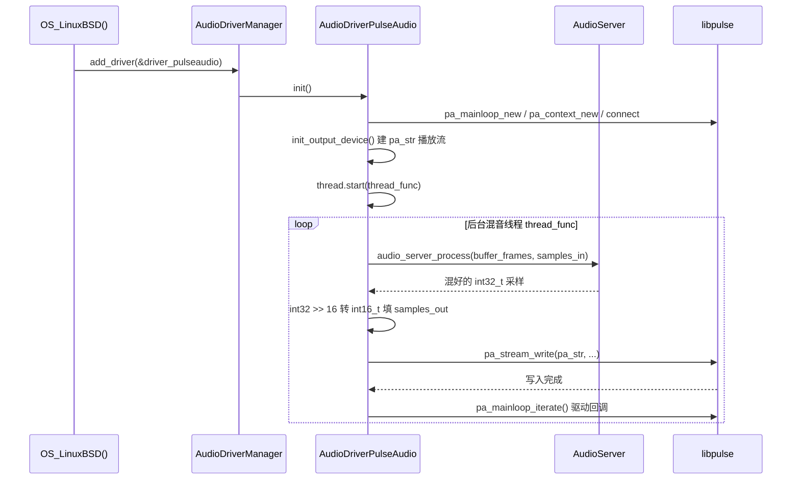

# pulseaudio（drivers）

> 一句话：把 Godot 混音好的音频「送货上门」——它是在 Linux 上替引擎把混好的 PCM 采样交给 PulseAudio 声卡服务器播放（顺带把麦克风采样收回来）的后端搬运工。

**结论**：`AudioDriverPulseAudio` 是 Linux 平台默认音频驱动，负责把 `AudioServer` 混音后的采样喂给 PulseAudio 播放、并回收麦克风输入，代价是必须独立开一条线程跑事件循环、且只支持 S16LE/立体声上限为 8 声道的简单格式。

## 是什么 / 不是什么

它是一层**适配器**：上承 Godot 的 `AudioDriver` 抽象契约（`servers/audio/audio_server.h:48`），下接 PulseAudio 的 C API（`pa_mainloop` / `pa_context` / `pa_stream`）。

它负责：把混音好的 `int32_t` 采样转成 PulseAudio 要的 `int16_t`，用后台线程喂给声卡；枚举/切换输入输出设备；把麦克风采样写回引擎的输入缓冲。

它不负责：真正的混音（`AudioServer` 在 `audio_server_process` 里做）、采样率与声道数的策略制定（由基类 `AudioDriver` 的 `_get_configured_mix_rate` 决定）、其他平台的声音输出（那是 `wasapi`/`coreaudio`/`alsa` 的事）。

## 在引擎里的位置

```mermaid
flowchart LR
    subgraph scene["scene 层"]
        Node["AudioStreamPlayer 等节点"]
    end
    subgraph servers["servers/audio 层"]
        AS["AudioServer<br/>混音逻辑"]
        AD["AudioDriver<br/>抽象契约 (audio_server.h:48)"]
        ADM["AudioDriverManager<br/>add_driver (audio_server.cpp:215)"]
    end
    subgraph drivers["drivers/pulseaudio"]
        PA["AudioDriverPulseAudio<br/>audio_driver_pulseaudio.h:46"]
    end
    subgraph platform["platform/linuxbsd"]
        OS["OS_LinuxBSD 构造函数<br/>os_linuxbsd.cpp:1299"]
    end
    Node --> AS
    AS --> AD
    ADM -->|注册| PA
    OS -->|add_driver(&driver_pulseaudio)| ADM
    PA -->|继承| AD
    PA -->|调用| LIB["libpulse / pulse-so_wrap.h"]
```

`AudioDriverPulseAudio` 在 `platform/linuxbsd/os_linuxbsd.cpp:1299-1301` 的 `OS_LinuxBSD` 构造函数里通过 `AudioDriverManager::add_driver(&driver_pulseaudio)` 注册，位置排在 ALSA 之前。注册后它就是一个「候选驱动」，由用户在项目设置里选 `audio/driver/driver` 时被 `AudioDriverManager::initialize()` 实例化并调用 `init()`。

## 关键概念

- **主循环（pa_mainloop）**：PulseAudio 是异步的，所有查询/回调都得靠一个事件循环驱动。比喻：一个「前台接待处」，你提交请求，然后不断 `pa_mainloop_iterate` 让它把结果回调给你。对应成员 `pa_ml`（`audio_driver_pulseaudio.h:50`）。
- **上下文（pa_context）**：到 PulseAudio 服务器的一条连接。比喻：拨通客服总机的那根电话线。对应成员 `pa_ctx`（`.h:51`）。
- **流（pa_stream）**：一条实际的音频数据通道，分播放流 `pa_str` 与录音流 `pa_rec_str`（`.h:52-53`）。比喻：一根送外卖的传送带。
- **声道映射（pa_channel_map）**：告诉 PulseAudio 每个采样槽对应哪个喇叭位置。成员 `pa_map` / `pa_rec_map`（`.h:54-55`）。奇数声道（如 3.0/5.0/7.0）会被驱动补成偶数声道（`audio_driver_pulseaudio.cpp:204-224`）。
- **回调（callback）**：6 个 `static` 回调（`pa_state_cb` / `pa_sink_info_cb` / `pa_source_info_cb` / `pa_server_info_cb` / `pa_sinklist_cb` / `pa_sourcelist_cb`）都是 PulseAudio 异步 API 的「回执单」，把服务器返回的状态/设备列表写回驱动成员。

## 核心文件（按阅读顺序）

1. `drivers/pulseaudio/audio_driver_pulseaudio.h` — 类声明，成员 + 全部 `AudioDriver` 契约方法签名，读它就能看清职责全貌。
2. `drivers/pulseaudio/audio_driver_pulseaudio.cpp` — 实现：`init()` 建主循环与上下文，`init_output_device()` 建播放流，`thread_func()` 跑混音喂数据循环。
3. `drivers/pulseaudio/SCsub` — 编译规则：无条件编 `*.cpp`；启用 `use_sowrap` 时追加 `pulse-so_wrap.c`。
4. `drivers/pulseaudio/pulse-so_wrap.h` — dylibloader 生成的头：把 `pa_context_new` / `pa_stream_write` 等符号重定向到 `initialize_pulse` 动态加载的函数指针，让 Godot 不硬链接 libpulse。

## 数据流 / 调用链



播放的「搬运」发生在 `thread_func`（`audio_driver_pulseaudio.cpp:400`）：线程先 `lock()`，若 `active` 未置位就填零静音，否则调 `audio_server_process(buffer_frames, samples_in.ptrw())`（`.cpp:418`）拿到引擎混音结果；接着把 `int32_t` 右移 16 位转成 `int16_t` 填进 `samples_out`（`.cpp:424`），再 `pa_stream_write` 交给 PulseAudio（`.cpp:461`）。录音则反过来：`pa_stream_peek` 取回采样，左移 16 位还原成 `int32_t` 后 `input_buffer_write`（`.cpp:546-553`）。整条线程用 `Mutex` 与主线程的 `get_latency`/`set_output_device` 等调用互斥。

## 中文口诀

> 一个契约要兑现，六个回调收回执；
> 主循环像接待处，上下文是电话线；
> 播放流是传送带，录音流来回收站；
> 线程里忙搬运，三十二位右移十六。

## 练习（15 分钟）

1. 打开 `audio_driver_pulseaudio.cpp` 的 `init()`（第 279 行），逐句对照：它依次创建了哪三个 PulseAudio 对象？版本检查的阈值是多少（第 297-299 行）？
2. 在 `init_output_device()`（第 183 行）里找到 `PA_SAMPLE_S16LE` 和 `buffer_frames` 的计算公式，算一下默认 44100Hz、15ms 延迟时 `buffer_frames` 是多少。
3. 在 `thread_func` 里标出「混音 → 右移 → 写入」三段代码的行号，确认奇偶声道分支（第 422 行 vs 第 426 行）分别走了哪条路径。

## 自测

- [ ] `AudioDriverPulseAudio` 继承的基类是什么？它在哪个文件注册进 `AudioDriverManager`？
- [ ] 播放流和录音流的成员名分别是什么？采样从 `int32_t` 到 `int16_t` 的转换用了什么运算？
- [ ] 为什么驱动需要一条独立线程，而不是在主线程里直接 `pa_stream_write`？

## 一句话总结

> `AudioDriverPulseAudio` 是 Linux 上兑现 `AudioDriver` 契约的 PulseAudio 适配器：一条后台线程把 `AudioServer` 混好的采样转成 int16 喂给声卡、再顺手回收麦克风。
