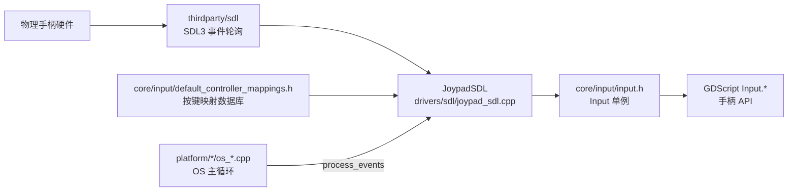
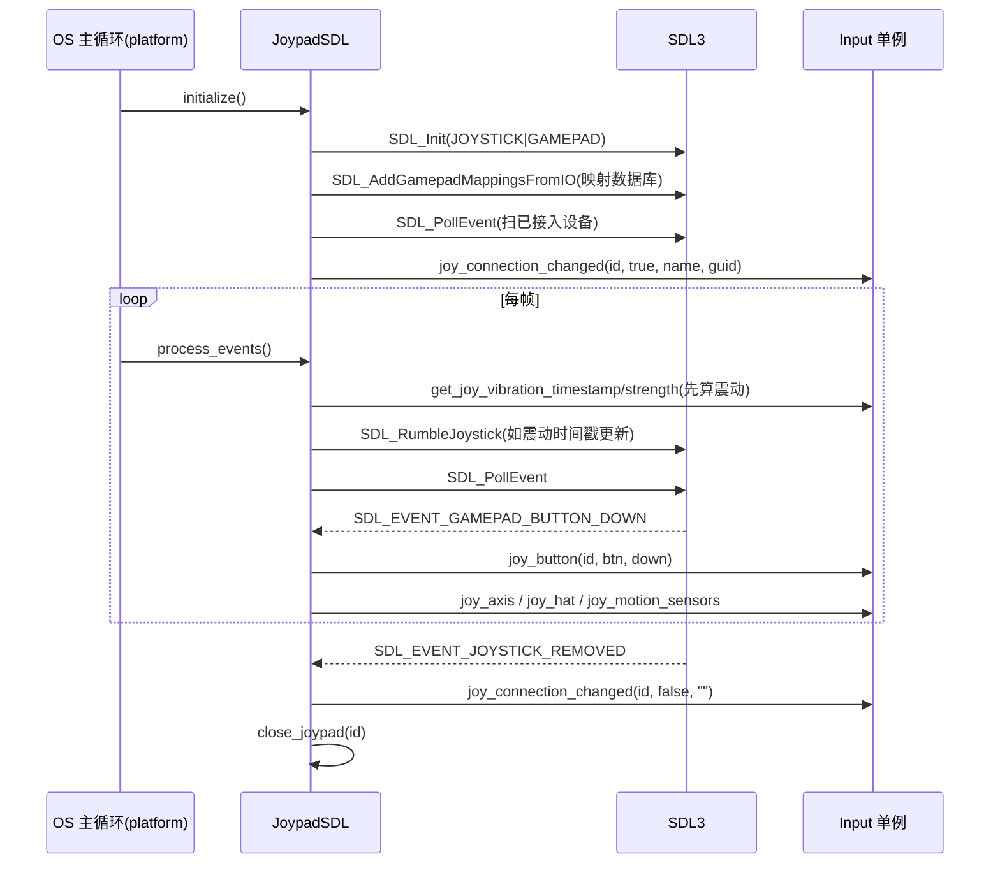

# sdl（drivers）

> 一句话：`sdl` 是 Godot 用来「听懂手柄」的翻译官——它把 SDL3 的原始摇杆/手柄事件，翻译成 Godot 内部 `Input` 统一的手柄语言。

**结论**：`drivers/sdl` 是手柄输入驱动，唯一职责是把 SDL3 的摇杆（joystick）/手柄（gamepad）事件转成 Godot `Input` 的手柄事件；它只做「手柄输入」这一件事，音频、视频、渲染全被显式关掉，代价是必须在引擎里捆绑编译整个 `thirdparty/sdl`（约 130 个 C 文件）。

## 是什么 / 不是什么

`drivers/sdl` 是一个**输入驱动**：它站在「SDL3 底层事件」和「Godot `Input` 单例」之间，把前者的方言翻译成后者的方言。整个目录只有 4 个文件、1 个类 `JoypadSDL`（`drivers/sdl/joypad_sdl.h:39`）。

它**不是**音频驱动——尽管 SDL 常被当作音频库。`SDL_build_config_private.h:42` 里 `#define SDL_AUDIO_DISABLED 1`，音频交给 `servers/audio` 和平台专有驱动（wasapi/alsa 等）。

它**不是**渲染/窗口驱动。视频（`SDL_VIDEO_DISABLED`）、渲染（`SDL_RENDER_DISABLED`）、GPU、相机、对话框在 `SDL_build_config_private.h:45-53` 全部关掉。窗口和渲染归 `DisplayServer`。

它**不负责**手柄按键的语义映射——那个数据库由 `core/input/default_controller_mappings.h` 提供，`sdl` 只是在初始化时把它灌进 SDL。

## 在引擎里的位置

`JoypadSDL` 被四套平台 OS 持有并驱动：`platform/linuxbsd/os_linuxbsd.cpp:179`、`platform/macos/os_macos.mm:260`、`platform/windows/display_server_windows.cpp:8323`、`drivers/apple_embedded/os_apple_embedded.mm:178`。它自己不知道「什么时候被调用」，全由 OS 主循环每帧叫一次 `process_events()`。

## 关键概念

- **手柄 vs 摇杆**：SDL 里手柄（gamepad，有标准 ABXY 布局，走 `SDL_Gamepad`）和摇杆（joystick，非标准设备，走 `SDL_Joystick`）是两条事件流。`JoypadSDL` 用 `SDL_IsGamepad()` 区分，用宏 `SKIP_EVENT_FOR_GAMEPAD`（`joypad_sdl.cpp:47`）跳过对 gamepad 的重复 joystick 事件。
- **能力探测**：每个手柄的震动/灯/陀螺仪能力在接入时一次性读出来，存进内部 `Joypad` 结构（`joypad_sdl.h:47`），之后按需调用。
- **实例 ID 映射**：SDL 的 `SDL_JoystickID` 和 Godot 的槽位编号不是一回事，用 `HashMap<SDL_JoystickID, int> sdl_instance_id_to_joypad_id`（`joypad_sdl.h:71`）双向对应。
- **映射数据库**：`DefaultControllerMappings::mappings`（`core/input/default_controller_mappings.h:35`）是一张内置表，初始化时逐条喂给 `SDL_AddGamepadMappingsFromIO()`（`joypad_sdl.cpp:74`），让 SDL 认得各家手柄的按键布局。

## 核心文件（按阅读顺序）

1. `drivers/sdl/joypad_sdl.h` — 唯一类的声明：`JoypadSDL` 及内部 `Joypad`（继承 `Input::JoypadFeatures`），外加 16 个槽位数组和 ID 映射表。
2. `drivers/sdl/joypad_sdl.cpp` — 全部实现：`initialize()` / `process_events()` / `close_joypad()` 三条主线，357 行。
3. `drivers/sdl/SDL_build_config_private.h` — SDL3 的「瘦身配置」：只留摇杆/手柄/传感器，其余子系统全关。
4. `drivers/sdl/SCsub` — 构建脚本：把 `thirdparty/sdl` 约 130 个 C 文件（按平台挑选）编进引擎，再加本目录 `*.cpp`。

## 数据流 / 调用链

## 中文口诀

手柄事件进 SDL，翻译全靠 JoypadSDL；
gamepad 和 joystick 分两路，重复事件宏里跳过；
映射表灌给 SDL3，十六槽位别超车；
震动先算再 Rumble，拔线 close 回 HashMap。

## 练习（15 分钟）

1. 打开 `drivers/sdl/joypad_sdl.cpp:84`，跟着 `process_events()` 走一遍：先看震动循环，再看 `SDL_PollEvent` 的 `switch`，数数它一共处理了几种事件。
2. 找到宏 `SKIP_EVENT_FOR_GAMEPAD`（第 47 行），回答：为什么要跳过？如果删掉会发生什么（提示：同一物理按键会报几次）。
3. 读 `SDL_build_config_private.h`，列出被 `*_DISABLED` 关掉的 8 个 SDL 子系统，确认「sdl 模块不管音频/视频」。

## 自测

- [ ] `JOYPADS_MAX` 是多少？它在哪个头文件定义？（提示：`core/input/input.h:104`）
- [ ] `JoypadSDL` 内部类 `Joypad` 继承自谁？覆写了哪几个虚函数？
- [ ] 手柄的 guid 是从哪个 SDL API 拿到的？存进了哪个字段？

## 一句话总结

> `drivers/sdl` 是 Godot 的手柄输入驱动：把 SDL3 的摇杆/手柄事件喂给 `Input`，只做输入、砍掉 SDL 其余子系统，靠平台 OS 每帧驱动。
