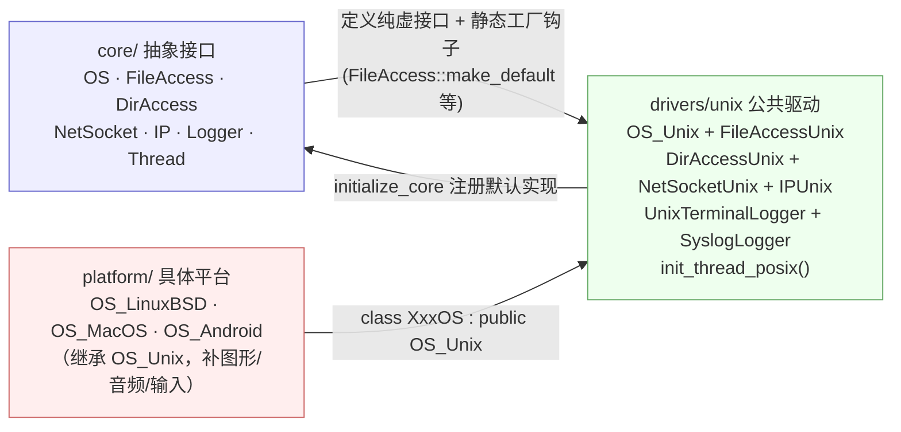
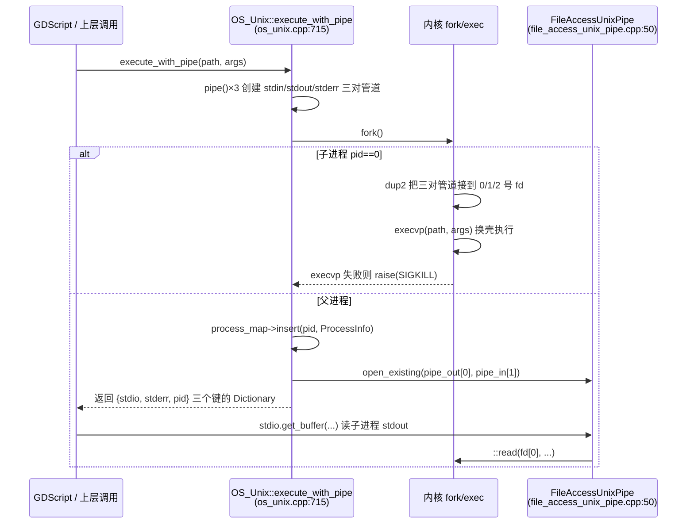

# unix（drivers）

> 一句话：Unix 驱动层是 Godot 在 Linux/macOS/BSD 等 POSIX 系统上的「公共底座」——把「读文件、开进程、发网络包、取时间」这些活，翻译成一次 `open()`、`fork()`、`socket()` 系统调用，让上层 OS 抽象类只认一个统一的 `OS` 接口。

**结论**：`drivers/unix` 这一层把 POSIX 系统调用封装成 `OS_Unix` 以及 `FileAccessUnix` / `DirAccessUnix` / `NetSocketUnix` / `IPUnix` 五个默认实现，注册进 core 的工厂钩子，为所有 Unix 系平台（Linux、macOS、*BSD、Android 的 Linux 内核部分）提供文件、目录、进程、网络、时钟、熵的底层支撑；代价是它**不**实现任何平台特有的图形/音频/输入，那些留给 `platform/` 下的具体平台（如 `platform/linuxbsd`、`platform/macos`）去继承和补齐。

## 是什么 / 不是什么

这个目录是「驱动层」里唯一一个**跨平台共享**的 Unix 驱动：17 个文件（8 个头文件 + 8 个实现 + 1 个 `SCsub`），全部包在 `#ifdef UNIX_ENABLED` 之下（如 `drivers/unix/os_unix.h:33`、`drivers/unix/file_access_unix.h:33`）。`SCsub` 只有一行 `env.add_source_files(env.drivers_sources, "*.cpp")`（`drivers/unix/SCsub:6`），编译所有 `.cpp`。

它负责的是 POSIX 系统调用的「兜底封装」：文件读写用 `fopen/fread/fwrite`（`FileAccessUnix`），目录枚举用 `opendir/readdir`（`DirAccessUnix`），进程创建用 `fork/execvp/waitpid`（`OS_Unix::create_process`），网络用 `socket/bind/connect/accept`（`NetSocketUnix`），主机名解析用 `getaddrinfo`（`IPUnix`），时钟用 `clock_gettime`（`OS_Unix::get_ticks_usec`）。

它**不**负责：图形上下文（那是 `drivers/vulkan`、`drivers/gl_context`）、音频设备（`drivers/alsa`、`drivers/pulseaudio`）、窗口与事件循环（那是 `platform/linuxbsd` 等平台层）。它也不是 `OS` 抽象接口本身——`OS_Unix` 只「认领」了核心公共部分，注释写得很清楚：`// UNIX only handles the core functions. inheriting platforms under unix (eg. X11) should handle the rest`（`drivers/unix/os_unix.h:77-78`）。

## 在引擎里的位置



依赖关系是「接口在 core，实现在 drivers/unix，继承在 platform」：core 里的 `FileAccess`、`DirAccess`、`NetSocket`、`IP` 都持有一个静态函数指针（如 `FileAccess::create_func`），`OS_Unix::initialize_core()` 通过 `make_default<T>()` 把 Unix 实现塞进去（`drivers/unix/os_unix.cpp:171-181`）。`platform/linuxbsd` 的 `OS_LinuxBSD` 则 `class OS_LinuxBSD : public OS_Unix`，只重写图形/音频那部分。被它服务的另一头是 `core/os/os.h` 里声明的 `OS` 基类——`OS_Unix` 是它的第一个真正可实例化的 POSIX 子类。

## 关键概念

1. **默认实现注册（工厂钩子）**：core 里的 `FileAccess`/`DirAccess`/`NetSocket`/`IP` 都是「抽象类 + 一个静态 `_create` 函数指针」，谁先 `make_default` 谁就是整个进程里唯一的实现。比喻：像酒店前台登记的「值班表」，`OS_Unix::initialize_core()` 在启动时把 `FileAccessUnix` 等 4 个实现挂上号（`drivers/unix/os_unix.cpp:171-181`），之后引擎里所有 `FileAccess::open(...)` 实际创建的都这 4 个类的实例。

2. **进程管理（fork/execvp/waitpid）**：Godot 的 `OS.execute()`/`OS.create_process()` 在 Unix 上就是 `fork()` 出子进程 + `execvp()` 换壳执行，父进程用 `waitpid()` 收尸。锚点：`OS_Unix::create_process`（`drivers/unix/os_unix.cpp:955`）和 `_wait_for_pid_completion`（`drivers/unix/os_unix.cpp:825`）。配套的 `ProcessInfo` 结构体和 `process_map` 记录每个子进程的存活状态和退出码（`drivers/unix/os_unix.h:53-58`）。

3. **管道作为文件**：`FileAccessUnixPipe` 是「把一对文件描述符 `fd[2]` 伪装成 `FileAccess`」的类，读取时它用 `::read(fd[0],...)`、写入用 `::write(fd[1],...)`（`drivers/unix/file_access_unix_pipe.cpp:149-184`）。`OS_Unix::execute_with_pipe` 用它把子进程的 stdout/stderr 变成可读的 `FileAccess` 返回给 GDScript。

4. **错误码翻译层**：POSIX 的 `errno` 是一个全局 int，Godot 需要自己的 `Error` 枚举。`NetSocketUnix::_get_socket_error()` 把 `EISCONN/EINPROGRESS/EAGAIN/EADDRINUSE/EACCES/ENOBUFS` 一一映射成 `NetError`（`drivers/unix/net_socket_unix.cpp:155-176`），`FileAccessUnix::open_internal` 则把 `ENOENT` 映射成 `ERR_FILE_NOT_FOUND`（`drivers/unix/file_access_unix.cpp:174-182`）。

5. **时钟与熵**：`get_ticks_usec()` 用 `CLOCK_MONOTONIC`（Linux 上优先 `CLOCK_MONOTONIC_RAW`）减去启动时记录的 `_clock_start` 得到单调递增的微秒数（`drivers/unix/os_unix.cpp:391-404`）；`get_entropy()` 优先用 `getentropy()`，回退到读 `/dev/urandom`（`drivers/unix/os_unix.cpp:282-306`）。这两样是游戏主循环计时和密码学随机数的地基。

## 核心文件（按阅读顺序）

1. `drivers/unix/os_unix.h` — `OS_Unix` 类的公共接口声明，覆盖进程/环境变量/动态库/时钟/熵/字符编码转换；还有终端彩色日志 `UnixTerminalLogger`（`os_unix.h:147`）。
2. `drivers/unix/os_unix.cpp` — 核心实现：`initialize_core()` 注册 4 个默认实现，`fork/execvp` 进程管理，`dlopen` 动态库，iconv 编码转换，`/proc/meminfo` 内存读取。
3. `drivers/unix/file_access_unix.h` / `.cpp` — `FileAccessUnix`：用标准 C 的 `FILE *` 做文件读写、seek、权限与扩展属性（xattr）。
4. `drivers/unix/file_access_unix_pipe.h` / `.cpp` — `FileAccessUnixPipe`：把管道/命名管道（FIFO）伪装成文件，是 `execute_with_pipe` 的返回类型。
5. `drivers/unix/dir_access_unix.h` / `.cpp` — `DirAccessUnix`：`opendir/readdir` 枚举目录，`stat` 判断文件/目录/软链，`statvfs` 算剩余空间，`get_filesystem_type()` 用 `statfs` 的魔数识别文件系统类型。
6. `drivers/unix/net_socket_unix.h` / `.cpp` — `NetSocketUnix`：TCP/UDP 与 Unix 域套接字的 open/bind/listen/connect/accept/send/recv 全套。
7. `drivers/unix/ip_unix.h` / `.cpp` — `IPUnix`：`getaddrinfo` 解析主机名，`getifaddrs` 枚举本机网卡与 IP。
8. `drivers/unix/thread_posix.h` / `.cpp` — `init_thread_posix()`：只干一件事，把 pthread 的线程命名 `set_name` 注入 `Thread::_set_platform_functions`（`drivers/unix/thread_posix.cpp:77-79`）。
9. `drivers/unix/syslog_logger.h` / `.cpp` — `SyslogLogger`：把日志写进系统 `syslog`（用 `vsyslog`/`syslog`），供无终端的服务场景使用。

## 数据流 / 调用链

以 `OS.execute_with_pipe("ls", ["-l"], true)` 为例，一次「带管道执行外部命令」的完整链路：



要点：`fork()` 之后父子共享同一份管道描述符，子进程 `dup2` 把管道接到标准输入输出再 `execvp`，父进程关掉自己用不到的一端，把读端 `pipe_out[0]` 包成 `FileAccessUnixPipe` 塞进返回的 `Dictionary` 的 `"stdio"` 键（`drivers/unix/os_unix.cpp:803-818`）。这样上层拿到的就是一个普通 `FileAccess`，可以像读文件一样读子进程输出。

## 中文口诀

```
OS 一统 POSIX，工厂钩子挂四处
文件目录加网络，启动注册不糊涂
fork 出来 execvp，waitpid 收尸防僵尸
管道伪装成文件，读子进程像读书
errno 翻译成 Error，socket 错误有来路
时钟熵源双保险，monotonic 配 urandom
终端日志带颜色，syslog 兜底无屏幕
platform 层来继承，图形音频它不管
```

## 练习（15 分钟）

1. 打开 `drivers/unix/os_unix.cpp` 的 `initialize_core()`（第 166 行），对照 `core/io/file_access.h` 找到 `FileAccess::make_default` 模板和它赋值的那个静态函数指针，确认「注册」到底改的是哪个变量。
2. 在 `execute_with_pipe`（第 715 行）里找出三对 `pipe()` 和 `dup2()` 的对应关系，画出「哪个 fd 对应子进程的 stdin/stdout/stderr」。
3. 读 `_get_socket_error()`（`net_socket_unix.cpp:155`），把 6 个 `errno` 值和它返回的 `NetError` 一一列成表。
4. 对比 `FileAccessUnix`（`FILE *`）和 `FileAccessUnixPipe`（`fd[2]`）的 `get_buffer` 实现，说出为什么管道实现要自己处理 `SIGPIPE`。

## 自测

- [ ] `OS_Unix::initialize_core()` 一共注册了哪几个默认实现？分别调用的是哪个 `make_default`？（在 `drivers/unix/os_unix.cpp:166-186` 找答案。）
- [ ] 为什么 `execute_with_pipe` 的子进程要调用 `setsid()`？它解决了什么问题？（提示：`os_unix.cpp:767` 附近注释。）
- [ ] `FileAccessUnixPipe::open_internal` 打开 `pipe://` 路径时，实际在磁盘上创建了什么？关闭时又做了什么？（看 `file_access_unix_pipe.cpp:69-127`。）
- [ ] `NetSocketUnix` 在哪些方法里用 `FD_CLOEXEC` 关闭了「子进程继承描述符」？动机是什么？（搜 `_set_close_exec_enabled`。）

## 一句话总结

> `drivers/unix` 是 Godot 所有 POSIX 平台的公共底层：它不定义接口，只把 POSIX 系统调用翻译成 `OS`/`FileAccess`/`NetSocket`/`IP` 的默认实现，再用一个 `initialize_core()` 挂上工厂钩子，让上层平台只需继承 `OS_Unix` 补上图形、音频、输入即可。
