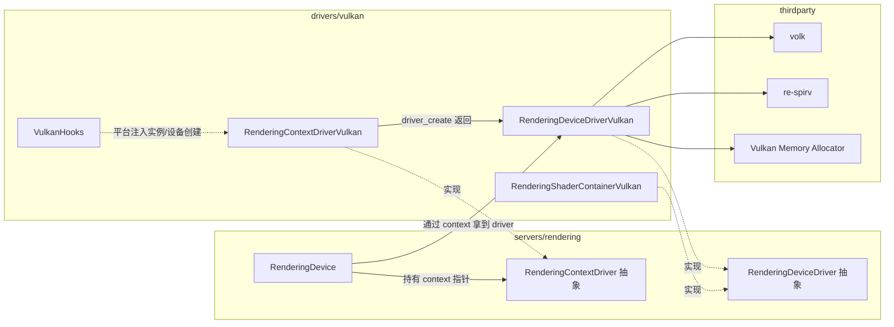
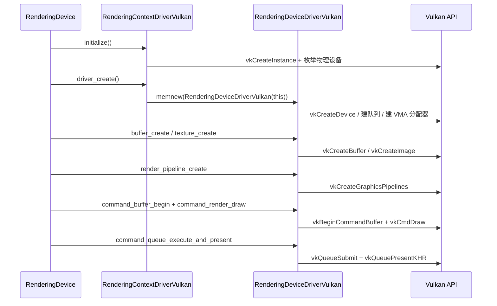

# vulkan（drivers）

> 一句话：Vulkan 驱动是 Godot 渲染服务器和显卡之间的一名「翻译官」，把引擎抽象的 `RenderingDeviceDriver` 菜单逐条翻译成 `vk*` 调用。

**结论**：`drivers/vulkan` 实现 Vulkan 渲染后端——对外兑现 `RenderingDeviceDriver` / `RenderingContextDriver` 两份契约（`servers/rendering/rendering_device_driver.h:90`、`servers/rendering/rendering_context_driver.h:41`），对内把每一个抽象资源（buffer、texture、pipeline……）翻译成真正的 Vulkan 对象。代价是这里要扛起 Vulkan 最啰嗦的活：队列、同步、内存、交换链、管线缓存，核心实现一个 `.cpp` 就有 6473 行。

## 是什么 / 不是什么

这个模块**是**：一个把 Godot 渲染抽象翻译成 Vulkan 的后端驱动。引擎上层（`RenderingDevice`，`servers/rendering/rendering_device.h:85`）只认两张抽象菜单，不关心菜单背后是 Vulkan、D3D12 还是 Metal。它负责两件事——管「上下文」（VkInstance、物理设备、窗口表面）和管「设备」（VkDevice、资源、命令缓冲）。

这个模块**不是**：渲染算法本身。什么 mesh 怎么画、lightmap 怎么烘焙、后处理怎么做，都不在这里，那些在 `servers/rendering/` 的更高层。它也不负责平台窗口（那是 `platform/` 的活，只通过 `VulkanHooks` 注入）、不写着色器编译器（用第三方 `re-spirv`，`SCsub:60-64`）。

## 在引擎里的位置



箭头分两种：实线是「运行时谁持有谁」，虚线是「谁实现了谁的契约」。

## 关键概念

- **翻译官（设备驱动）**：`RenderingDeviceDriverVulkan`（`rendering_device_driver_vulkan.h:54`）继承 `RenderingDeviceDriver`，把抽象 ID 翻译成 `VkBuffer`/`VkImage`/`VkPipeline`。整个头文件 692 行，全是 `override final` 的虚函数，一个资源类别一段。
- **前台接待（上下文驱动）**：`RenderingContextDriverVulkan`（`rendering_context_driver_vulkan.h:46`）继承 `RenderingContextDriver`，负责 `VkInstance`、枚举物理设备、创建 `VkSurfaceKHR`。它不直接画东西，只负责「开机」和「开窗口」。
- **整数 ID + 分页分配器**：上层看到的 `BufferID`/`TextureID` 本质是整数。真实对象存在 `PagedAllocator<VersatileResource, true>` 里（`rendering_device_driver_vulkan.h:816-824`），用 `VersatileResourceTemplate` 让七种资源共用一个分配器。
- **VMA 管显存**：所有 `VkDeviceMemory` 都交给第三方 Vulkan Memory Allocator（`SCsub:38-57`），驱动只持有 `VmaAllocator allocator`（`rendering_device_driver_vulkan.h:221`），小分配还按内存类型建 `VmaPool`（`:224`）。
- **SPIR-V 容器**：`RenderingShaderContainerVulkan`（`rendering_shader_container_vulkan.h:35`）持有着色器字节码，`_set_code_from_spirv`（`rendering_shader_container_vulkan.cpp:47`）负责把反射结果转成 SPIR-V，可选 SMOLV 压缩（`:80`）。

## 核心文件（按阅读顺序）

1. `SCsub` — 编译清单：三个第三方件（VMA / volk / re-spirv）+ 本目录全部 `*.cpp`，并按平台加 `VK_USE_PLATFORM_*` 宏。
2. `godot_vulkan.h` — 唯一入口头，在 `USE_VOLK` 下切到 `volk.h`，否则直接 `vulkan/vulkan.h`。
3. `rendering_context_driver_vulkan.h` — 上下文驱动，管实例、物理设备、表面，声明的 5 个 .cpp 里 925 行。
4. `rendering_context_driver_vulkan.cpp` — `driver_create()` 就在这里 `memnew(RenderingDeviceDriverVulkan(this))`（`:950-951`）。
5. `rendering_device_driver_vulkan.h` — 设备驱动的全量契约清单，按 BUFFERS / TEXTURE / PIPELINE / RAYTRACING 分段。
6. `rendering_device_driver_vulkan.cpp` — 6473 行的翻译主体，每个抽象函数对应一坨 `vk*` 调用。
7. `rendering_shader_container_vulkan.h/.cpp` — SPIR-V 容器与其格式描述。
8. `vulkan_hooks.h/.cpp` — 单例钩子，平台或 XR 用它接管 `vkCreateInstance`/`vkCreateDevice` 等环节。

## 数据流 / 调用链

一帧从「拿到 driver」到「把图交到屏幕上」的典型链路：



记住中间这一层永远是「上层说抽象词，驱动说 `vk*`」。`command_render_draw`（`rendering_device_driver_vulkan.h:651`）最终落到 `vkCmdDraw`，不是驱动自己画。

## 中文口诀

```
两份契约两张皮：Context 管实例，Device 管资源。
一名翻译做菜单：抽象 API 翻成 vk 调用。
ID 全是整数，资源住进分页器。
显存交给 VMA，着色器存 SPIR-V。
编译靠 SCsub，三方三件套不碰。
```

## 练习（15 分钟）

1. 打开 `rendering_device_driver_vulkan.cpp`，找 `buffer_create`（`:1946`），数它内部调了几个 `vk*` 函数。
2. 打开 `rendering_context_driver_vulkan.cpp`，找 `driver_create()`（`:950`），确认返回类型与 `memnew` 的是同一个类。
3. 在 `rendering_device_driver_vulkan.h` 里定位 `swap_chain_create`（`:449`），对比 `SwapChain` 结构体（`:425`）里的 `VkSwapchainKHR` 字段，理解「抽象 ID 包一个原生句柄」。

## 自测

- [ ] `RenderingDeviceDriverVulkan` 和 `RenderingContextDriverVulkan` 各自继承哪个抽象类？分别在哪个文件声明？
- [ ] 设备驱动用什么数据结构把 `BufferID` 映射到真正的 `VkBuffer`？搜 `VersatileResource` 与 `PagedAllocator` 回答。
- [ ] 交换链的图像信号量为什么是「每个 command queue 一份」？读 `CommandQueue` 里 `image_semaphores` 相关字段（`rendering_device_driver_vulkan.h:374`）解释。

## 一句话总结

> `drivers/vulkan` 是 Godot 渲染栈的 Vulkan 后端：上层点抽象菜单，这里逐条翻译成 `vk*` 调用，把队列、同步、显存、交换链这些 Vulkan 最硬的骨头都吞在这里。
