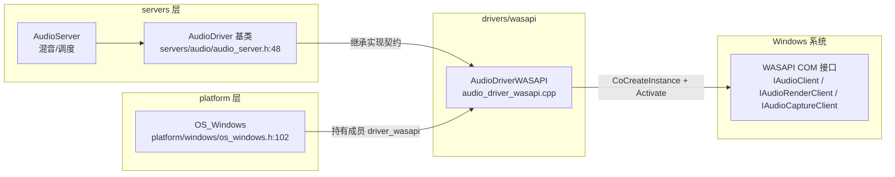
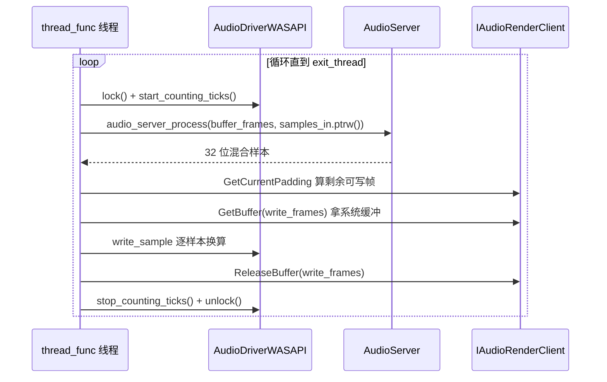

# wasapi（drivers）

> 一句话：把 Godot 混音器产出的 PCM 样本，倒进 Windows 的 WASAPI「共享水槽」，让系统把声音放出来；顺便用同一个水槽把麦克风声音捞回来。

**结论**：`wasapi` 是 Windows 平台的音频输出/输入驱动，用单个类 `AudioDriverWASAPI` 实现引擎的 `AudioDriver` 契约——起一条独立线程，用「拉 + 填」的方式把 `AudioServer` 混好的 32 位样本换算成设备格式、推进 WASAPI 共享缓冲里播放，再反向把麦克风数据抓回输入缓冲；代价是它只能跑在 Windows 上，且共享模式下采样率、位深、缓冲大小都由系统说了算，驱动只能「跟着走」。

## 是什么 / 不是什么

`wasapi` 是一个「驱动层适配器」：它只负责把引擎统一的 `AudioDriver` 接口翻译成 Windows 的 WASAPI COM 接口（`IAudioClient` / `IAudioRenderClient` / `IAudioCaptureClient`）。它**不负责**混音（那是 `servers/audio/` 里 `AudioServer` 的活，`audio_server_process` 会帮它算好每一帧样本），也不负责音频文件编解码（交给 `ogg`/`vorbis`/`mp3` 等模块）。它夹在「混音服务器」和「Windows 声卡」之间，是最后一道搬运工。

## 在引擎里的位置



平台层在 `os_windows.h:102` 声明了成员 `AudioDriverWASAPI driver_wasapi;`，引擎启动时在 `os_windows.cpp:2906` 用 `AudioDriverManager::add_driver(&driver_wasapi)` 把它挂进驱动管理器（只有 `WASAPI_ENABLED` 打开才编译）。它向上只依赖基类 `AudioDriver` 提供的 `audio_server_process`、`input_buffer_write` 等方法，向下通过 COM 调用 Windows 的 WASAPI。

## 关键概念

1. **共享模式（Shared Mode）**——WASAPI 的「拼车车道」：驱动用 `AUDCLNT_SHAREMODE_SHARED` 初始化，和其他程序共用声卡，所以采样率、位深、缓冲大小都不能自定义，只能 `GetMixFormat` 问系统「你用的什么格式」然后跟着走（`audio_driver_wasapi.cpp:328`）。
2. **IAudioClient3**——Windows 10 才有的「可调缓冲版」接口：老接口 `IAudioClient` 的缓冲大小是系统定的，延迟没法调；`IAudioClient3` 能用 `InitializeSharedAudioStream` 按帧数精确指定缓冲，实现低延迟（`audio_driver_wasapi.cpp:463`）。驱动先试着激活它，失败就回退老接口（`audio_driver_wasapi.cpp:295-308`）。
3. **混音线程（thread_func）**——驱动的「心脏」，一条独立 `Thread` 循环干三件事：向 `AudioServer` 要样本、填进渲染缓冲、抓麦克风数据（`audio_driver_wasapi.cpp:739`）。
4. **设备监听（CMMNotificationClient）**——一个 `IMMNotificationClient` 回调，注册到枚举器上，监听「默认设备变了」之类的事件，把标记位 `default_output_device_changed` 置真，让线程下次循环去重建设备（`audio_driver_wasapi.cpp:131`、`178`）。
5. **样本换算（write_sample / read_sample）**——引擎内部样本统一是 32 位 `int32_t`，设备可能是 8/16/24/32 位 PCM 或 IEEE float，这两个静态函数负责在两种表示之间移位换算（`audio_driver_wasapi.cpp:711`、`678`）。

## 核心文件（按阅读顺序）

1. `drivers/wasapi/SCsub` — 编译入口，一句 `add_source_files(env.drivers_sources, "*.cpp")`，只编 `.cpp`。
2. `drivers/wasapi/audio_driver_wasapi.h` — 唯一的类声明 `AudioDriverWASAPI`（继承 `AudioDriver`），加上内嵌的 `AudioDeviceWASAPI` 设备结构体，一眼看清它实现了哪些虚函数。
3. `drivers/wasapi/audio_driver_wasapi.cpp` — 全部实现，共 1057 行：设备初始化/枚举、混音线程、样本换算、输入输出两套设备的开关。

## 数据流 / 调用链

一次输出帧的典型调用（播放方向）：



播放侧的关键是 `audio_server_process`（`audio_driver_wasapi.cpp:755`）：驱动不自己混音，只按 `buffer_frames` 一批一批向服务器要 32 位样本，存进成员 `samples_in`，再用 `write_sample` 换算、经 `render_client->GetBuffer/ReleaseBuffer` 推进 WASAPI 缓冲。输入方向则在同一个线程里用 `capture_client->GetBuffer` 抓原始样本，`read_sample` 还原成 32 位，逐样本 `input_buffer_write` 交给服务器（`audio_driver_wasapi.cpp:902-924`）。

## 中文口诀

```
WASAPI 是水槽，共享模式跟着走。
GetMixFormat 问格式，IsFormatSupported 找最像。
Client3 能调缓冲，Win10 才给开，失败就退回老接口。
一条线程三件事，要样本、填缓冲、抓麦克风。
三十二位送进去，write_sample 移位转设备位深。
设备拔了别慌，通知客户端标记位，线程下轮重建。
锁住再填，别打架，mutex 保护 samples_in。
```

## 练习（15 分钟）

1. 打开 `audio_driver_wasapi.cpp` 的 `init()`（第 592 行起），圈出它依次做了哪几件事：取混音率 → 取目标延迟 → 清退出标记 → `init_output_device` → 启动 `thread_func` 线程。
2. 找到 `audio_device_init()`（第 199 行起），看 `using_audio_client_3` 是怎么决定用 `IAudioClient3` 还是回退 `IAudioClient` 的（第 295-308 行）。
3. 在 `thread_func`（第 739 行起）里找到「写设备缓冲」的三板斧：`GetCurrentPadding` → `GetBuffer` → `ReleaseBuffer`，写出它们在哪个分支里被调用。
4. 看 `write_sample`（第 711 行起），把 16 位 PCM 和 IEEE float 两种格式各写一行换算代码，说明 32 位样本分别被移了几位。
5. 找到 `init_output_device` 里的声道映射（第 510-530 行），写出 1/3/5/7 声道为什么会被 `channels + 1`。

## 自测

- [ ] `AudioDriverWASAPI` 的 `get_name()` 返回什么字符串？在哪个文件的哪一行？
- [ ] 混音线程 `thread_func` 是在 `init()` 里用哪个成员、哪个静态函数启动的？
- [ ] `IAudioClient3` 在什么条件下才会被激活？失败时怎么办？（提示：看 `using_audio_client_3`）
- [ ] 引擎混音产出的是多少位样本，`write_sample` 把它换算成设备的哪些格式？
- [ ] 输出和输入设备是各一个 `AudioDeviceWASAPI` 结构体，还是共用一个？各叫什么成员名？

## 一句话总结

> `wasapi` 是 Windows 上的「混音服务器 ↔ 声卡」翻译层：一个类、一条独立线程，用共享模式的 COM 接口把 `AudioServer` 的 32 位样本换算成设备格式送出去，再把麦克风数据反向接回来，并在设备热插拔时靠 `IMMNotificationClient` 自动重建。
