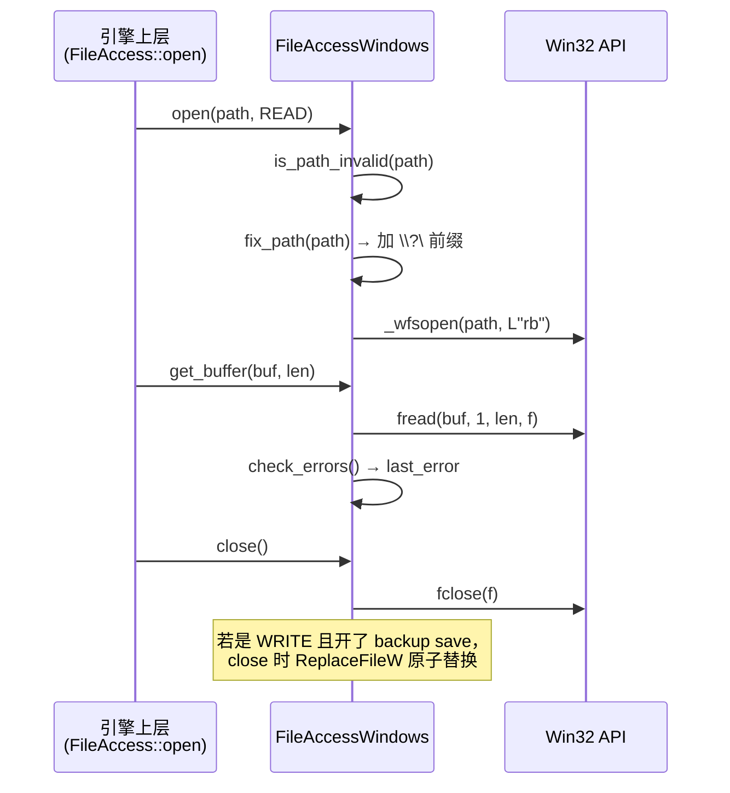

# windows（drivers）

> 一句话：这是 Godot 在 Windows 上「读写文件、列目录、连网络、给线程起名」的那层转接头——把引擎统一的 `FileAccess`/`DirAccess`/`NetSocket`/`IP` 接口翻译成 Win32 API 调用。

**结论**：`drivers/windows` 是 Windows 专属的平台驱动层，给 `core/io` 与 `core/os` 定义的抽象基类提供一套 Win32/Winsock 实现（文件、目录、命名管道、socket、网卡、线程命名）；代价是代码 100% 依赖 Win32 API，被 `#ifdef WINDOWS_ENABLED` 整段包裹，换平台就整份不编译。

## 是什么 / 不是什么

它**负责**的是「怎么在 Windows 上做」这一层：打开文件用 `_wfsopen`、列目录用 `FindFirstFileExW`、建 socket 用 Winsock `socket()`、解析域名用 `getaddrinfo`、给线程起名用 `SetThreadDescription`。它实现的是 `core/io/` 和 `core/os/` 里已经定好的纯虚接口。

它**不负责**：窗口、消息循环、输入、崩溃处理（`crash_handler_windows`）、进程启动（`OS_Windows`）——这些都在 `platform/windows/`。它也不定义「文件/目录/套接字」这个概念本身，概念在 `core/io/dir_access.h`、`core/io/file_access.h`、`core/io/net_socket.h` 里。

一句话区分：`platform/windows` 管「Windows 这个操作系统」，`drivers/windows` 管「Windows 上这几件具体小事的系统调用」。

## 在引擎里的位置

```mermaid
flowchart LR
    subgraph core["core（抽象层）"]
        DirAccess["DirAccess<br/>core/io/dir_access.h"]
        FileAccess["FileAccess<br/>core/io/file_access.h"]
        NetSocket["NetSocket<br/>core/io/net_socket.h"]
        IP["IP<br/>core/io/ip.h"]
        Thread["Thread<br/>core/os/thread.h"]
    end
    subgraph drivers["drivers/windows（本模块）"]
        DirAccessWindows
        FileAccessWindows
        FileAccessWindowsPipe
        NetSocketWinSock
        IPWindows
        ThreadWin["init_thread_win"]
    end
    subgraph platform["platform/windows"]
        OSWindows["OS_Windows<br/>os_windows.cpp"]
    end

    OSWindows -- "make_default / initialize" --> drivers
    drivers -- "继承并实现" --> core
```

注册动作全在 `platform/windows/os_windows.cpp` 里完成：`FileAccess::make_default<FileAccessWindows>`（`os_windows.cpp:281`）、`DirAccess::make_default<DirAccessWindows>`（`os_windows.cpp:285`）、`NetSocketWinSock::make_default()`（`os_windows.cpp:289`）、`IPWindows::make_default()`（`os_windows.cpp:320`）、`init_thread_win()`（`os_windows.cpp:278`）。本模块自己不注册，只「被注册」。

## 关键概念

- **默认实现（make_default）**：`FileAccess` 这类基类用「工厂函数指针 + `make_default<T>` 模板」决定实例化哪个子类。驱动层只负责提供子类和 `make_default()`，由 `OS_Windows` 在启动时挑它当默认。锚点：`net_socket_winsock.cpp:103` 的 `make_default()` 里 `WSAStartup(MAKEWORD(2,2))` 就是典型——先初始化 Winsock，再把自己的 `_create_func` 挂上去。

- **长路径前缀 `\\?\`**：Windows 老 API 有 260 字符的 `MAX_PATH` 限制，加 `\\?\` 前缀能绕过。`fix_path` 的结尾统一拼上这个前缀（`file_access_windows.cpp:95-96`、`dir_access_windows.cpp:83-84`），网络共享路径 `\\server\share` 除外。

- **保留设备名（invalid_files）**：Windows 把 `CON`、`PRN`、`AUX`、`NUL`、`COM0-9`、`LPT0-9` 当系统管道，不能拿来当普通文件名。`FileAccessWindows::initialize()` 把这些名字塞进静态 `HashSet<String> invalid_files`（`file_access_windows.cpp:695-707`），`is_path_invalid()` 负责拦截（`file_access_windows.cpp:69`）。

- **安全保存（backup save）**：写文件先写到同目录的 `.tmp` 临时文件，关文件时用 `ReplaceFileW` 原子替换目标（`file_access_windows.cpp:197-216`、`237-279`），并重试 1000 次来对付「爱锁文件的杀毒软件」。

- **大小写敏感探测**：Windows 默认大小写不敏感，但 NTFS 目录可被单独设为敏感。`DirAccessWindows::is_case_sensitive()` 用未公开的 `NtQueryInformationFile(FileCaseSensitiveInformation)` 查询（`dir_access_windows.cpp:415-436`）。

## 核心文件（按阅读顺序）

1. `dir_access_windows.h` — `DirAccessWindows` 接口：列目录、枚举盘符（最多 26 个）、判断大小写敏感。
2. `file_access_windows.h` — `FileAccessWindows` 接口：基于 `FILE*` 的读写，含隐藏/只读/扩展属性。
3. `file_access_windows_pipe.h` — `FileAccessWindowsPipe` 接口：把命名管道伪装成文件。
4. `net_socket_winsock.h` — `NetSocketWinSock` 接口：TCP/UDP、组播、IPv4/IPv6。
5. `ip_windows.h` — `IPWindows` 接口：域名解析 + 枚举本机网卡。
6. `thread_windows.h` — `init_thread_win()`：注册 Windows 线程命名回调。
7. `SCsub` — 一行 `env.add_source_files(env.drivers_sources, "*.cpp")`，把全部 `.cpp` 编进 `drivers_sources`。

## 数据流 / 调用链

以「引擎读一个文件」为例，看一次典型的读写调用链：

网络侧同理：`NetSocketWinSock::open()` 用 `socket(AF_INET6/INET, SOCK_STREAM/DGRAM, ...)`（`net_socket_winsock.cpp:225-228`），`poll()` 用 `select()` 而非 `WSAPoll`（注释明说 `WSAPoll is broken`，`net_socket_winsock.cpp:373`），`recv()/send()` 再把 `WSAGetLastError()` 映射成引擎的 `NetError` 枚举（`net_socket_winsock.cpp:125-147`）。

## 中文口诀

路径要加 `\\?\`，长名才不撞墙； 
`CON PRN NUL` 是禁名，读写先问 `is_path_invalid`。 
写文件先落 `.tmp`，关时 `ReplaceFileW` 原子换； 
列目录走 `FindFirst`，二十六盘 `GetLogicalDrives`。 
socket 靠 Winsock，`select` 不碰 `WSAPoll`； 
域名解析 `getaddrinfo`，网卡枚举 `GetAdaptersAddresses`。 
线程起名 `SetThreadDescription`，注册全靠 `make_default`。

## 练习（15 分钟）

1. 在 `file_access_windows.cpp` 找到 `fix_path`，画出 `res://user/foo.txt` 经过它之后的最终字符串。
2. 读 `_update_drives()`（`dir_access_windows.cpp:138`），解释为什么 `GetLogicalDrives()` 返回的位掩码能和 `MAX_DRIVES = 26` 对应。
3. 对比 `net_socket_winsock.cpp` 的 `poll()` 与 `open()`，说出 UDP socket 在 `open()` 里被额外关掉了什么系统行为。
4. 看 `file_access_windows_pipe.cpp:64`，写出 `pipe://my/pipe` 映射成的真实命名管道路径。

## 自测

- [ ] `FileAccessWindows` 和 `DirAccessWindows` 分别继承自哪个基类？基类头文件在哪一行？
- [ ] 为什么 `fix_path` 要对「网络共享路径」网开一面、不加 `\\?\` 前缀？
- [ ] backup save 机制里，`close()` 失败时引擎会弹哪句提示（提示里点名的「元凶」是谁）？
- [ ] `NetSocketWinSock::set_reuse_address_enabled()` 的注释说了 Windows 的 `SO_REUSEADDR` 实际等价于什么？

## 一句话总结

> `drivers/windows` 是 Windows 专属的「系统调用适配层」：把引擎的 `FileAccess`/`DirAccess`/`NetSocket`/`IP`/线程命名接口翻译成 Win32/Winsock 调用，自己只被 `OS_Windows` 注册、不注册别人。
