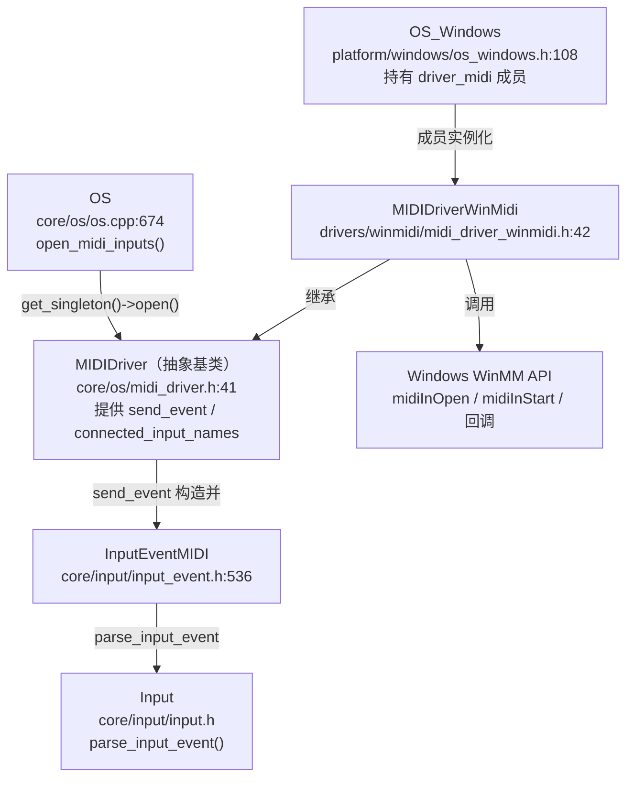
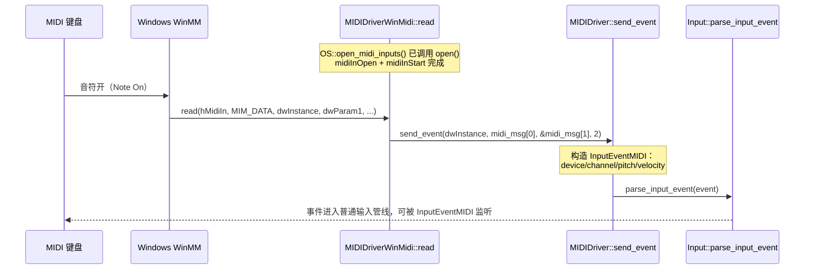

# winmidi（drivers）

> 一句话：winmidi 是「Windows 版 MIDI 键盘翻译官」——它借 Windows 自带的多媒体 API 把硬件 MIDI 音符翻译成引擎认识的 `InputEventMIDI`，塞进输入系统。

**结论**：`winmidi` 是 Godot 在 Windows 平台的 MIDI 输入驱动，它把 `MIDIDriverWinMidi`（`drivers/winmidi/midi_driver_winmidi.h:42`）注册成 `MIDIDriver` 的单例实现，用 `midiInOpen` 打开系统里的 MIDI 输入设备、用回调把按键消息转成 `InputEventMIDI` 喂给 `Input`；代价是它只做「输入」这一半，不解析字节流、不处理 SysEx，也不发出声音。

## 是什么 / 不是什么

- **是**：Windows 上把硬件 MIDI 输入（键盘、打击垫、控制台）接入引擎输入系统的桥。工作都在 `midi_driver_winmidi.cpp` 一个文件里，约 100 行。
- **不是**：它不负责解析原始 MIDI 字节流——Windows 的 `CALLBACK_FUNCTION` 回调已经把 running status 展开、SysEx 丢弃（`midi_driver_winmidi.cpp:39-41`），所以这里不碰 `MIDIDriver::Parser`（那是 alsamidi / coremidi 等拿到裸字节流的驱动才用的）。
- **不是**：它不产生声音。声音输出归 `servers/audio` 和音频驱动管，MIDI 输入只是「事件源」。

## 在引擎里的位置

依赖方向：`winmidi` 只依赖 `core/os/midi_driver.h` 和 Windows 头 `<mmsystem.h>`；它被 `platform/windows` 的 `OS_Windows` 实例化，自己不往下游扩散。

## 关键概念

- **MIDI 输入设备（HMIDIIN）**：一个物理/虚拟输入口。驱动用一个 `Vector<HMIDIIN> connected_sources` 记下所有打开成功的句柄（`midi_driver_winmidi.h:43`）。
- **回调（CALLBACK_FUNCTION）**：Windows 在每来一条 MIDI 消息时异步调用 `MIDIDriverWinMidi::read`，这是整个驱动的入口，不是轮询（`midi_driver_winmidi.cpp:37`）。
- **`MIM_DATA` 消息**：回调收到的 `wMsg` 的一种，代表一条已组包好的 MIDI 短消息，`dwParam1` 低 3 字节就是「状态字节 + 2 数据字节」（`midi_driver_winmidi.cpp:38-44`）。
- **`send_event`**：基类提供的静态桥接函数，把「状态字节 + 数据」打包成 `InputEventMIDI` 并交给 `Input::parse_input_event`，是 MIDI 进入引擎输入系统的唯一闸口（`core/os/midi_driver.cpp:105-143`）。
- **设备名对齐**：`open()` 里每次成功打开一个设备就把名字推进 `connected_input_names`，打不开也推进 `"ERROR"` 占位，保证脚本侧设备 ID 与名字一一对应（`midi_driver_winmidi.cpp:60-66`）。

## 核心文件（按阅读顺序）

1. `drivers/winmidi/midi_driver_winmidi.h` — 类声明：继承 `MIDIDriver`，成员只有 `connected_sources` 和静态回调 `read`。
2. `drivers/winmidi/midi_driver_winmidi.cpp` — 全部实现：`read` 回调、`open`、`close`、析构。
3. `drivers/winmidi/SCsub` — 只把 `*.cpp` 加进 `drivers_sources`，无独立模块注册。
4. `core/os/midi_driver.h` / `core/os/midi_driver.cpp` — 基类，提供 `send_event`、`Parser`、`connected_input_names`（**理解桥梁必读，但不属于本模块**）。
5. `platform/windows/os_windows.h:108` — `driver_midi` 成员实例化处，说明谁在持有这个驱动。

## 数据流 / 调用链

一次「按下琴键」的完整旅程：

要点：`read` 只处理 `MIM_DATA` 这一种 `wMsg`（`midi_driver_winmidi.cpp:38`），其余消息静默忽略；`dwInstance` 就是 `open()` 里传入的 `device_index`（`midi_driver_winmidi.cpp:54`），靠它区分「哪个设备在响」。

## 中文口诀

- 一个类，三函数：`open` 开、`close` 关、`read` 收。
- Windows 帮拆包，running status 不用管。
- `MIM_DATA` 来三字节，状态带头、数据跟后。
- `send_event` 是闸口，`InputEventMIDI` 进输入。
- 设备名要占位，`ERROR` 也要对齐 ID。
- 只进不出没声音，出声找音频那半边。

## 练习（15 分钟）

1. 在 `midi_driver_winmidi.cpp` 里找到 `midiInOpen` 的 5 个参数，说出 `CALLBACK_FUNCTION` 和 `(DWORD_PTR)read` 各是什么含义。
2. 把 `read` 里 `send_event((int)dwInstance, midi_msg[0], &midi_msg[1], 2)` 的 `2` 改成 `1`，预测一条 Note On 事件会怎样（提示：看 `midi_driver.cpp:108` 的 `ERR_FAIL_COND`）。
3. 对比 `core/os/midi_driver.cpp` 的 `Parser::parse_fragment`，回答：为什么 winmidi 不用 `Parser` 也能正确组消息。

## 自测

- [ ] `MIDIDriverWinMidi::read` 里 `dwInstance` 的值来自哪里，它最终变成 `InputEventMIDI` 的哪个字段？
- [ ] `open()` 里 `device_index++` 为什么只放在 `open_res == MMSYSERR_NOERROR` 分支里？
- [ ] 如果某设备被别的程序占用（`midiInOpen` 失败），引擎会崩溃吗？为什么？

## 一句话总结

> `winmidi` 是 Windows 上把硬件 MIDI 输入翻译成 `InputEventMIDI`、经 `Input::parse_input_event` 接入引擎输入系统的薄驱动，靠系统回调而非自己解析字节流。
