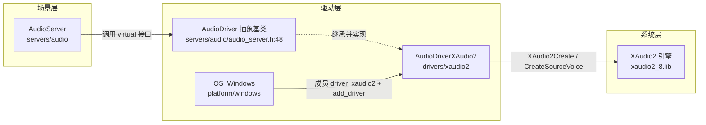
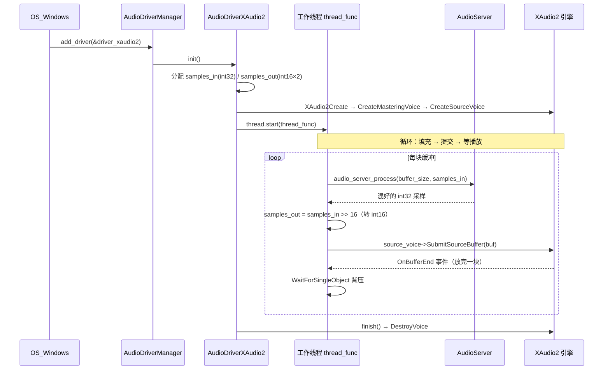

# xaudio2（drivers）

> 一句话：XAudio2 是 Windows 上把混音结果「送进音箱」的搬运工——引擎算好一帧 PCM 采样，它负责把采样塞给 XAudio2 声卡引擎、排队播放、等放完再喂下一块。

**结论**：`xaudio2` 模块实现了一个 `AudioDriver` 子类 `AudioDriverXAudio2`，把 Godot 的混音输出接到微软 XAudio2 音频引擎上；它为 `AudioServer` 服务，代价是只支持 2 声道、16-bit、固定立体声，且不采集输入（录音）。

## 是什么 / 不是什么

**是什么**：一个「输出驱动」——Godot 引擎侧已经混好的音频帧，通过它写进 Windows 的 XAudio2 播放队列。整个模块只有 3 个文件（`SCsub`、`audio_driver_xaudio2.h`、`audio_driver_xaudio2.cpp`，合计约 210 行核心代码），是 Godot 全部 22 个 `drivers` 子模块里最小的一类。

**不是什么**：

- 它**不负责混音**。混音在 `AudioServer`（`servers/audio/`）完成，驱动只是调用基类的 `audio_server_process`（`servers/audio/audio_server.cpp:72`）把一帧算好的 `int32_t` 采样拿回来。
- 它**不负责录音**。基类里 `input_start` / `input_stop` 默认返回 `FAILED`（`servers/audio/audio_server.h:111-112`），这个驱动没有覆盖它们。
- 它**不是唯一的 Windows 音频驱动**。Godot 在 Windows 上还有一个 WASAPI 驱动（`drivers/wasapi/`），两者按 `XAUDIO2_ENABLED` / `WASAPI_ENABLED` 宏分别编译、分别注册。

## 在引擎里的位置



依赖方向：`OS_Windows` 在 `platform/windows/os_windows.cpp:2909` 调用 `AudioDriverManager::add_driver(&driver_xaudio2)` 把驱动注册进管理器；真正用它的还是 `AudioServer`，通过 `AudioDriver` 的纯虚接口调用。`xaudio2` 自己不依赖任何场景节点，也不被任何模块直接 include（除 `platform/windows/`）。

## 关键概念

1. **混音回调**（`audio_server_process`）——驱动不自己算声音，它叫引擎「给我 `buffer_size` 帧采样」。入口在 `AudioDriver::audio_server_process`（`servers/audio/audio_server.cpp:72`），它会转发给 `AudioServer::_driver_process`。
2. **双缓冲（double buffering）**——`AUDIO_BUFFERS = 2`（`audio_driver_xaudio2.h:45`）。一块在播放、一块在填充，轮流提交，避免「边写边放」的杂音。这是音频驱动通用的流水线手法。
3. **源声（source voice）与主声（mastering voice）**——XAudio2 的术语。`CreateSourceVoice` 建的 `source_voice` 负责播放提交的缓冲（`audio_driver_xaudio2.cpp:74`），`CreateMasteringVoice` 建的 `mastering_voice` 负责把声音送进默认输出设备（`audio_driver_xaudio2.cpp:63`）。类比：源声是「麦克风前的歌手」，主声是「把歌手声音送进功放的调音台」。
4. **缓冲结束事件（`OnBufferEnd`）**——驱动自定义 `XAudio2DriverVoiceCallback : IXAudio2VoiceCallback`（`audio_driver_xaudio2.h:48`），在每块缓冲放完时 `SetEvent` 唤醒工作线程，用 `WaitForSingleObject` 实现「等播放追上再继续」的背压（`audio_driver_xaudio2.cpp:113-115`）。
5. **格式降级**——引擎内部采样是 `int32_t`（`samples_in`），提交给 XAudio2 前右移 16 位变成 `int16_t`（`samples_out`）（`audio_driver_xaudio2.cpp:101`），因为 XAudio2 只认 16-bit PCM。

## 核心文件（按阅读顺序）

1. `drivers/xaudio2/SCsub` — 编译脚本：定义 `XAUDIO2_ENABLED`、链接 `xaudio2_8.lib`、把 `*.cpp` 收进 `env.drivers_sources`。
2. `drivers/xaudio2/audio_driver_xaudio2.h` — 类声明：继承 `AudioDriver`，声明双缓冲、源声/主声、线程/互斥锁、回调结构。
3. `drivers/xaudio2/audio_driver_xaudio2.cpp` — 类实现：`init` / `thread_func` / `start` / `finish` / `get_latency` 全部逻辑。
4. `servers/audio/audio_server.h:48` — `AudioDriver` 抽象基类，定义驱动必须实现的纯虚接口（`init/start/get_mix_rate/get_speaker_mode/lock/unlock/finish`）。
5. `platform/windows/os_windows.cpp:2909` — 注册点：把 `driver_xaudio2` 加进 `AudioDriverManager`。

## 数据流 / 调用链



一次典型调用：`OS_Windows` 启动时注册驱动 → `init()` 建好 XAudio2 引擎、主声、源声并拉起工作线程 → 线程每轮先 `lock()` 再调 `audio_server_process` 取一帧采样，转成 16-bit 后 `SubmitSourceBuffer` 提交，然后循环 `GetState` 判断排队数，超过 1 块就 `WaitForSingleObject` 等缓冲放完（背压），形成「算一块、放一块、等一块」的稳定流水线。

## 中文口诀

```
音频驱动是搬运，混音不干只传帧。
双缓冲来分两半，一块播放一块填。
源声唱、主声送，回调喊你接着干。
int32 右移十六，PCM 十六才认账。
缓冲满了别硬塞，事件等到放完再补。
录音接口它不接，立体声双通道写死。
```

## 练习（15 分钟）

1. 打开 `audio_driver_xaudio2.cpp:49`，把 `buffer_size` 的计算式在纸上拆开：`latency * mix_rate / 1000` 再取 2 的幂，分别代入 `latency=100ms, mix_rate=44100` 算出结果。
2. 在 `thread_func`（`audio_driver_xaudio2.cpp:82`）里找三处关键动作——`audio_server_process`、`SubmitSourceBuffer`、`WaitForSingleObject`——用箭头连出它们的先后关系。
3. 对比 `audio_driver_xaudio2.h:92-105` 和 `servers/audio/audio_server.h:92-105`，圈出 XAudio2 驱动**没有**覆盖的虚接口（比如 `input_start`），说出为什么不覆盖也能编译通过。

## 自测

- [ ] `AudioDriverXAudio2` 的 `get_name()` 返回什么字符串？在哪个文件哪一行？
- [ ] 驱动为什么要用 `AUDIO_BUFFERS = 2` 的双缓冲，而不是 1 块大缓冲？
- [ ] `samples_in[i] >> 16` 这行（`audio_driver_xaudio2.cpp:101`）在做什么？为什么必须做？
- [ ] 当 XAudio2 队列里还有 2 块没放完时，工作线程会怎样阻塞自己？调用了哪个 API？

## 一句话总结

> `xaudio2` 是 Godot 在 Windows 上的最小音频输出驱动：它只把 `AudioServer` 混好的立体声采样降成 16-bit 后，用双缓冲 + 缓冲结束事件喂给 XAudio2 引擎播放，是「驱动契约」最瘦的实现样本。
