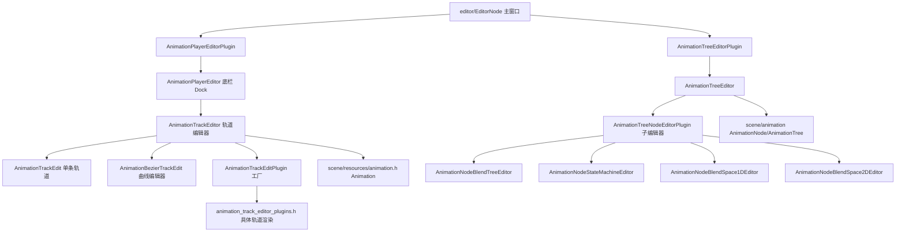
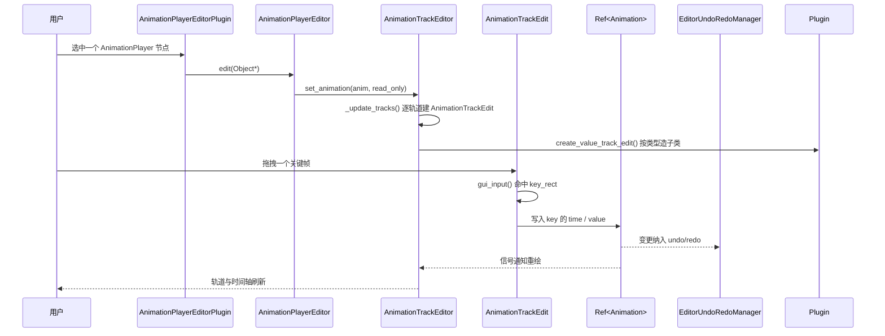

# animation（editor）

> 一句话：这是动画的「操作台」——动画数据是 `scene/resources/animation.h` 里的 `Animation`，本模块在编辑器里给它铺了一张可拖拽、可预览、可画曲线的桌面。

**结论**：`editor/animation` 是 Godot 编辑器的动画工作台，为 `AnimationPlayer` 和 `AnimationTree` 提供「轨道编辑 + 播放预览」的图形界面，让美术直接在时间轴、关键帧、曲线、状态机图上操作动画数据；代价是约 11 个 `.cpp`、10 个 `.h`（合计约 1.3 MB 源码），全部只随编辑器编译（`SCsub` 走 `env.editor_sources`）。

## 是什么 / 不是什么

它负责「怎么编辑」：把 `Animation` 里的每条轨道画成一排关键帧，把 `AnimationNode` 画成可连线的节点图，用户拖一下，数据就写回资源。它**不负责**「动画怎么算」——插值、混合、状态机求值都在 `scene/animation/`（`AnimationMixer`、`AnimationNode`）里；也不负责「资源怎么存」——序列化归 `scene/resources/animation.h`。前者是引擎核心，后者是资源层，本模块只是编辑器壳。

## 在引擎里的位置

依赖向下：本模块 `#include` 的都是 `scene/`（`AnimationPlayer`、`AnimationTree`、`GraphEdit`）和 `editor/`（`EditorDock`、`EditorPlugin`）。被依赖方向单一——只有编辑器把这两个 `EditorPlugin` 注册进 dock，运行时永远不加载它。

## 关键概念

- **轨道（track）**：动画的一行，绑定一个 `NodePath` + 一个属性。术语锚点 `Animation::TrackType`（`scene/resources/animation.h:48`），编辑器侧对应 `AnimationTrackEdit`（`animation_track_editor.h:423`）。
- **关键帧（key）**：轨道上某个时间点的取值。拖一个 `AnimationTrackEdit` 上的小方块，就是把 key 的 `time`/`value` 写回 `Ref<Animation>`。
- **轨道工厂**：同一条轨道有布尔、颜色、音频、音量分贝、子动画等多种画法，靠 `AnimationTrackEditPlugin`（`animation_track_editor.h:561`）按类型造出对应子类；默认实现 `AnimationTrackEditDefaultPlugin`（`animation_track_editor_plugins.h:156`）返回 `AnimationTrackEditBool`、`AnimationTrackEditAudio` 等 8 个变体。
- **曲线编辑器**：把 `TYPE_BEZIER` 轨道的 key 展开成可拉控制柄的曲线，对应 `AnimationBezierTrackEdit`（`animation_bezier_editor.h:40`）。
- **节点子编辑器**：`AnimationTree` 是一棵 `AnimationNode` 树，`AnimationTreeEditor`（`animation_tree_editor_plugin.h:55`）自己不画图，而是按节点类型分发给实现 `AnimationTreeNodeEditorPlugin`（`animation_tree_editor_plugin.h:44`）的四个子编辑器：混合树、状态机、一维/二维混合空间。

## 核心文件（按阅读顺序）

1. `SCsub` — 只有一行 `env.add_source_files(env.editor_sources, "*.cpp")`，说明本模块不注册运行时类、无 `register_types`。
2. `animation_player_editor_plugin.h` — `AnimationPlayerEditor`（底栏 dock，含播放键、洋葱皮、`AnimationTrackEditor` 实例）与它的 `EditorPlugin` 包装。
3. `animation_track_editor.h` — 主干：`AnimationTrackEditor`、`AnimationTimelineEdit`（时间轴标尺）、`AnimationMarkerEdit`（标记）、`AnimationTrackEdit`（单条轨道基类）、若干 key 编辑代理对象。
4. `animation_track_editor_plugins.h` — `AnimationTrackEdit` 的 8 个具体子类 + 默认工厂，负责「不同数据类型画不同样子」。
5. `animation_bezier_editor.h` — `AnimationBezierTrackEdit`，贝塞尔曲线轨道的专用画布。
6. `animation_library_editor.h` — `AnimationLibraryEditor`，管理 `AnimationLibrary` 的增删、加载、另存。
7. `animation_tree_editor_plugin.h` — `AnimationTreeEditor` 与 `AnimationTreeNodeEditorPlugin` 抽象基类。
8. `animation_blend_tree_editor_plugin.h` / `animation_state_machine_editor.h` / `animation_blend_space_1d_editor.h` / `animation_blend_space_2d_editor.h` — 四个 `AnimationNode` 子编辑器。

## 数据流 / 调用链

一次「编辑一条 value 轨道」的典型路径：

关键跳板：`AnimationPlayerEditor::edit()`（`animation_player_editor_plugin.h:276`）拿到 `AnimationMixer` 后交给 `AnimationTrackEditor::set_animation()`（`animation_track_editor.h:960`），后者在 `_update_tracks()`（`animation_track_editor.h:669`）里调用工厂 `AnimationTrackEditPlugin::create_value_track_edit()`（`animation_track_editor.h:565`）生成每条轨道的编辑控件。

## 中文口诀

- 资源存数据，编辑画桌面；`scene` 管运算，`editor` 管操作。
- 一个 Dock 挂播放，洋葱皮里看前后帧。
- 轨道一行一个 `TrackEdit`，类型不同工厂造。
- 时间轴是标尺，标记是书签，曲线编辑器专治贝塞尔。
- `AnimationTree` 不自己画图，四个子编辑器各管一摊。
- 拖关键帧改数据，undo/redo 兜底，信号刷画面。

## 练习（15 分钟）

1. 打开 `animation_track_editor_plugins.h`，数出 `AnimationTrackEdit` 一共几个子类，各对应 `Animation::TrackType` 里的哪一种（布尔/颜色/音频/音量/子动画……）。
2. 在 `animation_track_editor.h` 找到 `_update_tracks()`（约 669 行），顺藤摸瓜看它怎么调用 `AnimationTrackEditPlugin::create_value_track_edit()`。
3. 在 `animation_tree_editor_plugin.h` 里读 `AnimationTreeNodeEditorPlugin` 的两个纯虚接口，再去 `animation_blend_space_2d_editor.h` 看它如何 override `can_edit` / `edit`。

## 自测

- [ ] `AnimationPlayerEditor` 是哪个基类（`EditorDock` 还是 `EditorPlugin`）？它持有的轨道编辑器成员叫什么类型？
- [ ] 一条「音量（分贝）」轨道和一条「布尔」轨道，在编辑器里画出来的差异由哪个类的哪个方法决定？
- [ ] 修改关键帧后，为什么能撤销？回滚信息最终落到哪个管理器？
- [ ] `AnimationTreeEditor` 如何决定一个 `AnimationNode` 该交给哪个子编辑器？

## 一句话总结

> 本模块是动画系统的编辑器前端：把 `Animation` 的轨道/关键帧和 `AnimationNode` 的节点图变成可拖拽、可预览、可回滚的图形界面，自己只负责「怎么编辑」，把「怎么算」留给 `scene/animation`。
