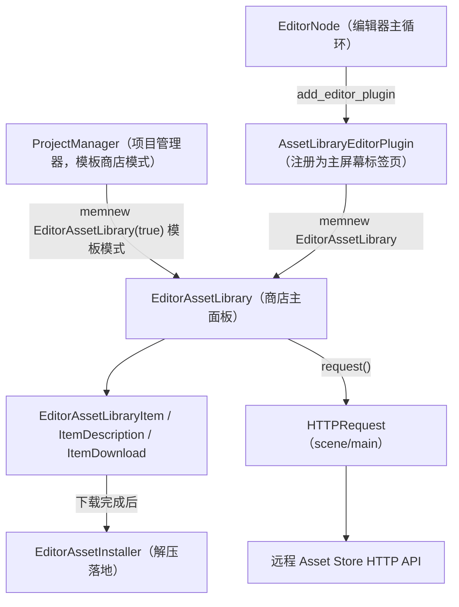
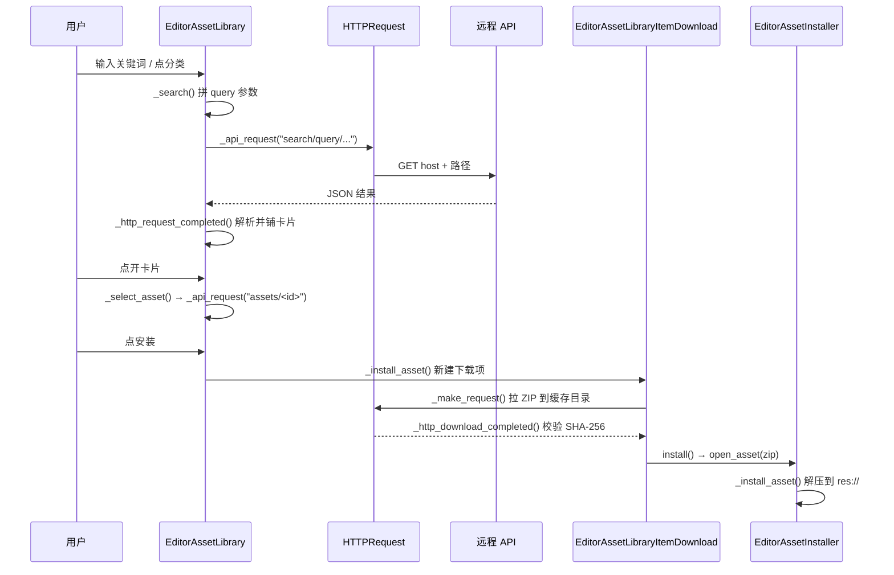

# asset_library（editor）

> 一句话：编辑器里的「应用商店」——把官方 Asset Store 网站上的插件、素材包，拉进编辑器里浏览、下载、解压、装进 `res://`。

**结论**：这个模块是 Godot 编辑器的「资产商店」前端，为使用者（在编辑器里点开 Asset Store 标签页的人）服务，代价是它只管「把网页上的东西搬进项目」，不负责商店服务器本身、也不负责资产装完后的运行——只做 HTTP 拉取、界面展示、ZIP 解压落地三件事。

## 是什么 / 不是什么

它负责三件事：**浏览**（搜索、分类、分页、看截图和详情）、**下载**（`HTTPRequest` 拉 ZIP、校验 SHA-256）、**安装**（解压到项目目录，冲突时让用户勾选）。入口是 `AssetLibraryEditorPlugin`（`editor/asset_library/asset_library_editor_plugin.h:407`），它注册成一个编辑器主屏幕标签页。

它不是商店后端：资产数据来自远程 HTTP API（`host` + 请求路径，见 `_api_request`，`asset_library_editor_plugin.cpp:1629`），服务器不在这个模块里。它也不负责资产被装进项目之后的事情——比如插件需要用户再去「启用插件」管理，那属于别的编辑器子系统。

## 在引擎里的位置

依赖关系一句话：它站在 `editor/plugins/editor_plugin.h`（插件框架）和 `scene/main/http_request.h`（HTTP 客户端）之上，被 `editor/editor_node.cpp:9405` 和 `editor/project_manager/project_manager.cpp:1739` 两处实例化——编辑器里是完整版，项目管理器里是只装项目模板的 `templates_only` 版。

## 关键概念

- **商店条目卡片**：每个资产在网格里是一张卡（图标 + 标题 + 作者 + 许可 + 评分），由 `EditorAssetLibraryItem`（`asset_library_editor_plugin.h:57`）画出来。
- **资产详情弹窗**：点开卡片弹出的详情窗，含简介、版本列表、预览图，`EditorAssetLibraryItemDescription`（`asset_library_editor_plugin.h:114`），它有个 `InstallMode` 三态：下载 → 下载中 → 安装。
- **下载任务**：一个资产一次下载就是一个 `EditorAssetLibraryItemDownload`（`asset_library_editor_plugin.h:204`），带进度条、重试按钮、SHA-256 校验。
- **解压安装器**：下载完的 ZIP 交给 `EditorAssetInstaller`（`editor_asset_installer.h:41`），用两个 `Tree` 左右对照「源文件 / 目标文件」，冲突文件标红让用户勾选。
- **图片队列**：缩略图和截图是异步加载的，`EditorAssetLibrary` 内部用 `ImageQueue` 结构 + 线程池排队解码（`asset_library_editor_plugin.cpp:1224`）。

## 核心文件（按阅读顺序）

1. `editor/asset_library/asset_library_editor_plugin.h` — 所有商店 UI 类的声明：卡片、详情、下载项、主面板、插件。
2. `editor/asset_library/editor_asset_installer.h` — 解压安装器的声明：源/目标两棵树、冲突检测、顶层目录处理。
3. `editor/asset_library/asset_library_editor_plugin.cpp` — 主实现（约 2345 行）：API 请求、搜索、图片队列、下载校验。
4. `editor/asset_library/editor_asset_installer.cpp` — 解压落地实现（约 779 行）：unzip 逐个文件写到 `res://`。
5. `editor/asset_library/SCsub` — 一句话编译脚本：把目录下 `*.cpp` 加进 `editor_sources`。

## 数据流 / 调用链

一次「搜索 → 点开 → 下载 → 安装」的完整链路：

要点：搜索和详情是**串行**请求（复用同一个 `HTTPRequest`，`_api_request` 里 `p_is_parallel=false` 会先 `cancel_request`）；图片是**并行**请求（每次 `memnew(HTTPRequest)` 用完即 `queue_free`）。下载落盘用 `FileAccess::get_sha256` 比对，防止文件被篡改（`asset_library_editor_plugin.cpp:795`）。

## 中文口诀

- 商店卡片铺成格，点开详情看版本。
- 搜索串行图并行，串行先撤旧的。
- 下载拉到缓存里，SHA-256 防篡改。
- 左右两树对冲突，勾选落地 `res://`。
- 模板商店是变体，一个开关 `templates_only`。

## 练习（15 分钟）

1. 打开 `asset_library_editor_plugin.cpp:1629` 的 `_api_request`，回答：`p_is_parallel` 为真和假时，`requester` 分别是谁、用完怎么释放。
2. 打开 `asset_library_editor_plugin.cpp:1487` 的 `_search`，数一数 query 里一共拼了几个参数（query / category / type / sort / compatibility / licenses / page）。
3. 打开 `editor_asset_installer.cpp:507` 的 `_install_asset`，找出「用户没勾选的文件」是用哪一行跳过的（提示：`_is_item_checked`）。

## 自测

- [ ] `EditorAssetLibrary::_search` 里 `require_release=true` 这个参数的作用是什么？在请求结果里它筛掉了什么？
- [ ] 为什么详情请求和图片请求要区分「串行 / 并行」？串行请求复用同一个 `HTTPRequest` 节点，代码里怎么避免上一个请求还没返回就发下一个？
- [ ] 项目管理器里的商店和编辑器里的商店，是靠哪个构造参数区分的？这个参数在 `_search` 和下载完成后各改变了什么行为？

## 一句话总结

> 资产库是「编辑器里的搬运工」：把远程商店的 JSON 变成卡片，把 ZIP 变成项目里的文件，中间用 SHA-256 和冲突勾选兜住安全与覆盖风险。
