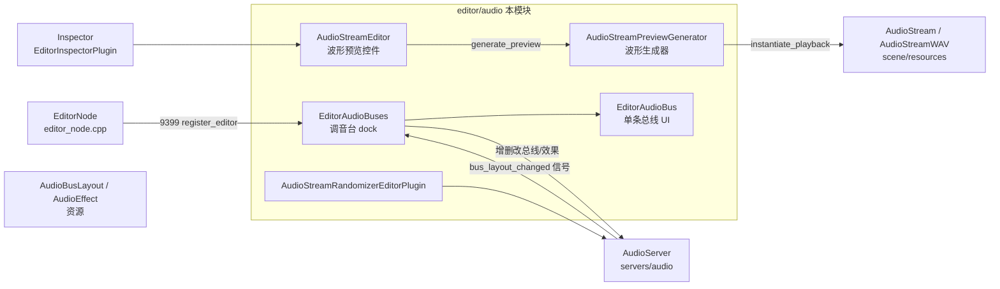
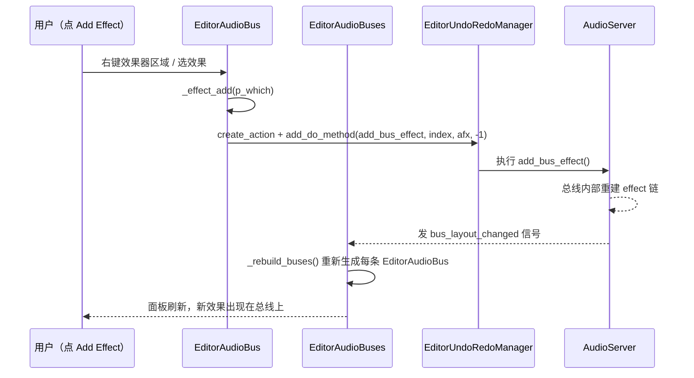

# audio（editor）

> 一句话：编辑器里那台「调音台」——用来搭音频总线、往总线上挂效果器，再给每种音频资源画一张波形缩略图。

**结论**：`editor/audio` 是 Godot **编辑器专用的音频前端**，它把运行时音频服务器 `AudioServer` 里那条「总线 + 效果器链」的拓扑，渲染成底部面板上可拖拽、可混音、可加效果的调音台 UI；同时它用后台线程把任意 `AudioStream` 离屏渲染成波形预览。代价是它只在 `TOOLS_ENABLED`（编辑器构建）里编译，游戏运行时根本不存在，一切改动最终都落到 `AudioServer`，UI 本身不产生声音。

## 是什么 / 不是什么

**是什么**：一个「画在屏幕上的混音台」。它的核心任务只有两件——① 把 `AudioServer` 的总线（bus）结构变成可交互的 UI（`EditorAudioBus` 一条总线一格）；② 把音频流的波形「算」出来给 Inspector 看（`AudioStreamPreviewGenerator`）。

**不是什么**：它不负责发声、混音、解码、驱动声卡——那些都是 `servers/audio/` 里 `AudioServer` 的活；它也不定义总线/效果器的数据结构（那在 `AudioBusLayout` 和 `AudioEffect` 资源里）。它只是一个**控制器 + 视图**：用户点按钮 → 它发 UndoRedo 命令给 `AudioServer` → `AudioServer` 通知它重画。

一句话：**编辑数据的人，而不是生产数据的人**。

## 在引擎里的位置

读图：本模块夹在「编辑框架」（`EditorNode`、Inspector 插件系统）和「音频运行时」（`AudioServer`）之间。所有总线编辑最终都汇入 `AudioServer`，而 `AudioStreamPreviewGenerator` 则单独对接音频资源，给 Inspector 供波形数据。

## 关键概念

1. **总线（bus）= 一条「音轨」**：一条总线就是一列纵向滑块 + VU 表 + 效果器列表，对应 `AudioServer` 里 `get_bus_count()` 返回的下标。UI 侧一个 `EditorAudioBus`（`editor_audio_buses.h:55`）恰好渲染一个下标。

2. **效果器链 = 总线上依次套的「滤镜」**：往总线上加效果，本质是 `AudioServer::add_bus_effect(bus, effect, -1)`（`editor_audio_buses.cpp:666`）。UI 只负责把它变成一个可拖拽排序、可勾选启停的 `Tree` 列表。

3. **总线布局（Bus Layout）= 可存档的「调音台快照」**：把整个总线拓扑 + 效果器序列化成一个 `AudioBusLayout` 资源，靠 `AudioServer::generate_bus_layout()` / `set_bus_layout()`（`editor_audio_buses.cpp:1431`、`:1636`）保存和恢复。

4. **波形预览 = 离线「渲染」音频**：`AudioStreamPreviewGenerator` 起一条后台线程（`audio_stream_preview.cpp:114`），用 `AudioStreamPlayback::mix()` 把整条流跑一遍，逐段记录 min/max 幅度，压缩成 2 字节/像素的波形数组——不经过声卡，纯 CPU 离屏计算。

## 核心文件（按阅读顺序）

1. `editor/audio/editor_audio_buses.h` — 定义调音台 dock 本体 `EditorAudioBuses`、单总线 `EditorAudioBus`、拖放占位 `EditorAudioBusDrop`、刻度尺 `EditorAudioMeterNotches`、插件 `AudioBusesEditorPlugin`。
2. `editor/audio/editor_audio_buses.cpp` — 全部总线增删改查、效果器挂载、布局存取、UndoRedo 命令构造，约 1729 行的主实现。
3. `editor/audio/audio_stream_preview.h` — 定义波形数据 `AudioStreamPreview` 与后台生成器 `AudioStreamPreviewGenerator`。
4. `editor/audio/audio_stream_preview.cpp` — 波形生成线程 + 缓存逻辑。
5. `editor/audio/audio_stream_editor_plugin.h` — 定义 Inspector 里的波形控件 `AudioStreamEditor` 与 `EditorInspectorPluginAudioStream`。
6. `editor/audio/audio_stream_editor_plugin.cpp` — 波形绘制（`_draw_preview`）、播放/拖拽定位、Inspector 注册。
7. `editor/audio/audio_stream_randomizer_editor_plugin.h` / `.cpp` — 给 `AudioStreamRandomizer` 资源提供数组元素拖拽排序支持。
8. `editor/audio/SCsub` — 把本目录 `*.cpp` 编进 `env.editor_sources`（仅编辑器构建）。

## 数据流 / 调用链

以「给某条总线加一个效果器」为例，画一次完整往返：

关键点：UI 从不直接改数据，而是**包成 UndoRedo 命令**（`editor_audio_buses.cpp:666`），由 `AudioServer` 执行后广播 `bus_layout_changed`（`editor_audio_buses.cpp:1611`）再回流到 UI。这样「撤销 / 重做」天然免费获得。

## 中文口诀

> 一条总线一格调，音量滑块 VU 表；
> 效果挂上 Tree 列表，勾选启停拖得动；
> 布局存成快照件，进出全靠 AudioServer；
> 波形不用声卡放，后台线程算 min-max。

## 练习（15 分钟）

1. 在 `editor_audio_buses.cpp` 里找 `_add_bus()`，数一下它总共构造了几条 `add_do_method` / `add_undo_method` 命令，理解为什么删一条总线要连名字、音量、send、solo、mute、效果器一起备份。
2. 找到 `EditorAudioBus::_volume_changed` 与 `_normalized_volume_to_scaled_db`，解释为什么滑块的归一化值要先「缩放」再转 dB。
3. 读 `audio_stream_preview.cpp` 的 `_preview_thread`，算出「预览宽度 = 采样率 × 时长 / 20」这个公式里 `20` 的含义（每个像素代表多少帧）。

## 自测

- [ ] `EditorAudioBuses` 继承自哪个类？它在 `editor_node.cpp` 哪一行被 `register_editor()` 注册成 dock？
- [ ] 加效果器的 UndoRedo 里，`add_do_method` 与 `add_undo_method` 分别对应 `AudioServer` 的哪两个方法？
- [ ] `AudioStreamPreviewGenerator::generate_preview` 如何避免对同一个流重复生成波形（缓存 key 是什么）？

## 一句话总结

> `editor/audio` 是 `AudioServer` 的「编辑器遥控器」加一个「音频波形离线渲染器」：把总线/效果器拓扑画成可拖可混的调音台，把音频流算成波形预览，而真正的发声与混音永远留在 `servers/audio`。
