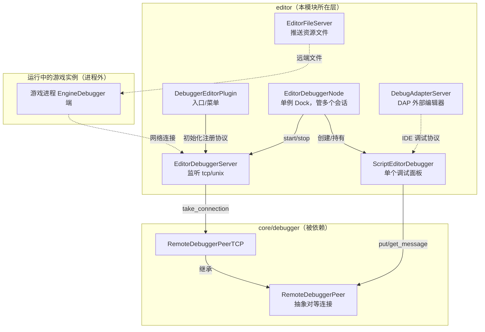
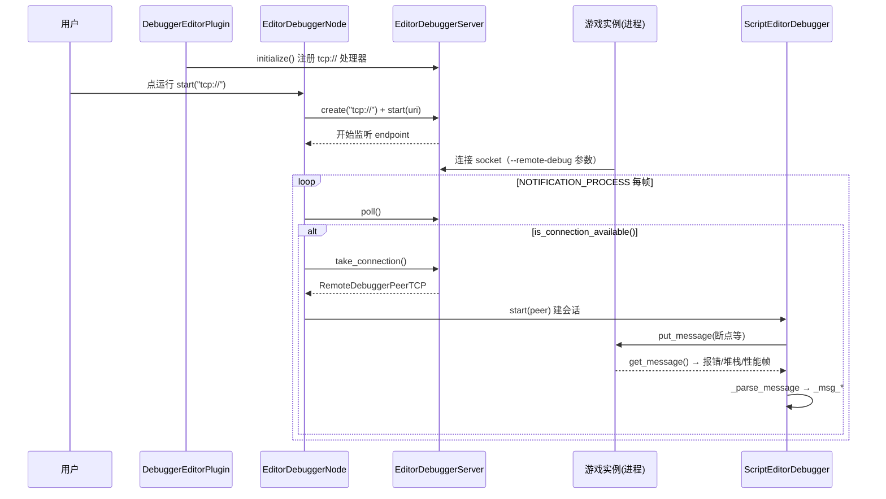

# debugger（editor）

> 一句话：编辑器里的「遥控器 + 心电图仪」——点下运行后，它作为服务端等在后台，游戏进程主动连回来，把堆栈、变量、报错、性能指标一帧一帧送回来，你在面板上实时看、改、停。

**结论**：`editor/debugger` 是**编辑器的调试面板后端**，为「正在运行的游戏实例」提供一面遥控监视窗（断点、堆栈、远端场景树、对象检查器、Profiler、Live 编辑、文件服务、DAP 外部调试器接入），代价是这一整套 UI 只存在于 `editor` 目标构建里，纯运行时（`template_release`）不含它。

## 是什么 / 不是什么

这个模块是**连接与展示层**：它负责「编辑器进程」这一侧的监听、会话管理、消息解析和界面渲染。

- 它**是**：编辑器侧的调试服务器（`EditorDebuggerServer`）、会话容器（`EditorDebuggerNode`）、单个调试面板（`ScriptEditorDebugger`）、各种分析视图（Profiler / 远端树 / 检查器）。
- 它**不是**：游戏进程里被调试的那一端。真正插桩、采集数据的是 `core/debugger`（`EngineDebugger` + `RemoteDebuggerPeer`），编辑器这里只消费对面送来的消息。
- 它**也不是**：脚本语言的断点执行逻辑。GDScript 怎么停、怎么单步，是 `modules/gdscript` 里的事，这里只把「步进/继续」这类指令打包成消息发过去。

一句话：**编辑器这半身负责「看和指挥」，运行实例那半身负责「跑和上报」**，中间的线就是 `RemoteDebuggerPeer`。

## 在引擎里的位置



依赖方向很清晰：这个模块**向下依赖** `core/debugger` 的 `RemoteDebuggerPeer` 抽象，**向上**被 `editor/` 的 Dock 系统、运行栏（`EditorRunBar`）、场景树 Dock（`SceneTreeDock`）调用；**对外**它通过 socket 与另一个进程（运行实例）通信。

## 关键概念

1. **遥控会话 = 一个 Tab**：`ScriptEditorDebugger`（`script_editor_debugger.h:59`）继承 `MarginContainer`，是「一次运行」的全部 UI——报错列表、调用栈、断点树、远端检查器、Profiler 都挂它身上。多开几个游戏实例，`EditorDebuggerNode` 就给每个开一个 Tab（`editor_debugger_node.cpp:114` `_add_debugger`）。

2. **总控台**：`EditorDebuggerNode`（`editor_debugger_node.h:47`）继承 `EditorDock`，是单例，持有 `TabContainer` 里所有 `ScriptEditorDebugger`，也是「谁在监听、谁连进来了」的调度点。

3. **门房**：`EditorDebuggerServer`（`editor_debugger_server.h:36`）是抽象监听服务器，`initialize()` 里注册两个协议处理函数——`tcp://` 和 `unix://`（`editor_debugger_server.cpp:177-182`），真正把 socket 包成 `RemoteDebuggerPeerTCP` 的是 `take_connection()`（`editor_debugger_server.cpp:131-137`）。

4. **翻译官**：`RemoteDebuggerPeer`（`core/debugger/remote_debugger_peer.h:40`）是抽象对等连接，`put_message`/`get_message` 收发 `Array` 消息。编辑器这半身只认它，不关心底层是 TCP 还是 Unix socket。

5. **外接 IDE 的桥**：`DebugAdapterProtocol`（`debug_adapter/debug_adapter_protocol.h:72`）把 Godot 内部消息翻译成 Debug Adapter Protocol，`DebugAdapterServer`（`debug_adapter/debug_adapter_server.h:36`）默认监听端口 `6006`，让 VS Code 等外部编辑器能步进调试。

## 核心文件（按阅读顺序）

1. `debugger_editor_plugin.h` — 模块入口，`EditorPlugin`，构造时初始化调试服务器、挂「调试」菜单（`get_plugin_name()` 返回 `"Debugger"`）。
2. `editor_debugger_node.h` — 单例 Dock，多会话调度、监听启动/停止、断点分发、远端树/检查器请求的出口。
3. `editor_debugger_server.h` — 监听服务器抽象 + 协议注册表，TCP/UDS 两个实现都在 `editor_debugger_server.cpp`。
4. `script_editor_debugger.h` — 单个会话面板，最大的一坨：`_parse_message` 和几十个 `_msg_*` 处理器，是消息入口。
5. `editor_debugger_plugin.h` — `EditorDebuggerSession` / `EditorDebuggerPlugin`，给第三方插件往面板里加自定义 Tab、拦截消息。
6. `editor_debugger_tree.h` — 远端场景树控件，`update_scene_tree` 吃 `SceneDebuggerTree` 数据。
7. `editor_debugger_inspector.h` — `EditorDebuggerInspector` + `EditorDebuggerRemoteObjects`，把远端对象当成本地对象编辑。
8. `editor_expression_evaluator.h` — 断点停住后输入表达式求值的小工具。
9. `editor_profiler.h` / `editor_visual_profiler.h` / `editor_performance_profiler.h` — 三个 Profiler：CPU 函数耗时 / 渲染可视化 / 引擎性能监视器。
10. `editor_file_server.h` — 把编辑器里的资源文件推送给远端实例。
11. `debug_adapter/` — DAP 协议实现，独立子目录、独立 `SCsub`，对外部编辑器开放。

## 数据流 / 调用链

一次「运行游戏 → 面板连上 → 收到报错」的主线：



关键点：编辑器**主动监听、被动接客**（`editor_debugger_node.cpp:403` `is_connection_available()` 分支），拿到 `RemoteDebuggerPeerTCP` 后塞给某个 `ScriptEditorDebugger` 的 `start(peer)`（`editor_debugger_node.cpp:431`）；此后每帧 `poll` 收包，`ScriptEditorDebugger::_parse_message`（`script_editor_debugger.h:247`）按消息名分发到 `_msg_stack_dump`、`_msg_output`、`_msg_error` 等处理器（`script_editor_debugger.h:211-245`）。

## 中文口诀

```
运行按钮点下去，门房先把端口开；
游戏实例连回来，取个 peer 当接线；
一个会话一个 Tab，多开会话能到四；
断点堆栈加报错，远端树里点对象；
Profiler 三兄弟，CPU 渲染和监视；
外部 IDE 想调试，六千零六开 DAP。
```

## 练习（15 分钟）

1. 在 `editor_debugger_server.cpp:177` 的 `initialize()` 里打断点，启动编辑器，观察 `tcp://` 和（Unix 下）`unix://` 两个协议何时被注册。
2. 在 `editor_debugger_node.cpp:403` 的 `is_connection_available()` 分支打断点，点「运行项目」，单步看 `take_connection()` 返回的 `RemoteDebuggerPeerTCP` 是怎么流进 `debugger->start()` 的。
3. 运行游戏后，在 `script_editor_debugger.cpp` 的 `_parse_message` 打断点，观察第一条消息是什么、走哪个 `_msg_*` 分支。

## 自测

- [ ] `EditorDebuggerServer::initialize()` 注册了哪两个协议？各自的实现类叫什么？
- [ ] 编辑器最多同时保持几个调试会话（Tab）？超过后新连接会怎样？（提示：`editor_debugger_node.cpp:412`）
- [ ] `EditorDebuggerNode` 里「谁连进来就塞给谁」的调度循环写在哪个函数、哪个 `case` 分支？
- [ ] 为什么说 `RemoteDebuggerPeer` 是「翻译官」——它把 `Array` 消息翻译成什么？游戏进程那端是谁在采集数据？
- [ ] `DebugAdapterServer` 默认监听哪个端口？它和 `ScriptEditorDebugger` 是什么关系？

## 一句话总结

> `editor/debugger` 是编辑器的「遥控监视窗」——运行实例回连过来后，把它的心跳变成面板上的断点、堆栈、场景树和性能曲线，代价是整套代码只活在编辑器构建里。
