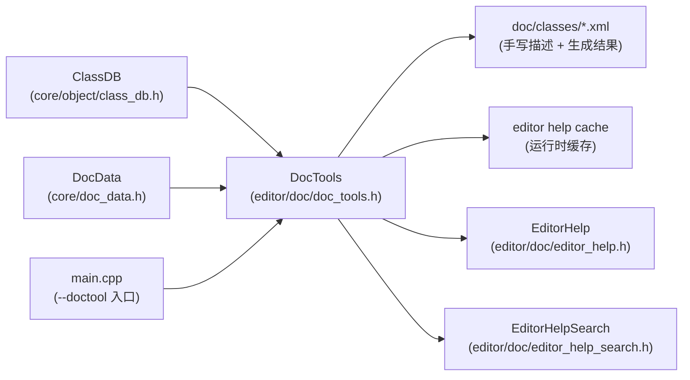
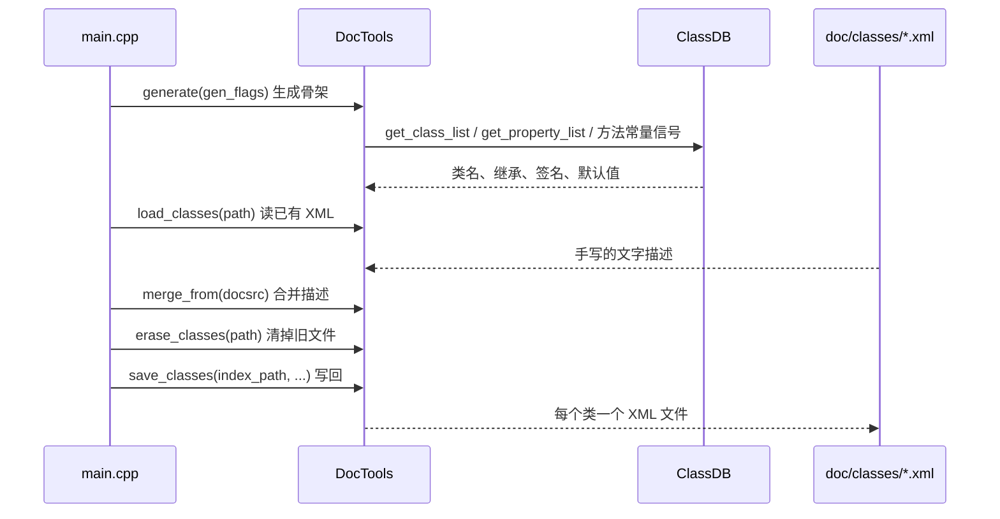

# doc（editor）

> 一句话：这是 Godot 的「说明书生产车间 + 内置说明书阅读器」——把 ClassDB 里反射出来的类信息，和 `doc/classes/` 里手写的文字描述拼成一份类参考（`DocData`），既能导出成 XML 喂给在线文档，也能在编辑器里直接显示。

**结论**：`editor/doc` 负责生成、合并、加载和渲染 Godot 的类参考文档，为两类读者服务——构建期的 `--doctool` 工具链（输出 `doc/classes/*.xml`）和编辑器里的「类参考 / 搜索帮助」面板；代价是生成过程要遍历 ClassDB 全部类、还要实例化部分对象，很慢，所以运行时靠「缓存 + 后台线程 + 编译期嵌入的压缩数据」来省时间。

## 是什么 / 不是什么

它负责三件事：把反射信息变成结构化数据（`DocTools::generate`，`editor/doc/doc_tools.cpp:422`）、把这个数据和手写 XML 合并再写回文件（`merge_from` / `save_classes`）、在编辑器里把这个数据画成可读页面（`EditorHelp`）并支持搜索（`EditorHelpSearch`）。

它不负责的：把 XML 转成网页这件事（那是 `doc/` 目录下的转换工具如 `make_rst.py` 干的，不在本模块）；类描述的具体文字内容（那是写在 `doc/classes/*.xml` 里的「内容」，不是代码逻辑）。另外 `DocData` 数据结构本身定义在 `core/doc_data.h`（`core/doc_data.h:35`），不在 `editor/doc` 目录下，但它是本模块和外部共享的数据契约。

## 在引擎里的位置



`DocTools` 是枢纽：向下吃 `ClassDB` 反射和 `DocData` 模型，向上吐出 XML 文件与缓存，再喂给两个编辑器前端 `EditorHelp` / `EditorHelpSearch`。

## 关键概念

- **`DocData::ClassDoc`**：一个类的「文档骨架」——名字、继承、方法、属性、常量、主题项等字段的容器，是内存里唯一的数据格式（`core/doc_data.h:698`）。
- **`DocTools`**：文档的「编译器」。`generate()` 从 ClassDB 反射出骨架（签名、默认值），再靠 `merge_from()` 把手写 XML 里的文字描述补进来（`editor/doc/doc_tools.h:38`）。
- **合并（`merge_from`）**：反射管「长什么样」，XML 管「怎么说」，二者合体才是一份完整文档（`editor/doc/doc_tools.cpp:306`）。
- **压缩嵌入数据 `_doc_data_compressed`**：构建期把整个 `doc/classes/` 压成字节数组编进二进制，运行时一次 `load_compressed` 读完，省去解析几百个小文件（`editor/editor_builders.py:55`、`editor/doc/editor_help.cpp:3052`）。
- **`EditorHelp` / `EditorHelpSearch`**：编辑器里把 `DocData` 画出来的两个前端——前者是类参考面板，后者是「搜索帮助」对话框（`editor/doc/editor_help.h:85`、`editor/doc/editor_help_search.h:42`）。

## 核心文件（按阅读顺序）

1. `core/doc_data.h` — `DocData` 数据模型：`ClassDoc`/`MethodDoc`/`PropertyDoc`/`ConstantDoc`/`ThemeItemDoc` 等结构，先读它才知道「文档长什么样」。
2. `editor/doc/doc_tools.h` / `doc_tools.cpp` — `DocTools`：`generate()` 反射生成 + `load_classes`/`save_classes`/`merge_from` 读写 XML。
3. `editor/doc/editor_help.h` / `editor_help.cpp` — `EditorHelp` 帮助面板：渲染成 RichTextLabel，管缓存与后台线程，还含 `FindBar`/`EditorHelpBit`/`EditorHelpBitTooltip`/`EditorHelpHighlighter`。
4. `editor/doc/editor_help_search.h` / `editor_help_search.cpp` — `EditorHelpSearch` 搜索对话框 + 内部 `Runner`（RefCounted，分阶段增量搜索）。
5. `editor/doc/SCsub` — 把目录下 `*.cpp` 加进 `env.editor_sources`。
6. `main/main.cpp:4123-4280` — `--doctool` 命令行入口，编排整个生成流程。
7. `editor/editor_builders.py` — 构建期 `make_doc_header` 把 `doc/classes/` 压成 `_doc_data_compressed` 生成 `doc_data_compressed.gen.h`。

## 数据流 / 调用链

下面是一次 `--doctool` 的完整调用链（入口 `main/main.cpp:4123`，核心逻辑 `main/main.cpp:4216-4280`）：



运行时（编辑器）走另一条路：`EditorHelp::generate_doc`（`editor/doc/editor_help.cpp:3254`）先 `doc->generate()` 反射出新骨架，再在后台线程 `_gen_doc_thread` 里 `load_compressed(_doc_data_compressed, …)` 读编译期嵌入的合并结果，`merge_from` 补上描述，最后存缓存；下次启动直接读缓存。

## 中文口诀

```
反射拉签名，XML 存描述；
merge 合一处，save 落 classes。
构建再压缩，编进二进制；
编辑器加载，后台线程刷；
缓存来加速，Bit 出提示。
```

## 练习（15 分钟）

1. 编译 editor target，在仓库根目录运行 `bin/godot.windows.editor.x86_64.console.exe --doctool`，看 `doc/classes/` 下 XML 时间戳是否刷新。
2. 打开 `doc/classes/Node.xml`，对照 `DocData::ClassDoc` 的字段（`core/doc_data.h:698`）逐项找对应 XML 标签。
3. 在编辑器按 `Ctrl+F1` 打开「搜索帮助」，输入 `Node2D`，看结果按类/方法/属性/信号分类；再点进右侧类参考面板。
4. 在 `doc_tools.cpp:422` 的 `generate()` 里加一行 `print_line`，重新编译后观察 `Sprite2D` 的属性、方法是如何从 `ClassDB` 被收集的。

## 自测

- [ ] `--doctool` 生成的 XML 里，「文字描述」来自哪里、「签名和默认值」来自哪里？分别在 `main/main.cpp` 和 `editor/doc/doc_tools.cpp` 找一行证据。
- [ ] 编辑器首次打开类参考、且缓存不存在时，走的是哪个函数、哪个后台线程？缓存文件路径由哪个函数给出？

## 一句话总结

> `editor/doc` 用 `DocTools` 把 ClassDB 反射和手写 XML 合并成统一的 `DocData`，一条 `--doctool` 主线导出类参考 XML，编辑器侧再用 `EditorHelp`/`EditorHelpSearch` 把这份数据读出来给人看。
