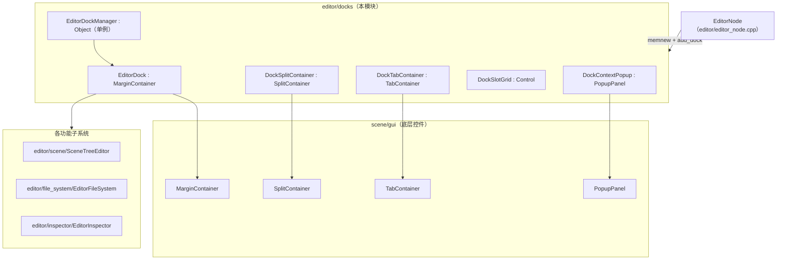
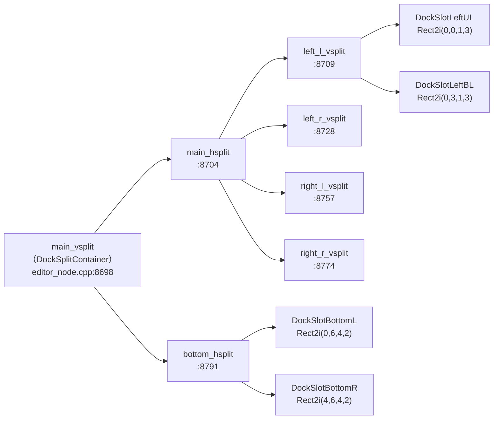
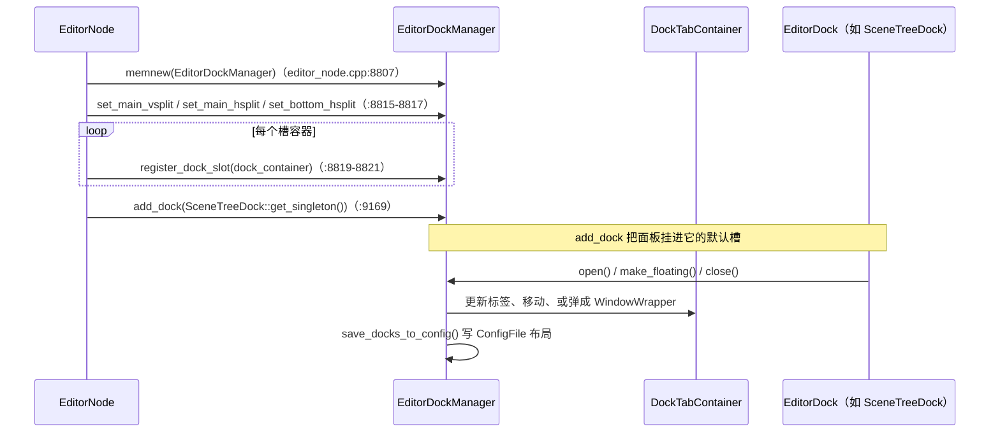

# docks（editor）

> 一句话：docks 是编辑器主窗口的「可拖动、可停靠、可折叠」的积木盒子系统——每个面板是一块积木，`EditorDockManager` 是那个决定积木该卡在哪个槽里、还是飘出窗口的调度员。

**结论**：`editor/docks` 实现 Godot 编辑器的**停靠面板布局系统**——把场景树、文件系统、检查器、导入器、历史、分组、信号这 7 个功能面板，统一抽象成可拖动、可换槽、可浮动成独立窗口的 `EditorDock`，由单例 `EditorDockManager` 负责它们的注册、布局、保存与恢复；代价是它只做「骨架和调度」，面板内部的具体功能（画场景树、列文件、显示属性）全部委托给别的模块。

## 是什么 / 不是什么

`docks` 负责的是「面板的**容器与摆放**」，不负责「面板里的**业务内容**」。

它**负责**：

- 把每个功能面板包成一个统一的 `EditorDock`（`editor/docks/editor_dock.h:40`），提供打开/关闭/浮动/聚焦等统一入口。
- 用 `EditorDockManager`（`editor/docks/editor_dock_manager.h:81`）记录「哪个面板在哪个槽、是否浮动、是否可见」，并把这些状态写进/读出自 `ConfigFile` 布局。
- 提供 8×8 网格里的固定停靠槽（`DockSlotGrid::GRID_SIZE = Vector2(8, 8)`，`editor/docks/editor_dock_manager.h:165`），支持拖动换槽、拖动成浮动窗口。

它**不负责**：

- 场景树的增删改查——那是 `SceneTreeDock` 内部委托给 `SceneTreeEditor`（`editor/scene/scene_tree_editor.h`）的事。
- 文件扫描与导入调度——`FileSystemDock` 委托给 `editor/file_system/` 的 `EditorFileSystem`。
- 属性列表的渲染——`InspectorDock` 委托给 `editor/inspector/editor_inspector.h` 的 `EditorInspector`。

所以 `docks` 是「外壳」，面板本体借用了编辑器里各自独立的子系统。这是本模块和相邻模块（inspector / file_system / scene）最要紧的一条边界。

## 在引擎里的位置

`docks` 处在「编辑器 GUI 组装」这一层：它自己继承 `scene/gui` 的控件，向下依赖各功能子系统，向上被 `EditorNode` 拼装进主窗口。

一句话定位：`docks` 是 `scene/gui` 之上的「面板框架层」，被 `EditorNode` 实例化和装配，向下面板子系统收「内容」，向上面板用户交「布局」。

## 关键概念

- **面板（Dock）**：一块能拖动、能换槽、能浮动的功能积木。术语 `EditorDock`（`editor/docks/editor_dock.h:40`），继承 `MarginContainer`。它只有骨架（标题、图标、快捷键、默认槽位、是否可关闭），面板内容由子类填充。
- **槽位（Slot）**：网格上的一个固定停靠格。术语 `EditorDock::DockSlot`（`editor/docks/editor_dock.h:51`），从 `DOCK_SLOT_NONE = -1` 到 `DOCK_SLOT_MAX`，共 12 个命名位置（左上/左下/右上/右下 × 左右两侧，加底部左/右等）。
- **布局形态（Layout）**：面板当前「长什么样」。术语 `EditorDock::DockLayout`（`editor/docks/editor_dock.h:44`），取值 `VERTICAL / HORIZONTAL / FLOATING`，分别对应竖直停靠、水平停靠、浮动成独立窗口。
- **槽容器（TabContainer）**：一个槽位里装着多个面板标签。术语 `DockTabContainer`（`editor/docks/dock_tab_container.h:71`），继承 `TabContainer`，左右两侧用子类 `SideDockTabContainer`、底部用 `BottomSideDockTabContainer`。
- **调度员（Manager）**：全局唯一的总控。术语 `EditorDockManager`（`editor/docks/editor_dock_manager.h:81`），`singleton` 静态指针（`:90`），知道所有 vsplit/hsplit、所有 dock、所有浮动窗口。

## 核心文件（按阅读顺序）

1. `editor/docks/editor_dock.h` — 面板基类：`DockLayout`、`DockSlot` 两个枚举，open/close/float/标题/图标/槽位等接口。
2. `editor/docks/editor_dock_manager.h` — 单例总控：槽位数组 `dock_slots[EditorDock::DOCK_SLOT_MAX]`（`:98`）、所有面板 `all_docks`（`:100`）、脏面板集合 `dirty_docks`（`:101`）、布局保存/加载、打开/关闭/浮动 API。
3. `editor/docks/dock_tab_container.h` — 槽容器与拖动提示（`EditorDockDragHint`）、左右/底部槽容器子类。
4. `editor/docks/scene_tree_dock.h` — 场景树面板，7 个面板里最重的一个（372 行头文件）。
5. `editor/docks/filesystem_dock.h` — 文件系统面板，树 + 列表双视图。
6. `editor/docks/inspector_dock.h` — 检查器面板，包装 `EditorInspector`。
7. `editor/docks/import_dock.h` / `history_dock.h` / `groups_dock.h` / `signals_dock.h` — 导入、历史、分组、信号四个轻量面板。
8. `editor/docks/SCsub` — 一行 `add_source_files(..., "*.cpp")`，把本目录所有 `.cpp` 编进编辑器。

## 数据流 / 调用链

面板的「骨架」由 `EditorNode` 在编辑器初始化时一次搭好（`editor/editor_node.cpp:8698` 起）：

每个槽位是一个 `SideDockTabContainer` 或 `BottomSideDockTabContainer`，用 `Rect2i` 记下它在 8×8 网格里占哪几格（如左上是 `(0,0,1,3)`，即第 0–1 列、第 0–3 行）。建好后统一交给 manager：

用户拖动面板换槽、或右键「浮动」，本质都是 `EditorDockManager` 调用 `_move_dock`（`editor/docks/editor_dock_manager.h:124`）或 `make_dock_floating`（`:151`），把 `EditorDock` 从旧的 `DockTabContainer` 摘下来、挂到新的槽容器里。

## 中文口诀

- 面板是积木，槽位是格子，浮动是飞出窗口。
- `EditorDock` 管骨架，`DockTabContainer` 管装标签，`EditorDockManager` 管调度。
- 网格八乘八，槽位十二个，默认只搭了十个框。
- `add_dock` 挂面板，`register_dock_slot` 登记槽。
- 布局写进 `ConfigFile`，启动再读回来。
- 内容不管，只管摆：场景树交给 SceneTreeEditor，文件交给 FileSystem，属性交给 Inspector。

## 练习（15 分钟）

1. 打开 `editor/docks/editor_dock.h`，数一数 `DockSlot` 枚举里从 `DOCK_SLOT_NONE` 到 `DOCK_SLOT_MAX` 之间有几个命名槽位，写在纸上。
2. 打开 `editor/editor_node.cpp` 第 8716 行，对照 `Rect2i(0, 0, 1, 3)`，说出 `DOCK_SLOT_LEFT_UL` 在 8×8 网格里占哪几列哪几行。
3. 在 `editor/editor_node.cpp` 里找 `add_dock(`，把出现的面板类名逐个抄下来，看是不是 7 个 `*Dock` + 1 个 log。

## 自测

- [ ] `EditorDockManager::add_dock` 和 `register_dock_slot` 的区别是什么？各在 `editor_dock_manager.h` 哪一行声明？
- [ ] 面板「浮动成独立窗口」时，`EditorDockManager` 把面板挂到哪个类上（提示：`editor_dock_manager.h` 里的 `dock_windows` 是什么类型）？
- [ ] `DockSlotGrid::GRID_SIZE` 是多少？为什么 `BottomSideDockTabContainer` 的 `grid_rect` 是 `(0,6,4,2)` 和 `(4,6,4,2)`？

## 一句话总结

> docks 是 Godot 编辑器的「停靠面板外壳」：把 7 个功能面板抽象成可拖动、可换槽、可浮动的 `EditorDock`，交给单例 `EditorDockManager` 统一调度与持久化，而面板里的实际内容则委托给各自独立的子系统。
