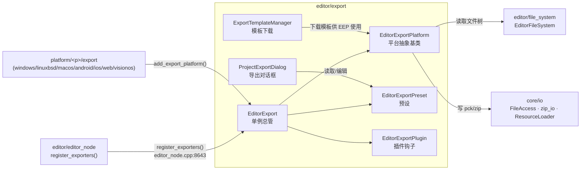
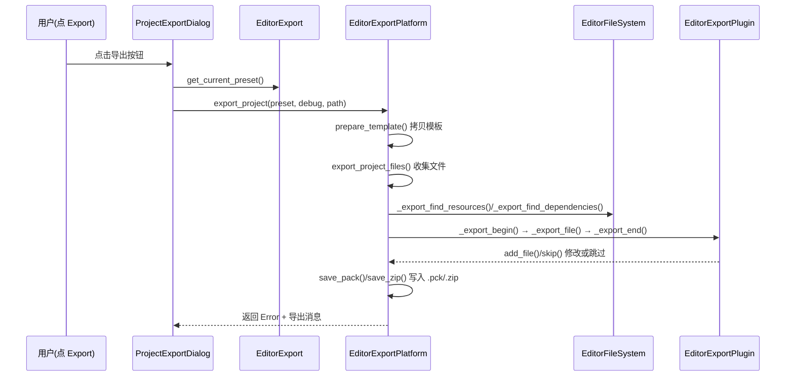

# export（editor）

> 一句话：export 是「把编辑器里的工程，装进一个能双击运行的成品文件」的流水线——预设是配方，平台是厨师，打包是装盒。

**结论**：`editor/export` 负责把工程资源按预设收集、加密、打包成目标平台的可执行产物，并让 GDExtension 与编辑器插件能在打包中途插手改数据。它是编辑器（`editor`）层，为「点一下 Export 按钮就出游戏」这件事服务，代价是必须依赖各平台的导出模板（`platform/<p>/export`），自身不生产模板。

## 是什么 / 不是什么

这个模块是「调度与打包中枢」，不是「平台细节实现」。

- 它负责：**管理导出预设**（`EditorExportPreset`）、**收集要导出的文件**（`EditorExportPlatform::export_project_files`）、**写成 .pck / .zip**（`save_pack` / `save_zip`）、**给插件开钩子**（`EditorExportPlugin`）。
- 它不负责：某个平台具体怎么写二进制（交给 `platform/<p>/export/export.cpp`，每个平台自己调用 `add_export_platform` 挂进来，如 `platform/windows/export/export.cpp:58`）；它也不负责生成导出模板（模板由 `ExportTemplateManager` 下载，见 `export_template_manager.h:96`）。

对比句：导出模板是「空房子」，`EditorExportPlatform` 是「装修队」，`EditorExportPreset` 是「装修图纸」。

## 在引擎里的位置



读法：`editor_node` 启动时调用 `register_exporters()`（`editor/editor_node.cpp:8643`），它会遍历各平台并调用它们的 `register_<p>_exporter()`，把平台实例 `add_export_platform` 进 `EditorExport` 单例。单例再持有预设与插件。真正写文件时，平台回到 `core/io` 和 `editor/file_system` 取数据。

## 关键概念

1. **导出预设（EditorExportPreset）—— 一张配方**。它记住「导出到哪个路径、包含哪些文件、要不要加密、脚本是文本还是二进制」。类定义在 `editor_export_preset.h:38`，`get_export_path()` / `get_export_filter()` 就是配方上的字段。

2. **导出平台（EditorExportPlatform）—— 一个厨师**。抽象基类，纯虚方法 `export_project`（`editor_export_platform.h:359`）让每个平台自己决定成品长什么样；`get_export_options`（`editor_export_platform.h:315`）列出该平台的导出选项。它是 `RefCounted`，不是 `Node`。

3. **导出插件（EditorExportPlugin）—— 中途插手的监工**。钩子 `_export_file` / `_export_begin` / `_export_end`（`editor_export_plugin.h:113-115`）让 GDExtension 或编辑器插件在打包每个文件时修改内容、追加文件（`add_file`、`add_shared_object`）甚至跳过（`skip`）。内置三个：`GDExtensionExportPlugin`、`DedicatedServerExportPlugin`、`ShaderBakerExportPlugin`。

4. **导出过滤器（ExportFilter）—— 决定带什么走**。枚举 `EXPORT_ALL_RESOURCES` / `EXPORT_SELECTED_SCENES` / `EXCLUDE_SELECTED_RESOURCES` 等（`editor_export_preset.h:42-48`），在 `export_project_files` 里被 switch 分支处理（`editor_export_platform.cpp:1324-1364`）。

5. **导出模板（ExportTemplate）—— 空房子**。导出不是从零编译，而是「拷贝模板可执行文件 + 把资源塞进去」。`find_export_template` 定位模板，`ExportTemplateManager` 负责从镜像下载（`export_template_manager.h:96`）。

## 核心文件（按阅读顺序）

1. `editor/export/editor_export.h` — 单例 `EditorExport`，持有平台/预设/插件三个容器（`:41-43`），是模块的入口。
2. `editor/export/editor_export_preset.h` — 预设数据类，含 `ExportFilter` / `FileExportMode` / `ScriptExportMode` 三组枚举。
3. `editor/export/editor_export_platform.h` — 平台抽象基类，定义 `export_project` / `save_pack` / `save_zip` / `export_project_files` 等核心接口。
4. `editor/export/editor_export_plugin.h` — 插件钩子基类，`GDVIRTUAL` 系列对应 GDScript 可覆写方法。
5. `editor/export/editor_export_platform_pc.h` — PC 平台的公共基类（桌面端共用）。
6. `editor/export/editor_export_platform_extension.h` — 供 GDExtension 注册自定义平台导出的基类。
7. `editor/export/project_export.h` — 导出对话框 `ProjectExportDialog`（继承 `ConfirmationDialog`）。
8. `editor/export/export_template_manager.h` — 导出模板下载/安装管理器。
9. `editor/export/gdextension_export_plugin.h` / `dedicated_server_export_plugin.h` / `shader_baker_export_plugin.h` — 三个内置导出插件。
10. `editor/export/register_exporters.h` — 声明 `register_exporters()` / `register_exporter_types()`，真正的实现由 `editor/editor_builders.py:32` 在构建时生成。

## 数据流 / 调用链

一次「点 Export」的典型调用：



关键锚点：`EditorExportPlatformPC::export_project` 三步走 `prepare_template → modify_template → export_project_data`（`editor_export_platform_pc.cpp:141-153`）；`export_project_files` 按 `ExportFilter` 分支收集路径（`editor_export_platform.cpp:1324-1364`）；`save_pack` / `save_zip` 负责写盘（`editor_export_platform.cpp:2289` / `:2415`）。

## 中文口诀

```
预设配方定乾坤，平台厨师出成品；
模板空房先拷贝，资源打包后塞进；
插件中途能插手，改文件来或跳过；
加密脚本防裸奔，pck zip 装车身。
```

## 练习（15 分钟）

1. 打开 `editor/export/editor_export_preset.h`，找出 `ExportFilter` 的 5 个枚举值，用一句话说明 `EXPORT_CUSTOMIZED` 和 `EXCLUDE_SELECTED_RESOURCES` 的区别。
2. 打开 `editor/export/editor_export_platform_pc.cpp` 的 `export_project`，画出它调用 `prepare_template → modify_template → export_project_data` 的顺序，并指出 `prepare_template` 里模板路径从哪个预设字段来。
3. 在 `editor/export/editor_export.cpp` 里找到 `add_export_platform`，说明「平台挂载」和「预设保存」之间如何通过 `should_update_presets` 联动。
4. 打开 `platform/windows/export/export.cpp`，看它如何创建一个平台实例并挂进 `EditorExport`，验证「平台细节在 platform 层，不在 export 层」这句话。

## 自测

- [ ] `EditorExportPlatform::export_project` 是纯虚函数，那 PC 平台（`EditorExportPlatformPC`）具体在哪一步把资源数据写进 .pck？（提示：看 `editor_export_platform_pc.cpp:208` 的 `export_project_data` 与 `editor_export_platform.cpp:2289` 的 `save_pack`。）
- [ ] `EditorExportPlugin::skip()` 的作用是什么？它在哪个内置插件的 `_export_file` 里被调用？（提示：`gdextension_export_plugin.h` 的 `android_aar_plugin` 分支。）

## 一句话总结

> `editor/export` 是「预设 + 平台 + 插件」三件套构成的导出中枢：预设定内容，平台定形状，插件可插足，最终把工程资源打包成 .pck/.zip 塞进平台模板，产出可运行的成品文件。
