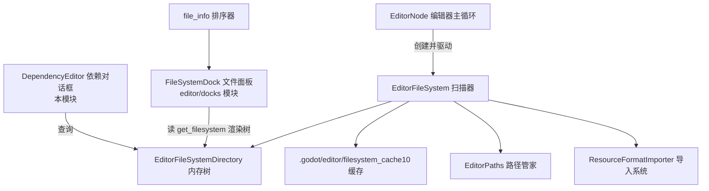
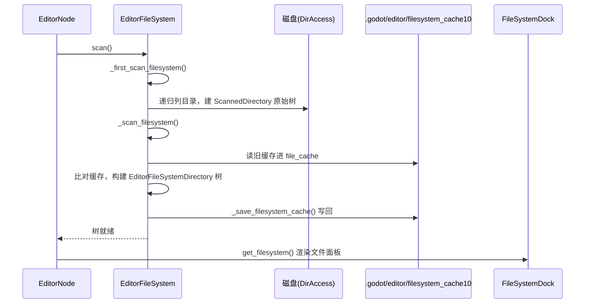

# file_system（editor）

> 一句话：它是编辑器的「文件档案室」——把磁盘上的项目文件树扫进内存、登记成一张可查询的索引，并落盘到 `.godot` 里做缓存，谁要查文件类型、依赖、脚本类名都来找它。

**结论**：`file_system` 负责把项目磁盘目录扫描成内存文件树 `EditorFileSystemDirectory` 并缓存到 `.godot/editor/filesystem_cache10`，供文件面板、依赖修复、导入系统查询；代价是启动时要扫一遍全项目 + 维护一份缓存文件。

## 是什么 / 不是什么

- **是**：磁盘文件 → 内存索引树的「扫描 + 缓存」主线，以及围绕这条主线长出来的依赖/孤儿资源修复对话框。
- **不是**：不负责把文件显示成面板（那是 `editor/docks/filesystem_dock.h` 的 `FileSystemDock`）；不负责真正的导入执行（导入归 `ResourceFormatImporter`，本模块只负责判断「要不要重新导入」）。
- **不是**：不负责编辑器各目录的物理创建逻辑本身，路径字符串的统一定义在本模块的 `EditorPaths` 里。

## 在引擎里的位置



## 关键概念

- **内存文件树节点**：`EditorFileSystemDirectory`（`editor/file_system/editor_file_system.h:46`）——一颗树的每个节点就是一个目录，身上挂着 `subdirs`（子目录）和 `files`（文件，每个文件是一个嵌套的 `FileInfo`）。
- **扫描器 / 缓存管家**：`EditorFileSystem`（`editor/file_system/editor_file_system.h:145`）——`Node` 子类的单例，干三件事：递归扫磁盘、和缓存比对、写回缓存。
- **磁盘缓存**：`filesystem_cache10`（`editor/file_system/editor_file_system.cpp:61` 的 `CACHE_FILE_NAME`）——把整棵树的文件类型、修改时间、导入 MD5、依赖拍平存进 `.godot/editor/`，下次启动靠它「免扫」。
- **路径管家**：`EditorPaths`（`editor/file_system/editor_paths.h:36`）——单例，统一给出 `data/config/cache/temp` 各目录；`get_project_settings_dir()` 返回 `res://.godot/editor`（`editor/file_system/editor_paths.cpp:88`）。
- **展示层排序**：`FileInfo` 结构体 + `FileSortOption` 枚举（`editor/file_system/file_info.h:36`、`:46`）——文件面板排序用的轻量数据，不参与扫描。

## 核心文件（按阅读顺序）

1. `editor/file_system/editor_paths.h` — 编辑器各目录路径的定义与单例，缓存目录的「源头」。先读它。
2. `editor/file_system/editor_file_system.h` — 全模块核心：`EditorFileSystem`、`EditorFileSystemDirectory`、`FileCache`、`ScannedDirectory` 都在这。
3. `editor/file_system/editor_file_system.cpp` — 扫描、比对缓存、写缓存、依赖重导入的全部实现（约 3833 行）。
4. `editor/file_system/file_info.h` — `FileInfo` 与三种排序比较器，供文件面板显示。
5. `editor/file_system/dependency_editor.h` — `DependencyEditor`、`OrphanResourcesDialog` 等 5 个对话框，修「缺失依赖 / 孤儿资源」。

## 数据流 / 调用链

首次启动的扫描主线：磁盘 → 原始树 → 比对缓存 → 内存树 → 写回缓存。



二次启动 / 文件变动时走 `scan_changes()`，只对 `filesystem_update4` 标记的文件（`editor_file_system.cpp:493`）做增量更新，不再全量扫。

## 中文口诀

```
扫描磁盘建棵树，目录文件分清楚。
缓存落盘 .godot，二次启动免重扫。
依赖缺失弹个窗，孤儿资源也能除。
路径统一靠 EditorPaths，排序展示靠 file_info。
```

## 练习（15 分钟）

1. 打开 `editor/file_system/editor_file_system.cpp:409`，找到读 `CACHE_FILE_NAME` 的那段，看缓存文件是怎么解析回 `file_cache` 的。
2. 打开 `editor/file_system/editor_paths.cpp:88`，确认 `get_project_settings_dir()` 返回的路径字符串。
3. 用 grep 找 `filesystem_update4` 的三处出现，说清它和 `filesystem_cache10` 的分工。
4. 打开 `editor/file_system/dependency_editor.h:197`，看 `OrphanResourcesDialog` 靠什么数据结构列出孤儿资源。

## 自测

- [ ] `filesystem_cache10` 存在哪个目录？写盘时第一行存的是什么（提示：`editor_file_system.cpp:561`）？
- [ ] 为什么除了 `filesystem_cache10` 还要一个 `filesystem_update4` 标记文件？
- [ ] `EditorFileSystemDirectory` 里的 `FileInfo.verified` 字段（`editor_file_system.h:68`）是给哪个比对流程用的？

## 一句话总结

> `file_system` 是编辑器的文件档案室：扫磁盘、建索引、缓存到 `.godot`，一切「这个文件是什么、依赖谁」的查询都从这棵内存树出发。
