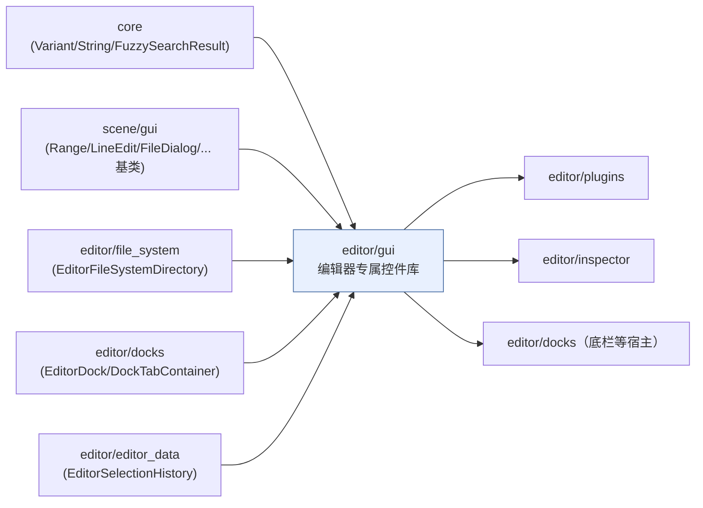
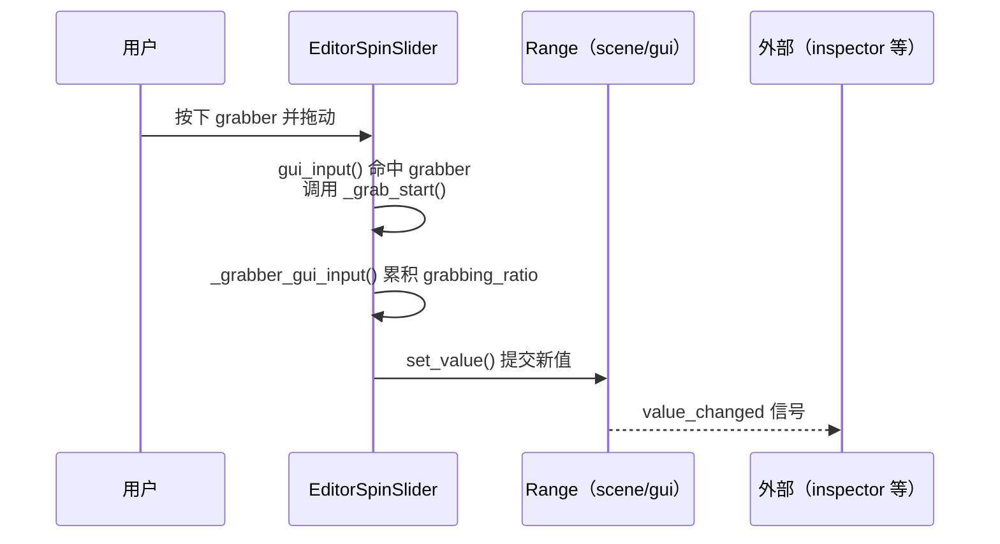

# gui（editor）

> 一句话：编辑器里那些「只在编辑器里用、游戏里用不到」的按钮、滑杆、对话框，全部住在这里——它们都是给 `scene/gui` 的通用控件穿上工装的子类。

**结论**：`editor/gui` 是编辑器专属的 GUI 控件库，为编辑器 UI 提供 32 个继承自 `scene/gui` 的控件子类（滑杆、文件对话框、toast 通知、进度条、代码编辑器外壳等），代价是这些类几乎全部不进 ClassDB、不暴露给脚本，纯 C++ 内部自用。

## 是什么 / 不是什么

`editor/gui` 是「编辑器自己的控件抽屉」。它做的只有一件事：把 `scene/gui` 里通用的 `Control` 子类再往下派生一层，补上编辑器才需要的交互。

- 它负责：编辑器专用交互控件，比如拖拽改数值的 `EditorSpinSlider`、右下角弹错误提示的 `EditorToaster`、模糊搜索资源的 `EditorQuickOpenDialog`。
- 它不负责：通用控件的实现（那些在 `scene/gui`，如 `Range`、`LineEdit`、`FileDialog` 本体）；也不负责 inspector 里的属性编辑器（`EditorProperty` 族在 `editor/inspector`，不在这里）。

一句话：这里放「编辑器才用的零件」，零件本身的制造图纸在 `scene/gui`。

## 在引擎里的位置

`editor/gui` 处在编辑器层的「中间偏下」：它向上借用 `scene/gui` 和 `core`，横向引用 file_system、docks、editor_data 的数据结构，向下被 plugins / inspector / docks 这些真正组装编辑器窗口的地方使用。

## 关键概念

- **继承而非重造**：每个控件都是 `scene/gui` 某个类的子类，例如 `EditorSpinSlider : public Range`（`editor/gui/editor_spin_slider.h:37`）、`FilterLineEdit : public LineEdit`（`editor/gui/filter_line_edit.h:35`）。要改的是「编辑器专属行为」，不是重新画一个控件。
- **编辑器内单例**：`EditorToaster` 和 `ProgressDialog` 都持有静态 `singleton` 指针并提供 `get_singleton()`（`editor/gui/editor_toaster.h:109-114`、`editor/gui/progress_dialog.h:86-99`），整个编辑器进程共享一份。
- **主题缓存 ThemeCache**：控件把主题色/图标缓存在成员结构体里，避免每帧查主题。例：`EditorSpinSlider` 的 `struct ThemeCache`（`editor_spin_slider.h:98-101`）、`EditorToaster` 的 6 个 `StyleBoxFlat` 字段（`editor_toaster.h:54-60`）。
- **不进脚本 API**：虽然挂了 `GDCLASS` 宏，但 `_bind_methods()` 大多是空的——`EditorTitleBar` 直接写成 `static void _bind_methods() {}`（`editor_title_bar.h:47`）。这些控件不会出现在 GDScript 里。

## 核心文件（按阅读顺序）

1. `editor/gui/SCsub` — 只有一行：把本目录所有 `*.cpp` 加进 `env.editor_sources`，说明它只是编辑器编译单元，不是独立模块。
2. `editor/gui/editor_spin_slider.h` — 数值滑杆 + 可点击输入框 + 拖拽改值的复合控件，最能体现「扩展 scene/gui」的做法。
3. `editor/gui/editor_file_dialog.h` / `editor_dir_dialog.h` — 在 `FileDialog` / `ConfirmationDialog` 基础上加编辑器行为（文件夹着色、删除依赖确认）。
4. `editor/gui/editor_toaster.h` — 右下角 toast 通知单例，接住引擎错误流。
5. `editor/gui/editor_validation_panel.h` — 表单校验面板，按 id 存错误/警告消息。
6. `editor/gui/editor_quick_open_dialog.h` — 快速打开对话框，内部还有 `HighlightedLabel`、`QuickOpenResultContainer` 等一整排子控件。
7. `editor/gui/progress_dialog.h` — 后台任务进度对话框单例，含 `BackgroundProgress`。
8. `editor/gui/code_editor.h` — 代码编辑器外壳：`CodeTextEditor` + `FindReplaceBar` + `GotoLinePopup`。
9. `editor/gui/window_wrapper.h` — 把普通控件包成独立 `Window`，含 `ScreenSelect` 屏幕选择按钮。

## 数据流 / 调用链

以 `EditorSpinSlider` 拖拽改数值为例——它全程不碰 inspector，只在自己的类里消化输入、再调基类 `Range::set_value`：

另一条典型链路是 `EditorToaster`：引擎报错 → `_error_handler` 回调（`editor_toaster.h:93`）→ `popup_str` → 生成一个 `Toast` 放进 `toasts` HashMap，右下角自动计时消失（`_auto_hide_or_free_toasts`）。

## 中文口诀

> 编辑器控件一大堆，个个继承 scene/gui；
> Slider 拖拽改数值，Toaster 右下弹提示；
> FileDialog 选文件，QuickOpen 模糊找资源；
> Progress 单例报进度，Validation 校验过不过。

## 练习（15 分钟）

1. 打开 `editor/gui/editor_spin_slider.h`，数出 `EditorSpinSlider` 一共 override 了 `Range` 的哪些虚函数（`gui_input`、`get_minimum_size` 等），列在纸上。
2. 用 grep 找出本目录里所有带 `singleton` 字段的类，确认哪几个是单例控件。
3. 打开 `editor/gui/editor_title_bar.h:47`，对比 `editor_spin_slider.h:106` 的 `_bind_methods`，体会「挂了 GDCLASS 但不进脚本」的区别。

## 自测

- [ ] `EditorFileDialog` 和 `EditorDirDialog` 各自的基类是什么？它们 override 了哪些虚函数来加编辑器行为？
- [ ] 为什么说这个目录「不是独立模块」，证据在 `SCsub` 的哪一行？
- [ ] `EditorToaster::Severity` 有几个取值？分别对应 `EditorValidationPanel::MessageType` 的哪些值？

## 一句话总结

> `editor/gui` 是编辑器自己的一套「工装控件库」：站在 `scene/gui` 的肩膀上派生，只服务编辑器、不进脚本 API，让游戏运行时和编辑器 UI 各走各的路。
