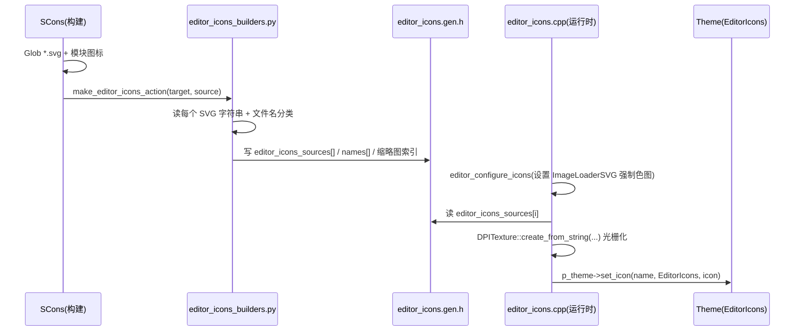

# icons（editor）

> 一句话：这是 Godot 编辑器的「图标仓库」——一堆 `.svg` 素材 + 一段构建脚本，运行时把它们烘焙成主题里的图标纹理。

**结论**：`editor/icons/` 是一个纯图标资产目录（1024 个 `.svg` + 1 个构建脚本，没有任何运行时 C++ 代码），它只为编辑器的 `EditorIcons` 主题分类供应图标，真正的「把 SVG 变成纹理、注册进主题」的逻辑在 `editor/themes/editor_icons.cpp` 里，不在这里。

## 是什么 / 不是什么

`editor/icons/` 是素材的存放处和「编译期的数据源」：构建时（SCons）把每个 `.svg` 的内容原样塞进一个生成的头文件 `editor/themes/editor_icons.gen.h`，运行时再按名字去那个数组里取 SVG 字符串，实时光栅化成 `DPITexture`。

它**不是**一个代码模块——目录里没有 `.cpp` / `.h`，只有 `SCsub`、`editor_icons_builders.py` 和 `README.md`。它**不负责**「如何用这些图标」：渲染、着色换算、注册进主题这些事交给 `editor/themes/editor_icons.cpp`（`editor_configure_icons` / `editor_register_icons`）。平台专属图标也不在这里，而在各自 platform 目录里（`editor/icons/README.md:3-4`）。

## 在引擎里的位置

```mermaid
flowchart LR
    subgraph A["editor/icons（资产目录）"]
        SVGs["1024 个 *.svg"]
        SCsub["SCsub"]
        PY["editor_icons_builders.py"]
    end
    subgraph B["构建期（SCons）"]
        GEN["editor/themes/editor_icons.gen.h<br/>(生成文件)"]
    end
    subgraph C["运行时（编辑器主题）"]
        ICONS["editor/themes/editor_icons.cpp<br/>editor_configure_icons / editor_register_icons"]
        THEME["Theme<br/>EditorIcons 分类"]
    end
    MOD["各模块 module_icons_paths"]

    SCsub -->|Glob *.svg| SVGs
    MOD -->|追加模块 SVG| SCsub
    SCsub -->|env.Run(make_editor_icons_action)| GEN
    GEN -->|editor_icons_sources[] 等数组| ICONS
    ICONS -->|p_theme->set_icon(...)| THEME
```

## 关键概念

- **SVG 即数据**：每个图标是一个 `.svg` 文本文件，构建时其字符串被整体塞进数组，运行时再光栅化。比喻：素材是「字模」，构建是「排版」，运行是「印刷」。
- **`editor_icons.gen.h` 是中间产物**：由 `SCsub` 调用 Python 脚本生成，里面是 `editor_icons_sources[]`、`editor_icons_names[]` 等 `constexpr` 数组（`editor/icons/editor_icons_builders.py:33-46`）。
- **DPITexture 是按需光栅化的纹理**：运行时用 `DPITexture::create_from_string(editor_icons_sources[i], ...)` 把 SVG 字符串按 DPI/缩放转成纹理（`editor/themes/editor_icons.cpp:50-52`）。
- **缩略图是名字约定分出来的**：文件名以 `MediumThumb` 结尾归入中缩略图、以 `BigThumb` 或 `GodotFile` 结尾归入大缩略图，构建脚本据此生成索引数组（`editor/icons/editor_icons_builders.py:23-26`）。

## 核心文件（按阅读顺序）

1. `editor/icons/README.md` — 一句话说明这是编辑器图标（除平台图标外）的存放处，并指向官方「制作图标」文档。
2. `editor/icons/SCsub` — 构建入口：`Glob("*.svg")` 收集图标，再把各模块 `env.module_icons_paths` 下的 `.svg` 追加进来，最后调用 Python 脚本生成 `editor_icons.gen.h`。
3. `editor/icons/editor_icons_builders.py` — `make_editor_icons_action()`：读每个 SVG 内容 + 取文件名，按缩略图命名规则分类，拼出 `editor_icons_count`、`editor_icons_sources[]`、`editor_icons_names[]` 等数组并写进生成头文件。
4. `editor/themes/editor_icons.h` — 声明三个消费函数：`editor_configure_icons`、`editor_register_icons`、`editor_copy_icons`，以及 `get_default_project_icon`。
5. `editor/themes/editor_icons.cpp` — 真正「用图标」的地方：配置颜色换算、遍历数组生成 `DPITexture`、按主题明暗/饱和度/强调色调整后 `set_icon` 进 `EditorIcons` 分类。

## 数据流 / 调用链



## 中文口诀

图标仓库无代码，一堆 SVG 加脚本。
SCsub 收集分内外，模块图标也凑齐。
Python 一跑烤成头，名字内容缩略图。
运行时按名取字符串，DPITexture 再光栅。
明暗饱和度换算，强调色也别漏。
最后 set_icon 进主题，EditorIcons 分类收。

## 练习（15 分钟）

1. 打开 `editor/icons/SCsub`，确认 `icon_sources` 是怎么从「本目录」和「模块路径」两处汇集 SVG 的。
2. 打开 `editor/icons/editor_icons_builders.py`，找出缩略图分类的判定关键字（`MediumThumb` / `BigThumb` / `GodotFile`）。
3. 打开 `editor/themes/editor_icons.cpp` 的 `editor_register_icons`，对照注释找出三类图标的处理差异：标准颜色换算、强调色替换、饱和度例外。

## 自测

- [ ] 构建生成的头文件路径是什么？里面至少包含哪两个核心数组？（提示：`editor/icons/SCsub:21`、`editor_icons_builders.py:33-36`）
- [ ] 运行时把一个图标字符串变成纹理用的是哪个函数、哪个类？（提示：`editor/themes/editor_icons.cpp:50-51`）
- [ ] `get_default_project_icon()` 靠什么名字在数组里定位新工程默认图标？（提示：`editor/themes/editor_icons.cpp:222`）

## 一句话总结

> `editor/icons/` 是编辑器全部 UI 图标的 SVG 素材库与编译期数据源，它只负责「把图标字符串送进生成头文件」，真正把 SVG 光栅化并注册进 `EditorIcons` 主题的是 `editor/themes/editor_icons.cpp`。
