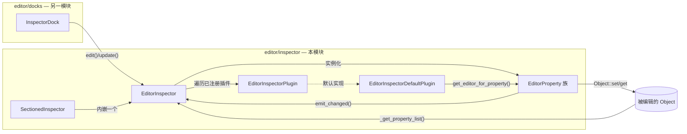
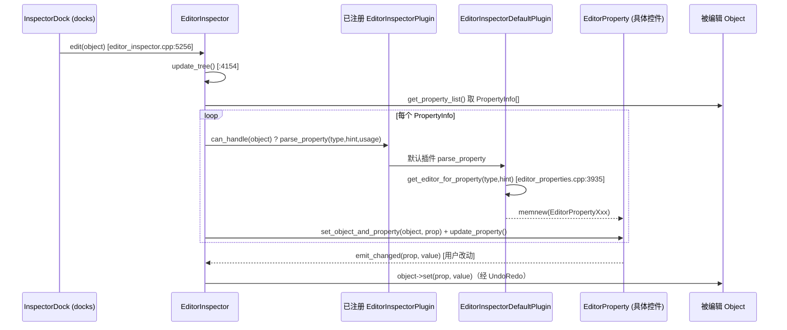

# inspector（editor）

> 一句话：属性面板（Inspector）是一台「属性 → 控件」的自动装配机——给一个 `Object`，它按每个属性的 `Variant::Type` 和 `PropertyHint` 现造出对应的编辑控件，并把改动写回对象。

**结论**：`editor/inspector` 是编辑器右侧那个属性面板的引擎，为选中对象生成可交互的属性编辑器（`EditorProperty` 一族），把「读属性、改属性」这件事集中到一个可插拔的解析器管线里；代价是它自己不知道对象是干嘛的，一切行为都来自 `PropertyInfo` 元数据和外部注册的 `EditorInspectorPlugin`。

## 是什么 / 不是什么

它负责：**把对象的一组 `PropertyInfo` 转成一棵控件树**——每个属性对应一个 `EditorProperty`（左名字右控件），并按分组/分类套上 `EditorInspectorSection` / `EditorInspectorCategory`（`editor/inspector/editor_inspector.h:449`、`:380`）。用户改值后，由 `EditorInspector::_property_changed` 走 `Object::set` + UndoRedo 写回（`editor/inspector/editor_inspector.cpp:4154` 附近的 `update_tree` 是入口）。

它不负责：对象的「谁被选中」（那是 `InspectorDock`，位于 `editor/docks/inspector_dock.h:46`，另一层 `docks` 模块）；资源缩略图怎么画（`editor_resource_preview.h` 只做缓存与分发，具体画法在 `editor_preview_plugins.h` 的各 `*PreviewPlugin` 里）；属性名的本地化词典（交给 `editor_property_name_processor.h` 只做字符串风格化）。

一句话切分：**inspector 造控件，docks 决定何时造、造给谁，scene/资源的编辑插件决定「特殊情况怎么办」**。

## 在引擎里的位置



上层是 `docks` 模块的 `InspectorDock`（`editor/docks/inspector_dock.h:46`），它持有 `EditorInspector *inspector`（`inspector_dock.h:76`）并把「当前选中对象」喂进来；本模块的 `EditorInspector` 再向下问 `Object` 要属性清单，向上把「属性名风格化」交给 `EditorPropertyNameProcessor`（`editor_property_name_processor.h:35`）。

## 关键概念

1. **EditorProperty（一行属性）**——面板里一行「名字 + 控件」的最小单位。基类 `EditorProperty : Container`（`editor_inspector.h:70`），所有具体编辑器都从它派生；子类只负责重写 `update_property()` 把对象当前值刷进控件。
2. **EditorInspectorPlugin（可插拔解析器）**——决定「谁来生成某个属性的控件」。它有两个钩子：`can_handle(Object*)` 判断是否接管这个对象，`parse_property(...)` 接管单个属性（`editor_inspector.h:356`、`:376`）。整个面板就是按序问一遍所有插件。
3. **EditorInspectorDefaultPlugin（默认装配工）**——最底层的兜底插件，`can_handle` 恒真，`get_editor_for_property()` 是一张「`Variant::Type` + `PropertyHint` → `memnew(EditorPropertyXxx)`」的分派大表（`editor_properties.h:795`、`editor_properties.cpp:3935`）。
4. **PropertyHint（类型之外的第二维）**——同一个 `INT` 类型，`PROPERTY_HINT_ENUM` 变成下拉框 `EditorPropertyEnum`，`PROPERTY_HINT_RANGE` 变成滑条 `EditorPropertyInteger`。hint 是「用什么控件」的另一半决定因素（`editor_properties.cpp:3935` 起的分支）。
5. **EditorInspectorSection / Category（分组与分类）**——把一堆 `EditorProperty` 套上可折叠的分组框、可点标题栏的分类头（`editor_inspector.h:449`、`:380`），构成面板的视觉层级。

## 核心文件（按阅读顺序）

1. `editor/inspector/SCsub` — 一行 `add_source_files(env.editor_sources, "*.cpp")`，全目录编进编辑器本体。
2. `editor/inspector/editor_inspector.h` — 主类声明集中地：`EditorProperty`、`EditorInspectorPlugin`、`EditorInspectorSection/Category`、`EditorInspector`（约 960 行，是本模块的「索引」）。
3. `editor/inspector/editor_inspector.cpp` — 主实现（约 5300 行，223 KB，全目录最大）：`update_tree()` 装配、`edit()` 切换对象、`instantiate_property_editor()` 静态分派、`_property_changed()` 写回。
4. `editor/inspector/editor_properties.h` — 默认插件 `EditorInspectorDefaultPlugin` 与全部标量/几何编辑器（`EditorPropertyText/Check/Enum/Integer/Float/Color/NodePath/Resource/Transform3D/...`）的声明。
5. `editor/inspector/editor_properties.cpp` — `get_editor_for_property()` 的 switch 分派大表（约 3700 行）。
6. `editor/inspector/editor_properties_array_dict.h/.cpp` — 复合类型：`EditorPropertyArray`、`EditorPropertyDictionary`、`EditorPropertyLocalizableString`，用代理对象 `EditorPropertyArrayObject/DictionaryObject` 让子项也能被普通属性编辑器编辑（`:92`、`:181`、`:279`）。
7. `editor/inspector/editor_properties_vector.h` — `EditorPropertyVector2/2i/3/3i/4/4i` 共用基类 `EditorPropertyVectorN`（`:68`）。
8. `editor/inspector/editor_sectioned_inspector.h` — `SectionedInspector`：左侧分区树 + 右侧一个 `EditorInspector` 的分栏版本。
9. `editor/inspector/multi_node_edit.h` — `MultiNodeEdit`：多选节点时伪装成一个对象，把对属性的读写广播到所有被选节点。
10. `editor/inspector/editor_property_name_processor.h` — `EditorPropertyNameProcessor`：把 `foo_bar` 这类属性路径段变成 `Foo Bar` 等显示风格。
11. `editor/inspector/editor_resource_picker.h` / `editor_resource_preview.h` / `editor_preview_plugins.h` — 资源下拉选择器、缩略图缓存、各类资源的缩略图生成插件。
12. `editor/inspector/property_selector.h` / `editor_context_menu_plugin.h` / `add_metadata_dialog.h` — 属性路径选择器、右键菜单插件、元数据新增对话框等辅助件。

## 数据流 / 调用链

一次「点选节点 → 面板显示可编辑属性 → 改值写回」的完整链路：



要点：`EditorInspector::instantiate_property_editor()`（`editor_inspector.cpp:3829`）是上面的静态封装，它从**后往前**遍历 `inspector_plugins`（`editor_inspector.cpp:3830`），谁先 `can_handle` 且产出 `added_editors` 谁说了算——这就是为什么 `EditorInspectorDefaultPlugin` 注册在 `editor/editor_node.cpp:8607` 排在最后兜底，而动画、材质等场景插件能提前抢走自己关心的属性。

## 中文口诀

```
对象进来，属性铺开；
插件按序，逐个来猜；
类型定形，hint 定样；
默认兜底，memnew 上场。
控件绑定，读值刷屏；
一有改动，emit 上报；
set 写回，撤销记账。
```

## 练习（15 分钟）

1. 打开 `editor/inspector/editor_properties.cpp` 的 `get_editor_for_property()`（`:3935`），数一数 `case Variant::FLOAT` 分支里，`PROPERTY_HINT_RANGE` 和默认分支分别 `memnew` 了什么类；对比 `PROPERTY_HINT_ENUM` 在 `INT` 分支里生成的控件。
2. 在 `editor/inspector/editor_inspector.cpp` 的 `update_tree()`（`:4154`）里找到 `parse_property` 的调用循环（`:4867`），确认 `exclusive` 为真时如何提前 `break`，以及 `late_editors`（`add_to_end`）如何被追加到最后。
3. 给一个属性加 `PROPERTY_HINT_MULTILINE_TEXT`，跟踪它落到 `EditorPropertyMultilineText` 的那一个 `memnew`，再回到 `update_tree` 看它如何被挂进 `EditorInspectorSection`。

## 自测

- [ ] `EditorInspector` 自己知道「如何渲染一个布尔值」吗？还是完全委托给 `EditorInspectorDefaultPlugin::get_editor_for_property()`？从 `editor_inspector.cpp:3829` 与 `editor_properties.cpp:3935` 的关系回答。
- [ ] `MultiNodeEdit` 为什么能出现在「被编辑对象」的位置上却不显示脚本和元数据？看它 `_hide_script_from_inspector()` / `_hide_metadata_from_inspector()`（`multi_node_edit.h:59`）返回什么。
- [ ] `instantiate_property_editor()` 为什么要「从后往前」遍历插件数组（`editor_inspector.cpp:3830`）？结合默认插件注册在 `editor/editor_node.cpp:8607` 的时机解释「后注册先询问」的优先级。
- [ ] 数组子项编辑用的是 `EditorPropertyArrayObject` 代理（`editor_properties_array_dict.h:41`），它的 `_set/_get` 靠什么命名约定把 `indices/0` 映射回数组下标？

## 一句话总结

> `editor/inspector` 是属性面板的装配车间：`EditorInspector` 向对象要属性清单，`EditorInspectorPlugin` 管线（以 `EditorInspectorDefaultPlugin` 兜底）按 `Variant::Type` 与 `PropertyHint` 现造 `EditorProperty` 控件，改值再经 `emit_changed → Object::set` 写回。
