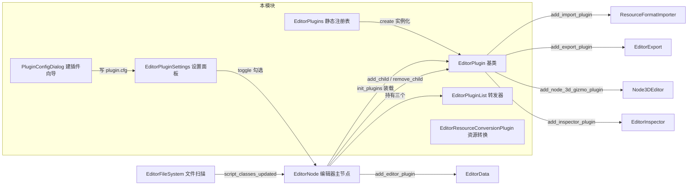
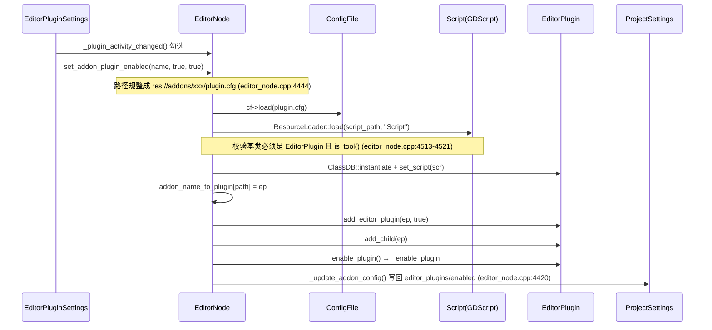

# plugins（editor）

> 一句话：编辑器插件系统是 Godot 编辑器的「外挂插座」——它给第三方提供一套统一的接口（`EditorPlugin`），让你不碰引擎源码就能往编辑器里塞 UI、导入器、导出器、Gizmo 等，代价是插件脚本只能在 `tool` 模式下运行、且要在编辑器主循环里被逐个「接线」。

**结论**：`editor/plugins/` 这个模块提供「插件怎么被加载、启用、停用」这条主线——它定义插件基类 `EditorPlugin`、内置 C++ 插件的静态注册表 `EditorPlugins`、转发事件到插件的 `EditorPluginList`，以及编辑器里「已安装插件」设置面板；真正干活的是它把插件「接」进引擎各子系统的几十个 `add_*_plugin()` 方法。

## 是什么 / 不是什么

- **是**：插件的「基类 + 注册表 + 装载器 + 设置 UI」这一整套基础设施。所谓「插件」，在引擎里最终都是一个继承自 `EditorPlugin`（`editor_plugin.h:59`，继承 `Node`）的实例，可以是从 `res://addons/*/plugin.cfg` 里的 `tool` 脚本动态加载的，也可以是 C++ 静态注册的，还可以是 GDExtension 动态注册的。
- **不是**：它不管插件具体长什么样（每个插件自己的功能在别处实现）；也不管编辑器主界面如何布局（那是 `editor_main_screen`/`docks` 的事）。它只负责「让插件进来、让插件出去、把事件转发给插件」。

## 在引擎里的位置

依赖方向：本模块只依赖 `editor/` 上层（`editor_node.h`、`editor_data.h`、`editor_interface.h`）和 `scene/gui`、`core/io/config_file.h`；反过来，几乎所有编辑器子系统（`scene/`、`import/`、`export/`、`inspector/`）都在编译期 `#include "editor/plugins/editor_plugin.h"` 或 `editor_plugin_list.h` 来使用它。

## 关键概念

- **插件基类**：`EditorPlugin`（`editor_plugin.h:59`）是所有编辑器插件的共同「插座」。它一半是 C++ 虚函数（`handles()`/`edit()`/`make_visible()`），一半是 `GDVIRTUAL` 钩子（`_enter_tree` 那类、`_enable_plugin`/`_disable_plugin` 等，`editor_plugin.h:122-146`），脚本插件靠覆写这些下划线方法被编辑器回调。
- **静态注册表**：`EditorPlugins`（`editor_plugin.h:282`）用 `MAX_CREATE_FUNCS = 128` 的静态数组保存「创建函数指针」，`add_by_type<T>()` 注册一个内置 C++ 插件的 `memnew` 工厂，`create(idx)` 按索引实例化。`register_editor_types.cpp:225-293` 一次性注册了约 60 个内置插件（`AnimationTreeEditorPlugin`、`MeshEditorPlugin`……）。
- **转发器**：`EditorPluginList`（`editor_plugin_list.h:38`）内部是 `LocalVector<EditorPlugin *>`，把 2D/3D 的输入事件和绘制覆盖逐个 `forward_*` 给列表里每个插件（`editor_plugin_list.cpp:33-94`）。`EditorNode` 持有三个这样的列表——`editor_plugins_over`、`editor_plugins_force_over`、`editor_plugins_force_input_forwarding`（`editor_node.h:269-271`）。
- **子插件（add_\* 家族）**：`EditorPlugin` 上有一串 `add_import_plugin()`/`add_export_plugin()`/`add_node_3d_gizmo_plugin()`/`add_inspector_plugin()`/`add_debugger_plugin()`/`add_resource_conversion_plugin()`……（`editor_plugin.h:234-268`），它们把一个「大插件」里的小能力，接进导入、导出、Gizmo、Inspector 等不同子系统。
- **资源转换插件**：`EditorResourceConversionPlugin`（`editor_resource_conversion_plugin.h:36`）是 `RefCounted`，声明 `_converts_to`/`_handles`/`_convert` 三个虚方法，用于把一种资源转成另一种（比如旧格式迁移）。

## 核心文件（按阅读顺序）

1. `editor/plugins/editor_plugin.h` — 插件基类 `EditorPlugin` 与静态注册表 `EditorPlugins`，全模块的灵魂。
2. `editor/plugins/editor_plugin.cpp` — 基类的实现：`add_*_plugin` 各方法怎么把插件接进子系统，`enable_plugin`/`disable_plugin`（`editor_plugin.cpp:539/545`）。
3. `editor/plugins/editor_plugin_list.h` — 事件/绘制转发器 `EditorPluginList`。
4. `editor/plugins/editor_plugin_settings.cpp` — 「Installed Plugins」设置面板：扫 `res://addons` 下所有 `plugin.cfg`（`_get_plugins`，`editor_plugin_settings.cpp:192`），勾选即启停。
5. `editor/plugins/plugin_config_dialog.cpp` — 新建/编辑插件向导，生成 `plugin.cfg` 并 `emit_signal("plugin_ready", ...)`。
6. `editor/plugins/editor_resource_conversion_plugin.h` — 资源转换插件基类。
7. `editor/plugins/SCsub` — `env.add_source_files(env.editor_sources, "*.cpp")`，只编译本目录所有 `.cpp`。

## 数据流 / 调用链

一条「用户勾选启用某个插件 → 插件活过来」的完整链路：

启动时的批量装载走同一条路：`EditorNode::init_plugins()`（`editor_node.cpp:1230`）读 `editor_plugins/enabled` 设置，逐个 `set_addon_plugin_enabled(addon, true)`。若脚本在首次文件扫描阶段还解析不出基类，就把插件丢进 `pending_addons`，等 `script_classes_updated` 信号后由 `_enable_pending_addons()`（`editor_node.cpp:6200`）重试。停用则反向：`set_addon_plugin_enabled(name, false)` → `remove_editor_plugin()`（`editor_node.cpp:4376`）依次 `make_visible(false)`、`clear()`、`disable_plugin()`、从三个转发列表和场景树移除，最后 `memdelete` 释放。

## 中文口诀

- 插件是个插座，`EditorPlugin` 是总纲；脚本工具模式，C++ 静态注册表。
- `add_by_type` 记工厂，`create` 一调就造人。
- 三个转发列表管事件：over、force_over、force_input。
- 勾选即启停，`set_addon_plugin_enabled` 一条龙：读 cfg、载脚本、验 tool、进树、写回 `editor_plugins/enabled`。
- 首扫没解析，先挂 `pending_addons`；信号一到，重试再装载。
- 卸载反着走：隐藏、clear、disable、出树、`memdelete`。

## 练习（15 分钟）

1. 打开 `editor/plugins/editor_plugin.h:59`，数一数 `EditorPlugin` 上有多少个 `add_*_plugin` / `remove_*_plugin` 成对方法，各对应哪个子系统。
2. 读 `editor_node.cpp:4441-4536`，画出 `set_addon_plugin_enabled(p_enabled=true)` 从 cfg 到 `enable_plugin()` 的每一个校验分支。
3. 打开 `editor/plugins/editor_plugin_settings.cpp:192` 的 `_get_plugins`，说清楚它是怎么递归扫出 `res://addons` 下所有 `plugin.cfg` 的。
4. 打开 `register_editor_types.cpp:225`，随机挑 3 个 `add_by_type<...>` 的类，用 grep 找到它们的头文件确认真实存在。

## 自测

- [ ] `EditorPlugins::MAX_CREATE_FUNCS` 是多少？这个上限意味着什么？
- [ ] 启动时脚本插件如果 `get_instance_base_type()` 为空，`init_plugins` 会走哪条兜底路径？（提示：`pending_addons`）
- [ ] 插件脚本为什么必须 `is_tool()` 才能被启用？（见 `editor_node.cpp:4518`）
- [ ] `EditorPlugin::enable_plugin()` 和 `disable_plugin()` 分别在什么时机被调用？（见 `editor_node.cpp:4371/4383`）

## 一句话总结

> `editor/plugins/` 是编辑器的「外挂插座」：`EditorPlugin` 定义插头形状，`EditorPlugins` 管内置插件的生产，`EditorPluginList` 管事件转发，`EditorNode::set_addon_plugin_enabled` 管插拔，剩下几十个 `add_*_plugin` 负责把插头插进引擎的各个插座。
