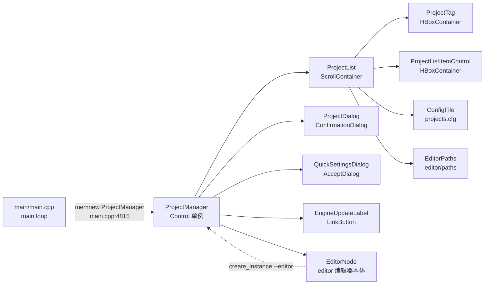
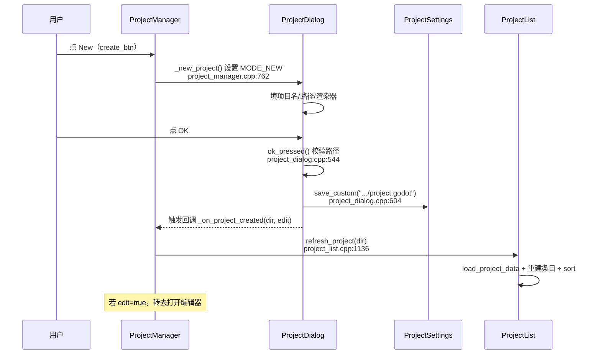

# project_manager（editor）

> 一句话：项目管理器是引擎的「前台门卫」——你打开 Godot 先见到的那个窗口，负责列出你机器上的项目、新建、导入（ZIP）和打开，再把手交给真正的编辑器（`EditorNode`）。

**结论**：`ProjectManager` 是编辑器启动前的独立 GUI 窗口，为「还没打开任何项目」的用户服务，代价是它自己也是一套完整的 GUI 场景，带主题、搜索、标签、异步扫描和版本检查，代码量约 2000 行的 `.cpp`（`project_manager.cpp` + `project_list.cpp` + `project_dialog.cpp`）。

## 是什么 / 不是什么

- 它**负责**：列出本机项目（`project.godot` 的扫描与缓存）、新建项目、从 ZIP 导入/安装项目、打开/运行项目、重命名/复制/删除、打标签、排序筛选（`project_manager.h:146-167` 那一排按钮）。
- 它**不负责**：真正编辑项目——打开动作其实是 `OS::get_singleton()->create_instance(args)` 拉起一个带 `--editor` 参数的新进程，把控制权交给 `editor/` 下的 `EditorNode`（`project_manager.cpp:598`）。
- 它**不负责**：项目版本升级本身——老项目会标灰并提示走迁移/全量转换，具体升级逻辑在 `project_upgrade` 模块，这里只负责「拦住并询问」（`project_manager.cpp:613` `_open_selected_projects_check_warnings`）。

## 在引擎里的位置

项目管理器不注册任何 ClassDB 暴露给脚本的类，它是 `main/main.cpp` 直接 `memnew` 出来的顶层控件，挂在场景树的根节点下。

- `main.cpp:4815` 是唯一创建点：`ProjectManager *pmanager = memnew(ProjectManager)`，随后 `sml->get_root()->add_child(pmanager)`（`main.cpp:4819`）。
- 它往下依赖 `ProjectList` 做列表、`ProjectDialog` 做新建/导入对话框；往上被 `main.cpp` 的启动逻辑依赖，判断「没传 `--editor` 也没有项目路径」时进入项目管理器。

## 关键概念

- **项目 = 一个 `project.godot` 文件**：扫描器在目录树里递归找 `project.godot`，找到就把所在目录当项目（`project_list.cpp:1110`）。这是整个模块的「唯一真值」。
- **`ProjectList::Item` = 列表里的一个项目的快照**：名字、描述、版本、标签、路径、图标、主场景、最后编辑时间、是否缺失/灰化等，都塞进这个结构体（`project_list.h:158`）。
- **`ProjectDialog` 的 `Mode` = 一个对话框五副面孔**：`MODE_NEW / MODE_IMPORT / MODE_INSTALL / MODE_RENAME / MODE_DUPLICATE`（`project_dialog.h:47-53`），新建和导入共用同一个 `ok_pressed()` 出口（`project_dialog.cpp:544`）。
- **`projects.cfg` = 已登记项目的缓存清单**：不是扫描结果，而是「你见过/收藏过的项目」的持久化，路径 `EditorPaths::get_singleton()->get_data_dir().path_join("projects.cfg")`（`project_list.cpp:1728`）。

## 核心文件（按阅读顺序）

1. `editor/project_manager/project_manager.h` — 主窗口类 `ProjectManager`，单例、按钮布局、各动作回调签名。先读这里建立全局。
2. `editor/project_manager/project_list.h` — `ProjectList`（滚动列表）和 `ProjectListItemControl`（单条项目行）及 `Item` 结构体。
3. `editor/project_manager/project_list.cpp` — 项目数据的加载、扫描、排序、图标异步加载（`load_project_data` 在 `project_list.cpp:791`）。
4. `editor/project_manager/project_dialog.h` / `.cpp` — 新建/导入对话框，`ok_pressed()` 真正写 `project.godot` 或解 ZIP。
5. `editor/project_manager/project_tag.h` / `.cpp` — 项目标签控件（一行 `HBoxContainer` + 一个按钮）。
6. `editor/project_manager/quick_settings_dialog.h` / `.cpp` — 快捷设置弹窗（语言/主题/缩放/网络模式等）。
7. `editor/project_manager/engine_update_label.h` / `.cpp` — 检查引擎新版本的 `LinkButton`。

`SCsub` 只有一行 `env.add_source_files(env.editor_sources, "*.cpp")`，整个目录的 `.cpp` 全编进编辑器。

## 数据流 / 调用链

以「新建一个项目」为典型调用（主线三件套之一）：

- 「导入」走同一条链，只是 `ProjectDialog` 用 `MODE_IMPORT`，`ok_pressed()` 里用 minizip 的 `unzOpen2` 解包并定位 ZIP 内第一个含 `project.godot` 的目录（`project_dialog.cpp:649-673`）。
- 「打开」是另一条线：`_open_selected_projects()`（`project_manager.cpp:562`）拼出 `--path <项目> --editor` 参数，`OS::get_singleton()->create_instance(args)` 新开进程，然后 `get_tree()->quit()` 关闭项目管理器本身（`project_manager.cpp:610`）。
- 「运行」同理但用 `--path`（不带 `--editor`）并校验 `main_scene` 非空、资源已导入（`project_manager.cpp:528` `_run_project_confirm`）。

## 中文口诀

项目文件是根本，扫到 `project.godot` 才算数。
列表缓存 `projects.cfg`，读数据靠 `load_project_data`。
新建导入同个框，`ProjectDialog` 换 `Mode` 变面孔。
新建写 `project.godot`，导入 minizip 解 ZIP。
打开运行都 `create_instance`，一个加 `--editor` 一个不加。
单例 `ProjectManager`，`main.cpp` 里 `memnew` 出来。

## 练习（15 分钟）

1. 在 `project_list.cpp` 里找到 `load_project_data`，数一数它从 `project.godot` 读了多少个 `application/config/*` 键（名字、描述、标签、主场景、图标、features 等），各填进 `Item` 的哪个字段。
2. 跟踪「删除项目」：从 `project_manager.h` 的 `erase_btn` 出发，找到 `_erase_project` → `_erase_project_confirm` → `ProjectList::erase_selected_projects`，确认它删的是 `projects.cfg` 里的登记还是磁盘上的目录。
3. 对比 `_run_project_confirm` 和 `_open_selected_projects` 拼的 `args` 列表，写出「运行」比「打开」少/多了哪个关键参数。

## 自测

- [ ] `ProjectManager` 是不是 ClassDB 暴露给脚本的类？它是在哪一行被 `memnew` 出来的？
- [ ] 项目扫描判断「这是一个项目」的唯一条目是什么？写在哪个文件哪一行？
- [ ] 新建项目时，`project.godot` 由哪个类的哪个函数写出？渲染器类型（`forward_plus/mobile/gl_compatibility`）默认写进哪个 `ProjectSettings` 键？
- [ ] 打开项目和运行项目都靠 `OS::create_instance`，两者拼出来的命令行参数关键差异是什么？

## 一句话总结

> `ProjectManager` 是引擎的启动前哨：把「本机项目列表 + 新建/导入/打开」这条主线做扎实，真正干活时用 `create_instance` 起新进程把控制权交给编辑器或游戏本体。
